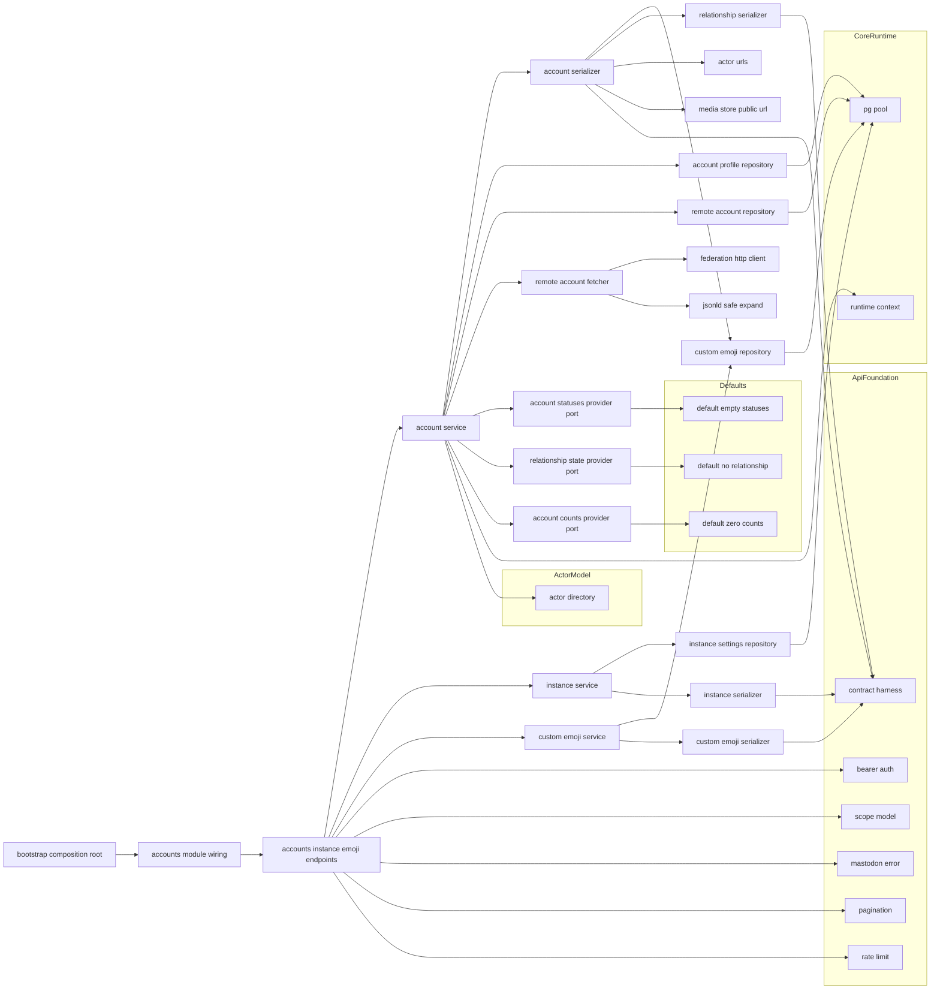
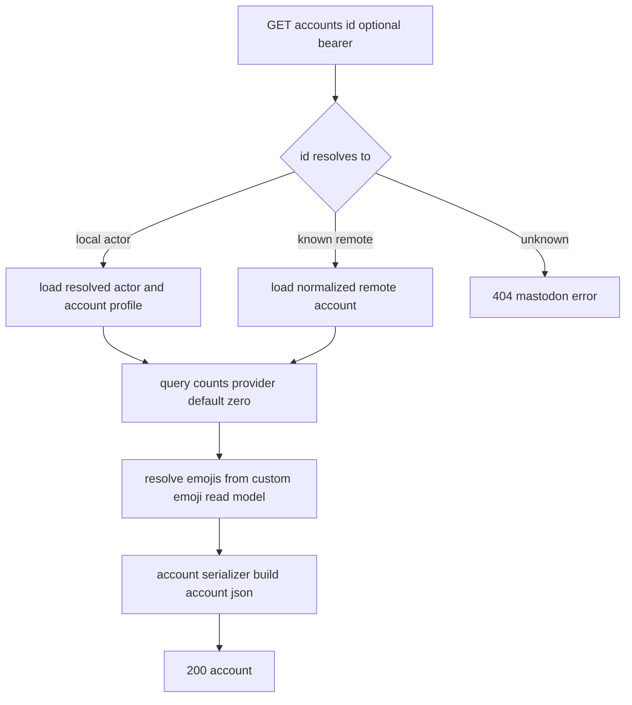
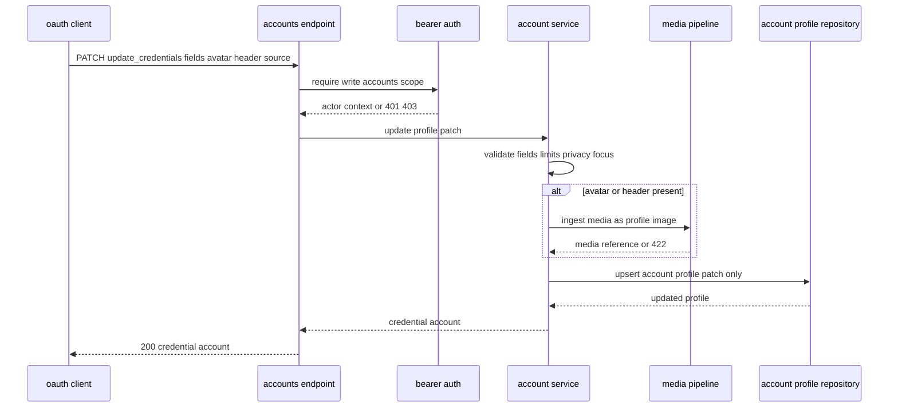
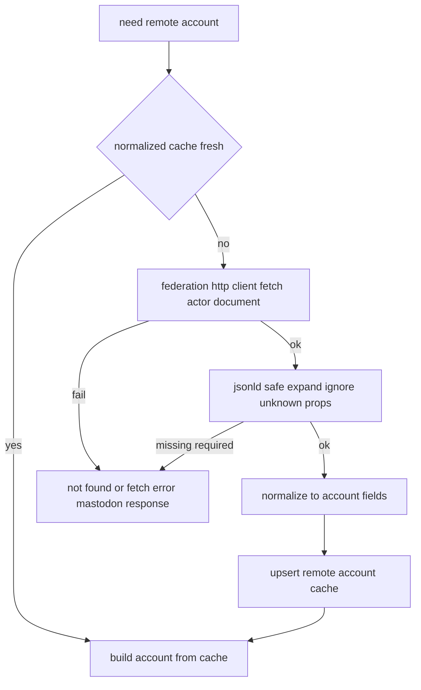
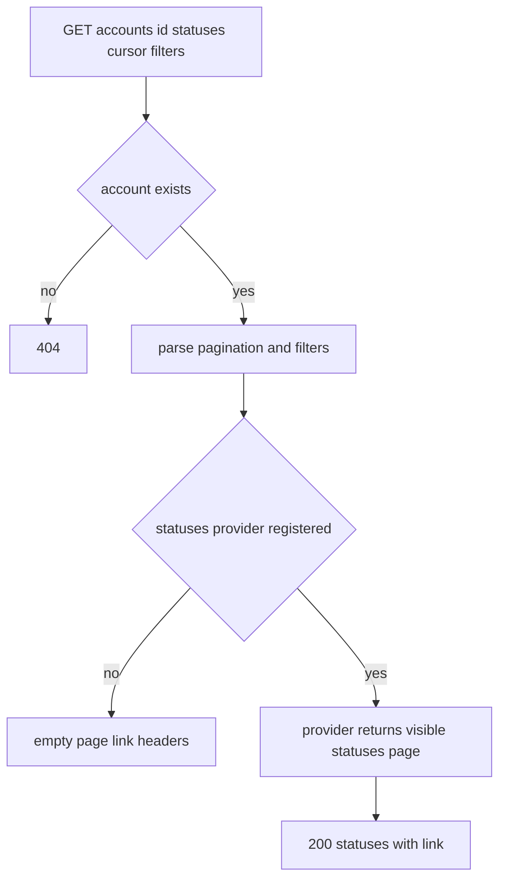

# Design Document

## Overview

**Purpose**: accounts-and-instance は、標準クライアントがログイン直後に参照する「アカウント・インスタンス情報・カスタム絵文字」の Mastodon 互換 API を提供する。本 spec は Account / CredentialAccount / Relationship / Instance(v2) / CustomEmoji の各エンティティ JSON 契約とシリアライズ、`accounts`（verify_credentials / :id / :id/statuses / relationships / update_credentials）・`instance`(v2)・`custom_emojis`(read) の各エンドポイント、ローカルアカウントのプロフィール拡張（アバター/ヘッダ/フィールド/source 既定）の保持と更新、リモートアカウントのフェッチ/正規化と Account 形への変換、instance v2 の運用設定反映を所有する。

**Users**: 一人鯖の運用者と標準クライアント（Ivory・Elk・Phanpy 等）が、ログイン後の自己取得・他アカウント表示・プロフィール編集・インスタンス機能ネゴシエーション・絵文字描画に利用する。下流 spec（statuses-core / social-graph / timelines / search）は、本 spec が確立する Account 契約とエンティティ表現に依存し、`accounts/:id/statuses` の Status 供給と `relationships` の関係状態供給を本 spec の委譲境界へ登録する。

**Impact**: core-runtime のランタイム土台と api-foundation の横断土台（Bearer 認証・スコープ・Mastodon 互換エラー・ページネーション・`X-RateLimit-*`・契約ハーネス）、federation-core の連合参照（`ActorUrls` / `FederationHttpClient` / アクター解決）、media-pipeline（MediaAttachment / `MediaStore`）、actor-model（`ActorDirectory` / `ResolvedActor`）の上に、API モジュール群 `src/accounts/` と運用設定/絵文字/プロフィール/リモートアカウントの永続テーブル（`migrations/0005_accounts.sql`）を追加する。

### Goals

- ローカルアクターとリモートアカウントを単一の Account 契約へ統一してシリアライズする。
- verify_credentials / accounts/:id / accounts/:id/statuses / relationships / update_credentials を Mastodon 互換で提供する。
- instance v2 を運用設定（DB 保存値）と本サーバーの実制約から構成して返す。
- custom_emojis(read) を提供し、Account の `emojis` と同一読み取りモデルを共有する。
- Account / CredentialAccount / Relationship / Instance(v2) / CustomEmoji の JSON 契約をゴールデンで固定する。
- 下流所有情報（Status 本体・関係状態・カウント）を委譲境界の背後から取り込み、未登録時も正常応答する。

### Non-Goals

- フォロー/ブロック/ミュート等の関係**変更**操作（social-graph）。本 spec は relationships の**読み**のみ。
- 投稿（Status）本体の取得・CRUD・シリアライズ（statuses-core）。本 spec は accounts/:id/statuses のルート/ページネーション/可視性条件受け渡しのみ。
- カスタム絵文字の登録/アップロード/連合取り込み/管理（custom-federation / admin-frontend）。本 spec は読み取りのみ。
- 運用設定の書き込み/管理画面（admin-frontend）。本 spec は読み取りと初期既定のみ。
- `familiar_followers`・プロフィールディレクトリ・アカウント移転の送信（後回し/非目標）。
- 認証・スコープ・エラー・ページネーション・レート制限・契約ハーネス基盤そのもの（api-foundation 所有。本 spec は適用のみ）。

## Boundary Commitments

### This Spec Owns

- Account / CredentialAccount / Relationship / Instance(v2) / CustomEmoji エンティティの JSON 契約とシリアライズ、および api-foundation 契約ハーネスへのゴールデン登録。
- `accounts` 系エンドポイント（verify_credentials / :id / :id/statuses / relationships / update_credentials）、`instance`(v2)、`custom_emojis`(read) の HTTP 表層と応答コード規律。
- ローカルアカウントのプロフィール拡張（`display_name`/`note`・アバター/ヘッダのメディア参照・プロフィールフィールド・locked/bot/discoverable・source 既定 = privacy/sensitive/language）の永続モデルと更新。
- リモートアカウントの正規化キャッシュ（ActivityPub アクター文書 → Account フィールドへの正規化結果の保持）。
- カスタム絵文字の**読み取りモデル**（`custom_emojis` テーブルの read）と CustomEmoji 表現。
- instance v2 のための運用設定読み取りモデル（`instance_settings`）と初期既定。
- 下流所有情報の委譲境界（`AccountStatusesProvider` / `RelationshipStateProvider` / `AccountCountsProvider`）の **定義と既定実装**。
- 本 spec が所有する永続テーブル（`account_profiles` / `remote_accounts` / `custom_emojis` / `instance_settings`）とそのマイグレーション（0005）。

### Out of Boundary

- 関係状態の保持・変更（social-graph が `RelationshipStateProvider` の実装を供給）。
- Status エンティティの表現・投稿の取得本体（statuses-core が `AccountStatusesProvider` の実装を供給）。
- カウントの真実源（`AccountCountsProvider` の実装供給は分担: followers/following は social-graph、statuses_count は statuses-core。本 spec は実装未配線時の既定 0）。
- カスタム絵文字の書き込み・連合取り込み・管理（custom-federation / admin-frontend）。
- 運用設定の書き込み・管理 UI（admin-frontend）。
- 認証/スコープ/エラー/ページネーション/レート制限/契約ハーネスの規約（api-foundation）、アクター/署名鍵モデル（actor-model）、連合プロトコル配管（federation-core）、メディア処理（media-pipeline）、起動/設定/DI/マイグレーション基盤（core-runtime）。

### Allowed Dependencies

- core-runtime: `AppState` / `RuntimeContext`（`Clock` / `IdGenerator`）/ `PgPool` / `AppError` / 起動設定（サーバードメイン等）/ 構造化ログ / マイグレーション基盤 / テストハーネス（`spawn_test_app`）/ `domain` モジュールが所有する正準共有型（`AccountRef` / `Visibility`。本 spec は定義せず import）。
- api-foundation: Bearer 認証ミドルウェア（`RequestActorContext`）/ `Scope`（`read:accounts` / `read:follows` / `write:accounts` 等の内包判定）/ `MastodonError` / `Pagination`（`PageParams` / `Cursor` / `build_link_header`）/ プロキシ尊重 URL / `X-RateLimit-*` レイヤー / 契約ハーネス（`assert_golden` / `register_fixture`）。
- federation-core: `ActorUrls`（アクター/プロフィール URL 構築）/ `FederationHttpClient.fetch`（リモートアクター文書取得）/ `ActorDirectory` 経由のローカルアクター解決 / JSON-LD 安全展開ユーティリティ（リモート正規化）。
- media-pipeline: MediaAttachment 契約 / `MediaStore`（公開 URL 生成）/ メディア所有確認（アバター/ヘッダ取り込み）。
- actor-model: `ActorDirectory::resolve_actor_by_handle` / `find_by_id` 相当のローカルアクター参照（`ResolvedActor`、owner 非露出）。
- 下流仕様（Status 表現・関係状態の実体）を本 spec に持ち込まない（委譲境界の背後に置く）。

### Revalidation Triggers

- Account / CredentialAccount / Relationship / Instance(v2) / CustomEmoji の JSON 契約（フィールド・型・null 規律）の変更。
- 委譲境界（`AccountStatusesProvider` / `RelationshipStateProvider` / `AccountCountsProvider`）のシグネチャ・登録規約・既定挙動の変更。これらの port は下流に相互義務として確立済み（`RelationshipStateProvider` および `AccountCountsProvider` の followers/following → social-graph、`AccountStatusesProvider` および `AccountCountsProvider` の statuses_count → statuses-core）。port 契約を変更する場合は、これら下流 spec（social-graph / statuses-core）の実装登録側にも再検証を波及させる。
- 正準共有型（core-runtime の `domain` モジュールが所有する `AccountRef` / `Visibility`）の定義変更。本 spec はこれらを import して使用するため、上流の型変更は本 spec の再検証トリガーとなる。
- ローカルプロフィール拡張・リモート正規化・カスタム絵文字読み取りモデルのスキーマ変更。
- 運用設定読み取りモデル（`instance_settings`）の項目・既定値の変更。
- マイグレーション番号規約・本 spec 所有テーブルのスキーマ変更。
- 上流（api-foundation の Bearer/Scope/MastodonError/Pagination/Harness、federation-core の `ActorUrls`/`FederationHttpClient`、media-pipeline の MediaAttachment/`MediaStore`、actor-model の `ActorDirectory`/`ResolvedActor`、core-runtime の `AppState`/`RuntimeContext`）の契約変更。

## Architecture

### Architecture Pattern & Boundary Map

選択パターン: **Repository + Service + 委譲 Port（core-runtime の Composition Root に配線、api-foundation のレイヤー/抽出器を再利用）**。横断関心（Bearer 認証・エラー・レート制限・ページネーション）は api-foundation の既存実装に「乗るだけ」。本 spec 固有の業務は API → サービス → リポジトリ/シリアライザに分離し、下流所有情報（Status 本体・関係状態・カウント）は port の背後に隔離して既定実装を提供する。依存方向は一方向（左→右）。



**Architecture Integration**:
- Selected pattern: Repository + Service + 委譲 Port。エンティティ契約・API 表層・正規化を本 spec に集約し、下流所有情報は port の既定実装で吸収。
- Domain/feature boundaries: アカウント業務（service/serializer/repository/fetcher）と instance/emoji を分離。下流所有情報（Status/関係/カウント）は port で隔離。
- Existing patterns preserved: api-foundation「乗るだけ」、federation-core「委譲境界（`BlockPolicy` 同型）」、core-runtime「Composition Root」「決定性」「`AppError`」、steering「契約の集約」「レイヤー分離」「ローカル/リモート対称」。
- New components rationale: 各コンポーネントは Boundary Commitments の 1 関心に 1:1 対応。シリアライザはローカル/リモート両入力を 1 つに統一して契約ドリフトを防ぐ。
- Steering compliance: 外部ブローカー/検索エンジン非依存（DB 完結）、決定性（時刻/ID は `RuntimeContext`）、可観測性（取得/正規化/更新失敗の診断）、一次情報は Mastodon 実レスポンス（ゴールデン固定）。

### Technology Stack

| Layer | Choice / Version | Role in Feature | Notes |
|-------|------------------|-----------------|-------|
| Backend / Services | Rust (edition 2021) + axum 0.7 系 | accounts/instance/custom_emojis エンドポイント・サービス | core-runtime クレートに `src/accounts/` を追加 |
| Middleware | api-foundation の tower レイヤー/抽出器 | Bearer 認証・スコープ・エラー変換・レート制限・ページネーション再利用 | 新規ミドルウェアは作らない |
| Data / Storage | PostgreSQL + sqlx 0.7 系 | プロフィール拡張・リモート正規化・絵文字読取・運用設定の永続化 | 既存 `PgPool` を共有 |
| Federation access | federation-core `FederationHttpClient` / JSON-LD 安全展開 / `ActorUrls` | リモートアクター取得・正規化・URL 構築 | port 背後でモック可能 |
| Media access | media-pipeline MediaAttachment / `MediaStore` | アバター/ヘッダの取り込みと公開 URL | 既定画像 URL は本 spec が定義 |
| Serialization | serde / serde_json | エンティティ JSON 契約のシリアライズ | 決定的ゴールデン |
| Test | core-runtime `spawn_test_app` + api-foundation 契約ハーネス | 統合テスト・各エンティティゴールデン | 決定的 `RuntimeContext` 上で再現 |

> バージョンは系列の目安。実装時に最新互換版へ固定する。選定理由・代替比較は `research.md` 参照。

## File Structure Plan

### Directory Structure

```
migrations/
└── 0005_accounts.sql            # account_profiles / remote_accounts / custom_emojis / instance_settings（0001-0004 と非衝突。0003 は federation/oauth 二重利用のため回避）

src/
├── accounts.rs                   # AccountsModule 組み立て（サービス/リポジトリ/シリアライザ/port のハンドル束ね）と公開・ルータ装着点
└── accounts/
    ├── model.rs                  # AccountView, CredentialSource, AccountProfile, ProfilePatch, RemoteAccount, ProfileField, CustomEmojiView, RelationshipView, InstanceSettings 等のドメイン型
    ├── ports.rs                  # AccountStatusesProvider / RelationshipStateProvider / AccountCountsProvider trait + 既定実装（空/関係なし/0）+ 登録レジストリ
    ├── profile_repository.rs     # AccountProfileRepository（ローカルプロフィール拡張の取得・upsert）
    ├── remote_repository.rs      # RemoteAccountRepository（正規化リモートの取得・upsert・陳腐化判定）
    ├── remote_fetcher.rs         # RemoteAccountFetcher（FederationHttpClient で取得→JSON-LD 安全展開→正規化）
    ├── emoji_repository.rs       # CustomEmojiRepository（visible 一覧取得・ショートコード解決）read のみ
    ├── settings_repository.rs    # InstanceSettingsRepository（運用設定 read + 既定マージ）
    ├── account_serializer.rs     # AccountSerializer（ローカル/リモート → Account/CredentialAccount JSON 統一・emojis/avatar/header/既定値）
    ├── relationship_serializer.rs# RelationshipSerializer（RelationshipStateProvider 値 → Relationship JSON・未登録時既定）
    ├── instance_serializer.rs    # InstanceSerializer（運用設定 + 実制約 → Instance(v2) JSON）
    ├── emoji_serializer.rs       # CustomEmojiSerializer（CustomEmoji JSON）
    ├── account_service.rs        # AccountService（verify_credentials/:id/:id/statuses/relationships/update_credentials の業務集約）
    ├── instance_service.rs       # InstanceService（instance v2 合成）
    ├── emoji_service.rs          # CustomEmojiService（custom_emojis read）
    └── endpoints.rs              # 各エンドポイントハンドラ（スコープ要求・応答コード規律）

tests/
├── account_show_it.rs           # verify_credentials / accounts/:id（ローカル/リモート/404/任意認証）（統合）
├── account_statuses_it.rs       # accounts/:id/statuses（ページネーション・provider 未登録時の空・絞り込み伝達）（統合）
├── relationships_it.rs          # relationships（複数 id・provider 未登録時の既定・スコープ）（統合）
├── update_credentials_it.rs     # プロフィール更新（項目別・アバター/ヘッダ取込・422・401/403・反映）（統合）
├── instance_v2_it.rs            # instance v2（運用設定反映・既定・configuration 整合）（統合）
├── custom_emojis_it.rs          # custom_emojis read（visible・category）（統合）
├── remote_account_fetch_it.rs   # リモート取得→正規化→Account・キャッシュ・取得失敗（統合, FederationHttpClient モック）
└── entity_contract_it.rs        # Account/CredentialAccount/Relationship/Instance(v2)/CustomEmoji ゴールデン（契約）
```

### Modified Files

- `src/state.rs`（core-runtime）— `AppState` に `AccountsModule`（各サービス・委譲 port レジストリのハンドル）を追加。
- `src/bootstrap.rs`（core-runtime）— プール・api-foundation・federation-core・media-pipeline モジュール構築後に `AccountsModule` を組み立て、委譲 port を既定実装で初期化し `AppState` に格納。
- `src/server.rs`（core-runtime）— ルータに accounts/instance/custom_emojis エンドポイントを mount し、api-foundation の横断レイヤー（認証・エラー・レート制限）が適用される装着点に乗せる。

> 各ファイルは単一責務。アカウント業務（service/serializer/repository/fetcher）と instance/emoji と委譲 port を分離し、core-runtime の Composition Root へ一方向に配線する。

## System Flows

### accounts/:id 取得（ローカル/リモート統一）



ローカルは `ResolvedActor` + `AccountProfile`、リモートは `RemoteAccount` を入力に同一 `AccountSerializer` へ合流（1.1–1.3）。avatar/header 未設定は既定 URL（1.5）。emojis は本文ショートコードから読み取りモデルで解決（1.4）。未存在は 404（3.3）。任意認証（3.4, 10.2）。

### update_credentials（プロフィール更新）



指定項目のみ部分更新し更新後 CredentialAccount を返す（6.1, 6.5）。検証違反は 422（6.3）。avatar/header は media-pipeline 経由（6.2）。認証/スコープ不足は 401/403（6.4, 10.1）。

### リモートアカウントのフェッチ・正規化



有効キャッシュ時は再取得しない（7.3）。取得は federation の連合取得境界（7.1）。未知プロパティで失敗させず必須欠落のみ失敗（7.5, 7.4）。正規化結果をキャッシュ（7.2）。

### accounts/:id/statuses（委譲）



ルート・ページネーション・絞り込み/可視性条件の受け渡しは本 spec、Status 表現は provider（statuses-core）。未登録は空ページで正常応答（4.2, 4.3, 4.4, 4.5）。

## Requirements Traceability

| Requirement | Summary | Components | Interfaces | Flows |
|-------------|---------|------------|------------|-------|
| 1.1–1.6 | Account 契約・ローカル/リモート統一・emojis・既定画像・ゴールデン | AccountSerializer, EmojiRepository, ActorUrls(参照), MediaStore(参照) | build_account() | accounts/:id 取得 |
| 2.1–2.4 | verify_credentials・CredentialAccount・source/role・スコープ・ゴールデン | AccountService, AccountSerializer, AccountProfileRepository, Bearer(参照), Scope(参照) | verify_credentials(), build_credential_account() | （認証取得） |
| 3.1–3.4 | accounts/:id・ローカル/リモート・404・任意認証 | AccountService, AccountSerializer, RemoteAccountRepository | show_account() | accounts/:id 取得 |
| 4.1–4.5 | accounts/:id/statuses・ページネーション・委譲・空既定・絞り込み・可視性 | AccountService, AccountStatusesProvider, Pagination(参照) | list_statuses() | accounts/:id/statuses |
| 5.1–5.6 | relationships・Relationship 契約・委譲・未登録既定・スコープ・ゴールデン | AccountService, RelationshipStateProvider, RelationshipSerializer | relationships() | （委譲） |
| 6.1–6.5 | update_credentials・部分更新・media 取込・422・401/403・反映 | AccountService, AccountProfileRepository, MediaStore(参照) | update_credentials() | update_credentials |
| 7.1–7.5 | リモート取得・正規化・キャッシュ・取得失敗・未知プロパティ耐性 | RemoteAccountFetcher, RemoteAccountRepository, FederationHttpClient(参照), JsonLd(参照) | fetch_and_normalize() | リモート正規化 |
| 8.1–8.5 | instance v2・運用設定反映・既定・configuration・ゴールデン | InstanceService, InstanceSettingsRepository, InstanceSerializer | instance_v2() | （合成） |
| 9.1–9.5 | custom_emojis read・CustomEmoji 契約・読み取り専有・emojis 共有・ゴールデン | CustomEmojiService, CustomEmojiRepository, CustomEmojiSerializer | list_custom_emojis() | （読み取り） |
| 10.1–10.5 | 認証/スコープ・任意認証・エラー互換・ページネーション・レート制限 | AccountsEndpoints, Bearer(参照), Scope(参照), MastodonError(参照), Pagination(参照), RateLimit(参照) | （全エンドポイント） | 全フロー横断 |

## Components and Interfaces

| Component | Domain/Layer | Intent | Req Coverage | Key Dependencies (P0/P1) | Contracts |
|-----------|--------------|--------|--------------|--------------------------|-----------|
| model | Accounts Domain | アカウント/プロフィール/リモート/絵文字/関係/設定のドメイン型 | 1,2,5,6,7,8,9 | core-runtime Id/時刻型 (P0) | State |
| ports | Delegation Port | 下流所有情報の委譲境界 + 既定実装 + レジストリ | 4,5 | model (P0) | Service |
| AccountProfileRepository | Data | ローカルプロフィール拡張の取得・upsert | 1,2,6 | PgPool (P0) | Service, State |
| RemoteAccountRepository | Data | 正規化リモートの取得・upsert・陳腐化判定 | 3,7 | PgPool (P0) | Service, State |
| CustomEmojiRepository | Data | visible 絵文字一覧・ショートコード解決（read） | 1,9 | PgPool (P0) | Service, State |
| InstanceSettingsRepository | Data | 運用設定 read + 既定マージ | 8 | PgPool (P0) | Service, State |
| RemoteAccountFetcher | Service | 取得→安全展開→正規化 | 7 | FederationHttpClient, JsonLd, RemoteAccountRepository (P0) | Service |
| AccountSerializer | Serialization | ローカル/リモート → Account/CredentialAccount JSON 統一 | 1,2,3 | EmojiRepository, ActorUrls, MediaStore, Harness (P0/P1) | Service |
| RelationshipSerializer | Serialization | 関係状態 → Relationship JSON・未登録既定 | 5 | RelationshipStateProvider, Harness (P0/P1) | Service |
| InstanceSerializer | Serialization | 運用設定 + 実制約 → Instance(v2) JSON | 8 | InstanceSettingsRepository, Harness (P0/P1) | Service |
| CustomEmojiSerializer | Serialization | CustomEmoji JSON | 9 | Harness (P1) | Service |
| AccountService | Accounts Service | verify_credentials/:id/:id/statuses/relationships/update_credentials 業務集約 | 1,2,3,4,5,6 | Repos, Fetcher, Serializers, Ports, ActorDirectory, RuntimeContext (P0) | Service |
| InstanceService | Instance Service | instance v2 合成 | 8 | InstanceSettingsRepository, InstanceSerializer (P0) | Service |
| CustomEmojiService | Emoji Service | custom_emojis read | 9 | CustomEmojiRepository, CustomEmojiSerializer (P0) | Service |
| AccountsEndpoints | API | 各エンドポイント HTTP 表層・スコープ・応答コード | 2,3,4,5,6,8,9,10 | Services, Bearer, Scope, MastodonError, Pagination (P0) | API |
| AccountsModule(wiring) | Runtime | 配線（構築・port 既定初期化・ルータ装着・AppState 格納） | 4,5,10 | core-runtime bootstrap (P0) | Service |

依存方向（左→右、上位は下位のみ参照）: `model → ports / Repositories → RemoteAccountFetcher / Serializers → AccountService / InstanceService / CustomEmojiService → AccountsEndpoints → AccountsModule wiring`。

### Accounts Domain / ドメイン層

#### model

| Field | Detail |
|-------|--------|
| Intent | アカウント・プロフィール拡張・リモート正規化・絵文字・関係・運用設定のドメイン型を定義する |
| Requirements | 1.1, 1.2, 1.3, 2.2, 5.2, 6.1, 7.2, 8.1, 9.2 |

**Responsibilities & Constraints**
- `AccountView` は Account 契約の論理表現（ローカル/リモート両入力の正規化先）。`acct` 規律（ローカル=ハンドル、リモート=`user@domain`）を型で区別可能にする（1.2, 1.3）。
- `AccountProfile` はローカルアクターのプロフィール拡張（`display_name`・`note`・avatar/header メディア参照・`fields`・`locked`/`bot`/`discoverable`・`CredentialSource`）を保持（1.1, 2.2, 6.1）。`display_name`/`note` は Account/CredentialAccount の同名フィールドの供給元（1.1, 2.2）。
- `ProfilePatch` は `update_credentials` の項目別部分更新の入力（各フィールド `Option`、`None` は変更なしを表す）。Requirement 6.1 が列挙する項目（`display_name`/`note`/`locked`/`bot`/`discoverable`/`fields`/avatar・header メディア参照/source の privacy・sensitive・language）に対応する（6.1, 6.5）。
- `RemoteAccount` は正規化済みリモート（acct/display_name/note/url/uri/avatar/header/fields/bot/locked/fetched_at）（7.2）。
- `CustomEmojiView` は `shortcode`/`url`/`static_url`/`visible_in_picker`/`category`（9.2）。`RelationshipView` は Req 5.2 の全フラグ。`InstanceSettings` は運用可変項目（`title`/`description`/`contact`/`rules`/`registrations`/`thumbnail`/`languages`）（8.1, 8.2）。`version`/`source_url`/`usage` は `InstanceSettings` に含めず、`InstanceSerializer` がビルド時定数・固定値から供給する（後述）。

**Dependencies**
- Inbound: 全アカウントコンポーネント (P0)
- Outbound: core-runtime の Id 型・時刻型・`domain` モジュールの正準共有型（`AccountRef` / `Visibility`） (P0)

**Contracts**: State [x]

##### 型定義（抜粋）
```rust
use core_runtime::domain::{AccountRef, Visibility}; // 正準共有型: core-runtime が所有（本 spec では定義せず import）
// AccountRef（内部識別）と Visibility（投稿公開範囲）は core-runtime の domain モジュール（domain/primitives.rs 起源、domain::mod 経由で再公開）が正準所有する。
// accounts-and-instance と statuses-core は並行（相互非依存）であり、両者の共通祖先である core-runtime に正準定義を置く。
pub struct ProfileField { pub name: String, pub value: String, pub verified_at: Option<OffsetDateTime> }
pub struct CredentialSource { pub privacy: Visibility, pub sensitive: bool, pub language: Option<String>, pub note: String, pub fields: Vec<ProfileField>, pub follow_requests_count: i64 } // privacy は core-runtime の Visibility を使用
pub struct AccountProfile { pub actor_id: Id, pub display_name: String, pub note: String, pub avatar_media: Option<Id>, pub header_media: Option<Id>, pub fields: Vec<ProfileField>, pub locked: bool, pub bot: bool, pub discoverable: bool, pub source: CredentialSource }
pub struct ProfilePatch { pub display_name: Option<String>, pub note: Option<String>, pub avatar_media: Option<Option<Id>>, pub header_media: Option<Option<Id>>, pub fields: Option<Vec<ProfileField>>, pub locked: Option<bool>, pub bot: Option<bool>, pub discoverable: Option<bool>, pub source_privacy: Option<Visibility>, pub source_sensitive: Option<bool>, pub source_language: Option<Option<String>> } // フィールドが None なら該当項目は変更しない（6.1, 6.5）
pub struct RemoteAccount { pub id: Id, pub actor_uri: String, pub username: String, pub domain: String, pub display_name: String, pub note: String, pub url: String, pub avatar_url: Option<String>, pub header_url: Option<String>, pub fields: Vec<ProfileField>, pub bot: bool, pub locked: bool, pub fetched_at: OffsetDateTime }
pub struct CustomEmojiView { pub shortcode: String, pub url: String, pub static_url: String, pub visible_in_picker: bool, pub category: Option<String> }
pub struct RelationshipView { pub id: Id, pub following: bool, pub showing_reblogs: bool, pub notifying: bool, pub languages: Vec<String>, pub followed_by: bool, pub blocking: bool, pub blocked_by: bool, pub muting: bool, pub muting_notifications: bool, pub requested: bool, pub requested_by: bool, pub domain_blocking: bool, pub endorsed: bool, pub note: String }
pub struct AccountCounts { pub followers: i64, pub following: i64, pub statuses: i64, pub last_status_at: Option<OffsetDateTime> }
pub struct InstanceSettings { pub title: String, pub description: String, pub contact_email: String, pub contact_account_id: Option<Id>, pub rules: Vec<String>, pub registrations_enabled: bool, pub registrations_approval_required: bool, pub registrations_message: Option<String>, pub thumbnail: Option<String>, pub languages: Vec<String> } // version/source_url/usage はここに含めない。InstanceSerializer がビルド時定数・固定値から供給する（8.1）
```
- Invariants: ローカル/リモートのどちらでも Account 必須フィールドが欠落しない（欠落は既定化）。`avatar`/`header` は null にしない（1.5）。

### Delegation Port / 委譲境界層

#### ports（AccountStatusesProvider / RelationshipStateProvider / AccountCountsProvider）

| Field | Detail |
|-------|--------|
| Intent | 下流所有情報（Status 本体・関係状態・カウント）を委譲し、既定実装で未登録時も正常応答する |
| Requirements | 4.2, 4.3, 4.4, 4.5, 5.3, 5.4, 1.1 |

**Responsibilities & Constraints**
- `AccountStatusesProvider` は対象アカウント・ページネーション・絞り込み/可視性コンテキストを受け、Status 表現（不透明 JSON 値）のページを返す。既定は空ページ（4.3）。実装供給は **statuses-core**。
- `RelationshipStateProvider` は閲覧者アクターと対象 id 群から関係フラグを返す。既定は全 false・件数 0（5.4）。実装供給は **social-graph**。
- `AccountCountsProvider` は対象アカウントのカウントを返す。既定は 0 / `last_status_at=None`（1.1 の counts 既定）。実装供給は分担で、followers_count / following_count は **social-graph**、statuses_count（および last_status_at）は **statuses-core** が真実源を持つ。
- 本 spec は port の **定義と既定実装** のみ所有。実装供給は statuses-core / social-graph（Out of Boundary）。既定実装は実装が未配線（=下流 spec が未着手/未登録）の間の **graceful fallback** であり、登録され次第その値が優先される。レジストリは `AppState` に保持し bootstrap が既定で初期化、下流が差し替え。
- これらの port は下流 spec（statuses-core / social-graph）にとっての **相互義務**（reciprocal obligation）であり、各下流 spec は本 spec の port に対する実装登録タスクを自 spec 側に持つ。

**Dependencies**
- Inbound: AccountService (P0)
- Outbound: model (P0)

**Contracts**: Service [x]

##### Service Interface
```rust
pub struct StatusesQuery { pub target: AccountRef, pub viewer: Option<Id>, pub page: PageParams, pub pinned: bool, pub only_media: bool, pub exclude_replies: bool, pub exclude_reblogs: bool }
pub trait AccountStatusesProvider: Send + Sync {
    async fn list_statuses(&self, q: &StatusesQuery) -> Result<Page<serde_json::Value>, AppError>;
}
pub trait RelationshipStateProvider: Send + Sync {
    async fn relationships(&self, viewer: Id, targets: &[AccountRef]) -> Result<Vec<RelationshipView>, AppError>;
}
pub trait AccountCountsProvider: Send + Sync {
    async fn counts(&self, target: &AccountRef) -> Result<AccountCounts, AppError>;
}
// 既定実装: EmptyStatusesProvider / NoRelationshipProvider / ZeroCountsProvider
```
- Postconditions: 既定実装はネットワーク/DB に触れず空・関係なし・0 を返す（4.3, 5.4）。

### Data / データ層

#### AccountProfileRepository / RemoteAccountRepository / CustomEmojiRepository / InstanceSettingsRepository

| Field | Detail |
|-------|--------|
| Intent | プロフィール拡張・正規化リモート・絵文字読取・運用設定読取の永続化アクセス |
| Requirements | 1.4, 2.2, 3.1, 3.2, 6.5, 7.2, 7.3, 8.2, 8.3, 9.1 |

**Responsibilities & Constraints**
- `AccountProfileRepository`: actor_id で取得、`update_credentials` の部分 upsert（指定項目のみ）。識別子/時刻は `RuntimeContext`（6.5）。プロフィール未作成のローカルアクターには安全な既定を返す。
- `RemoteAccountRepository`: actor_uri / 内部 id で取得、正規化結果 upsert、`fetched_at` で陳腐化判定（3.2, 7.2, 7.3）。
- `CustomEmojiRepository`: `visible_in_picker` を含む一覧取得とショートコード→絵文字解決（read のみ、書き込み API を持たない）（1.4, 9.1）。
- `InstanceSettingsRepository`: 運用設定行を取得し、未設定項目は既定にマージして返す（8.2, 8.3）。`thumbnail`（既定 `null`）・`languages`（既定 `[]`）も同じ既定マージ対象に含める（8.1）。

**Contracts**: Service [x] / State [x]

##### Service Interface
```rust
// profile
pub async fn find_profile(pool: &PgPool, actor_id: Id) -> Result<Option<AccountProfile>, AppError>;
pub async fn upsert_profile(pool: &PgPool, actor_id: Id, patch: ProfilePatch, now: OffsetDateTime) -> Result<AccountProfile, AppError>;
// remote
pub async fn find_remote_by_uri(pool: &PgPool, actor_uri: &str) -> Result<Option<RemoteAccount>, AppError>;
pub async fn find_remote_by_id(pool: &PgPool, id: Id) -> Result<Option<RemoteAccount>, AppError>;
pub async fn upsert_remote(pool: &PgPool, account: &RemoteAccount) -> Result<RemoteAccount, AppError>;
// emoji (read only)
pub async fn list_visible_emojis(pool: &PgPool) -> Result<Vec<CustomEmojiView>, AppError>;
pub async fn resolve_emojis(pool: &PgPool, shortcodes: &[String]) -> Result<Vec<CustomEmojiView>, AppError>;
// instance settings (read + default merge)
pub async fn load_instance_settings(pool: &PgPool) -> Result<InstanceSettings, AppError>;
```
- Postconditions: `upsert_profile` は patch に無い項目を変更しない（6.1）。`load_instance_settings` は常に全項目が埋まった値を返す（8.3）。

### Service / サービス層

#### RemoteAccountFetcher

| Field | Detail |
|-------|--------|
| Intent | リモートアクター文書を取得し、安全展開して Account フィールドへ正規化・キャッシュする |
| Requirements | 7.1, 7.2, 7.3, 7.4, 7.5 |

**Responsibilities & Constraints**
- 有効キャッシュ時は取得を行わない（7.3）。ミス/陳腐化時のみ `FederationHttpClient.fetch` で取得（7.1）。
- federation-core の JSON-LD 安全展開を用い、未知プロパティで失敗させない（7.5）。必須プロパティ（type/id/preferredUsername 等）欠落は失敗扱い（7.4）。
- 標準フィールドのみ正規化（独自方言は custom-federation 所有、本 spec は解釈しない）。結果を `RemoteAccountRepository` に upsert（7.2）。

**Contracts**: Service [x]

##### Service Interface
```rust
pub async fn fetch_and_normalize(&self, actor_uri: &str) -> Result<RemoteAccount, AppError>; // 取得失敗/必須欠落は AppError
```

#### AccountSerializer

| Field | Detail |
|-------|--------|
| Intent | ローカル（`ResolvedActor` + `AccountProfile`）とリモート（`RemoteAccount`）を単一 Account / CredentialAccount JSON へ写像する |
| Requirements | 1.1, 1.2, 1.3, 1.4, 1.5, 1.6, 2.2, 2.4 |

**Responsibilities & Constraints**
- 共通の Account 必須フィールドを生成（1.1）。`acct`/`url`/`uri` をローカル/リモートで規律分け（1.2, 1.3）。`display_name`/`note` はローカルは `AccountProfile.display_name`/`AccountProfile.note`、リモートは `RemoteAccount.display_name`/`RemoteAccount.note` から供給する（1.1, 2.2）。
- avatar/header はローカルは `MediaStore.public_url`（未設定は既定 URL）、リモートは正規化済み URL（未設定は既定 URL）（1.5）。
- `emojis` は display_name/note のショートコードを `CustomEmojiRepository::resolve_emojis` で解決し付与（1.4）。
- CredentialAccount はローカルのみで生成し `source`（privacy/sensitive/language/note/fields/follow_requests_count）と `role` を付与（2.2）。counts は `AccountCountsProvider`（既定 0）。
- 契約はハーネスにゴールデン登録（1.6, 2.4）。

**Contracts**: Service [x]

##### Service Interface
```rust
pub fn build_account_local(&self, actor: &ResolvedActor, profile: &AccountProfile, counts: &AccountCounts, emojis: &[CustomEmojiView]) -> serde_json::Value;
pub fn build_account_remote(&self, remote: &RemoteAccount, counts: &AccountCounts, emojis: &[CustomEmojiView]) -> serde_json::Value;
pub fn build_credential_account(&self, actor: &ResolvedActor, profile: &AccountProfile, counts: &AccountCounts, emojis: &[CustomEmojiView]) -> serde_json::Value;
```
- Invariants: 同一入力で決定的 JSON（ゴールデン再現）。`avatar`/`header` は常に非 null（1.5）。

#### RelationshipSerializer / InstanceSerializer / CustomEmojiSerializer

| Field | Detail |
|-------|--------|
| Intent | Relationship / Instance(v2) / CustomEmoji の各 JSON 契約を生成しゴールデン登録する |
| Requirements | 5.1, 5.2, 5.4, 5.6, 8.1, 8.4, 8.5, 9.1, 9.2, 9.4, 9.5 |

**Responsibilities & Constraints**
- `RelationshipSerializer`: `RelationshipView`（既定: 関係なし）から Req 5.2 の全フラグを持つ JSON を生成（5.1, 5.4）。
- `InstanceSerializer`: 運用設定（`InstanceSettings`）+ 本サーバー実制約（`ServerCapabilities`、`configuration` の上限・許容値）+ ビルド時定数を合成（8.1, 8.4）。フィールド出自を以下のとおり定める。
  - `title`/`description`/`contact`/`rules`/`registrations`/`thumbnail`/`languages`: `InstanceSettings`（DB 保存値、未設定は既定マージ）から供給（8.1, 8.2, 8.3）。
  - `version`: ビルド時定数 `env!("CARGO_PKG_VERSION")` から供給。DB には保持しない。
  - `source_url`: ビルド時定数（固定のリポジトリ URL 定数）から供給。DB には保持しない。
  - `usage.users.active_month`: MVP では固定値（例: `1`）を返すプレースホルダとする。真の集計（アクティブユーザー数の算出）は本 spec の対象外とし、ゴールデン契約（8.5）を決定的に固定できることを優先する。
  - `configuration` は media-pipeline の上限等と整合させる。
- `CustomEmojiSerializer`: CustomEmoji JSON（9.2）。Account の `emojis` と同一表現（9.4）。
- 各契約をハーネスにゴールデン登録（5.6, 8.5, 9.5）。

**Contracts**: Service [x]

##### Service Interface
```rust
pub fn build_relationship(&self, view: &RelationshipView) -> serde_json::Value;
pub fn build_instance_v2(&self, settings: &InstanceSettings, caps: &ServerCapabilities) -> serde_json::Value;
pub fn build_custom_emoji(&self, emoji: &CustomEmojiView) -> serde_json::Value;
```

#### AccountService / InstanceService / CustomEmojiService

| Field | Detail |
|-------|--------|
| Intent | 各エンドポイントの業務を集約する |
| Requirements | 2.1, 3.1, 3.2, 3.3, 4.1, 4.2, 4.4, 4.5, 5.1, 5.3, 6.1, 6.2, 6.3, 6.5, 7.1, 8.1, 8.2, 9.1 |

**Responsibilities & Constraints**
- `AccountService`:
  - verify_credentials: トークンの単一アクターを CredentialAccount で返す（2.1）。
  - show_account: ローカルは `ActorDirectory`、リモートは `RemoteAccountRepository`/必要なら `RemoteAccountFetcher`、未存在は 404（3.1, 3.2, 3.3）。
  - list_statuses: アカウント解決 + ページネーション + 絞り込み/可視性を `AccountStatusesProvider` へ渡す（4.1, 4.4, 4.5）。未登録は空（4.2）。
  - relationships: 対象 id 群を `RelationshipStateProvider` へ問い合わせ、`RelationshipSerializer` で配列化（5.1, 5.3）。
  - update_credentials: 検証 → media 取込（avatar/header）→ プロフィール部分 upsert → 更新後 CredentialAccount（6.1, 6.2, 6.3, 6.5）。
- `InstanceService`: 運用設定読取 + 実制約で instance v2 を合成（8.1, 8.2）。
- `CustomEmojiService`: visible 絵文字一覧を返す（9.1）。

**Contracts**: Service [x]

##### Service Interface
```rust
pub async fn verify_credentials(&self, ctx: &RequestActorContext) -> Result<serde_json::Value, AppError>;
pub async fn show_account(&self, id: &str, viewer: Option<&RequestActorContext>) -> Result<serde_json::Value, AppError>;
pub async fn list_statuses(&self, id: &str, query: StatusesQueryInput, viewer: Option<&RequestActorContext>) -> Result<Page<serde_json::Value>, AppError>;
pub async fn relationships(&self, ctx: &RequestActorContext, ids: &[String]) -> Result<serde_json::Value, AppError>;
pub async fn update_credentials(&self, ctx: &RequestActorContext, patch: UpdateCredentialsInput) -> Result<serde_json::Value, AppError>;
pub async fn instance_v2(&self) -> Result<serde_json::Value, AppError>;        // InstanceService
pub async fn list_custom_emojis(&self) -> Result<serde_json::Value, AppError>; // CustomEmojiService
```

### API / エンドポイント層

#### AccountsEndpoints

| Field | Detail |
|-------|--------|
| Intent | accounts/instance/custom_emojis の HTTP 表層・スコープ要求・応答コード規律 |
| Requirements | 2.1, 2.3, 3.3, 3.4, 4.1, 5.1, 5.5, 6.4, 8.1, 9.1, 10.1, 10.2, 10.3, 10.4, 10.5 |

**Responsibilities & Constraints**
- 認証要求: verify_credentials=`read:accounts`、relationships=`read:follows`、update_credentials=`write:accounts`（10.1）。Bearer + Scope を api-foundation から再利用。
- 任意/公開: accounts/:id・accounts/:id/statuses・instance・custom_emojis はトークン未提示でも応答（3.4, 10.2）。
- 失敗は api-foundation の Mastodon 互換エラー本文（10.3）。リスト系は `Link` + プロキシ尊重 URL（10.4）。レート制限レイヤー装着点に乗せる（10.5）。

**Contracts**: API [x]

##### API Contract
| Method | Endpoint | Request | Response | Errors |
|--------|----------|---------|----------|--------|
| GET | /api/v1/accounts/verify_credentials | Bearer（`read:accounts`） | CredentialAccount | 401, 403 |
| GET | /api/v1/accounts/relationships | Bearer（`read:follows`）, id[] | Relationship[] | 401, 403 |
| PATCH | /api/v1/accounts/update_credentials | Bearer（`write:accounts`）, multipart/form | CredentialAccount | 401, 403, 422 |
| GET | /api/v1/accounts/:id | 任意 Bearer | Account | 404 |
| GET | /api/v1/accounts/:id/statuses | 任意 Bearer, cursor/filters | Status[] + Link | 404 |
| GET | /api/v2/instance | - | Instance(v2) | - |
| GET | /api/v1/custom_emojis | - | CustomEmoji[] | - |

### Runtime / 配線層

#### AccountsModule（wiring）

| Field | Detail |
|-------|--------|
| Intent | 構築・委譲 port 既定初期化・ルータ装着・AppState 格納 |
| Requirements | 4.2, 5.4, 10.1, 10.5 |

**Responsibilities & Constraints**
- 各リポジトリ/サービス/シリアライザを構築し、委譲 port を既定実装（空/関係なし/0）で初期化して `AppState` のレジストリに格納（下流が後で差し替え可能）。
- accounts/instance/custom_emojis ルータを土台ルータへ装着し、api-foundation の横断レイヤー適用点に乗せる。

**Contracts**: Service [x]

## Data Models

### Logical Data Model

- `local_actors (1) ──< account_profiles (1)`: ローカルアクターのプロフィール拡張（actor-model `local_actors.id` を論理参照、1:1）。
- `remote_accounts`: 正規化済みリモート（`actor_uri` UNIQUE）。
- `custom_emojis`: 読み取りモデル（本 spec は read のみ。population は後続 spec）。
- `instance_settings`: 運用可変項目（単一行）。
- counts と関係状態と Status 本体は本 spec に持たない（委譲 port）。

### Physical Data Model

```sql
-- 0005_accounts.sql （0001 core-runtime / 0002 actor-model / 0003 federation+oauth / 0004 media と非衝突）
CREATE TABLE account_profiles (
    actor_id        BIGINT PRIMARY KEY,            -- local_actors(id) 論理参照（1:1）
    display_name    TEXT   NOT NULL DEFAULT '',    -- Account/CredentialAccount の display_name 供給元
    note            TEXT   NOT NULL DEFAULT '',    -- Account/CredentialAccount の note 供給元
    avatar_media_id BIGINT,                        -- media(id) 論理参照（任意）
    header_media_id BIGINT,                        -- media(id) 論理参照（任意）
    fields          JSONB  NOT NULL DEFAULT '[]',  -- ProfileField[]
    locked          BOOLEAN NOT NULL DEFAULT FALSE,
    bot             BOOLEAN NOT NULL DEFAULT FALSE,
    discoverable    BOOLEAN NOT NULL DEFAULT FALSE,
    source_privacy  TEXT   NOT NULL DEFAULT 'public',
    source_sensitive BOOLEAN NOT NULL DEFAULT FALSE,
    source_language TEXT,
    updated_at      TIMESTAMPTZ NOT NULL
);

CREATE TABLE remote_accounts (
    id            BIGINT PRIMARY KEY,              -- core-runtime IdGenerator 採番
    actor_uri     TEXT   NOT NULL UNIQUE,
    username      TEXT   NOT NULL,
    domain        TEXT   NOT NULL,
    display_name  TEXT   NOT NULL DEFAULT '',
    note          TEXT   NOT NULL DEFAULT '',
    url           TEXT   NOT NULL,
    avatar_url    TEXT,
    header_url    TEXT,
    fields        JSONB  NOT NULL DEFAULT '[]',
    bot           BOOLEAN NOT NULL DEFAULT FALSE,
    locked        BOOLEAN NOT NULL DEFAULT FALSE,
    fetched_at    TIMESTAMPTZ NOT NULL
);
CREATE INDEX remote_accounts_handle_idx ON remote_accounts(username, domain);

CREATE TABLE custom_emojis (
    shortcode         TEXT   NOT NULL,
    domain            TEXT   NOT NULL DEFAULT '',  -- '' = ローカル
    url               TEXT   NOT NULL,
    static_url        TEXT   NOT NULL,
    visible_in_picker BOOLEAN NOT NULL DEFAULT TRUE,
    category          TEXT,
    updated_at        TIMESTAMPTZ NOT NULL,
    PRIMARY KEY (shortcode, domain)
);

CREATE TABLE instance_settings (
    id            INTEGER PRIMARY KEY DEFAULT 1,   -- 単一行（id=1 固定）
    title         TEXT   NOT NULL DEFAULT '',
    description   TEXT   NOT NULL DEFAULT '',
    contact_email TEXT   NOT NULL DEFAULT '',
    contact_account_id BIGINT,                     -- local_actors(id) 論理参照（任意）
    rules         JSONB  NOT NULL DEFAULT '[]',
    registrations_enabled BOOLEAN NOT NULL DEFAULT FALSE,
    registrations_approval_required BOOLEAN NOT NULL DEFAULT FALSE,
    registrations_message TEXT,
    thumbnail     TEXT,                             -- Instance(v2).thumbnail 供給元（未設定 = null）
    languages     JSONB  NOT NULL DEFAULT '[]',      -- Instance(v2).languages 供給元（String[]、未設定 = []）
    updated_at    TIMESTAMPTZ NOT NULL,
    CONSTRAINT instance_settings_singleton CHECK (id = 1)
);
```

- Consistency: `account_profiles` の upsert は patch 項目のみ更新。`remote_accounts` は `actor_uri` UNIQUE で upsert。時刻は `Clock` 由来（決定性）。
- Temporal: `remote_accounts.fetched_at` で陳腐化判定（7.3）。`*.updated_at` は `Clock` 由来。
- 既定: `instance_settings` は未投入でも `load_instance_settings` が既定マージで全項目を返す（8.3）。書き込みは admin-frontend（Out of Boundary）。

### Data Contracts & Integration

- Account / CredentialAccount / Relationship / Instance(v2) / CustomEmoji JSON は Mastodon 互換（一次情報は実レスポンス、ゴールデン固定）。
- エラー応答は api-foundation の `{"error": ...}`（+ `error_description`）。リスト系は `Link` ヘッダ。
- 委譲境界の提供型: `AccountStatusesProvider`（Status 表現は不透明 JSON）/ `RelationshipStateProvider`（`RelationshipView`）/ `AccountCountsProvider`（`AccountCounts`）。下流が実装登録。
- 上流消費: federation-core（`FederationHttpClient`/`ActorUrls`/JSON-LD 安全展開）、media-pipeline（MediaAttachment/`MediaStore`）、actor-model（`ActorDirectory`/`ResolvedActor`）、api-foundation（Bearer/Scope/MastodonError/Pagination/Harness）。

## Error Handling

### Error Strategy
- 全失敗を core-runtime `AppError` に集約し、api-foundation の `MastodonError` 変換層で互換本文 + ステータスへ写像する（新エラー型を作らない）。
- 入力検証（update_credentials のフィールド上限・privacy 許容値・focus 範囲）は fail fast で 422、認証/スコープは Bearer/Scope が 401/403、未存在は 404。
- リモート取得失敗・必須欠落は取得失敗/未検出として互換応答（7.4）。

### Error Categories and Responses
- **利用者起因**: 更新検証違反→422（6.3）、認証欠如/無効→401、スコープ不足→403（2.3, 5.5, 6.4, 10.1）、未存在アカウント→404（3.3）。いずれも互換エラー本文（10.3）。
- **連合起因**: リモート文書の取得失敗・必須プロパティ欠落→未検出/取得失敗の互換応答（7.4）。未知プロパティは無視し失敗させない（7.5）。
- **システム起因（5xx）**: 内部詳細を本文に出さず互換本文のみ。診断は core-runtime ログへ。

### Monitoring
- アカウント取得・リモート正規化・プロフィール更新・instance/emoji 応答は構造化ログ（core-runtime 相関 ID）。取得/正規化失敗は原因特定に十分な診断（取得 URL・必須欠落項目）。秘匿値は出さない。

## Testing Strategy

### Unit Tests
- `AccountSerializer`: ローカル/リモートで `acct`/`url`/`uri` 規律が分かれる、avatar/header 未設定で既定 URL（非 null）、emojis がショートコードから付与される（1.2, 1.3, 1.4, 1.5）。
- `RelationshipSerializer`: 既定（関係なし）で全フラグ false・件数 0・note 空（5.4）。
- `InstanceSerializer`: 運用設定反映と未設定既定、`configuration` が実制約と整合（8.2, 8.3, 8.4）。`version`/`source_url`（ビルド時定数）と `usage.users.active_month`（固定値）が決定的でゴールデン再現可能である（8.5）。
- `RemoteAccountFetcher`: 未知プロパティで失敗しない、必須欠落で失敗、有効キャッシュ時に取得しない（7.3, 7.4, 7.5）。

### Integration Tests（`spawn_test_app` 上）
- verify_credentials: 認証済みで CredentialAccount（source/role 付き）、未認証/スコープ不足で 401/403（2.1, 2.3）。
- accounts/:id: ローカル/既知リモートを Account で返す、未存在 404、未認証でも公開応答（3.1, 3.2, 3.3, 3.4）。
- accounts/:id/statuses: provider 未登録で空ページ・`Link` 付き、ページネーション、絞り込み伝達（4.1, 4.2, 4.3, 4.4）。
- relationships: 複数 id を配列で返す、provider 未登録で全既定、スコープ不足で 403（5.1, 5.4, 5.5）。
- update_credentials: 項目別部分更新が verify_credentials/accounts/:id に反映、avatar/header 取込、検証違反 422、スコープ不足 403（6.1, 6.2, 6.3, 6.4, 6.5）。
- リモート取得: `FederationHttpClient` モックで取得→正規化→Account、キャッシュ再利用、取得失敗の互換応答（7.1, 7.2, 7.3, 7.4）。
- instance v2 / custom_emojis: 運用設定反映と既定、visible 絵文字一覧（8.1, 8.2, 9.1）。
- 横断: 公開エンドポイントが未認証で応答、全エラーが互換 JSON、リスト系に `Link`、`X-RateLimit-*` 付与（10.2, 10.3, 10.4, 10.5）。

### Contract Tests（api-foundation ハーネス上）
- Account / CredentialAccount / Relationship / Instance(v2) / CustomEmoji のゴールデン: 決定的 `RuntimeContext` で再現、フィールド有無・型・null 規律（特に avatar/header 非 null、emojis/fields 形）を固定（1.6, 2.4, 5.6, 8.5, 9.5）。

## Security Considerations
- update_credentials は `write:accounts` と単一アクター文脈を要求し、他アクターのプロフィールを更新させない（6.4, 10.1）。
- relationships / verify_credentials は閲覧者トークンのアクター文脈に限定（2.1, 5.1）。
- アバター/ヘッダ取り込みは media-pipeline の所有確認に従い、他アクターのメディアを流用させない（6.2）。
- リモート正規化は標準フィールドのみ取り込み、未検証の独自方言をコアに持ち込まない（7.5）。owner 情報は actor-model の `ResolvedActor`（owner 非露出）に従い Account に出さない。
