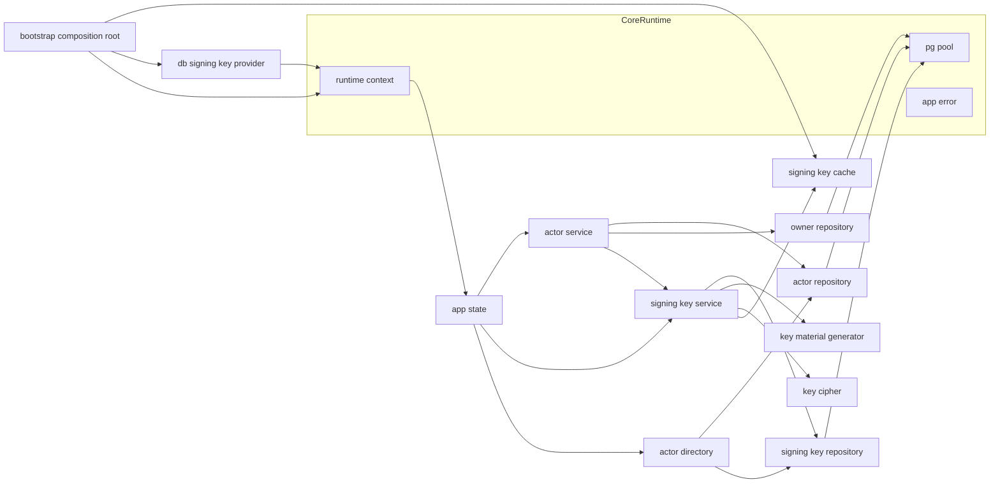
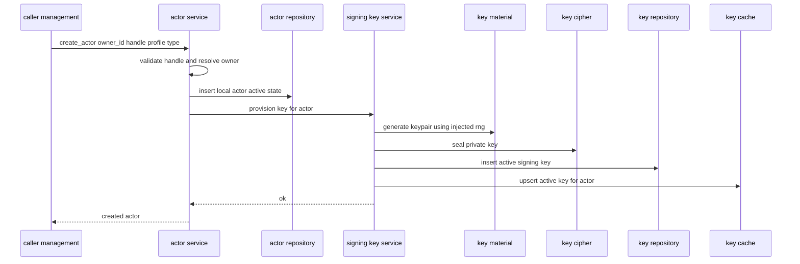
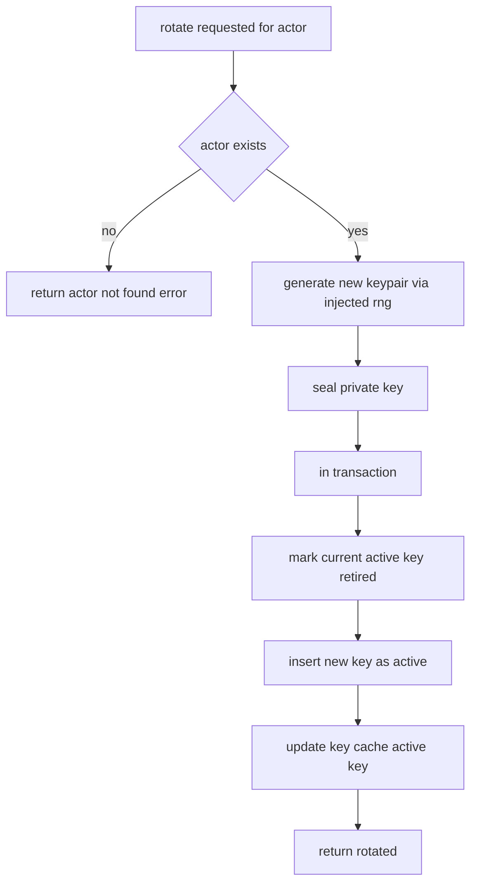
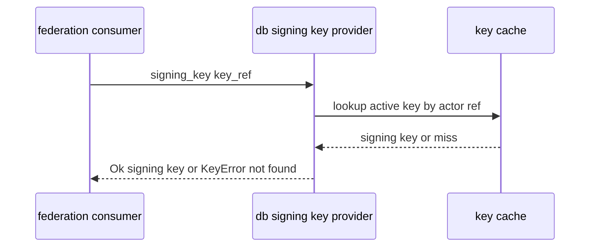

# Design Document

## Overview

**Purpose**: actor-model は「一人鯖だが ActivityPub 上では複数アクターが独立して振る舞う」方針を、(1) 複数ローカルアクターのコアデータモデル、(2) 管理層オーナー↔アクターの関連、(3) アクター毎署名鍵の生成・保管・ローテーション、(4) core-runtime 署名鍵供給境界の本番実装、(5) 下流向け参照経路、として実体化する。

**Users**: 後続 spec の実装者が本 spec の上に乗る。federation-core はハンドル解決と公開鍵素材を消費し、api-foundation はオーナーの保有アクター一覧をアクター選択の基礎として消費する。一人鯖の運用者は、複数の人格／BOT アクターを単一オーナーの下で保有できる。

**Impact**: core-runtime のランタイム土台（DI 境界・DB プール・統一エラー型）に、最初のドメインモジュール `src/actor/` を追加する。core-runtime が空けておいた本番 `SigningKeyProvider` 拡張点を本 spec が埋め、以降の連合・API はここで定義されるアクター・鍵参照に依存する。

### Goals

- 複数のローカルアクター（識別子・ハンドル・種別・プロフィール基礎・状態・時刻）を永続化し、ハンドルをインスタンス内で一意にする。
- 管理層の「オーナー」概念と 1:N のオーナー↔アクター関連を表現する。
- 「同一オーナー」をプロトコル層・外部公開に露出させない構造を保証する。
- アクター毎署名鍵を注入乱数で生成し、秘密鍵を保護して保管し、ローテーション経路を提供する。
- core-runtime の `SigningKeyProvider` 同期契約を変えずに本番実装を供給する。
- 下流が必要とする参照（オーナー別一覧・ハンドル解決・公開鍵供給）を提供する。

### Non-Goals

- WebFinger／inbox／outbox 等の連合エンドポイント、アクター URL ルーティング、JSON-LD 表現（federation-core）。
- Mastodon Account エンティティの JSON シリアライズ・update_credentials（accounts-and-instance）。
- OAuth トークン発行とトークンへのアクター選択の結びつけ（api-foundation。本 spec は選択候補の供給のみ）。
- リモートアクターのフェッチ／正規化（federation-core／accounts-and-instance）。
- アバター・ヘッダ等のメディア（media-pipeline）、プロフィールの拡張フィールド（accounts-and-instance）。
- 起動・設定基盤・DI 境界 trait の定義・マイグレーション基盤・テストハーネス土台（core-runtime）。

## Boundary Commitments

### This Spec Owns

- ローカルアクターのコアデータモデルと永続化（`owners` / `local_actors` / `actor_signing_keys` テーブルおよびそのマイグレーション）。
- 管理層オーナー概念とオーナー↔アクターの 1:N 関連、ハンドルのインスタンス内一意制約。
- アクターの基本ライフサイクル（作成・無効化）と状態モデル。
- アクター毎署名鍵の生成（注入乱数）・保管（秘密鍵 at-rest 保護）・ローテーション・有効鍵の一意性。
- core-runtime `SigningKeyProvider` の本番実装（`DbSigningKeyProvider`）と鍵キャッシュ。
- 下流向け参照 API（管理層: オーナー別アクター一覧 / プロトコル層: ハンドル解決・公開鍵供給）。
- 「同一オーナー」のプロトコル層非露出を担保する型分離。

### Out of Boundary

- 連合エンドポイント・アクター URL の構築と公開・JSON-LD（federation-core）。
- Account JSON 契約・update_credentials・プロフィール拡張フィールド（accounts-and-instance）。
- OAuth トークンとアクター選択の結びつけ（api-foundation）。
- 非決定性境界 trait（Clock / IdGenerator / Rng / SigningKeyProvider）の**定義**、DB プール確立、統一エラー型、マイグレーション基盤、テストハーネス土台（core-runtime が所有）。
- 鍵の利用（HTTP Signatures の生成・検証そのもの）は federation-core。本 spec は鍵の供給まで。

### Allowed Dependencies

- core-runtime: `RuntimeContext`（`IdGenerator` / `Rng` / `Clock` / `SigningKeyProvider`）、`PgPool`、`AppError`、起動設定（`Secret<T>` を含む）、マイグレーション基盤、テストハーネス（`spawn_test_app`）。
- core-runtime の `SigningKeyProvider` trait は本 spec が**実装する**対象であり、シグネチャは変更しない。
- 暗号ライブラリ: RSA 鍵生成（注入 `Rng` を受ける形）と AEAD（秘密鍵封緘）。標準的な Rust 暗号クレートに閉じる。
- 下流仕様（JSON 契約・アクター URL 形・OAuth 詳細）を本 spec に持ち込んではならない。

### Revalidation Triggers

- `LocalActor` / `Owner` / `ActorSigningKey` の公開フィールドやドメイン型の変更。
- 下流向け参照 API（`ActorDirectory` の `list_actors_for_owner` / `resolve_actor_by_handle` / `actor_public_key`）の契約変更。
- 署名鍵供給の `KeyRef` 解釈・`DbSigningKeyProvider` の鍵キャッシュ更新規約の変更。
- ハンドル一意制約・有効鍵一意制約・アクター状態モデルの変更。
- 秘密鍵保管形式（暗号化方式・カラム構成）の変更。
- core-runtime 側の `SigningKeyProvider` シグネチャや `KeyRef` 形が変わった場合（上流発の再検証）。

## Architecture

### Architecture Pattern & Boundary Map

選択パターン: **Repository + Service（core-runtime の DI 境界に乗る）**。永続化（Repository）と業務ロジック（Service）を分離し、非決定性は core-runtime の `RuntimeContext` 経由で受け取る。依存方向は一方向（左→右）。



**Architecture Integration**:
- Selected pattern: Repository + Service。non-determinism（id / rng / clock / signing-key）は `RuntimeContext` から注入。
- Domain/feature boundaries: 管理層（Owner / オーナー別一覧）とプロトコル層向け参照（ハンドル解決・公開鍵供給）を型レベルで分離し、owner をプロトコル経路に出さない。
- Existing patterns preserved: steering「レイヤー分離最優先」「注入可能な非決定性境界」「決定性の強制」。
- New components rationale: 各コンポーネントは Boundary Commitments の 1 関心に 1:1 対応。鍵供給は core-runtime の同期 trait に合わせ、キャッシュ＋サービス更新で整合。
- Steering compliance: 外部ブローカー／検索エンジン非依存（DB 完結）、秘密鍵を平文ログに出さない可観測性規律。

### Technology Stack

| Layer | Choice / Version | Role in Feature | Notes |
|-------|------------------|-----------------|-------|
| Backend / Services | Rust (edition 2021) | ドメインモデル・サービス・供給実装 | core-runtime クレートに `src/actor/` を追加 |
| Data / Storage | PostgreSQL + sqlx 0.7 系 | アクター／鍵の永続化、ハンドル・有効鍵の一意制約 | 既存 `PgPool` を共有 |
| Crypto (keygen) | RSA-2048（注入 `Rng` で生成）, SPKI/PKCS#8 PEM | 署名鍵ペア生成・公開鍵エンコード | アルゴリズム種別はカラムで保持し将来拡張 |
| Crypto (at-rest) | AEAD（ChaCha20-Poly1305 もしくは AES-256-GCM） | 秘密鍵の封緘、KEK は起動設定 | `KeyCipher` 境界で差し替え可能 |

> バージョンは系列の目安。実装時に最新互換版へ固定する。選定理由は `research.md` 参照。

## File Structure Plan

### Directory Structure

```
migrations/
└── 0002_actors.sql              # owners / local_actors / actor_signing_keys と各種一意制約

src/
├── actor/
│   ├── mod.rs                   # モジュール公開・ActorModule 組み立て（サービス/ディレクトリのハンドル束ね）
│   ├── model.rs                 # Owner, LocalActor, ActorType, ActorState, Handle(値オブジェクト), 参照型(ResolvedActor/ActorSummary/ActorPublicKey)
│   ├── owner.rs                 # OwnerRepository（オーナー作成・取得）
│   ├── repository.rs            # ActorRepository（作成・状態更新・ハンドル/ID/オーナー別取得）
│   ├── service.rs               # ActorService（アクター作成=鍵生成連動・無効化・状態遷移）
│   ├── directory.rs             # ActorDirectory（下流向け参照: 管理層一覧 / プロトコル層 解決・公開鍵）
│   └── keys/
│       ├── mod.rs               # keys サブモジュール公開
│       ├── material.rs          # 鍵ペア生成（注入 Rng で RSA 生成）・公開鍵/秘密鍵 PEM エンコード
│       ├── cipher.rs            # KeyCipher 境界（秘密鍵 AEAD 封緘）本番/決定的実装
│       ├── repository.rs        # ActorSigningKeyRepository（鍵の作成・有効鍵取得・失効・全件ロード）
│       ├── service.rs           # SigningKeyService（作成時生成・ローテーション・有効鍵一意・キャッシュ更新）
│       ├── cache.rs             # KeyCache（KeyRef→SigningKey のメモリ保持, Arc+内部可変性）
│       └── provider.rs          # DbSigningKeyProvider（core-runtime SigningKeyProvider 本番実装, KeyCache を読む）

tests/
├── actor_lifecycle_it.rs        # 作成・無効化・ハンドル一意・状態判別（統合）
├── signing_key_it.rs            # 生成・ローテーション・供給反映・決定的再現（統合）
└── owner_actor_boundary_it.rs   # owner 非露出（プロトコル経路）と管理層一覧（統合）
```

### Modified Files

- `src/state.rs`（core-runtime）— `AppState` に `ActorModule`（`ActorService` / `SigningKeyService` / `ActorDirectory` のハンドル）を追加。
- `src/bootstrap.rs`（core-runtime）— プール確立後に `KeyCache` を DB からロードし `DbSigningKeyProvider` を構築、`RuntimeContext` に注入。`ActorModule` を組み立てて `AppState` に格納。
- `src/runtime/signing_key.rs`（core-runtime）— 本番 `SigningKeyProvider` の差込点に `DbSigningKeyProvider` を受け入れる構成（テスト用固定鍵実装は維持）。
- `src/config/mod.rs`（core-runtime）— 起動設定に鍵暗号鍵（KEK）の `Secret<T>` 項目を1つ追加。

> 各ファイルは単一責務。`keys/` 配下は「生成・封緘・永続化・サービス・キャッシュ・供給」を分離し、core-runtime の同期 trait に整合させる。

## System Flows

### アクター作成（鍵生成連動）



ハンドル重複・オーナー不在・形式不正は挿入前に拒否する（1.3, 1.6, 2.3）。アクター挿入と鍵生成は同一トランザクション境界で扱い、鍵生成失敗時はアクター作成もロールバックする（4.1）。

### 署名鍵ローテーション



有効鍵一意は部分一意制約（status=active）で担保し、新旧の切替を単一トランザクションで原子的に行う（5.2, 5.3）。失効鍵は status で区別して保持する（5.4）。

### 署名鍵供給（同期境界）



供給は同期。鍵は起動時にキャッシュへロードされ、作成／ローテーションのたびに `SigningKeyService` がキャッシュを更新するため、供給応答は最新状態を反映する（6.2, 6.3, 6.4）。

## Requirements Traceability

| Requirement | Summary | Components | Interfaces | Flows |
|-------------|---------|------------|------------|-------|
| 1.1–1.6 | アクターモデル・ハンドル一意・種別・ID境界・形式検証 | LocalActor(model), ActorRepository, ActorService | create_actor(), Handle | アクター作成 |
| 2.1–2.5 | オーナー概念・1:N関連・オーナー作成・管理層取得 | Owner(model), OwnerRepository, ActorService, ActorDirectory | create_owner(), list_actors_for_owner() | アクター作成 |
| 3.1–3.3 | 同一オーナーのプロトコル非露出・型分離 | ActorDirectory, model(参照型) | resolve_actor_by_handle(), actor_public_key(), ResolvedActor/ActorPublicKey | 供給／参照 |
| 4.1–4.6 | 鍵生成（注入Rng）・決定的再現・秘密鍵非露出/保護・公開鍵取得 | SigningKeyService, KeyMaterial, KeyCipher, ActorSigningKeyRepository | provision_key(), generate_keypair(), seal()/open() | アクター作成 |
| 5.1–5.5 | ローテーション・旧鍵失効・有効鍵一意・失効鍵保持・不在拒否 | SigningKeyService, ActorSigningKeyRepository | rotate_key() | ローテーション |
| 6.1–6.4 | 供給境界本番実装・鍵参照解決・未検出エラー・更新反映 | DbSigningKeyProvider, KeyCache | SigningKeyProvider::signing_key() | 供給 |
| 7.1–7.5 | 状態モデル・初期有効化・無効化・状態判別・時刻境界 | ActorState(model), ActorService, ActorRepository | deactivate_actor(), ActorState | アクター作成 |
| 8.1–8.4 | オーナー別一覧・ハンドル解決・公開鍵供給・owner非露出 | ActorDirectory | list_actors_for_owner(), resolve_actor_by_handle(), actor_public_key() | 供給／参照 |

## Components and Interfaces

| Component | Domain/Layer | Intent | Req Coverage | Key Dependencies (P0/P1) | Contracts |
|-----------|--------------|--------|--------------|--------------------------|-----------|
| model | Domain | アクター/オーナー/鍵のドメイン型・参照型・値オブジェクト | 1,2,3,7 | core-runtime Id/時刻型 (P0) | State |
| OwnerRepository | Data | オーナーの作成・取得 | 2 | PgPool (P0) | Service, State |
| ActorRepository | Data | アクターの作成・状態更新・各種取得 | 1,2,7,8 | PgPool (P0), model (P0) | Service, State |
| ActorSigningKeyRepository | Data | 鍵の作成・有効鍵取得・失効・全件ロード | 4,5,6 | PgPool (P0) | Service, State |
| KeyMaterial | Crypto | 注入 Rng による鍵ペア生成・PEM エンコード | 4 | RuntimeContext.rng (P0) | Service |
| KeyCipher | Crypto | 秘密鍵の AEAD 封緘/開封 | 4 | KEK(config), RuntimeContext.rng (P0) | Service |
| KeyCache | Runtime | KeyRef→SigningKey のメモリ保持 | 6 | model (P0) | State |
| SigningKeyService | Service | 生成・ローテーション・有効鍵一意・キャッシュ更新 | 4,5,6 | KeyMaterial, KeyCipher, KeyRepo, KeyCache (P0) | Service |
| DbSigningKeyProvider | Runtime | core-runtime SigningKeyProvider 本番実装 | 6 | KeyCache (P0) | Service |
| ActorService | Service | アクター作成（鍵連動）・ライフサイクル | 1,2,7 | ActorRepo, OwnerRepo, SigningKeyService (P0) | Service |
| ActorDirectory | Service | 下流向け参照（管理層一覧 / プロトコル解決・公開鍵） | 2,3,8 | ActorRepo, KeyRepo (P0) | Service |
| ActorModule(bootstrap wiring) | Runtime | 配線（プロバイダ注入・キャッシュ初期化・AppState 格納） | 6 | core-runtime bootstrap (P0) | Service |

依存方向（左→右、上位は下位のみ参照）: `model → Repositories / KeyMaterial / KeyCipher / KeyCache → Services(SigningKeyService, ActorService, ActorDirectory) / DbSigningKeyProvider → bootstrap wiring`。

### Domain / モデル層

#### model

| Field | Detail |
|-------|--------|
| Intent | アクター・オーナー・鍵のドメイン型と、プロトコル層向け参照型を型レベルで分離して定義する |
| Requirements | 1.1, 1.4, 2.1, 3.1, 3.2, 7.1 |

**Responsibilities & Constraints**
- `Handle` 値オブジェクトが形式検証（空文字不可・許可文字集合・インスタンス内一意は DB 制約で担保）を保持（1.2, 1.6）。
- 管理層型（`LocalActor` は `owner_id` を含む）とプロトコル層向け参照型（`ResolvedActor` / `ActorPublicKey` は owner を**含まない**）を分離（3.1）。
- `ActorType`（Person / Service=BOT）と `ActorState`（Active / Deactivated）を列挙で表現（1.4, 7.1）。

**Dependencies**
- Inbound: 全コンポーネント (P0)
- Outbound: core-runtime の Id 型・時刻型 (P0)

**Contracts**: State [x]

##### 型定義（抜粋）
```rust
pub struct Handle(String); // 形式検証付き。new() で不正形式を拒否

pub enum ActorType { Person, Service }       // Service = 自動化アクター(BOT)
pub enum ActorState { Active, Deactivated }

pub struct Owner { pub id: Id, pub created_at: OffsetDateTime }

pub struct LocalActor {
    pub id: Id,
    pub owner_id: Id,            // 管理層のみ。プロトコル参照型へは渡さない
    pub handle: Handle,
    pub actor_type: ActorType,
    pub display_name: String,
    pub summary: String,
    pub state: ActorState,
    pub created_at: OffsetDateTime,
    pub updated_at: OffsetDateTime,
}

// プロトコル層／外部公開向け（owner を構造的に持たない）
pub struct ResolvedActor {
    pub id: Id,
    pub handle: Handle,
    pub actor_type: ActorType,
    pub display_name: String,
    pub summary: String,
    pub state: ActorState,
}
pub struct ActorPublicKey { pub actor_id: Id, pub key_id: Id, pub public_key_pem: String }

// 管理層一覧用（アクター選択の基礎）
pub struct ActorSummary { pub id: Id, pub handle: Handle, pub actor_type: ActorType, pub display_name: String, pub state: ActorState }
```
- Invariants: `ResolvedActor` / `ActorPublicKey` / `ActorSummary` はいずれも `owner_id` を含まない（3.1, 8.4）。

### Data / データ層

#### OwnerRepository

| Field | Detail |
|-------|--------|
| Intent | オーナーの作成と取得 |
| Requirements | 2.1, 2.4 |

**Contracts**: Service [x] / State [x]

##### Service Interface
```rust
pub async fn create_owner(pool: &PgPool, id: Id, now: OffsetDateTime) -> Result<Owner, AppError>;
pub async fn find_owner(pool: &PgPool, id: Id) -> Result<Option<Owner>, AppError>;
```

#### ActorRepository

| Field | Detail |
|-------|--------|
| Intent | アクターの永続化・状態更新・取得 |
| Requirements | 1.1, 1.2, 1.3, 2.2, 7.3, 8.1, 8.2 |

**Responsibilities & Constraints**
- ハンドル一意制約違反を重複エラーへ写像（1.3）。
- オーナー別取得・ハンドル取得・ID 取得・状態更新を提供（8.1, 8.2, 7.3）。

**Contracts**: Service [x] / State [x]

##### Service Interface
```rust
pub async fn insert_actor(tx: &mut PgTransaction, actor: &LocalActor) -> Result<(), AppError>; // 一意違反→重複エラー
pub async fn find_by_handle(pool: &PgPool, handle: &Handle) -> Result<Option<LocalActor>, AppError>;
pub async fn find_by_id(pool: &PgPool, id: Id) -> Result<Option<LocalActor>, AppError>;
pub async fn list_by_owner(pool: &PgPool, owner_id: Id) -> Result<Vec<LocalActor>, AppError>;
pub async fn update_state(pool: &PgPool, id: Id, state: ActorState, now: OffsetDateTime) -> Result<bool, AppError>;
```

#### ActorSigningKeyRepository

| Field | Detail |
|-------|--------|
| Intent | 署名鍵の永続化・有効鍵取得・失効・起動時ロード |
| Requirements | 4.1, 4.5, 5.2, 5.3, 5.4, 6.2 |

**Responsibilities & Constraints**
- アクター毎に status=active が高々1行となる部分一意制約を前提に挿入・失効を行う（5.3）。
- 秘密鍵は封緘済みバイト列として格納（4.5）。
- 全有効鍵を起動時に一括ロードしてキャッシュ温めに供する。

**Contracts**: Service [x] / State [x]

##### Service Interface
```rust
pub async fn insert_active_key(tx: &mut PgTransaction, key: &StoredSigningKey) -> Result<(), AppError>;
pub async fn retire_active_key(tx: &mut PgTransaction, actor_id: Id, now: OffsetDateTime) -> Result<(), AppError>;
pub async fn find_active_public_key(pool: &PgPool, actor_id: Id) -> Result<Option<ActorPublicKey>, AppError>;
pub async fn load_all_active(pool: &PgPool) -> Result<Vec<StoredSigningKey>, AppError>; // 起動時キャッシュ温め
```
- `StoredSigningKey`: `{ id, actor_id, algorithm, public_key_pem, sealed_private_key, status, created_at }`。

### Crypto / 暗号層

#### KeyMaterial

| Field | Detail |
|-------|--------|
| Intent | 注入乱数で鍵ペアを生成し PEM エンコードする |
| Requirements | 4.2, 4.3, 4.6 |

**Responsibilities & Constraints**
- `RuntimeContext.rng` を受けて RSA-2048 を生成（4.2）。同一決定的乱数で同一鍵を再現（4.3）。
- 公開鍵 SPKI/PEM、秘密鍵 PKCS#8/PEM を出力（4.6）。

**Contracts**: Service [x]

##### Service Interface
```rust
pub struct GeneratedKeyPair { pub algorithm: KeyAlgorithm, pub public_key_pem: String, pub private_key_pem: SecretString }
pub fn generate_keypair(rng: &dyn Rng) -> Result<GeneratedKeyPair, AppError>;
```
- Invariants: `private_key_pem` は `Secret` ラッパで保持し Debug/ログに露出しない（4.4）。

#### KeyCipher

| Field | Detail |
|-------|--------|
| Intent | 秘密鍵 PEM を at-rest 封緘／開封する差し替え可能境界 |
| Requirements | 4.4, 4.5 |

**Responsibilities & Constraints**
- KEK（起動設定の `Secret<T>`）と注入乱数由来の nonce で AEAD 封緘（4.5）。
- 本番実装と決定的テスト実装を差し替え可能（差し替え可能境界制約）。

**Contracts**: Service [x]

##### Service Interface
```rust
pub trait KeyCipher: Send + Sync {
    fn seal(&self, plaintext: &SecretSlice, rng: &dyn Rng) -> Result<Vec<u8>, AppError>;
    fn open(&self, sealed: &[u8]) -> Result<SecretString, AppError>;
}
```

### Runtime / 供給層

#### KeyCache

| Field | Detail |
|-------|--------|
| Intent | KeyRef→有効署名鍵のメモリ保持。同期供給を可能にする |
| Requirements | 6.2, 6.4 |

**Contracts**: State [x]

##### State Management
- State model: `Arc<RwLock<HashMap<ActorKeyRef, SigningKey>>>`（内部可変性）。
- Persistence & consistency: 起動時に DB から温め、作成／ローテーションで `SigningKeyService` のみが更新（単一書込経路で整合）。
- Concurrency strategy: 読み多数・書き少数。`RwLock` で保護。

#### DbSigningKeyProvider

| Field | Detail |
|-------|--------|
| Intent | core-runtime `SigningKeyProvider` の本番実装（同期） |
| Requirements | 6.1, 6.2, 6.3 |

**Responsibilities & Constraints**
- `KeyRef` を「どのアクターの有効鍵か」を指す参照として解釈し、`KeyCache` から取得（6.2）。
- 該当鍵が無ければ `KeyError`（未検出）を返す（6.3）。

**Contracts**: Service [x]

##### Service Interface
```rust
// core-runtime の trait をそのまま実装（再定義しない）
impl SigningKeyProvider for DbSigningKeyProvider {
    fn signing_key(&self, key_ref: KeyRef) -> Result<SigningKey, KeyError>;
}
```
- Preconditions: `KeyCache` が起動時ロード済み。
- Postconditions: 生成／ローテーション後の最新有効鍵を返す（6.4）。

### Service / サービス層

#### SigningKeyService

| Field | Detail |
|-------|--------|
| Intent | 鍵の生成・ローテーション・有効鍵一意・キャッシュ更新を集約 |
| Requirements | 4.1, 4.5, 5.1, 5.2, 5.3, 5.5, 6.4 |

**Responsibilities & Constraints**
- アクター作成時に有効鍵を1つ生成（4.1）。ローテーションは新鍵有効化＋旧鍵失効を単一トランザクションで原子的に（5.1, 5.2, 5.3）。
- 不在アクターへのローテーションを拒否（5.5）。DB 書込と同時に `KeyCache` を更新（6.4）。

**Contracts**: Service [x]

##### Service Interface
```rust
pub async fn provision_key(&self, tx: &mut PgTransaction, actor_id: Id) -> Result<(), AppError>; // 作成時
pub async fn rotate_key(&self, actor_id: Id) -> Result<(), AppError>;                            // 不在→AppError
```

#### ActorService

| Field | Detail |
|-------|--------|
| Intent | アクター作成（鍵生成連動）とライフサイクル遷移 |
| Requirements | 1.1, 1.3, 1.5, 1.6, 2.2, 2.3, 7.2, 7.3, 7.5 |

**Responsibilities & Constraints**
- 作成: ハンドル形式検証 → オーナー存在確認 → アクター挿入（active 初期化）→ 鍵生成、を単一トランザクションで（1.6, 2.3, 7.2）。ID は `IdGenerator`、時刻は `Clock` から取得（1.5, 7.5）。
- 無効化: 状態を Deactivated へ遷移し updated_at を更新（7.3）。

**Contracts**: Service [x]

##### Service Interface
```rust
pub struct NewActor { pub owner_id: Id, pub handle: Handle, pub actor_type: ActorType, pub display_name: String, pub summary: String }
pub async fn create_actor(&self, input: NewActor) -> Result<LocalActor, AppError>;
pub async fn deactivate_actor(&self, actor_id: Id) -> Result<LocalActor, AppError>;
```

#### ActorDirectory

| Field | Detail |
|-------|--------|
| Intent | 下流向け参照。管理層一覧とプロトコル層解決・公開鍵を分離提供 |
| Requirements | 3.1, 3.2, 3.3, 8.1, 8.2, 8.3, 8.4 |

**Responsibilities & Constraints**
- 管理層: `list_actors_for_owner` がオーナー別一覧（`ActorSummary`）を返す（8.1）。
- プロトコル層: `resolve_actor_by_handle` は `ResolvedActor`、`actor_public_key` は `ActorPublicKey` を返し、いずれも owner を含まない（3.1, 3.2, 8.2, 8.3, 8.4）。

**Contracts**: Service [x]

##### Service Interface
```rust
pub async fn list_actors_for_owner(&self, owner_id: Id) -> Result<Vec<ActorSummary>, AppError>; // 管理層のみ
pub async fn resolve_actor_by_handle(&self, handle: &Handle) -> Result<Option<ResolvedActor>, AppError>;
pub async fn actor_public_key(&self, actor_id: Id) -> Result<Option<ActorPublicKey>, AppError>;
```

## Data Models

### Logical Data Model

- `owners (1) ──< local_actors (N)`: 管理層の所有関係。`local_actors.owner_id` は必須 FK。
- `local_actors (1) ──< actor_signing_keys (N)`: アクターは複数鍵を持ちうるが、status=active は高々1。
- ハンドルは `local_actors.handle` に対する一意制約（単一ドメイン前提、3）。

### Physical Data Model

```sql
-- 0002_actors.sql
CREATE TABLE owners (
    id          BIGINT PRIMARY KEY,            -- core-runtime IdGenerator 採番
    created_at  TIMESTAMPTZ NOT NULL
);

CREATE TABLE local_actors (
    id            BIGINT PRIMARY KEY,
    owner_id      BIGINT NOT NULL REFERENCES owners(id),
    handle        TEXT   NOT NULL,
    actor_type    TEXT   NOT NULL,             -- 'person' | 'service'
    display_name  TEXT   NOT NULL DEFAULT '',
    summary       TEXT   NOT NULL DEFAULT '',
    state         TEXT   NOT NULL,             -- 'active' | 'deactivated'
    created_at    TIMESTAMPTZ NOT NULL,
    updated_at    TIMESTAMPTZ NOT NULL,
    CONSTRAINT local_actors_handle_unique UNIQUE (handle)
);
CREATE INDEX local_actors_owner_idx ON local_actors(owner_id);

CREATE TABLE actor_signing_keys (
    id                  BIGINT PRIMARY KEY,
    actor_id            BIGINT NOT NULL REFERENCES local_actors(id),
    algorithm           TEXT   NOT NULL,        -- 'rsa-2048'
    public_key_pem      TEXT   NOT NULL,
    sealed_private_key  BYTEA  NOT NULL,        -- KeyCipher で封緘済み（平文を格納しない）
    status              TEXT   NOT NULL,        -- 'active' | 'retired'
    created_at          TIMESTAMPTZ NOT NULL
);
-- アクター毎に有効鍵は高々1（5.3）
CREATE UNIQUE INDEX actor_signing_keys_active_unique
    ON actor_signing_keys(actor_id) WHERE status = 'active';
```

- Consistency: アクター作成（actor 挿入＋active 鍵挿入）とローテーション（旧失効＋新 active 挿入）は単一トランザクション。
- Temporal: `created_at` / `updated_at` は `Clock` 由来（7.5）。

### Data Contracts & Integration

- 下流提供型: `ActorSummary`（管理層）、`ResolvedActor`・`ActorPublicKey`（プロトコル層）。後者2型は owner を含まない（境界契約、3 / 8.4）。
- core-runtime 連携: `DbSigningKeyProvider` が `SigningKeyProvider` を実装し、bootstrap が `RuntimeContext` へ注入。`KeyRef` は core-runtime 型で、actor 参照として解釈（不足時は再検証トリガ）。
- 起動設定: KEK（`Secret<T>`）を core-runtime config に1項目追加。

## Error Handling

### Error Strategy
- ドメイン操作の失敗は core-runtime の `AppError` に集約（4xx 相当: 重複ハンドル・形式不正・オーナー/アクター不在、5xx 相当: 暗号・DB 失敗）。
- 秘密鍵関連エラーは内部詳細（鍵素材）を本文・ログに出さない（4.4）。

### Error Categories and Responses
- **利用者起因（4xx 相当）**: ハンドル重複（1.3）、ハンドル形式不正（1.6）、オーナー不在（2.3）、アクター不在ローテーション（5.5）。原因種別を示すメッセージ。
- **供給未検出**: `SigningKeyProvider` の `KeyError`（鍵未検出, 6.3）。
- **システム起因（5xx 相当）**: 鍵生成・封緘・DB 失敗。秘密鍵素材を露出させず診断ログのみ。

### Monitoring
- アクター作成・鍵生成・ローテーションは構造化ログに出力（秘密鍵素材は除外、4.4）。失敗は core-runtime の相関 ID 付き診断に乗る。

## Testing Strategy

### Unit Tests
- `Handle::new` の形式検証（空文字・不正文字を拒否、許可文字を受理）（1.2, 1.6）。
- `generate_keypair` が同一決定的乱数で同一鍵を再現し、異なるシードで異なる鍵になる（4.2, 4.3）。
- `KeyCipher` の seal→open ラウンドトリップで原文一致、封緘出力に平文が含まれない（4.5）。
- `ActorState` 遷移（active→deactivated）と参照型に owner_id が無いことの型/値検査（3.1, 7.1）。

### Integration Tests（core-runtime `spawn_test_app` 上）
- アクター作成で active アクター＋有効鍵1つが永続化され、同一ハンドル再作成が重複エラーになる（1.1, 1.3, 4.1）。
- ローテーションで旧鍵が retired・新鍵が active、active が高々1、不在アクターは拒否（5.1, 5.2, 5.3, 5.5）。
- `DbSigningKeyProvider` が作成／ローテーション後の最新有効鍵を返し、未登録参照で未検出エラー（6.2, 6.3, 6.4）。
- `list_actors_for_owner` が当該オーナーのアクターのみ返す一方、`resolve_actor_by_handle`／`actor_public_key` の戻り値に owner 情報が含まれない（2.5, 3.1, 8.1, 8.2, 8.3, 8.4）。
- 無効化後、`resolve_actor_by_handle` で Deactivated 状態が判別できる（7.3, 7.4）。

### Security
- 秘密鍵素材がログ・診断・プロトコル参照型のいずれにも現れないことを検査（4.4）。
- DB に格納される秘密鍵が封緘済み（平文でない）ことを検査（4.5）。

## Security Considerations

- 秘密鍵は `Secret` ラッパで保持し Debug/Display/ログでマスク。DB には `KeyCipher` 封緘後のバイト列のみを格納（4.4, 4.5）。
- KEK は起動設定（`Secret<T>`）で供給し、平文ログに出さない（core-runtime のシークレット規律を継承）。
- 鍵生成・nonce は注入乱数境界経由。本番は本番乱数、テストのみ決定的乱数を bootstrap で切り替え、本番で決定的鍵を使う事故を防ぐ。
- 「同一オーナー」のプロトコル非露出は秘匿目的ではなくレイヤー分離（実装の綺麗さ）。プロトコル向け参照型から owner を構造的に排除して担保する。
