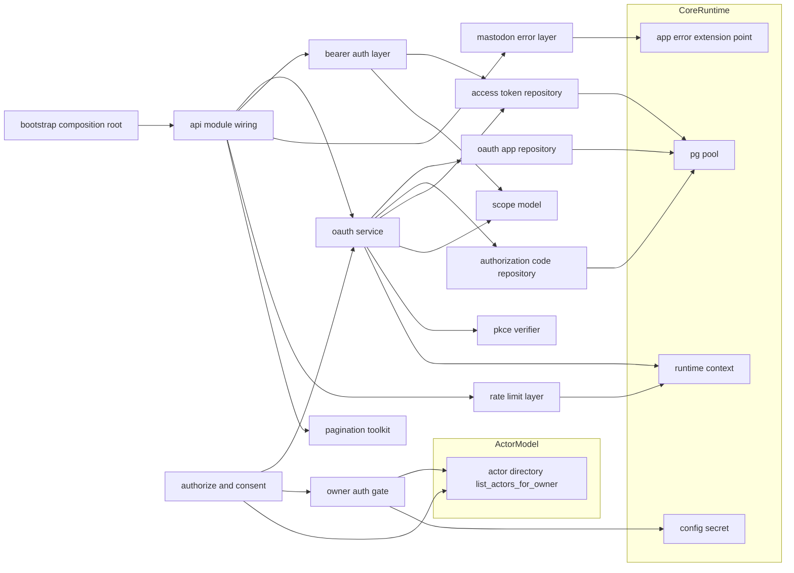
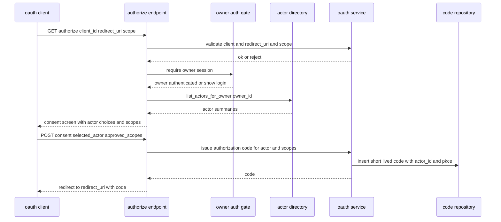
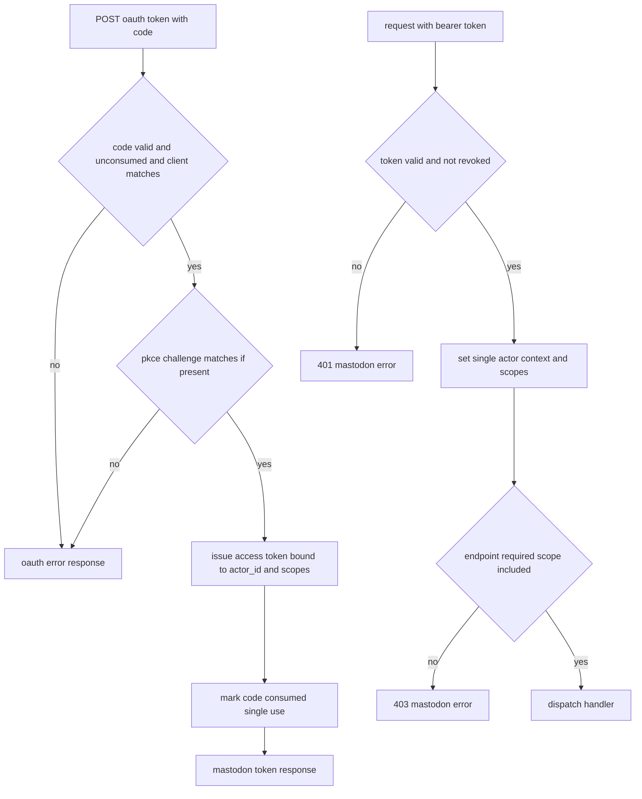
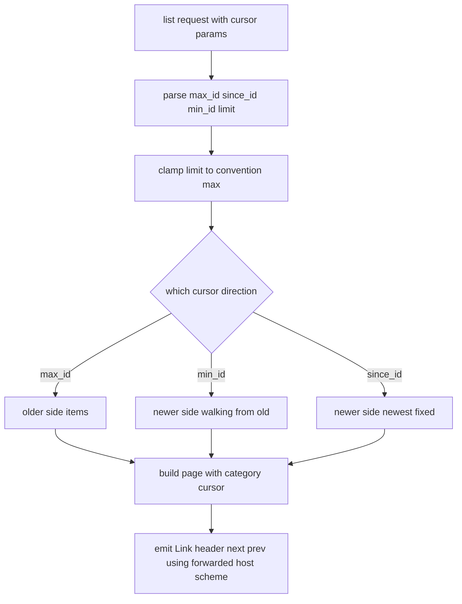

# Design Document

## Overview

**Purpose**: api-foundation は Mastodon 互換 API 全体が乗る横断土台を提供する。OAuth 2.0 サーバー（アプリ登録・認可コードフロー + アクター選択承認画面・トークン発行/失効・スコープ検証・Bearer 認証ミドルウェア）、全リスト系で一貫するページネーション規約（`Link` + カーソル）、Mastodon 互換のエラー JSON 形と `X-RateLimit-*` ヘッダ、HTTP ステータス互換、そしてエンティティ JSON 契約を固定するゴールデンテストハーネスを担う。

**Users**: 後続の全 API spec の実装者（AI 自律 TDD を含む）が本土台に「乗るだけ」で認証・ページネーション・エラー互換・契約テストを得る。一人鯖の運用者は、標準クライアント（Ivory・Elk・Phanpy 等）から OAuth でログインし、承認画面でどのローカルアクターとして操作するかを選べる。

**Impact**: core-runtime のランタイム土台（axum/tower・`AppError` 拡張点・`RuntimeContext`・`PgPool`・テストハーネス）と actor-model のアクター参照（`list_actors_for_owner`）の上に、横断 API モジュール群（`src/oauth/`・`src/api/`）と OAuth 永続テーブルを追加する。以降の認証/リスト/契約を要する全 API はここで確立される接合に依存する。

### Goals

- 標準クライアントが OAuth 認可コードフローでログインでき、承認時に単一アクターを選択して操作対象を確定できる。
- 全リスト系 API が `Link` + `max_id`/`since_id`/`min_id`/`limit` で一貫し、カテゴリ毎カーソル差異を吸収する。
- エラー JSON 形（`error` / `error_description`）と `X-RateLimit-*` ヘッダ・HTTP ステータスが Mastodon 互換で、横断適用される。
- エンティティ JSON 契約を決定的に固定・比較できるゴールデンテストハーネスを後続 spec へ提供する。
- スコープ内包判定・トークン検査を認可・発行・保護・後続再利用の全段階で単一実装として共有する。

### Non-Goals

- 個別エンティティ（Account/Status/Notification/Poll/Relationship/Instance）の具体的 JSON 契約内容（各機能 spec が所有し本ハーネスに足す）。
- 各エンドポイントのビジネスロジック（投稿・フォロー等）。
- WebSocket 接続そのもの・購読管理（streaming）。Web Push 購読実体と VAPID 鍵管理（web-push）。ただし `push` スコープ定義とトークン検査は本 spec が提供し再利用させる。
- レート制限の厳格な実値・分散カウンタ（一人鯖前提、ヘッダ形のみ厳守）。
- オーナー資格情報の本格的管理（ローテーション・複数管理者等）。本 spec は標準クライアントログインに必要な最小オーナー認証ゲートのみを持つ。
- アクター/オーナーのデータモデルと署名鍵（actor-model）、起動・設定・DI 境界・統一エラー骨格・マイグレーション基盤（core-runtime）。

## Boundary Commitments

### This Spec Owns

- OAuth 2.0 サーバー: OAuth アプリケーション登録と資格情報検証、認可コードフロー（承認画面 + アクター選択 + 任意の PKCE）、アクセストークン発行/失効、認可コード/トークンの永続化。
- スコープモデル（`read`/`write`/`follow`/`push` と細分スコープ）と、認可・発行・保護で共有される内包判定。
- Bearer 認証ミドルウェア（トークン解決 → 単一アクター文脈 + 承認スコープの供給）と、後続が再利用するトークン検査ロジック。
- 承認画面の前段となる最小オーナー認証ゲートと短命オーナーセッション。
- ページネーション規約（`Link` ヘッダ生成、`max_id`/`since_id`/`min_id`/`limit` 解釈、カテゴリ毎カーソル抽象、`X-Forwarded-*` 尊重の絶対 URL）。
- Mastodon 互換エラー応答層（`AppError` 拡張による `error`/`error_description` 本文 + ステータス対応表）。
- `X-RateLimit-*` ヘッダ付与ミドルウェアと上限超過応答（形のみ厳守、実値は緩い）。
- エンティティ契約テストハーネス（決定的応答生成・ゴールデン比較・差分報告・フィクスチャ登録の基盤）。

### Out of Boundary

- 個別エンティティの JSON 契約内容（accounts-and-instance / statuses-core 等が所有。本 spec はハーネスのみ）。
- アクター/オーナーのデータモデル・署名鍵・アクター作成/無効化（actor-model）。
- 統一エラー型 `AppError` の分類・`IntoResponse` 骨格そのもの、設定/DB プール/DI 境界 trait/マイグレーション基盤/テストハーネス土台（core-runtime）。
- WebSocket トランスポートと購読管理（streaming）、Web Push 購読実体と VAPID 鍵（web-push）。
- 各エンドポイントの業務ロジックとアクター URL/連合表現（federation-core 以降）。

### Allowed Dependencies

- core-runtime: `AppState`/`RuntimeContext`（`Clock`/`IdGenerator`/`Rng`）、`PgPool`、`AppError`（Mastodon 互換本文への拡張点）、起動設定（`Secret<T>`：オーナー資格情報・トークン署名/ハッシュ用素材）、構造化ログ、マイグレーション基盤、テストハーネス（`spawn_test_app`）、axum/tower(-http) 基盤。
- actor-model: `ActorDirectory::list_actors_for_owner`（承認画面のアクター候補）、アクター解決（`resolve_*` / id 妥当性）、`Owner` 概念。本 spec はアクター/オーナーを読み取るのみで生成・変更しない。加えて、OwnerGate が `owner_id` を解決するための単一オーナー取得アクセサ（例: `ActorDirectory::sole_owner()`。一人鯖前提でインスタンスに厳密に1件のみ存在する `owners` 行を返す）を要求する。**現時点で actor-model の設計にこのアクセサは存在しないため、actor-model の Boundary Commitments（下流向け参照 API）へ追加提供を要求する上流依存として明示する**（actor-model 側ファイルは本 spec からは変更しない）。
- 暗号プリミティブ crate: トークン乱数（注入 `Rng` 経由）・PKCE 検証・定数時間比較。下流仕様（個別エンティティ JSON 形・アクター URL 形）を本 spec に持ち込まない。

### Revalidation Triggers

- スコープ体系・内包判定規約の変更。
- 認可コード/アクセストークンのデータ契約（特に `actor_id` バインド規約）の変更。
- ページネーションのカーソル抽象・`Link` 生成規約・`max_id`/`since_id`/`min_id` 意味の変更。
- Mastodon 互換エラー本文形・ステータス対応表の変更。
- `X-RateLimit-*` の付与規約・算出基準の変更。
- 契約テストハーネスの登録 API・ゴールデン比較契約の変更。
- OwnerGate によるオーナー解決の契約（actor-model の単一オーナー取得アクセサの追加・シグネチャ）の変更。
- 上流（core-runtime `AppError` 拡張点シグネチャ / actor-model `list_actors_for_owner` および単一オーナー取得アクセサの契約）の変更。

## Architecture

### Architecture Pattern & Boundary Map

選択パターン: **Tower ミドルウェア層 + ドメインサービス（core-runtime の Composition Root に配線）**。横断関心（Bearer 認証・エラー変換・レート制限・ページネーション）を tower レイヤー/抽出器として実装し、OAuth 業務は Repository + Service に分離する。依存方向は一方向（左→右）。



**Architecture Integration**:
- Selected pattern: ミドルウェア層 + サービス。横断関心を tower レイヤー/抽出器に集約し、各エンドポイントは「乗るだけ」。
- Domain/feature boundaries: OAuth 業務（apps/code/token/scope）と API 横断（error/pagination/ratelimit/auth）を分離。アクター/オーナーは actor-model から読み取りのみ。
- Existing patterns preserved: core-runtime「Composition Root」「注入可能な非決定性境界」「`AppError` 拡張点」、steering「レイヤー分離」「決定性の強制」「契約の集約」。
- New components rationale: 各コンポーネントは Boundary Commitments の 1 関心に 1:1 対応。
- Steering compliance: 外部ブローカー/検索エンジン非依存（DB + インメモリ RL カウンタ）、シークレット非露出、可観測性（失敗時の診断）、決定性（時刻/ID/乱数は `RuntimeContext`）。

### Technology Stack

| Layer | Choice / Version | Role in Feature | Notes |
|-------|------------------|-----------------|-------|
| Backend / Services | Rust (edition 2021) + axum 0.7 系 | OAuth エンドポイント・ミドルウェア・抽出器 | core-runtime クレートに `src/oauth/`・`src/api/` を追加 |
| Middleware | tower / tower-http | 認証・エラー変換・レート制限レイヤー | core-runtime のルータ装着点に積む |
| Data / Storage | PostgreSQL + sqlx 0.7 系 | apps/codes/tokens の永続化 | 既存 `PgPool` を共有 |
| Crypto / OAuth primitives | トークン乱数（注入 `Rng`）・PKCE(S256) 検証・定数時間比較・トークンハッシュ | コード/トークンの安全な生成・照合 | プリミティブは確立 crate、編成は自前 |
| Templating | 最小 HTML（承認画面 + オーナーログイン） | 標準クライアントログインの実通過点 | サーバーサイドレンダリング最小限 |
| Test | core-runtime `spawn_test_app` + スナップショット比較 | 契約テストハーネス | 決定的 `RuntimeContext` 上で再現可能ゴールデン |

> バージョンは系列の目安。実装時に最新互換版へ固定する。選定理由は `research.md` 参照。

## File Structure Plan

### Directory Structure

```
migrations/
└── 0003_oauth.sql                # oauth_applications / oauth_authorization_codes / oauth_access_tokens と各種制約

src/
├── oauth.rs                      # OauthModule 組み立て（サービス/リポジトリ/ミドルウェアのハンドル束ね）と公開
├── oauth/
│   ├── model.rs                  # OauthApp, AuthorizationCode, AccessToken, TokenContext, OwnerSession 等のドメイン型
│   ├── scope.rs                  # Scope/ScopeSet モデルと内包判定（authorize/token/middleware で共有）
│   ├── pkce.rs                   # PKCE(S256) チャレンジ生成検証・コードとの整合検証
│   ├── app_repository.rs         # OauthAppRepository（登録・取得・資格情報検証）
│   ├── code_repository.rs        # AuthorizationCodeRepository（短命コード挿入・単回消費）
│   ├── token_repository.rs       # AccessTokenRepository（発行・トークン解決・失効）
│   ├── service.rs                # OauthService（アプリ登録・コード発行・トークン交換/失効・スコープ確定）
│   ├── owner_gate.rs             # 最小オーナー認証ゲート（設定 Secret 照合）と短命オーナーセッション
│   ├── apps_endpoint.rs          # POST /api/v1/apps, GET /api/v1/apps/verify_credentials
│   ├── authorize_endpoint.rs     # GET/POST /oauth/authorize（オーナー認証→アクター選択承認画面→コード発行）
│   ├── token_endpoint.rs         # POST /oauth/token, POST /oauth/revoke
│   ├── middleware.rs             # Bearer 認証レイヤー/抽出器（RequestActorContext 供給）と再利用可能トークン検査
│   └── templates.rs              # 承認画面・オーナーログインの最小 HTML レンダリング
├── api.rs                        # api 横断モジュール公開・ルータ装着ヘルパ
├── api/
│   ├── error.rs                  # Mastodon 互換エラー本文 + AppError 拡張 + ステータス対応表
│   ├── pagination.rs             # PageParams, Cursor 抽象, Page<T>, Link ヘッダ生成（X-Forwarded 尊重）
│   └── ratelimit.rs              # X-RateLimit-* 付与レイヤー・上限超過応答・インメモリカウンタ
└── testing/
    └── contract.rs               # 契約テストハーネス（決定的応答生成・ゴールデン比較・差分報告・フィクスチャ登録）

tests/
├── oauth_apps_it.rs              # アプリ登録・資格情報検証（統合）
├── oauth_flow_it.rs             # 認可コード→トークン→失効、PKCE、アクター選択バインド（統合）
├── auth_scope_it.rs             # Bearer 認証・スコープ内包・401/403（統合）
├── pagination_it.rs             # max_id/since_id/min_id/limit と Link ヘッダ（統合）
├── error_ratelimit_it.rs        # エラー JSON 形・ステータス出し分け・X-RateLimit-* （統合）
└── contract_harness_it.rs       # ハーネス自身のゴールデン比較・差分報告・決定性（統合）
```

### Modified Files

- `src/state.rs`（core-runtime）— `AppState` に `OauthModule`（`OauthService` / Bearer ミドルウェア / リポジトリのハンドル）と `ApiModule`（ページネーション/エラー/RL ヘルパ）を追加。
- `src/bootstrap.rs`（core-runtime）— プール確立後に OAuth リポジトリ/サービスとオーナーゲートを構築し、エラー変換・RL・Bearer の各 tower レイヤーをルータへ装着、`AppState` に格納。
- `src/server.rs`（core-runtime）— ルータに OAuth/apps エンドポイントを mount し、横断レイヤー（エラー変換・RL）を全 API に適用する装着点を用意。
- `src/config.rs`（core-runtime）— 起動設定にオーナー資格情報（`Secret<T>`）とトークンハッシュ用素材（`Secret<T>`）の項目を追加。
- `src/error.rs`（core-runtime）— Mastodon 互換本文を差し込めるよう、`AppError` 拡張点が `api::error` の変換を受け入れることを確認（骨格は core-runtime 所有・本 spec は本文表現を供給）。

> 各ファイルは単一責務。OAuth 業務（service/repository）と API 横断（error/pagination/ratelimit）と認証ミドルウェアを分離し、core-runtime の Composition Root へ一方向に配線する。

## System Flows

### 認可コードフロー（オーナー認証 + アクター選択）



クライアント/リダイレクト URI 不一致・未知スコープは承認前に拒否（1.1–1.4, 2.1）。承認画面はオーナー認証後にのみ提示し、選択アクター ID と承認スコープを認可コードへ不可分にバインドする（2.2, 2.3）。承認拒否は OAuth 準拠のアクセス拒否を返す（2.4）。

### トークン交換と Bearer 認証



認可コードは単回消費（2.5, 3.1, 3.2）。PKCE は存在時に検証（2.6, 3.3）。トークンは単一 `actor_id` + 承認スコープを保持し（3.5, 5.3）、ミドルウェアが単一アクター文脈を確定してからスコープ内包を判定する（5.1, 4.2–4.5）。失効トークンは 401（3.4, 5.2）。

### リスト応答のページネーションとリンク生成



`since_id`（最新固定）と `min_id`（古い側から進む）の挙動差を保持（6.3, 6.4）。カーソルはカテゴリ毎に差し替え可能（6.6）。`Link` URL は `X-Forwarded-*` を尊重した絶対 URL（6.7）。

## Requirements Traceability

| Requirement | Summary | Components | Interfaces | Flows |
|-------------|---------|------------|------------|-------|
| 1.1–1.5 | アプリ登録・資格情報検証・スコープ/URI 検証 | OauthAppRepository, OauthService, AppsEndpoint, Scope | register_app(), verify_app_credentials() | 認可コードフロー（前段検証） |
| 2.1–2.6 | 認可検証・アクター選択承認・コード発行・拒否・短命単回・PKCE 紐付 | AuthorizeEndpoint, OwnerGate, ActorDirectory(参照), OauthService, AuthorizationCodeRepository, Pkce | issue_authorization_code(), list_actors_for_owner() | 認可コードフロー |
| 3.1–3.6 | トークン交換・失効・actor/scope 保持・トークン非露出 | OauthService, AccessTokenRepository, Pkce | exchange_token(), revoke_token() | トークン交換 |
| 4.1–4.5 | スコープ体系・内包判定・上位/細分・全段階共有 | Scope | required(), is_satisfied_by() | トークン交換 / Bearer 認証 |
| 5.1–5.5 | Bearer 解決・401・単一アクター文脈・任意認証・再利用 | BearerAuthMiddleware, AccessTokenRepository, Scope | authenticate(), RequestActorContext | Bearer 認証 |
| 6.1–6.7 | Link・max_id/since_id/min_id/limit・カテゴリカーソル・プロキシ URL | Pagination | PageParams, Cursor, build_link_header() | ページネーション |
| 7.1–7.5 | エラー JSON・error_description・ステータス出し分け・拡張・内部秘匿 | MastodonError | into_response(), status_for() | （全フロー横断） |
| 8.1–8.4 | X-RateLimit-* 付与・時刻算出・超過応答・形維持 | RateLimit | rate_limit_layer() | （全フロー横断） |
| 9.1–9.5 | 契約ハーネス・差分報告・決定性・拡張点・フィクスチャ | ContractHarness | assert_golden(), register_fixture() | （テスト時） |

## Components and Interfaces

| Component | Domain/Layer | Intent | Req Coverage | Key Dependencies (P0/P1) | Contracts |
|-----------|--------------|--------|--------------|--------------------------|-----------|
| model | OAuth Domain | OAuth ドメイン型・トークン文脈・オーナーセッション | 1,2,3,5 | core-runtime Id/時刻型 (P0) | State |
| Scope | OAuth Domain | スコープ体系と内包判定（全段階共有） | 4 | model (P0) | Service |
| Pkce | OAuth Domain | PKCE チャレンジ検証 | 2,3 | crypto primitives (P0) | Service |
| OauthAppRepository | Data | アプリ登録・取得・資格情報検証 | 1 | PgPool (P0) | Service, State |
| AuthorizationCodeRepository | Data | 短命認可コードの挿入・単回消費 | 2,3 | PgPool (P0) | Service, State |
| AccessTokenRepository | Data | トークン発行・解決・失効 | 3,5 | PgPool (P0) | Service, State |
| OwnerGate | OAuth Service | 最小オーナー認証ゲート・短命セッション | 2 | config Secret (P0), RuntimeContext (P1), actor-model ActorDirectory(単一オーナー解決, 要追加提供) (P0) | Service |
| OauthService | OAuth Service | 登録・コード発行・トークン交換/失効・スコープ確定 | 1,2,3,4 | Repos, Scope, Pkce, RuntimeContext (P0) | Service |
| AppsEndpoint | OAuth API | apps 登録・資格情報検証エンドポイント | 1 | OauthService (P0) | API |
| AuthorizeEndpoint | OAuth API | 認可・承認画面・アクター選択 | 2 | OauthService, OwnerGate, ActorDirectory (P0) | API |
| TokenEndpoint | OAuth API | token / revoke エンドポイント | 3 | OauthService (P0) | API |
| BearerAuthMiddleware | API Cross-cutting | Bearer 解決→単一アクター文脈+スコープ供給・再利用 | 4,5 | AccessTokenRepository, Scope (P0) | Service |
| MastodonError | API Cross-cutting | 互換エラー本文 + AppError 拡張 + ステータス対応 | 7 | core-runtime AppError (P0) | Service, API |
| Pagination | API Cross-cutting | カーソル解釈・Page・Link 生成 | 6 | core-runtime 設定/プロキシ情報 (P1) | Service |
| RateLimit | API Cross-cutting | X-RateLimit-* 付与・超過応答 | 8 | RuntimeContext.clock (P0) | Service |
| ContractHarness | Test | ゴールデン比較・差分報告・決定性・フィクスチャ | 9 | spawn_test_app, RuntimeContext deterministic (P0) | Service |
| ApiModule(bootstrap wiring) | Runtime | 配線（サービス/ミドルウェア構築・ルータ装着・AppState 格納） | 1,2,3,5,7,8 | core-runtime bootstrap (P0) | Service |

依存方向（左→右、上位は下位のみ参照）: `model → Scope / Pkce / Repositories → OwnerGate / OauthService / Pagination / RateLimit / MastodonError → BearerAuthMiddleware / Endpoints → ApiModule wiring`。`ContractHarness` はテスト層で土台を再利用する。

### OAuth Domain / ドメイン層

#### model

| Field | Detail |
|-------|--------|
| Intent | OAuth ドメイン型と、トークンに不可分な単一アクター文脈を型で表現する |
| Requirements | 1.1, 2.3, 3.1, 3.5, 5.3 |

**Responsibilities & Constraints**
- `AccessToken` / `AuthorizationCode` は `actor_id`（actor-model のアクター識別子）と `ScopeSet` を必須に持つ（3.5, 2.3）。
- トークン値・コード値・シークレットは `Secret` ラッパで保持し Debug/ログに露出しない（3.6）。
- `RequestActorContext` は単一アクター文脈（複数アクター同時は表現不能）（5.3）。

**Dependencies**
- Inbound: 全 OAuth コンポーネント (P0)
- Outbound: core-runtime の Id 型・時刻型 (P0)

**Contracts**: State [x]

##### 型定義（抜粋）
```rust
pub struct OauthApp { pub id: Id, pub client_id: String, pub client_secret: Secret<String>, pub redirect_uris: Vec<String>, pub scopes: ScopeSet, pub name: String, pub created_at: OffsetDateTime }
pub struct AuthorizationCode { pub code: Secret<String>, pub app_id: Id, pub actor_id: Id, pub scopes: ScopeSet, pub redirect_uri: String, pub pkce: Option<PkceChallenge>, pub expires_at: OffsetDateTime, pub consumed: bool }
pub struct AccessToken { pub id: Id, pub token_hash: Vec<u8>, pub app_id: Id, pub actor_id: Id, pub scopes: ScopeSet, pub created_at: OffsetDateTime, pub revoked: bool }
pub struct RequestActorContext { pub actor_id: Id, pub scopes: ScopeSet }   // 単一アクター
pub struct OwnerSession { pub owner_id: Id, pub expires_at: OffsetDateTime }
```
- Invariants: `actor_id` は NOT NULL 相当（必ず存在）。秘匿値は `Secret`/ハッシュで保持。

#### Scope

| Field | Detail |
|-------|--------|
| Intent | Mastodon 互換スコープ体系と内包判定を提供し、認可・発行・保護で共有する |
| Requirements | 4.1, 4.2, 4.3, 4.4, 4.5 |

**Responsibilities & Constraints**
- 上位（`read`/`write`/`follow`/`push`）と細分（`read:statuses` 等）を表現（4.1）。
- 内包判定: 上位は配下細分を包含する（4.4）。`is_satisfied_by` を全段階で同一適用（4.5）。

**Contracts**: Service [x]

##### Service Interface
```rust
pub enum Scope { Read, Write, Follow, Push, ReadGranular(ReadKind), WriteGranular(WriteKind), /* ... */ }
pub struct ScopeSet(/* set of Scope */);
impl ScopeSet {
    pub fn parse(raw: &str) -> Result<ScopeSet, AppError>;       // 未知スコープは拒否 (1.3)
    pub fn is_satisfied_by(&self, granted: &ScopeSet) -> bool;   // required ⊆ granted（上位は細分を包含）
}
```
- Postconditions: `is_satisfied_by` は上位スコープが細分要求を満たすと判定する（4.4）。

#### Pkce

| Field | Detail |
|-------|--------|
| Intent | PKCE(S256) チャレンジを認可コードへ紐づけ、トークン交換で検証する |
| Requirements | 2.6, 3.3 |

**Contracts**: Service [x]

##### Service Interface
```rust
pub struct PkceChallenge { pub method: PkceMethod, pub challenge: String }
pub fn verify_pkce(challenge: &PkceChallenge, verifier: &str) -> Result<(), AppError>; // 不整合は AppError
```

### Data / データ層

#### OauthAppRepository / AuthorizationCodeRepository / AccessTokenRepository

| Field | Detail |
|-------|--------|
| Intent | OAuth アプリ・認可コード・トークンの永続化と検証用クエリ |
| Requirements | 1.1, 1.4, 1.5, 2.3, 2.5, 3.1, 3.2, 3.4, 5.1, 5.2 |

**Responsibilities & Constraints**
- App: 登録時に `client_id`/`client_secret` を採番し、`client_secret` は `oauth_access_tokens`/`oauth_authorization_codes` と同じ規約でハッシュ化して `client_secret_hash` に保存する（平文はレスポンスとして一度だけ返却し、以降は永続化・ログ出力しない）。リダイレクト URI を完全一致検証用に保持（1.1, 1.4）。資格情報検証は提示された `client_secret` をハッシュ化した上でハッシュ同士を定数時間比較する（1.5）。
- Code: 短命コードを挿入し、交換時に「未消費かつ未期限切れ」を原子的に消費（単回）（2.5, 3.1, 3.2）。
- Token: トークンはハッシュ化して保存、提示トークンのハッシュで解決、失効フラグ更新（3.4, 5.1, 5.2）。トークン平文は保存しない（3.6）。

**Contracts**: Service [x] / State [x]

##### Service Interface
```rust
// App
pub async fn register_app(pool: &PgPool, ids: &dyn IdGenerator, rng: &dyn Rng, input: NewApp) -> Result<OauthApp, AppError>;
pub async fn find_app_by_client_id(pool: &PgPool, client_id: &str) -> Result<Option<OauthApp>, AppError>;
pub async fn verify_app_credentials(pool: &PgPool, client_id: &str, secret: &str) -> Result<Option<OauthApp>, AppError>; // secret をハッシュ化し client_secret_hash と定数時間比較
// Code
pub async fn insert_code(pool: &PgPool, code: &AuthorizationCode) -> Result<(), AppError>;
pub async fn consume_code(pool: &PgPool, raw_code: &str, now: OffsetDateTime) -> Result<Option<AuthorizationCode>, AppError>; // 単回・期限
// Token
pub async fn issue_token(pool: &PgPool, token: &AccessToken) -> Result<(), AppError>;
pub async fn resolve_token(pool: &PgPool, raw_token: &str) -> Result<Option<AccessToken>, AppError>; // 失効済みは None 相当
pub async fn revoke_token(pool: &PgPool, raw_token: &str) -> Result<bool, AppError>;
```

### OAuth Service / サービス層

#### OwnerGate

| Field | Detail |
|-------|--------|
| Intent | 承認画面の前段で人間オーナーを最小認証し、短命セッションを確立する |
| Requirements | 2.2 |

**Responsibilities & Constraints**
- 起動設定（`Secret<T>`）のオーナー資格情報を定数時間比較で照合（一人鯖の単一オーナー前提）。
- 認証成功時、`OwnerSession.owner_id` は actor-model の単一オーナー取得アクセサ（`ActorDirectory::sole_owner()` 相当。一人鯖前提でインスタンスに厳密に1件のみ存在する `owners` 行を返す）を呼び出して解決する。複数オーナーの選択・突合ロジックは持たない（Allowed Dependencies 参照。actor-model への追加提供要求）。
- 認証成功で短命 `OwnerSession` を発行。資格情報の本格管理（ローテーション等）は範囲外。
- 発行した `OwnerSession` は署名付き HttpOnly Cookie（`SameSite=Lax` または `Strict`、TLS 配信時は `Secure`）として運搬する（Security Considerations 参照）。

**Contracts**: Service [x]

##### Service Interface
```rust
pub async fn authenticate_owner(cfg: &OwnerCredential, presented: &OwnerLogin, directory: &ActorDirectory, now: OffsetDateTime) -> Result<OwnerSession, AppError>;
// owner_id は directory 経由の単一オーナー取得アクセサ（例: sole_owner()）で解決する
```

#### OauthService

| Field | Detail |
|-------|--------|
| Intent | OAuth 業務（登録・コード発行・トークン交換/失効・スコープ確定）を集約 |
| Requirements | 1.1, 1.2, 1.3, 2.1, 2.3, 2.4, 2.5, 2.6, 3.1, 3.2, 3.3, 3.4, 4.x |

**Responsibilities & Constraints**
- 登録: 必須/形式/スコープ検証後に資格情報を発行（1.1–1.3）。ID/乱数は `RuntimeContext`（決定性）。
- コード発行: クライアント・リダイレクト URI・スコープ検証 → 選択アクター + 承認スコープ + 任意 PKCE を短命コードへバインド（2.1, 2.3, 2.6）。
- トークン交換: コードの単回消費・資格情報/URI 一致・PKCE 整合を検証してトークン発行（3.1–3.3）。失効は無効化（3.4）。

**Contracts**: Service [x]

##### Service Interface
```rust
pub async fn register_app(&self, input: NewApp) -> Result<OauthApp, AppError>;
pub async fn issue_authorization_code(&self, req: AuthorizeApproval) -> Result<IssuedCode, AppError>; // actor_id + scopes をバインド
pub async fn exchange_token(&self, req: TokenRequest) -> Result<IssuedToken, AppError>;
pub async fn revoke_token(&self, raw_token: &str) -> Result<(), AppError>;
```

### OAuth API / エンドポイント層

#### AppsEndpoint / AuthorizeEndpoint / TokenEndpoint

| Field | Detail |
|-------|--------|
| Intent | OAuth の HTTP 表層（apps/authorize/token/revoke）と承認画面レンダリング |
| Requirements | 1.1, 1.2, 1.5, 2.1, 2.2, 2.3, 2.4, 3.1, 3.2, 3.4 |

**Responsibilities & Constraints**
- AuthorizeEndpoint: GET でオーナー認証 → `list_actors_for_owner` の候補を承認画面に提示、POST で選択/承認を受けてコード発行・リダイレクト（2.1–2.4）。
- 承認画面（`templates.rs`）は `OwnerSession` に紐づく CSRF トークンをフォームへ埋め込んで描画する。状態変更を伴う `POST /oauth/authorize`（`selected_actor`/`approved_scopes`/`decision` を送信）はこの CSRF トークンの一致を検証してから処理し、不一致は認可コードを発行せず 403 相当の Mastodon 互換エラーで拒否する。
- 失敗は全て Mastodon 互換エラー応答（OAuth リダイレクトエラー含む）。

**Contracts**: API [x]

##### API Contract
| Method | Endpoint | Request | Response | Errors |
|--------|----------|---------|----------|--------|
| POST | /api/v1/apps | client_name, redirect_uris, scopes | application(+credentials) | 422 |
| GET | /api/v1/apps/verify_credentials | Bearer | application | 401 |
| GET | /oauth/authorize | client_id, redirect_uri, scope, response_type | consent HTML / login HTML | 400, 401 |
| POST | /oauth/authorize | selected_actor, approved_scopes, decision, csrf_token | redirect(code) / redirect(access_denied) | 400, 401, 403 |
| POST | /oauth/token | grant, code, client creds, redirect_uri, pkce verifier | token JSON | 400, 401 |
| POST | /oauth/revoke | token, client creds | empty 200 | 401 |

### API Cross-cutting / 横断層

#### BearerAuthMiddleware

| Field | Detail |
|-------|--------|
| Intent | Bearer トークンを解決し単一アクター文脈 + スコープを供給。後続が再利用できる検査を公開 |
| Requirements | 5.1, 5.2, 5.3, 5.4, 5.5, 4.2, 4.3 |

**Responsibilities & Constraints**
- 有効トークンを `RequestActorContext`（単一アクター + スコープ）へ解決（5.1, 5.3）。欠如/無効/失効は 401（5.2）。
- スコープ要求は `Scope::is_satisfied_by` で判定し不足は 403（4.2, 4.3）。任意認証モードを提供（5.4）。
- トークン検査関数を Streaming 等が再利用できる形で公開（5.5）。

**Contracts**: Service [x]

##### Service Interface
```rust
pub async fn authenticate(state: &AppState, bearer: Option<&str>) -> Result<Option<RequestActorContext>, AppError>; // None=未認証許容時
pub fn require_scope(ctx: &RequestActorContext, required: &ScopeSet) -> Result<(), AppError>; // 不足→403 相当 AppError
```

#### MastodonError

| Field | Detail |
|-------|--------|
| Intent | core-runtime `AppError` を Mastodon 互換 JSON 本文 + ステータスへ変換し横断適用 |
| Requirements | 7.1, 7.2, 7.3, 7.4, 7.5 |

**Responsibilities & Constraints**
- 本文は `{"error": ...}`（必要時 `error_description`）（7.1, 7.2）。
- 401/403/404/422/429 と 5xx を対応表で出し分け（7.3）。core-runtime 拡張点を埋め、新エラー型を作らない（7.4）。
- 5xx は内部詳細を本文に出さない（7.5、core-runtime の秘匿規律を継承）。

**Contracts**: Service [x] / API [x]

##### Service Interface
```rust
pub struct MastodonError { pub error: String, pub error_description: Option<String> }
pub fn mastodon_status_for(kind: &AppErrorKind) -> StatusCode; // 401/403/404/422/429/5xx
// AppError 拡張: into_response 時に MastodonError 本文を生成（core-runtime の拡張点に供給）
```

#### Pagination

| Field | Detail |
|-------|--------|
| Intent | カーソルパラメータ解釈・カテゴリ毎カーソル抽象・Link ヘッダ生成 |
| Requirements | 6.1, 6.2, 6.3, 6.4, 6.5, 6.6, 6.7 |

**Responsibilities & Constraints**
- `max_id`（古い側）/`min_id`（古い側から進む）/`since_id`（最新固定で新しい側）/`limit`（上限丸め）を解釈（6.2–6.5）。
- カーソルは `Cursor` trait でカテゴリ毎に差し替え可能（status id 以外も可）（6.6）。
- `Link`（next/prev）を `X-Forwarded-*` 尊重の絶対 URL で生成（6.1, 6.7）。

**Contracts**: Service [x]

##### Service Interface
```rust
pub struct PageParams { pub max_id: Option<String>, pub since_id: Option<String>, pub min_id: Option<String>, pub limit: Option<u32> }
pub trait Cursor: Sized { fn encode(&self) -> String; fn decode(raw: &str) -> Result<Self, AppError>; } // status id / その他
pub struct Page<T> { pub items: Vec<T>, pub prev_cursor: Option<String>, pub next_cursor: Option<String> }
pub fn build_link_header(req_uri: &RequestUriContext, page_cursors: &PageCursors) -> Option<HeaderValue>; // forwarded host/scheme 尊重
```

#### RateLimit

| Field | Detail |
|-------|--------|
| Intent | `X-RateLimit-*` ヘッダ付与と上限超過応答（形のみ厳守） |
| Requirements | 8.1, 8.2, 8.3, 8.4 |

**Responsibilities & Constraints**
- `Limit/Remaining/Reset` を付与（8.1）。Reset は `Clock` 由来時刻で算出（8.2）。
- 超過時は Mastodon 互換の超過応答（429 相当）（8.3）。実値が緩くても形と算出規約を維持（8.4）。

**Contracts**: Service [x]

##### Service Interface
```rust
pub fn rate_limit_layer(clock: Arc<dyn Clock>, policy: RateLimitPolicy) -> RateLimitLayer; // tower レイヤー
```

### Test / テスト層

#### ContractHarness

| Field | Detail |
|-------|--------|
| Intent | エンティティ JSON 契約を決定的に固定・比較し、後続 spec が契約を足す拡張点 |
| Requirements | 9.1, 9.2, 9.3, 9.4, 9.5 |

**Responsibilities & Constraints**
- 決定的 `RuntimeContext`（時刻/ID/乱数）上で応答を生成し再現可能ゴールデンを得る（9.3、`spawn_test_app` 再利用）。
- ゴールデン比較で不一致箇所を特定報告（9.1, 9.2）。個別エンティティ契約は所有せず登録点のみ提供（9.4）。
- 実クライアントのキャプチャをフィクスチャとして登録・受け入れ基準化（9.5）。

**Contracts**: Service [x]

##### Service Interface
```rust
pub fn assert_golden(golden_path: &str, actual_json: &serde_json::Value); // 差分を箇所特定して報告
pub fn register_fixture(name: &str, captured: CapturedExchange);          // 実リクエスト/レスポンス取り込み
```

## Data Models

### Logical Data Model

- `oauth_applications (1) ──< oauth_authorization_codes (N)` / `oauth_applications (1) ──< oauth_access_tokens (N)`。
- `oauth_authorization_codes.actor_id` / `oauth_access_tokens.actor_id` は actor-model `local_actors.id` を参照（論理参照。FK はモジュール境界方針に従い任意）。
- 認可コードは短命・単回消費。トークンはハッシュ保存・失効フラグ。

### Physical Data Model

```sql
-- 0003_oauth.sql
CREATE TABLE oauth_applications (
    id                  BIGINT PRIMARY KEY,           -- core-runtime IdGenerator 採番
    client_id           TEXT   NOT NULL UNIQUE,
    client_secret_hash  BYTEA  NOT NULL,              -- oauth_access_tokens.token_hash / oauth_authorization_codes.code_hash と同じ規約でハッシュ保存（平文は登録応答時に一度だけ返却し永続化しない）。照合はハッシュ同士の定数時間比較
    name                TEXT   NOT NULL,
    redirect_uris       TEXT   NOT NULL,              -- 登録 URI（完全一致検証用）
    scopes              TEXT   NOT NULL,              -- 要求スコープ
    created_at          TIMESTAMPTZ NOT NULL
);

CREATE TABLE oauth_authorization_codes (
    code_hash       BYTEA  PRIMARY KEY,           -- コードはハッシュ保存
    app_id          BIGINT NOT NULL REFERENCES oauth_applications(id),
    actor_id        BIGINT NOT NULL,              -- 選択アクター（actor-model 論理参照）
    scopes          TEXT   NOT NULL,
    redirect_uri    TEXT   NOT NULL,
    pkce_challenge  TEXT,                         -- 任意
    pkce_method     TEXT,
    expires_at      TIMESTAMPTZ NOT NULL,
    consumed        BOOLEAN NOT NULL DEFAULT FALSE
);

CREATE TABLE oauth_access_tokens (
    id              BIGINT PRIMARY KEY,
    token_hash      BYTEA  NOT NULL UNIQUE,       -- トークンはハッシュ保存（平文非保存）
    app_id          BIGINT NOT NULL REFERENCES oauth_applications(id),
    actor_id        BIGINT NOT NULL,              -- 単一アクター結びつけ
    scopes          TEXT   NOT NULL,
    created_at      TIMESTAMPTZ NOT NULL,
    revoked         BOOLEAN NOT NULL DEFAULT FALSE
);
CREATE INDEX oauth_access_tokens_actor_idx ON oauth_access_tokens(actor_id);
```

- Consistency: 認可コードの消費（未消費かつ未期限の確認 + consumed=true）は単一の条件付き更新で原子的に行い、競合した二重交換を防ぐ。
- Temporal: `expires_at` / `created_at` は `Clock` 由来（決定性、8.2 と整合）。

### Data Contracts & Integration

- トークン応答は Mastodon 互換のトークン JSON（`access_token`/`token_type`/`scope`/`created_at`）。
- エラー応答は `{"error": ...}`（+ `error_description`）に統一（7.x）。
- ページネーション応答は `Link` ヘッダ（本文は各カテゴリ spec の配列）。
- 起動設定追加: オーナー資格情報（`Secret<T>`）とトークンハッシュ用素材（`Secret<T>`）を core-runtime config へ。
- OwnerGate は `OwnerSession.owner_id` の解決のため actor-model の単一オーナー取得アクセサ（`ActorDirectory::sole_owner()` 相当）を呼び出す。actor-model 側に本アクセサは未提供のため、actor-model の Boundary Commitments へ追加提供を要求する上流依存として扱う。

## Error Handling

### Error Strategy
- 全失敗を core-runtime `AppError` に集約し、`MastodonError` 変換層で互換本文 + ステータスへ写像する（新エラー型を作らない、7.4）。
- OAuth リダイレクトエラー（authorize 段）は OAuth 仕様準拠でリダイレクト URI へ返す（2.4, 3.2）。

### Error Categories and Responses
- **利用者起因**: 入力検証失敗→422、認証失敗/無効トークン→401、権限不足（スコープ不足）→403、未検出→404。いずれも `{"error": ...}`（7.1–7.3, 4.3, 5.2）。
- **レート超過**: 429 相当 + `X-RateLimit-*`（8.3）。
- **システム起因（5xx）**: 内部詳細を本文に出さず互換本文のみ。診断は core-runtime ログへ（7.5）。

### Monitoring
- 認可・トークン発行/失効・認証失敗は構造化ログ（トークン/シークレット/オーナー資格情報はマスク、3.6）。core-runtime の相関 ID に乗る。

## Testing Strategy

### Unit Tests
- `ScopeSet::is_satisfied_by`: 上位が細分要求を満たし、不足を正しく拒否する（4.2, 4.3, 4.4）。
- `Pagination`: `since_id`（最新固定）と `min_id`（古い側から進む）の向き差、`max_id` の古い側、`limit` 上限丸め（6.2–6.5）。
- `MastodonError`: kind→status 対応（401/403/404/422/429/5xx）と 5xx 本文の内部秘匿（7.3, 7.5）。
- `verify_pkce`: S256 整合/不整合（2.6, 3.3）。`build_link_header`: `X-Forwarded-*` 尊重の絶対 URL（6.7）。

### Integration Tests（`spawn_test_app` 上）
- アプリ登録→資格情報検証、未知スコープ/URI 不正の拒否（1.1–1.5）。
- 認可コードフロー: オーナー認証→アクター選択→コード発行→トークン交換、コード単回消費、PKCE 検証、トークンへ `actor_id`/scope が伝播（2.x, 3.1–3.3）。
- Bearer 認証: 有効トークンで単一アクター文脈確定、欠如/失効で 401、スコープ不足で 403、任意認証で未認証継続（5.1–5.4, 4.2, 4.3）。失効後 401（3.4）。
- ページネーション: 各カーソルで欠落/重複/無限ループが起きないこと、`Link` next/prev が機能すること、カテゴリ別カーソルが差し替え可能（6.x）。
- エラー/レート制限: 422/401/403/404 の本文形・ステータス、`X-RateLimit-*` 付与と 429（7.x, 8.x）。

### Contract Tests（ハーネス自身）
- 決定的 `RuntimeContext` で同一ゴールデンが再現される、差分が箇所特定で報告される、フィクスチャ登録が受け入れ基準として機能する（9.1–9.5）。

## Security Considerations
- アクセストークン/認可コード/`client_secret` はいずれも同一規約でハッシュ保存し平文を永続化・ログ出力しない（3.6、1.5）。資格情報・トークン照合はハッシュ化した値同士の定数時間比較。
- オーナー資格情報は起動設定 `Secret<T>` で供給しマスク（core-runtime の規律継承）。
- `OwnerSession` は署名付き HttpOnly Cookie（`SameSite=Lax` または `Strict`、TLS 配信時は `Secure`）で運搬し、JavaScript からの読み取りと第三者サイト起点の送信を防ぐ。
- 状態変更を伴う `POST /oauth/authorize` は `OwnerSession` に紐づく CSRF トークン（承認画面フォームへ埋め込み、送信時に一致検証）を要求し、CSRF による無断承認・スコープ付与を防ぐ。
- PKCE をサポートしコード横取りに対処（2.6, 3.3）。リダイレクト URI は登録完全一致のみ許可（1.4, 2.1）。
- 認可コードは短命・単回消費で再生攻撃を防ぐ（2.5, 3.2）。
- トークンは単一アクターに不可分に結びつき、1 トークンでの複数アクター越境を構造的に不能化（5.3）。
