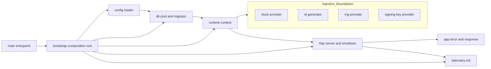
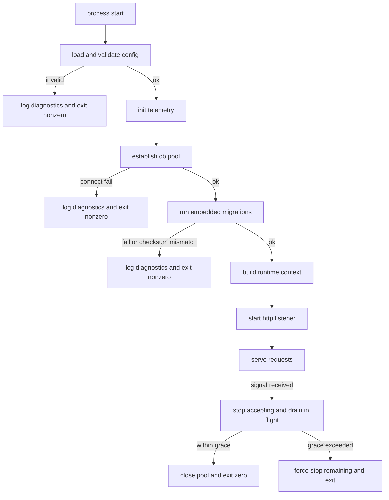
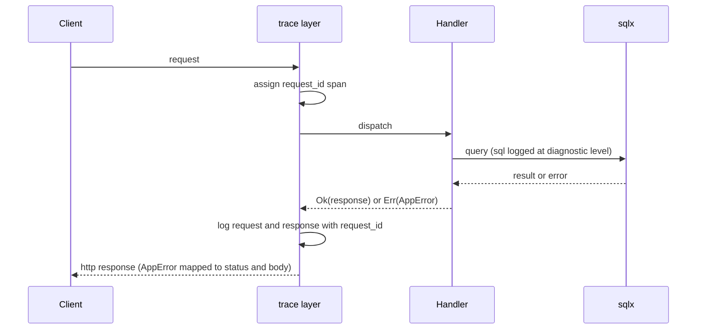

# Design Document

## Overview

**Purpose**: core-runtime は kawasemi のすべての機能 spec が乗るランタイム土台を提供する。HTTP アプリケーションの起動・graceful shutdown、起動設定（TOML/環境変数）の読み込みと検証、データベース接続プールの確立、埋め込みマイグレーションの起動時自動適用、注入可能な非決定性境界（clock / id / rng / 署名鍵）、統一エラー型と HTTP レスポンス変換の骨格、構造化ログ/診断出力、DB 込み統合テストを起動するテストハーネスの土台を担う。

**Users**: 後続のすべての機能 spec の実装者（AI 自律 TDD を含む）が本土台の上に機能を実装する。一人鯖の運用者は、本土台が提供する「起動するだけで設定読込・マイグレーション・待ち受けが完了する」挙動の恩恵を受ける。

**Impact**: 実装コードがゼロの状態から、Rust + axum + tokio + sqlx(PostgreSQL) のモノリス骨格を新設する。本 spec が確立する依存方向・注入境界・エラー/ログ規約が、以降の全 spec の前提となる。

### Goals

- アプリケーションが決定的な順序で起動し、初期化失敗時は安全停止、シグナル受信時は graceful shutdown する。
- 起動設定を二層設定の起動設定側（TOML + 環境変数、環境変数優先）として検証付きで読み込む。
- 埋め込みマイグレーションを起動時に自動適用し、失敗・不整合時は安全停止する。
- clock / id / rng / 署名鍵を差し替え可能な注入境界の背後に置き、本番実装と決定的テスト実装を切り替えられる。
- 統一エラー型・HTTP レスポンス変換骨格・構造化ログ/診断出力を全 spec に提供する。
- DB 込み統合テストを分離された状態で起動できるテストハーネスの土台を提供する。

### Non-Goals

- 個別 API エンドポイント・OAuth・ページネーション規約・Mastodon 互換エラー JSON 形（api-foundation が所有）。
- ActivityPub 連合（federation-core）、ドメインモデル（actor-model 以降）。
- 運用設定（DB 保存値）の読み書き・管理画面 UI（admin-frontend）。
- 配布形態・内蔵 ACME・TLS 終端・systemd unit・特権ポート bind（distribution）。
- 署名鍵の生成・保管・ローテーション運用（actor-model）。本 spec は鍵を供給する注入境界のみを所有する。

## Boundary Commitments

### This Spec Owns

- アプリケーションのライフサイクル（起動シーケンス、graceful shutdown、終了コード規律）。
- 起動設定の読み込み・マージ・検証と、検証済み不変設定構造体。
- データベース接続プールの確立と共有公開。
- 埋め込みマイグレーション基盤と起動時自動適用、適用履歴の整合検証。
- 非決定性注入境界の 4 つの trait（Clock / IdGenerator / Rng / SigningKeyProvider）と、それらを束ねる集約 `RuntimeContext`。各 trait の本番実装と決定的テスト実装。
- 統一エラー型（`AppError`）と axum レスポンス変換の骨格、エラー分類（4xx/5xx）。
- 構造化ログ基盤の初期化、HTTP リクエスト/レスポンス・SQL の診断出力、相関 ID 付与。
- DB 込み統合テストを起動するテストハーネス（テスト用 `RuntimeContext` 構築、分離 DB、終了時解放）。
- 並行 spec 横断で共有される軽量ドメインプリミティブの正準定義: 識別子 `Id`（内部表現・serde/文字列表現・DB カラム対応）、`AccountRef`（`Local`/`Remote`）と `Visibility`（`Public`/`Unlisted`/`Private`/`Direct`）の列挙および serde/文字列表現。

#### Boundary Commitment: 共有ドメインプリミティブの単一正準所有

- `AccountRef`（`Local(Id)`/`Remote(Id)`）と `Visibility`（`Public`/`Unlisted`/`Private`/`Direct`）は、本 spec を**唯一の正準定義**とする。これらは accounts-and-instance / statuses-core / social-graph / notifications が共通して必要とするが、statuses-core と accounts-and-instance は相互依存しない並行 wave のため、双方が依存する共通祖先は core-runtime のみである。したがって core-runtime がこれらを所有する。
- 下流のすべての spec は、これら 2 プリミティブを**再定義してはならず**、core-runtime から取り込む（import）こと。
- `AccountRef` は純粋なプリミティブであり、所有者情報を露出せず、Account エンティティの知識を持たない（ローカル/リモートの区別と `Id` のみ）。
- `Visibility` について core-runtime が所有するのは**列挙と serde/文字列表現の対応付けのみ**である。公開範囲ポリシー（`VisibilityPolicy` 等の判定・適用の振る舞い）は statuses-core が所有し、本 spec は所有しない。

### Out of Boundary

- 運用設定（DB 保存値）の読み書き・スキーマ・管理画面（後続 spec が所有）。
- Mastodon 互換のエラー応答 JSON 形・OAuth・ページネーション（api-foundation）。
- 署名鍵の生成・保管・ローテーション（actor-model）。本 spec は鍵供給境界のみ。
- TLS/ACME/特権ポート/配布（distribution）。
- ドメインテーブル定義（各機能 spec が自身のマイグレーションを追加する。本 spec は土台テーブルとマイグレーション基盤のみ）。
- 公開範囲ポリシー（`VisibilityPolicy` 等、`Visibility` に基づく判定・適用の振る舞い）。本 spec は `Visibility` 列挙と表現のみを所有し、ポリシーは statuses-core が所有する。

### Allowed Dependencies

- ランタイム/フレームワーク: tokio、axum、tower / tower-http。
- データ層: sqlx（PostgreSQL ドライバ + `migrate!`）。
- 可観測性: tracing、tracing-subscriber。
- 設定: TOML パーサ + 環境変数。
- 上流 spec への依存は無し（最上流）。下流仕様（Mastodon 互換 JSON 形、ドメインモデル）を本 spec に埋め込んではならない。

### Revalidation Triggers

- `RuntimeContext` の構成・公開方法、または 4 つの注入 trait のシグネチャ変更。
- `AppError` の分類・レスポンス変換骨格の契約変更。
- 起動設定構造体の必須項目・マージ規則・優先順位の変更。
- DB プールの公開方法・接続パラメータ契約の変更。
- マイグレーション基盤の配置規約（マイグレーション追加方法）の変更。
- テストハーネスの起動 API・分離方式の変更。
- 起動シーケンス順序・終了コード規律の変更。
- 共有ドメインプリミティブ（`Id` / `AccountRef` / `Visibility`）の内部表現・バリアント構成・serde/文字列表現・DB カラム対応の変更（下流全 spec に波及するため）。

## Architecture

### Architecture Pattern & Boundary Map

選択パターン: **Composition Root + 注入境界（ports）**。`main` から呼ばれる Composition Root が、設定 → ログ → プール → マイグレーション → 注入境界集約 → HTTP サーバの順に依存を組み立て、非決定性は trait の背後に置いて下流へ手渡す。依存方向は左から右の一方向のみ。



**Architecture Integration**:
- Selected pattern: Composition Root。起動時に一度だけ依存を組み立て、以後は不変の `AppState`/`RuntimeContext` を共有する。
- Domain/feature boundaries: 本 spec はランタイム横断の関心のみを所有し、ドメインを持たない。注入境界 4 つは独立した trait として分離。
- Existing patterns preserved: steering「注入可能な非決定性境界」「レイヤー分離」「バックエンド一体配信（土台のみ用意）」。
- New components rationale: 各コンポーネントは Boundary Commitments の 1 関心に 1:1 対応。
- Steering compliance: 決定性の強制（DI 境界）、可観測性（診断出力）、外部ジョブブローカー/検索エンジン非依存（本 spec は導入しない）。

### Technology Stack

| Layer | Choice / Version | Role in Feature | Notes |
|-------|------------------|-----------------|-------|
| Backend / Services | Rust (stable, edition 2021) + axum 0.7 系 | HTTP サーバ・ルーティング・`IntoResponse` 変換 | tower/tower-http と統合 |
| Infrastructure / Runtime | tokio 1.x | 非同期ランタイム・シグナルハンドリング・graceful shutdown | `tokio::signal` |
| Data / Storage | PostgreSQL + sqlx 0.7 系 | 接続プール（`PgPool`）・`migrate!` 埋め込みマイグレーション | `_sqlx_migrations` で履歴/チェックサム管理 |
| Observability | tracing + tracing-subscriber + tower-http TraceLayer | 構造化ログ・リクエスト span・相関 ID・SQL ログ | ログレベルは設定駆動 |
| Config | TOML パーサ + 環境変数 | 起動設定の読込・マージ・検証 | 環境変数優先 |

> バージョンは確定版ではなく系列の目安。実装時に最新の互換版へ固定する。詳細な選定理由は `research.md` 参照。

## File Structure Plan

### Directory Structure

```
Cargo.toml                       # クレート定義・依存（axum/tokio/sqlx/tracing/toml 等）
migrations/                      # sqlx 埋め込みマイグレーション（土台テーブルのみ。後続 spec が追加）
    0001_init_runtime.sql        # マイグレーション機構成立用の初期マイグレーション
src/
├── main.rs                      # エントリポイント。bootstrap を呼び、終了コードを制御
├── bootstrap.rs                 # Composition Root。起動シーケンスの組み立てと順序保証
├── config.rs                    # 検証済み設定構造体・読込/マージ/検証ロジック
├── config/
│   └── secret.rs                # シークレットラッパ型（Debug/ログでマスク）
├── domain.rs                    # 共有ドメインプリミティブの再公開（primitives 経由）
├── domain/
│   └── primitives.rs            # 共有プリミティブの正準定義（Id / AccountRef / Visibility と serde/文字列表現）
├── telemetry.rs                 # tracing 初期化・ログレベル制御・相関 ID 方針
├── db.rs                        # PgPool 確立・接続パラメータ適用
├── migrate.rs                   # 埋め込みマイグレーション適用・不整合検出
├── runtime.rs                   # RuntimeContext 集約と構築
├── runtime/
│   ├── clock.rs                 # Clock trait + 本番(SystemClock)/決定的(FixedClock)
│   ├── ids.rs                   # IdGenerator trait + 本番/決定的(SeqIdGenerator)
│   ├── rng.rs                   # Rng trait + 本番/決定的(SeededRng)
│   └── signing_key.rs           # SigningKeyProvider trait + テスト用固定鍵実装
├── error.rs                     # AppError 統一エラー型・分類・IntoResponse 変換骨格
├── server.rs                    # axum ルータ組み立て(土台層)・listener・graceful shutdown
└── state.rs                     # AppState（PgPool + RuntimeContext + 設定の共有ハンドル）
tests/
├── harness.rs                   # 統合テストハーネス（テスト用 AppState/分離DB/解放）
├── lifecycle_it.rs              # 起動・shutdown・マイグレーション統合テスト
└── error_response_it.rs        # エラー変換骨格の統合テスト
```

> `runtime/` 配下の 4 ファイルは「trait + 本番実装 + 決定的実装」という同一パターンに従う。`signing_key.rs` のみ本番実装は actor-model が差し込む拡張点として最小（テスト用固定鍵）に留める。

### Modified Files

- なし（グリーンフィールド・全ファイル新規）。

## System Flows

### 起動シーケンスと安全停止



起動は逐次・順序保証。いずれの初期化失敗も HTTP リスナー開始前に安全停止する（Requirement 1.2/2.3/2.4/3.2/4.5/4.6）。shutdown は「受付停止 → in-flight 完了待ち → 猶予超過で強制停止 → プール解放」（Requirement 1.3/1.4/1.5）。

### HTTP リクエストの可観測性とエラー変換



## Requirements Traceability

| Requirement | Summary | Components | Interfaces | Flows |
|-------------|---------|------------|------------|-------|
| 1.1–1.5 | 起動順序・安全停止・graceful shutdown・終了コード | Bootstrap, Server, AppState | bootstrap()、serve_with_shutdown() | 起動シーケンスと安全停止 |
| 2.1–2.6 | 起動設定の読込・マージ・検証・シークレットマスク・運用設定非所有 | Config, Secret | load_config()、AppConfig | 起動シーケンス（Cfg） |
| 3.1–3.4 | DB プール確立・共有公開・接続パラメータ | Db, AppState | establish_pool()、AppState.pool | 起動シーケンス（Pool） |
| 4.1–4.6 | 埋め込み・自動適用・冪等・データ保持・失敗/不整合時停止 | Migrate | run_migrations() | 起動シーケンス（Mig） |
| 5.1–5.6 | clock/id/rng/署名鍵の注入境界・本番/決定的切替 | RuntimeContext, Clock, IdGenerator, Rng, SigningKeyProvider | 4 trait + RuntimeContext | アーキ図 Injection_Boundaries |
| 6.1–6.5 | 統一エラー型・HTTP 変換骨格・4xx/5xx 分類・内部詳細秘匿・拡張点 | Error | AppError, IntoResponse | エラー変換シーケンス |
| 7.1–7.5 | 構造化ログ初期化・req/res ログ・SQL ログ・レベル制御・相関 ID | Telemetry, Server | init_telemetry()、TraceLayer | エラー変換シーケンス |
| 8.1–8.5 | テスト用起動・適用済みDB・決定的注入・分離・解放 | TestHarness | spawn_test_app()、TestApp、TestApp::cleanup() | （テスト時に起動シーケンスを再利用） |
| 9.1–9.4 | 共有ドメインプリミティブの正準定義（Id/AccountRef/Visibility）・振る舞い非所有・再定義禁止 | DomainPrimitives | Id, AccountRef, Visibility | （横断利用・起動フロー外） |

## Components and Interfaces

| Component | Domain/Layer | Intent | Req Coverage | Key Dependencies (P0/P1) | Contracts |
|-----------|--------------|--------|--------------|--------------------------|-----------|
| Config | Config | 起動設定の読込・マージ・検証 | 2 | toml, env (P0) | Service, State |
| Db | Data | PgPool 確立・共有 | 3 | sqlx (P0), Config (P0) | Service, State |
| Migrate | Data | 埋め込みマイグレーション適用 | 4 | sqlx migrate (P0), Db (P0) | Batch |
| RuntimeContext | Runtime | 4 注入境界の集約・構築 | 5 | Clock/Id/Rng/Keys (P0) | Service, State |
| Error | Cross-cutting | 統一エラー型・HTTP 変換骨格 | 6 | axum (P0) | Service, API |
| Telemetry | Cross-cutting | 構造化ログ初期化・相関 ID | 7 | tracing (P0), Config (P1) | Service |
| Server | Runtime | listener・graceful shutdown・TraceLayer 装着 | 1,7 | axum/tokio/tower-http (P0), AppState (P0) | Service |
| Bootstrap | Runtime | Composition Root・起動順序保証 | 1,2,3,4,5,7 | 全コンポーネント (P0) | Service |
| AppState | Runtime | プール+RuntimeContext+設定の共有ハンドル | 1,3,5 | Db, RuntimeContext, Config (P0) | State |
| TestHarness | Test | テスト用起動・分離DB・解放 | 8 | Bootstrap, Migrate, RuntimeContext (P0) | Service |
| DomainPrimitives | Domain | 共有プリミティブ（Id/AccountRef/Visibility）の正準定義 | 9 | serde (P0) | State |

依存方向（左→右、上位は下位のみ参照）: `Config → Telemetry → Db → Migrate → RuntimeContext → AppState → Error/Server → Bootstrap`。`TestHarness` は Bootstrap 構成要素を再利用する。

### Config / 設定層

#### Config

| Field | Detail |
|-------|--------|
| Intent | TOML と環境変数から起動設定を読み込み、検証済み不変構造体を構築する |
| Requirements | 2.1, 2.2, 2.3, 2.4, 2.5, 2.6 |

**Responsibilities & Constraints**
- 起動設定のみを所有する。運用設定（DB 保存値）には一切触れない（2.6）。
- マージ規則: 同一項目は環境変数を優先（2.2）。
- 必須項目（サーバードメイン、DB 接続先）欠落と形式不正を起動時に検出し、欠落/不正項目を特定するメッセージで中止（2.3, 2.4）。
- シークレットは専用ラッパ型 `Secret<T>` で保持し、`Debug`/ログ出力時にマスクする（2.5）。

**Dependencies**
- Inbound: Bootstrap — 起動時に設定構築を要求 (P0)
- Outbound: Db, Telemetry, Server — 検証済み設定値を参照 (P0)
- External: TOML パーサ, 環境変数 — 設定ソース (P0)

**Contracts**: Service [x] / API [ ] / Event [ ] / Batch [ ] / State [x]

##### Service Interface
```rust
pub struct AppConfig {
    pub server: ServerConfig,      // domain, bind addr, shutdown grace
    pub database: DatabaseConfig,  // url(Secret), pool size, acquire timeout
    pub log: LogConfig,            // level, sql diagnostic flag
}

/// TOML + 環境変数を読み、検証して不変設定を返す。失敗は ConfigError で原因項目を保持。
pub fn load_config() -> Result<AppConfig, ConfigError>;
```
- Preconditions: なし（プロセス環境と任意の TOML パスを参照）。
- Postconditions: 返る `AppConfig` は全必須項目が存在し形式検証済み。
- Invariants: `Secret<T>` は `Debug`/`Display` で値を露出しない。

**Implementation Notes**
- Integration: Bootstrap が最初に呼ぶ。
- Validation: 欠落と形式不正を区別し、複数エラーをまとめて報告できると望ましい。
- Risks: シークレット露出。`Secret<T>` のテストでマスクを保証。

### Data / データ層

#### Db

| Field | Detail |
|-------|--------|
| Intent | 設定に従い PgPool を確立し、共有可能な形で公開する |
| Requirements | 3.1, 3.2, 3.3, 3.4 |

**Responsibilities & Constraints**
- 接続先・プールサイズ・取得タイムアウトを設定値から適用（3.1, 3.4）。
- 初回接続失敗時は原因を診断出力し起動中止（3.2）。プール確立は HTTP リスナー開始前。
- 確立した `PgPool` を AppState 経由で共有公開（3.3）。

**Dependencies**
- Inbound: Bootstrap (P0)
- Outbound: Migrate（同一プールでマイグレーション実行）, AppState (P0)
- External: sqlx PgPool (P0)

**Contracts**: Service [x] / State [x]

##### Service Interface
```rust
/// 設定に基づき接続プールを確立。初回接続失敗は DbError。
pub async fn establish_pool(cfg: &DatabaseConfig) -> Result<PgPool, DbError>;
```
- Postconditions: 返る `PgPool` は最低 1 接続の確立に成功している。

#### Migrate

| Field | Detail |
|-------|--------|
| Intent | バイナリ埋め込みマイグレーションを起動時に適用し、履歴整合を検証する |
| Requirements | 4.1, 4.2, 4.3, 4.4, 4.5, 4.6 |

**Responsibilities & Constraints**
- `migrations/` をコンパイル時に埋め込み（4.1）、未適用分のみを適用順に自動適用（4.2, 4.3）。
- 既存データ保持・適用済み再適用なし（4.4、sqlx `_sqlx_migrations` 履歴に従う）。
- 適用失敗は失敗マイグレーション特定情報とともに起動中止（4.5）。
- 埋め込み定義と履歴のチェックサム不整合を検出し起動中止（4.6）。

**Dependencies**
- Inbound: Bootstrap (P0)
- Outbound: Db（プールを使用） (P0)
- External: sqlx migrate (P0)

**Contracts**: Batch [x]

##### Batch / Job Contract
- Trigger: 起動時（プール確立後・HTTP リスナー開始前）。
- Input / validation: 埋め込みマイグレーション集合 + `_sqlx_migrations` 履歴。
- Output / destination: 最新化された PostgreSQL スキーマ。
- Idempotency & recovery: 冪等（未適用分のみ）。失敗時はプロセスを安全停止し、再起動で再試行可能。

### Runtime / ランタイム層

#### RuntimeContext と注入境界

| Field | Detail |
|-------|--------|
| Intent | clock / id / rng / 署名鍵の 4 注入境界を集約し、本番/決定的を切替可能に手渡す |
| Requirements | 5.1, 5.2, 5.3, 5.4, 5.5, 5.6 |

**Responsibilities & Constraints**
- 4 つの trait を本 spec が所有し、本番実装（5.6）と決定的テスト実装（5.5）を提供。
- `RuntimeContext` は 4 境界を保持し、下流が単一集約として受け取れるようにする。
- 署名鍵は供給境界のみ所有。本番鍵の生成/保管/ローテーションは actor-model（Out of Boundary）。本 spec はテスト用固定鍵実装を提供し、本番実装差込の拡張点を開けておく。
- `KeyRef` は署名鍵の参照として本 spec が正準定義する。single-key-per-actor（アクターごとに現在有効な鍵は常に1つ）というモデルを前提に、対象アクターの `Id` を直接ラップする newtype とする（`KeyRef(Id)`）。鍵バージョン/世代を区別する独立した鍵 ID は持たず、「どのアクターの現在有効な鍵か」のみを表す。

**Dependencies**
- Inbound: AppState, 下流の全 spec (P0)
- Outbound: なし（最下層の供給境界）
- External: なし（本番実装は標準ライブラリ/暗号ライブラリに閉じる）

**Contracts**: Service [x] / State [x]

##### Service Interface
```rust
pub trait Clock: Send + Sync { fn now(&self) -> OffsetDateTime; }
pub trait IdGenerator: Send + Sync { fn next_id(&self) -> Id; }
pub trait Rng: Send + Sync { fn fill_bytes(&self, buf: &mut [u8]); }

/// 署名鍵の参照。single-key-per-actor モデルの下、対象アクターの `Id` を直接ラップする。
#[derive(Debug, Clone, Copy, PartialEq, Eq, Hash)]
pub struct KeyRef(pub Id);

pub trait SigningKeyProvider: Send + Sync { fn signing_key(&self, key_ref: KeyRef) -> Result<SigningKey, KeyError>; }

pub struct RuntimeContext {
    pub clock: Arc<dyn Clock>,
    pub ids: Arc<dyn IdGenerator>,
    pub rng: Arc<dyn Rng>,
    pub keys: Arc<dyn SigningKeyProvider>,
}

impl RuntimeContext {
    pub fn production() -> Self;                 // 本番実装で構築 (5.6)
    pub fn deterministic(seed: DeterministicSeed) -> Self; // テスト用決定的実装 (5.5)
}
```
- Preconditions: なし。
- Postconditions: `deterministic` は同一 seed で同一の時刻/ID/乱数/鍵列を再現する。
- Invariants: trait は `Send + Sync` で並行アクセス安全。`KeyRef` は対象アクターの `Id` のみを保持し、鍵バージョン/世代を区別しない（有効鍵は常に1つという single-key-per-actor 前提に従う）。

**Implementation Notes**
- Integration: AppState が保持し、ハンドラ/サービスへ共有。
- Validation: 決定的実装の再現性をテストで保証。
- Risks: 集約の肥大化。所有する 4 境界のみに限定（境界規律）。

#### AppState

| Field | Detail |
|-------|--------|
| Intent | PgPool + RuntimeContext + 設定参照を束ねた共有ハンドル |
| Requirements | 1.1, 3.3, 5.5, 5.6 |

**Responsibilities & Constraints**
- axum のステートとしてハンドラへ共有される不変ハンドル。
- 下流 spec はここからプール・注入境界・設定値を取得する。

**Contracts**: State [x]

##### State Management
- State model: 不変（起動時構築、以後共有のみ）。
- Persistence & consistency: メモリ常駐。プールは内部で接続を管理。
- Concurrency strategy: `Arc` 共有、内部可変性なし。

#### Server

| Field | Detail |
|-------|--------|
| Intent | listener 起動・TraceLayer 装着・graceful shutdown 実行 |
| Requirements | 1.1, 1.3, 1.4, 1.5, 7.2 |

**Responsibilities & Constraints**
- 土台ルータ（ヘルス確認等の最小ルート + 後続が拡張する装着点）を組み立て、TraceLayer を装着（7.2）。
- シグナル受信で受付停止 → in-flight 完了待ち → 猶予超過で強制停止 → プール解放（1.3, 1.4, 1.5）。

**Contracts**: Service [x]

##### Service Interface
```rust
/// listener を bind し、shutdown シグナルまで待ち受ける。猶予超過で強制停止。
pub async fn serve_with_shutdown(state: AppState, cfg: &ServerConfig) -> Result<(), ServeError>;
```

#### Bootstrap

| Field | Detail |
|-------|--------|
| Intent | 起動順序を保証する Composition Root |
| Requirements | 1.1, 1.2, 2.x, 3.x, 4.x, 5.x, 7.1 |

**Responsibilities & Constraints**
- 順序: config → telemetry → pool → migrate → runtime context → AppState → serve（1.1）。
- いずれの段階の失敗も HTTP リスナー開始前に診断出力 + 非ゼロ終了（1.2）。

**Contracts**: Service [x]

##### Service Interface
```rust
/// 全依存を組み立て、サーバを起動する。初期化失敗は BootstrapError。
pub async fn bootstrap() -> Result<(), BootstrapError>;
```

### Cross-cutting / 横断層

#### Error

| Field | Detail |
|-------|--------|
| Intent | 統一エラー型と HTTP レスポンス変換の骨格、4xx/5xx 分類 |
| Requirements | 6.1, 6.2, 6.3, 6.4, 6.5 |

**Responsibilities & Constraints**
- アプリ横断の `AppError` を提供（6.1）。axum `IntoResponse` で HTTP ステータス + 構造化本文へ変換（6.2）。
- 利用者向け（4xx）/システム（5xx）を分類（6.3）。5xx は内部詳細を本文に出さずログにのみ出す（6.4）。
- Mastodon 互換 JSON 形は api-foundation が拡張する拡張点を残す（6.5、本文表現を差し替え可能にする）。

**Dependencies**
- Inbound: 全ハンドラ/サービス (P0)
- Outbound: Telemetry（5xx の診断出力） (P1)
- External: axum IntoResponse (P0)

**Contracts**: Service [x] / API [x]

##### Service Interface
```rust
pub enum ErrorKind { Client, /* 4xx */ Server /* 5xx */ }

pub struct AppError {
    pub kind: ErrorKind,
    pub status: StatusCode,
    pub public_message: String,   // 4xx で利用者に返す
    pub source: Option<BoxError>, // 5xx で内部のみログ、本文に出さない
}

impl IntoResponse for AppError { /* status + structured body, source は秘匿 */ }
```
- Postconditions: 5xx 応答本文に `source` 由来の内部詳細を含めない。

##### API Contract
| Method | Endpoint | Request | Response | Errors |
|--------|----------|---------|----------|--------|
| (骨格) | 全エンドポイント共通 | - | 構造化エラー本文 | 4xx, 5xx |

#### Telemetry

| Field | Detail |
|-------|--------|
| Intent | 構造化ログ初期化・ログレベル制御・相関 ID・SQL 診断出力 |
| Requirements | 7.1, 7.2, 7.3, 7.4, 7.5 |

**Responsibilities & Constraints**
- tracing subscriber を初期化（7.1）、ログレベルを設定駆動（7.4）。
- HTTP req/res 診断をリクエスト span で出力（7.2）、相関 ID（request_id）を span フィールドで付与（7.5）。
- 診断レベル有効時に実行 SQL を出力する（7.3）。sqlx のクエリログは `sqlx::query` ターゲットへの tracing イベントとして発生し、`LogConfig` の SQL 診断フラグを `tracing_subscriber::EnvFilter` のディレクティブ（例: 有効時は `sqlx::query=debug`、無効時は当該ターゲットを既定レベルより上げて抑制）へ反映することで出力可否を制御する。これらのイベントはハンドラ処理中のリクエスト span（7.2/7.5 で `request_id` を付与する span）の内側で発生するため、tracing のイベント→span 継承により自動的に `request_id` と相関する（イベント自体に `request_id` を持たせる必要はなく、所属 span のフィールドとしてログ出力側が解決する）。

**Contracts**: Service [x]

##### Service Interface
```rust
/// ログ基盤を初期化。冪等でなくプロセス起動時に一度だけ呼ぶ。
pub fn init_telemetry(cfg: &LogConfig) -> Result<(), TelemetryError>;
```

### Test / テスト層

#### TestHarness

| Field | Detail |
|-------|--------|
| Intent | DB 込み統合テストを分離状態で起動し、終了時に解放する |
| Requirements | 8.1, 8.2, 8.3, 8.4, 8.5 |

**Responsibilities & Constraints**
- テスト用ランタイムインスタンスを起動（8.1）。起動時に埋め込みマイグレーション適用済み DB を提供（8.2）。
- `RuntimeContext::deterministic` で非決定性境界を決定的実装に差し替えて起動（8.3）。
- テストごとに分離された DB 状態（一意の DB/スキーマ名 or テンプレート DB からの作成）を提供し干渉を防ぐ（8.4）。
- 完了時にテスト用リソース（DB・listener・プール）を解放する（8.5）。正規の解放 API は明示的な `async fn cleanup(self)` とし、テストコードはこれを呼んで終了する。`Drop` 実装はベストエフォートに留める（例: 分離 DB の破棄をデタッチしたバックグラウンドタスクへ spawn する、または解放せず次回起動時の起動時スイープに委ねる）。tokio ランタイム内の同期 `Drop::drop` から async 処理を `block_on` すると panic しうるため、`Drop` に解放の正しさを依存させない。

**Dependencies**
- Inbound: 各 spec の統合テスト (P0)
- Outbound: Bootstrap 構成要素（Config/Db/Migrate/RuntimeContext/Server）を再利用 (P0)

**Contracts**: Service [x]

##### Service Interface
```rust
pub struct TestApp {
    pub address: SocketAddr,
    pub pool: PgPool,
    pub runtime: RuntimeContext, // deterministic
}

/// 分離DB作成 → マイグレーション適用 → 決定的 RuntimeContext で起動。
pub async fn spawn_test_app() -> TestApp;

impl TestApp {
    /// 正規の終了 API。プール解放・分離DBの破棄・listener 停止を非同期に行う (8.5)。
    /// テストコードは必ずこれを呼んで終了すること（成功/失敗にかかわらず）。
    pub async fn cleanup(self);
}

/// ベストエフォートのみ。tokio ランタイム内の同期 Drop から async cleanup を block_on することは
/// panic の危険があるため行わない。cleanup() 未呼び出し（パニック等での早期離脱）の取りこぼしに対する
/// 保険として、分離DBの破棄をデタッチしたバックグラウンドタスクへ spawn するか、解放せず次回起動時の
/// 起動時スイープ（残留テストDBの掃除）に委ねる。正しさの担保はここに置かない。
impl Drop for TestApp { /* ベストエフォートの解放 (8.5 は cleanup() が正規経路) */ }
```

### Domain / 共有プリミティブ層

#### DomainPrimitives

| Field | Detail |
|-------|--------|
| Intent | 並行 spec 横断で共有される軽量ドメインプリミティブ（`AccountRef` / `Visibility`）を唯一の正準定義として提供する |
| Requirements | 9.1, 9.2, 9.3, 9.4 |

**Responsibilities & Constraints**
- `Id` を全ドメインエンティティ・プリミティブが共有する識別子として正準定義する。内部表現は 64bit 符号付き整数（`i64` をラップした newtype）で、生成時刻順に単調増加する Snowflake 風の値とする（`IdGenerator::next_id()`（`runtime/ids.rs`）が本表現で払い出す）。serde 表現は 10 進文字列とする（JSON number の 53bit 精度超過を避け、Mastodon 互換 API が ID を文字列で表現する慣行とも整合させるため）。DB 列は `BIGINT` にマッピングする。これは下流 spec のマイグレーションが既に採用している `id BIGINT PRIMARY KEY -- core-runtime IdGenerator 採番` という規約（actor-model / media-pipeline / notifications / federation-core / api-foundation / search / accounts-and-instance / social-graph の各 `design.md`）と一致させたものであり、本 spec がその規約の正準根拠となる。
- `AccountRef` をローカル/リモートの区別と `Id` のみを持つ純粋なプリミティブとして所有する。所有者情報を露出せず、Account エンティティの知識を持たない（9.1）。
- `Visibility` 列挙と、その serde/文字列表現の対応付けのみを所有する（9.2）。
- 公開範囲ポリシー（`VisibilityPolicy` 等の振る舞い）は所有しない。statuses-core が `Visibility` を取り込んだ上で振る舞いを定義する（9.3）。
- これらは単一正準定義であり、下流 spec（accounts-and-instance / statuses-core / social-graph / notifications）は再定義せず core-runtime から取り込む（9.4、Boundary Commitment 参照）。

**Dependencies**
- Inbound: 下流の全 spec（共有プリミティブを取り込む） (P0)
- Outbound: なし（最下層の純粋プリミティブ）
- External: serde（直列化表現） (P0)

**Contracts**: Service [ ] / API [ ] / Event [ ] / Batch [ ] / State [x]

##### Service Interface
```rust
/// 全ドメインで共有される識別子。時刻順にソート可能な単調増加値（Snowflake 風: タイムスタンプ+シーケンスを
/// 64bit に詰めた内部表現）。DB は BIGINT 列にマッピングし、serde は 10 進文字列で表現する
/// （JSON number の 53bit 精度超過回避、Mastodon 互換 API の文字列 ID 表現とも整合）。
#[derive(Debug, Clone, Copy, PartialEq, Eq, PartialOrd, Ord, Hash)]
pub struct Id(i64);

impl Id {
    pub fn from_i64(raw: i64) -> Self { Self(raw) }
    pub fn as_i64(&self) -> i64 { self.0 }
}
// Serialize/Deserialize は 10 進文字列表現で実装する（sqlx 側は i64 <-> BIGINT の標準マッピングを利用）。

/// ローカル/リモートアクターを区別する軽量参照。所有者情報・Account エンティティ知識を持たない純粋プリミティブ。
pub enum AccountRef {
    Local(Id),
    Remote(Id),
}

/// 投稿の公開範囲プリミティブ。列挙と serde/文字列表現のみを所有し、ポリシー（振る舞い）は持たない。
#[derive(Serialize, Deserialize)]
#[serde(rename_all = "snake_case")]
pub enum Visibility {
    Public,
    Unlisted,
    Private,
    Direct,
}
```
- Preconditions: なし（純粋値型）。
- Postconditions: `Visibility` の serde/文字列表現は安定で、全 spec で一致する。`Id` の serde 文字列表現と DB `BIGINT` 表現は可逆に変換できる。
- Invariants: `AccountRef` は `Id` のローカル/リモート区別以外の状態を持たない。`Visibility` のバリアントは追加/削除しない限り表現が固定。`Id` は生成時刻順の単調増加のみを保証し、暗号学的なランダム性・推測不可能性は保証しない（それが必要な用途は呼び出し側が別途対策する）。

**Implementation Notes**
- Integration: `src/domain/primitives.rs` に `Id` / `AccountRef` / `Visibility` を定義し `src/domain.rs` から再公開。下流 spec はこの型を import する。`IdGenerator::next_id()`（`runtime/ids.rs`、RuntimeContext コンポーネント）はここで定義する `Id` を払い出す。
- Risks: 下流での再定義による型分裂。Boundary Commitment と Revalidation Trigger で防止する。

## Data Models

### Logical Data Model

本 spec はドメインデータを所有しない。所有する永続構造は以下のみ。

- `_sqlx_migrations`（sqlx 管理）: 適用済みマイグレーションのバージョン・チェックサム・適用時刻。Requirement 4.4/4.6 の履歴/整合検証の根拠。
- `migrations/0001_init_runtime.sql`: マイグレーション機構を成立させ、後続 spec がマイグレーションを追加するための初期マイグレーション。土台が必要とする最小テーブルのみ（なければ no-op に近い初期化に留める）。

### Data Contracts & Integration

- 後続 spec は `migrations/` に自身のマイグレーションを追加することでスキーマを拡張する。本 spec はこの追加規約（連番命名・前方追加のみ）を土台として確立するが、各ドメインテーブルは所有しない。
- 共有ドメインプリミティブ（`AccountRef` / `Visibility`）は永続テーブルを持たない値型である。本 spec はこれらの**型としての正準定義と serde/文字列表現**のみを所有し、これらを列に持つテーブルやその永続化方法は各下流 spec が所有する。下流 spec は core-runtime の型を取り込んでカラム表現にマッピングする。
- 共有識別子 `Id` は DB 上 `BIGINT` 列にマッピングする。これは下流全 spec のマイグレーションが用いる `id BIGINT PRIMARY KEY` 規約の正準根拠であり、本 spec 自身の `_sqlx_migrations` 以外に `Id` を列とするテーブルは持たないが、下流の全テーブル設計はこのマッピングに従う。

## Error Handling

### Error Strategy

- 起動時エラー（Config/Db/Migrate/Telemetry/Bootstrap）は `*Error` 型で原因を保持し、`BootstrapError` に集約して `main` が診断出力 + 非ゼロ終了に変換する（fail fast、Requirement 1.2）。
- リクエスト時エラーは `AppError` に集約し `IntoResponse` で HTTP へ変換する。

### Error Categories and Responses

- **User Errors (4xx)**: `ErrorKind::Client`。`public_message` を構造化本文で返す。内部 source は持たない/秘匿。
- **System Errors (5xx)**: `ErrorKind::Server`。本文には内部詳細を出さず汎用メッセージ、`source` は相関 ID 付きでログのみ（6.4）。
- **起動時失敗**: HTTP には到達しない。診断出力 + 非ゼロ終了コード。

### Monitoring

- 全リクエストは request_id 付き span で追跡（7.5）。5xx と起動失敗は原因特定に十分な診断情報を出力（6.4, 7.x）。診断レベルで SQL を出力（7.3）。

## Testing Strategy

### Unit Tests
- Config: 環境変数優先のマージ（2.2）、必須欠落・形式不正の検出（2.3, 2.4）、`Secret<T>` のマスク（2.5）。
- RuntimeContext: `deterministic(seed)` の時刻/ID/乱数/鍵の再現性（5.5）と本番実装の生成（5.6）。
- Error: 4xx/5xx 分類と `IntoResponse` 変換で 5xx 本文に内部詳細が出ないこと（6.2, 6.3, 6.4）。

### Integration Tests
- Lifecycle: `spawn_test_app` 起動でマイグレーション適用済み DB が得られ、ヘルス確認が応答し、テストコードが明示的に呼ぶ `TestApp::cleanup()` でリソース解放されること（1.1, 1.5, 4.2, 8.1, 8.2, 8.5）。
- Migration safety: 既存データ保持・再適用なし（4.4）、適用失敗/チェックサム不整合で起動中止し診断出力すること（4.5, 4.6）。
- Startup failure: 必須設定欠落・DB 接続不可で HTTP リスナーを開始せず非ゼロ終了すること（1.2, 2.3, 3.2）。
- Error response: ハンドラが `AppError(Server)` を返したとき本文に内部詳細が出ず、相関 ID 付きでログに出ること（6.4, 7.5）。
- Test isolation: 2 つの統合テストが分離 DB で互いのデータに干渉しないこと（8.4）。

### Performance / Load
- Graceful shutdown: in-flight リクエストが猶予内に完了して取りこぼされないこと、猶予超過で強制停止すること（1.3, 1.4）。
- DB プール: 設定したプールサイズ・取得タイムアウトが反映されること（3.4）。
