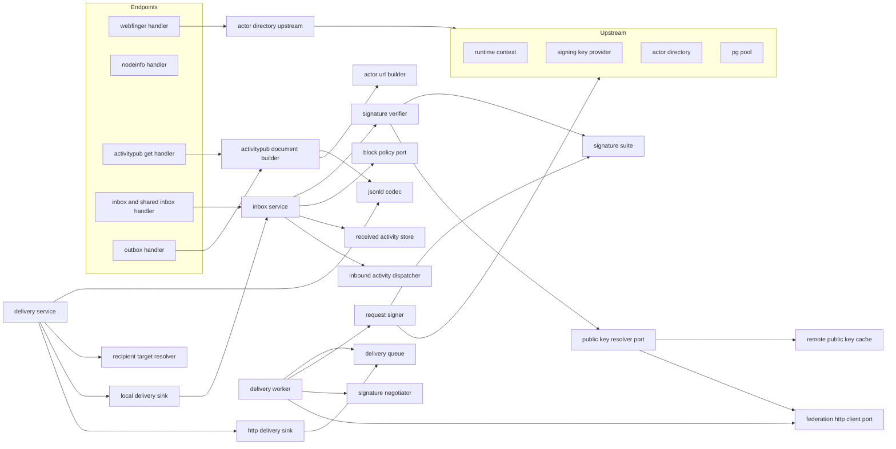
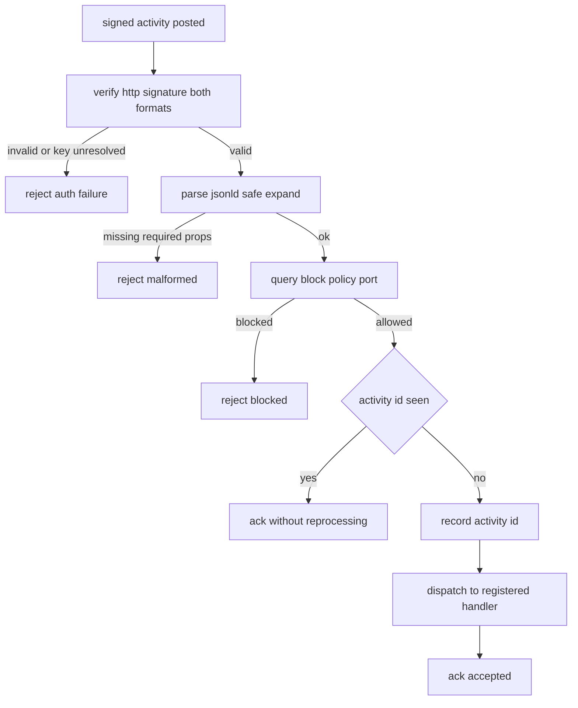
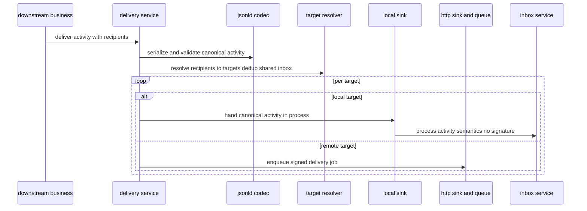
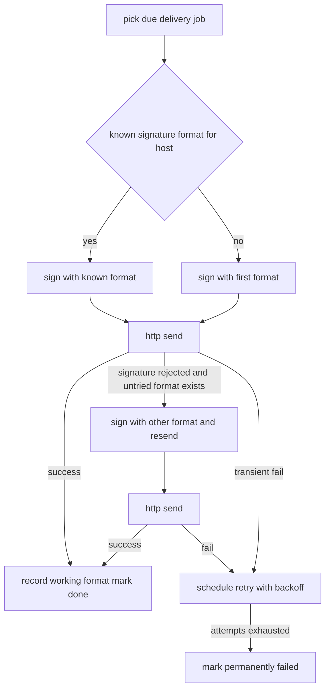

# Design Document

## Overview

**Purpose**: federation-core は kawasemi の ActivityPub 連合の配管層を提供する。HTTP Signatures の送受信（draft-cavage / RFC 9421 / double-knocking）、WebFinger、NodeInfo、inbox/outbox/shared inbox、アクター・オブジェクト・コレクションの `application/activity+json` GET、JSON-LD の `@context` 付与と未知プロパティの安全な展開、そして本プロジェクト中核制約である「意味論は対称・物理配送のみ最適化」を担う配送抽象と DB 配送キューを実装する。

**Users**: 下流 spec の実装者が本 spec の境界の上に乗る。statuses-core・social-graph 等は受信ディスパッチ境界に各 Activity 種別の処理を登録し、配送境界へ Activity と宛先を渡して配送を依頼する。social-graph はブロック判定委譲境界を埋める。外部インスタンスは WebFinger・NodeInfo・ActivityPub GET・inbox を通じて kawasemi と連合する。

**Impact**: core-runtime のランタイム土台（注入境界・DB プール・統一エラー型・テストハーネス）と actor-model のアクター解決・公開鍵供給・署名鍵供給の上に、最初の連合モジュール `src/federation/` を追加する。本 spec が確立する署名スイート境界・配送抽象・受信ディスパッチ境界・ブロック委譲境界が、以降の連合関連 spec の前提になる。

### Goals

- ローカルアクター鍵で署名した Activity / 取得要求を送信でき、受信側署名を draft-cavage / RFC 9421 双方で検証できる。
- double-knocking で相手の署名形式を交渉し、成功形式を host 単位で記憶する。
- WebFinger で複数ローカルアクターを `acct:` から解決し、NodeInfo で最小公開統計を返す。
- アクター・オブジェクト・コレクションを `application/activity+json` で配信し、セキュアモードで authorized fetch を要求できる構造を持つ。
- 受信 Activity を署名検証・ブロック判定・重複排除のうえディスパッチ境界へ受け渡す。
- Activity 生成・検証・宛先解決を共通コードパスとし、配送関数のみ in-process / HTTP に分岐させ、結果同値を連合テストで担保する。
- 配送を DB キューで非同期化し、再試行・shared inbox 重複排除・恒久失敗記録を行う。
- 署名検証・公開鍵取得・ネットワークをモック可能境界に置き、2 インスタンス往復の連合テスト基盤を提供する。

### Non-Goals

- 具体 Activity 種別（Create / Follow / Block / Announce 等）の業務処理・意味論（statuses-core・social-graph 等が所有）。
- 可視性・addressing 判定ロジックの中身（本 spec は共通パスの呼び出し点と recipient 受け取りのみ所有）。
- 独自連合方言（絵文字リアクション・引用・MFM）の正規化（custom-federation）。
- 受信側 Move / Flag（inbound-move-flag）。
- リモートアクターの完全プロフィール永続化・Mastodon Account 化（accounts-and-instance。本 spec は署名検証用公開鍵素材の取得・キャッシュのみ）。
- Mastodon REST API（api-foundation 以降）、ブロックリスト実体の保持（social-graph）。

## Boundary Commitments

### This Spec Owns

- HTTP Signatures のスイート抽象（draft-cavage / RFC 9421）、送信側署名・受信側検証、署名形式の double-knocking 交渉と host 能力記憶。
- 署名検証・公開鍵取得・送信ネットワークのモック可能境界（`PublicKeyResolver` / `FederationHttpClient`）と、リモート公開鍵キャッシュ。
- WebFinger・NodeInfo エンドポイント。
- アクター URL・inbox/outbox/shared inbox URL・オブジェクト/コレクション URL の構築と公開、`application/activity+json` GET、authorized fetch 要求構造。
- JSON-LD `@context` 付与・未知プロパティの安全な展開・必須プロパティ検証。
- inbox / shared inbox 受信パイプライン（署名検証→ブロック判定→重複排除→ディスパッチ受け渡し）と受信 Activity 重複記録。
- 受信 Activity を業務処理へ受け渡すディスパッチ境界（`InboundActivityHandler` レジストリ。外側 Activity 種別 1 つに複数ハンドラを登録でき、一致する全ハンドラへファンアウトする）。
- ブロック判定の委譲境界（`BlockPolicy`、宛先ローカルアクター単位で問い合わせる destination-aware 契約、既定 no-op）。
- ローカルオブジェクト/outbox 内容の下流供給委譲境界（`ObjectDocumentProvider` / `OutboxSource`、各既定 404 相当 / 空ページ）。本 spec が Activity/オブジェクトの実体を持たなくても、下流未登録の間は安全に応答する。
- 配送抽象（共通: 正規 Activity 生成・検証・宛先解決 / 分岐: in-process sink・HTTP sink）と DB 配送キュー・配送ワーカー・再試行・shared inbox 重複排除。
- 連合テスト基盤（2 インスタンス往復・ローカル/HTTP 結果同値検証）。
- 本 spec が所有する連合用テーブル（`delivery_jobs` / `received_activities` / `remote_public_keys` / `instance_signature_capabilities`）とそのマイグレーション。

### Out of Boundary

- 各 Activity 種別の意味論・状態遷移（下流 spec）。
- 可視性・addressing 判定ロジックの中身（呼び出し側が recipient を確定して渡す）。
- 独自連合方言の正規化（custom-federation）、受信側 Move/Flag（inbound-move-flag）。
- リモートアクターの完全プロフィール永続化（accounts-and-instance）。
- ブロックリスト実体の保持・管理（social-graph が `BlockPolicy` を実装供給）。
- アクター・署名鍵の保管とローテーション（actor-model）、起動・設定・DI 境界定義・統一エラー型・マイグレーション基盤・テストハーネス土台（core-runtime）。

### Allowed Dependencies

- core-runtime: `RuntimeContext`（`Clock` / `IdGenerator` / `Rng` / `SigningKeyProvider`）、`PgPool`、`AppError`、起動設定（`Secret<T>`・サーバードメイン・セキュアモードフラグ）、マイグレーション基盤、テストハーネス（`spawn_test_app`）。
- actor-model: `ActorDirectory`（`resolve_actor_by_handle` → `ResolvedActor`、`actor_public_key` → `ActorPublicKey`）。いずれもオーナー情報を含まない。署名鍵は core-runtime `SigningKeyProvider` 経由（`KeyRef` はアクター有効鍵参照）。
- 外部: HTTP クライアント（送信、`FederationHttpClient` 背後）、署名/ダイジェスト用暗号ライブラリ、JSON-LD/JSON 処理ライブラリ。
- 下流仕様（Activity 種別の意味論・Mastodon JSON 契約・ブロック実体）を本 spec に持ち込んではならない。

### Revalidation Triggers

- `InboundActivityHandler` / `InboundActivityDispatcher` のレジストリ契約・受け渡しする Activity 表現の変更。
- `DeliveryService` の配送依頼契約（Activity・recipient 集合の渡し方）の変更。
- `BlockPolicy` の問い合わせ契約の変更（destination-aware 化した `LocalRecipientContext` の形状・`Actor`/`SharedInbox` の意味論を含む。social-graph 等の実装供給側に波及）。
- 署名スイート（`SignatureSuite`）・`PublicKeyResolver` / `FederationHttpClient` / `SignatureVerifier`（`verify_request` の非同期化を含む）境界のシグネチャ変更。
- アクター URL・inbox/outbox URL の構築規約（URL 形）の変更。
- 連合用テーブルのスキーマ・配送ジョブ状態モデル・重複排除キーの変更、および `remote_public_keys` のキャッシュ TTL・`received_activities` の保持期間の設定値変更。
- `ObjectDocumentProvider` / `OutboxSource` の委譲契約（URL 解決・outbox ページ供給のシグネチャ、既定 404/空ページの挙動）の変更（下流 spec の実装登録側に波及する将来の実結合点）。
- 上流（core-runtime の注入境界 / actor-model の `ActorDirectory`・`KeyRef`）契約変更（上流発の再検証）。

## Architecture

### Architecture Pattern & Boundary Map

選択パターン: **Ports & Adapters（core-runtime の注入境界に乗る）**。連合プロトコルの配管をコアに置き、ネットワーク（HTTP クライアント）・公開鍵取得・ブロック判定・受信ディスパッチ・署名鍵供給を port（trait 境界）として外出しする。これにより、モック可能性・決定性・委譲境界・意味論対称を構造で担保する。依存方向は一方向（左→右、上位は下位のみ参照）。



**Architecture Integration**:
- Selected pattern: Ports & Adapters。ネットワーク・公開鍵取得・ブロック・受信ディスパッチを port にし、テストでモック/スタブへ差し替える。
- Domain/feature boundaries: 「プロトコル配管（本 spec）」と「Activity 意味論（下流）」を `InboundActivityHandler` / `DeliveryService` 契約で分離。ブロック実体は `BlockPolicy` で分離。
- Existing patterns preserved: steering「意味論対称・物理配送最適化」「注入可能な非決定性境界」「レイヤー分離」「外部ブローカー非依存（DB キュー）」。
- New components rationale: 各コンポーネントは Boundary Commitments の 1 関心に 1:1 対応。配送の共通部/分岐部を `DeliveryService` と `DeliverySink` で物理的に分離。
- Steering compliance: 決定性（署名鍵/時刻/ID/乱数は注入境界、ネットワークはモック可能）、可観測性（配送・検証失敗の診断）、DB 完結。

### Technology Stack

| Layer | Choice / Version | Role in Feature | Notes |
|-------|------------------|-----------------|-------|
| Backend / Services | Rust (edition 2021) + axum 0.7 系 | 連合エンドポイントのルーティングとハンドラ | core-runtime クレートに `src/federation/` を追加 |
| Protocol / Crypto | HTTP Signatures（draft-cavage + RFC 9421）、SHA-256 Digest、RSA 署名 | 署名生成・検証・ダイジェスト | 署名鍵は actor-model 経由（RSA-2048） |
| Serialization | JSON / JSON-LD（`serde` + 既知 `@context`） | ActivityPub ドキュメントの入出力・安全展開 | 未知プロパティ保持/無視 |
| Networking | 非同期 HTTP クライアント | 署名付き送信・公開鍵/リモートアクター取得 | `FederationHttpClient` port 背後でモック可能 |
| Data / Storage | PostgreSQL + sqlx 0.7 系 | 配送キュー・受信重複・公開鍵キャッシュ・署名能力記憶 | 既存 `PgPool` を共有、外部ブローカー不使用 |

> バージョンは系列の目安。実装時に最新互換版へ固定する。選定理由は `research.md` 参照。

## File Structure Plan

### Directory Structure

```
migrations/
└── 0008_federation.sql          # delivery_jobs / received_activities / remote_public_keys / instance_signature_capabilities

src/
└── federation/
    ├── mod.rs                    # FederationModule 組み立て・公開 port のエクスポート・ルータ装着点
    ├── config.rs                 # 連合関連設定の参照（サーバードメイン・セキュアモード・配送リトライ方針・公開鍵キャッシュ TTL・受信 Activity 保持日数）
    ├── urls.rs                   # ActorUrls: アクター/inbox/outbox/shared inbox/オブジェクト/コレクション URL 構築・keyId URL
    ├── jsonld/
    │   ├── mod.rs                # JsonLdCodec 公開
    │   ├── context.rs            # ActivityPub @context 定数・付与
    │   ├── serialize.rs          # 正規 ActivityPub ドキュメント直列化（@context 付与）
    │   └── parse.rs              # 受信 JSON-LD の安全展開・未知プロパティ処理・必須プロパティ検証
    ├── signatures/
    │   ├── mod.rs                # 署名サブモジュール公開
    │   ├── suite.rs              # SignatureSuite 抽象 + DraftCavage / Rfc9421 実装（形式差吸収）
    │   ├── digest.rs            # 本文ダイジェスト算出・検証
    │   ├── signer.rs             # RequestSigner: 送信リクエストへ署名付与（SigningKeyProvider 利用）
    │   ├── verifier.rs           # SignatureVerifier: 受信署名検証（両形式検出）
    │   ├── key_resolver.rs       # PublicKeyResolver port + Db/Http 実装（取得+キャッシュ）+ モック
    │   ├── negotiation.rs        # SignatureNegotiator: double-knock と host 能力記憶
    │   └── http_client.rs        # FederationHttpClient port + 本番/モック実装
    ├── inbound/
    │   ├── mod.rs                # inbound サブモジュール公開
    │   ├── dispatcher.rs         # InboundActivityHandler trait + InboundActivityDispatcher multimap レジストリ（委譲境界・複数ハンドラ/種別ファンアウト）
    │   ├── dedup.rs              # ReceivedActivityStore: Activity id 重複記録・冪等判定
    │   ├── block_policy.rs       # BlockPolicy port + 既定 no-op 実装（委譲境界）
    │   └── service.rs            # InboxService: 検証→ブロック判定→重複排除→ディスパッチ
    ├── outbound/
    │   ├── mod.rs                # outbound サブモジュール公開
    │   ├── delivery.rs           # DeliveryService: 共通部（正規 Activity 生成・検証・宛先解決）
    │   ├── target.rs             # RecipientTargetResolver: recipient → local/remote 物理ターゲット・shared inbox 重複排除
    │   ├── sink.rs               # DeliverySink trait + LocalDeliverySink(in-process) / HttpDeliverySink(キュー投入)
    │   ├── queue.rs              # DeliveryQueue: 配送ジョブ永続化・取得・状態遷移・再試行スケジュール
    │   └── worker.rs             # DeliveryWorker: ジョブ取り出し→署名付き HTTP 送信→再試行/恒久失敗
    └── endpoints/
        ├── mod.rs                # エンドポイントルータ束ね
        ├── webfinger.rs          # WebFinger ハンドラ（acct: 解決・複数アクター・ドメイン照合）
        ├── nodeinfo.rs           # NodeInfo ディスカバリ + ドキュメント
        ├── ap_get.rs             # アクター/オブジェクト/コレクション activity+json GET・authorized fetch・content negotiation（オブジェクト/コレクションは ObjectDocumentProvider レジストリへ委譲）
        ├── inbox.rs              # inbox / shared inbox POST ハンドラ（LocalRecipientContext::Actor / SharedInbox を BlockPolicy へ渡す）
        ├── outbox.rs             # outbox GET（順序付きコレクション・ページング。収録項目は OutboxSource レジストリから収集）
        └── document.rs           # ActivityPubDocumentBuilder + ObjectDocumentProvider/OutboxSource のレジストリ定義・既定実装（Noop/Empty）

tests/
├── signatures_it.rs             # 署名生成/検証/両形式/double-knock（統合）
├── webfinger_nodeinfo_it.rs     # WebFinger 複数アクター解決・NodeInfo（統合）
├── inbox_delivery_it.rs         # 受信検証→ディスパッチ・重複排除・ブロック拒否・配送キュー（統合）
└── federation_pair_it.rs        # 2 インスタンス往復・ローカル/HTTP 結果同値（連合）
```

### Modified Files

- `src/bootstrap.rs`（core-runtime）— プール確立・`ActorModule` 構築後に `FederationModule` を組み立て、配送ワーカーを起動、`AppState` に格納。
- `src/state.rs`（core-runtime）— `AppState` に `FederationModule`（ディスパッチャ・配送サービス・各 port のハンドル）を追加。
- `src/server.rs`（core-runtime）— 連合エンドポイントのルータを土台ルータへ装着。
- `src/config/mod.rs`（core-runtime）— セキュアモードフラグと配送リトライ方針の設定項目を追加（起動設定）。

> 各ファイルは単一責務。`signatures/` は形式差吸収・送信・受信・鍵取得・交渉・ネットワークを分離し、`outbound/` は共通部（delivery）と分岐部（sink）を物理的に分ける。

## System Flows

### 受信パイプライン（inbox / shared inbox）



署名検証→必須プロパティ検証→ブロック判定→重複排除→ディスパッチの順。各拒否は意味論処理前に行う（2.6, 7.2, 9.3, 12.2）。重複は再処理せず受領応答する（7.4）。ブロック判定は宛先コンテキスト（`LocalRecipientContext`）を伴う。アクター個別 inbox はその宛先アクターを `Actor` として渡し実効判定を得る。shared inbox は宛先アクターを一意に決定できないため `SharedInbox` を渡し、この時点では一括拒否しない（既定契約は false）。shared inbox 経由 Activity への実際のブロック適用は、宛先ローカルアクターを解決する下流の `InboundActivityHandler` 実装が担う。

### 配送（意味論対称・物理配送のみ分岐）



共通部（正規 Activity 生成・検証・宛先解決）は分岐前に一度だけ実行する（10.1, 10.2）。ローカルターゲットは `InboxService` の意味論処理（署名検証を除く）を in-process で通し、リモート受信と同一経路にする（10.3）。リモートはキュー投入で非同期化（10.4, 11.1）。

### 配送ワーカーと double-knock



double-knock は署名関連拒否時のみ他形式で再送する（3.1）。成功形式を host 能力として記録（3.2）し、以降はまず記録形式で署名（3.3）。一時失敗は指数的バックオフ再試行、上限到達で恒久失敗記録（11.3, 11.5）。

## Requirements Traceability

| Requirement | Summary | Components | Interfaces | Flows |
|-------------|---------|------------|------------|-------|
| 1.1–1.5 | 送信側署名・keyId・ダイジェスト・両形式生成・鍵欠落拒否 | RequestSigner, SignatureSuite, Digest | sign_request() | 配送ワーカー |
| 2.1–2.7 | 受信検証・両形式・公開鍵取得/キャッシュ・ダイジェスト検証・拒否・モック境界 | SignatureVerifier, PublicKeyResolver, FederationHttpClient | verify_request(), resolve_public_key() | 受信パイプライン |
| 3.1–3.3 | double-knock・成功形式記録・記録優先 | SignatureNegotiator | negotiate_and_send() | 配送ワーカー |
| 4.1–4.5 | WebFinger 解決・複数アクター・ドメイン照合・未検出・owner 非露出 | WebFinger handler, ActorDirectory(上流) | resolve_actor_by_handle() | （ハンドラ） |
| 5.1–5.3 | NodeInfo ディスカバリ・ドキュメント・内部情報非露出 | NodeInfo handler | nodeinfo() | （ハンドラ） |
| 6.1–6.6 | アクター/オブジェクト/コレクション GET・content negotiation・authorized fetch・owner 非露出・未検出 | ApGet handler, ActivityPubDocumentBuilder, ActorUrls, SignatureVerifier, ObjectDocumentProvider | build_actor_document(), ObjectDocumentProvider::resolve() | 受信パイプライン（authorized fetch） |
| 7.1–7.6 | inbox 検証・拒否・ディスパッチ受け渡し・重複排除・意味論委譲・複数ハンドラ/種別ファンアウト | InboxService, InboundActivityDispatcher, ReceivedActivityStore | process_inbound(), dispatch() | 受信パイプライン |
| 8.1–8.3 | outbox コレクション・ページング・範囲外除外 | Outbox handler, ActivityPubDocumentBuilder, OutboxSource | build_outbox_page(), OutboxSource::outbox_page() | （ハンドラ） |
| 9.1–9.4 | @context 付与・未知プロパティ安全展開・必須欠落拒否・メディアタイプ受理 | JsonLdCodec(context, serialize, parse) | serialize(), parse_activity() | 受信パイプライン |
| 10.1–10.5 | 共通部・配送関数のみ分岐・local in-process・remote HTTP・結果同値 | DeliveryService, RecipientTargetResolver, DeliverySink | deliver() | 配送 |
| 11.1–11.5 | DB キュー非同期・ワーカー送信・再試行バックオフ・shared inbox 重複排除・恒久失敗 | DeliveryQueue, DeliveryWorker, RecipientTargetResolver | enqueue(), claim_due(), reschedule() | 配送ワーカー |
| 12.1–12.3 | ブロック判定問い合わせ・拒否・委譲境界 | BlockPolicy, InboxService | is_blocked() | 受信パイプライン |
| 13.1–13.4 | 2 インスタンス基盤・決定的注入・往復検証・結果同値手段 | FederationTestHarness | spawn_federation_pair() | 配送 / 受信 |

## Components and Interfaces

| Component | Domain/Layer | Intent | Req Coverage | Key Dependencies (P0/P1) | Contracts |
|-----------|--------------|--------|--------------|--------------------------|-----------|
| JsonLdCodec | Serialization | @context 付与直列化・安全展開・必須検証 | 9 | serde (P0) | Service |
| ActorUrls | Serialization | アクター/各種 URL・keyId 構築 | 6,8 | config domain (P0) | Service |
| SignatureSuite | Crypto | draft-cavage / RFC9421 形式差吸収 | 1,2 | crypto (P0) | Service |
| Digest | Crypto | 本文ダイジェスト算出・検証 | 1,2 | crypto (P0) | Service |
| RequestSigner | Crypto | 送信リクエスト署名 | 1 | SignatureSuite, SigningKeyProvider, ActorUrls (P0) | Service |
| SignatureVerifier | Crypto | 受信署名検証（両形式） | 2,6,7 | SignatureSuite, PublicKeyResolver, Digest (P0) | Service |
| PublicKeyResolver | Port/Data | 公開鍵取得+キャッシュ（モック可能） | 2 | FederationHttpClient, KeyCache (P0) | Service, State |
| FederationHttpClient | Port | 送信ネットワーク（モック可能） | 1,2,11 | external http (P0) | Service |
| SignatureNegotiator | Crypto | double-knock・host 能力記憶 | 3 | RequestSigner, FederationHttpClient, capability store (P0) | Service, State |
| InboundActivityDispatcher | Inbound | 外側種別→複数ハンドラ委譲 multimap レジストリ・ファンアウト | 7 | model (P0) | Service |
| ReceivedActivityStore | Inbound/Data | Activity id 重複記録・冪等 | 7 | PgPool (P0) | Service, State |
| BlockPolicy | Port | ブロック判定委譲（既定 no-op） | 12 | none | Service |
| InboxService | Inbound | 検証→ブロック→重複→ディスパッチ | 6,7,9,12 | Verifier, BlockPolicy, Dedup, Dispatcher, JsonLdCodec (P0) | Service |
| DeliveryService | Outbound | 共通部 生成・検証・宛先解決・分岐 | 10 | JsonLdCodec, TargetResolver, DeliverySink (P0) | Service |
| RecipientTargetResolver | Outbound | recipient→target・shared inbox 重複排除 | 10,11 | ActorDirectory, ActorUrls (P0) | Service |
| DeliverySink | Outbound | local in-process / remote キュー投入 | 10,11 | InboxService, DeliveryQueue (P0) | Service |
| DeliveryQueue | Outbound/Data | ジョブ永続化・取得・再試行スケジュール | 11 | PgPool (P0) | Service, State, Batch |
| DeliveryWorker | Outbound | ジョブ送信・double-knock・再試行/恒久失敗 | 1,3,11 | DeliveryQueue, Negotiator, Signer (P0) | Batch |
| ActivityPubDocumentBuilder | Endpoint | アクター/コレクション AP 表現構築 | 6,8 | ActorUrls, JsonLdCodec, ActorDirectory, OutboxSource (P0) | Service |
| ObjectDocumentProvider(registry) | Port | ローカルオブジェクト/コレクション AP JSON 供給の下流委譲（既定 404） | 6 | none (P0) | Service |
| OutboxSource(registry) | Port | outbox 収録 Activity 供給の下流委譲（既定 空ページ） | 8 | none (P0) | Service |
| Endpoints(handlers) | Endpoint | WebFinger/NodeInfo/AP GET/inbox/outbox | 4,5,6,7,8 | 上記サービス群 (P0) | API |
| FederationModule(wiring) | Runtime | port 配線・ルータ装着・ワーカー起動 | 7,10,11 | bootstrap, AppState (P0) | Service |
| FederationTestHarness | Test | 2 インスタンス往復・結果同値検証 | 13 | spawn_test_app (P0) | Service |

依存方向（左→右、上位は下位のみ参照）: `JsonLdCodec / ActorUrls / SignatureSuite / Digest / FederationHttpClient → RequestSigner / SignatureVerifier / PublicKeyResolver / ReceivedActivityStore / BlockPolicy / ObjectDocumentProvider / OutboxSource / DeliveryQueue → SignatureNegotiator / InboundActivityDispatcher / RecipientTargetResolver / ActivityPubDocumentBuilder → InboxService / DeliverySink → DeliveryService / DeliveryWorker → Endpoints → FederationModule wiring`。

### Serialization / 直列化層

#### JsonLdCodec

| Field | Detail |
|-------|--------|
| Intent | ActivityPub ドキュメントの @context 付与直列化と、未知プロパティに耐える安全展開・必須プロパティ検証 |
| Requirements | 9.1, 9.2, 9.3, 9.4 |

**Responsibilities & Constraints**
- 直列化時に ActivityPub の `@context` を付与する（9.1）。
- 受信解釈時に未知プロパティで失敗させない（保持または無視。9.2）。
- 必須プロパティ（`type` / `id` 等）欠落を検出し不正として扱う（9.3）。
- `application/activity+json` と `application/ld+json` を AP 表現要求として受理（9.4、メディアタイプ判定ユーティリティを提供）。

**Dependencies**
- Inbound: InboxService, DeliveryService, ActivityPubDocumentBuilder (P0)
- External: serde / JSON ライブラリ (P0)

**Contracts**: Service [x]

##### Service Interface
```rust
pub struct ParsedActivity { pub id: String, pub activity_type: String, pub raw: serde_json::Value }

/// AP @context を付与して直列化する。
pub fn serialize(doc: &serde_json::Value) -> Result<Vec<u8>, AppError>;
/// 受信 JSON-LD を安全展開し、必須プロパティを検証して返す。未知プロパティは raw に保持。
pub fn parse_activity(body: &[u8]) -> Result<ParsedActivity, AppError>;
/// Accept ヘッダ等が AP 表現要求かを判定する。
pub fn accepts_activitypub(accept: &str) -> bool;
```
- Postconditions: `parse_activity` は必須プロパティ欠落時に検証エラーを返し、未知プロパティでは失敗しない。

#### ActorUrls

| Field | Detail |
|-------|--------|
| Intent | サーバードメインからアクター・inbox・outbox・shared inbox・オブジェクト・コレクション URL と keyId を構築する |
| Requirements | 6.1, 8.1 |

**Responsibilities & Constraints**
- アクター URL の構築・公開を本 spec が所有（actor-model は構築しない）。
- keyId は公開鍵取得可能な URL（アクター URL + フラグメント等）として一貫構築（1.2 に供給）。

**Contracts**: Service [x]

##### Service Interface
```rust
pub fn actor_url(&self, handle: &Handle) -> String;
pub fn inbox_url(&self, handle: &Handle) -> String;
pub fn shared_inbox_url(&self) -> String;
pub fn outbox_url(&self, handle: &Handle) -> String;
pub fn key_id(&self, handle: &Handle) -> String;
pub fn object_url(&self, kind: ObjectKind, id: Id) -> String;
```

### Crypto / 署名層

#### SignatureSuite

| Field | Detail |
|-------|--------|
| Intent | draft-cavage と RFC 9421 の形式差を吸収する署名スイート抽象 |
| Requirements | 1.4, 2.2 |

**Responsibilities & Constraints**
- 形式ごとに署名対象の構築・署名ヘッダの組み立て・署名ヘッダの解析を提供（1.4, 2.2）。
- 受信側は両形式を検出して該当スイートを選ぶ。

**Contracts**: Service [x]

##### Service Interface
```rust
pub enum SignatureFormat { DraftCavage, Rfc9421 }

pub trait SignatureSuite: Send + Sync {
    fn format(&self) -> SignatureFormat;
    fn build_signing_input(&self, req: &SignableRequest) -> SigningInput;
    fn assemble_headers(&self, key_id: &str, signature: &[u8], input: &SigningInput) -> Vec<(String, String)>;
    fn parse(&self, headers: &RequestHeaders) -> Result<ParsedSignature, AppError>;
    fn detect(headers: &RequestHeaders) -> Option<SignatureFormat>;
}
```

#### RequestSigner

| Field | Detail |
|-------|--------|
| Intent | 送信リクエストへローカルアクター鍵で署名を付与する |
| Requirements | 1.1, 1.2, 1.3, 1.5 |

**Responsibilities & Constraints**
- 署名鍵を core-runtime `SigningKeyProvider`（`KeyRef`＝アクター有効鍵参照）から取得（1.1）。
- keyId を `ActorUrls::key_id` で設定（1.2）。本文ありなら `Digest` を署名対象に含める（1.3）。
- 有効鍵が取得できない場合は署名を中止しエラー（1.5）。

**Contracts**: Service [x]

##### Service Interface
```rust
/// 指定アクター・指定形式でリクエストに署名を付与する。鍵欠落は AppError。
pub fn sign_request(&self, actor: &Handle, format: SignatureFormat, req: &mut OutboundRequest) -> Result<(), AppError>;
```

#### SignatureVerifier

| Field | Detail |
|-------|--------|
| Intent | 受信署名を両形式で検証し、公開鍵取得・ダイジェスト検証を行う |
| Requirements | 2.1, 2.2, 2.5, 2.6, 6.4, 7.1 |

**Responsibilities & Constraints**
- 形式検出→該当スイートで署名対象を再構築→公開鍵で検証（2.1, 2.2）。
- 本文ありはダイジェスト一致を検証（2.5）。署名欠落/不正/期限切れ/鍵取得失敗は検証失敗（2.6）。
- 検証失敗時は公開鍵キャッシュ無効化＋再取得を一度試みる（鍵ローテーション追従、research リスク対応）。
- 検証器自体がモック可能境界（7.7 の一部）として trait 化され、テストで差し替え可能。
- `verify_request` は依存する `PublicKeyResolver::resolve_public_key` がネットワーク/DB 呼び出しを伴う非同期処理であるため `async fn` とする（`FederationHttpClient` 等、本 spec の他の port と非同期性を統一）。

**Dependencies**
- Outbound: PublicKeyResolver, SignatureSuite, Digest (P0)

**Contracts**: Service [x]

##### Service Interface
```rust
pub struct VerifiedSigner { pub key_id: String, pub actor_uri: String }

pub trait SignatureVerifier: Send + Sync {
    /// 公開鍵解決（PublicKeyResolver::resolve_public_key、ネットワーク/DB 依存）を内部で待ち合わせるため非同期。
    async fn verify_request(&self, req: &IncomingRequest) -> Result<VerifiedSigner, AppError>;
}
```
- Postconditions: 成功時に署名者アクター URI を返す（ブロック判定・ディスパッチに供給）。

#### PublicKeyResolver / FederationHttpClient（モック可能境界）

| Field | Detail |
|-------|--------|
| Intent | 鍵識別子から公開鍵素材を取得・キャッシュし、送信ネットワークを抽象化する |
| Requirements | 2.3, 2.4, 2.7, 1.1, 11.2 |

**Responsibilities & Constraints**
- `PublicKeyResolver` は keyId→公開鍵を解決し、`remote_public_keys` にキャッシュ（2.3）。有効キャッシュ時はネットワーク取得しない（2.4）。「有効」は設定値 `federation.public_key_cache_ttl`（既定 24 時間）で判定し、`fetched_at` から TTL を超えたキャッシュは陳腐として扱い次回検証時に再取得する。署名検証失敗時の即時無効化＋再取得（鍵ローテーション追従）と、この TTL 満了時の定期的な再取得を併用する。
- `FederationHttpClient` は送信 HTTP（公開鍵/アクター取得・配送送信）を表す port。本番実装と決定的モック実装を差し替え可能（2.7）。
- 本 spec はリモートの公開鍵素材のみ取得し、完全プロフィールは永続化しない（境界）。

**Contracts**: Service [x] / State [x]

##### Service Interface
```rust
pub trait FederationHttpClient: Send + Sync {
    async fn send(&self, req: OutboundRequest) -> Result<HttpResponse, AppError>;
    async fn fetch(&self, url: &str, signed_as: Option<&Handle>) -> Result<HttpResponse, AppError>;
}

pub trait PublicKeyResolver: Send + Sync {
    /// keyId から公開鍵を解決。キャッシュ優先、ミス時のみ取得。force=true で再取得。
    async fn resolve_public_key(&self, key_id: &str, force: bool) -> Result<RemotePublicKey, AppError>;
}
pub struct RemotePublicKey { pub key_id: String, pub actor_uri: String, pub public_key_pem: String }
```

#### SignatureNegotiator

| Field | Detail |
|-------|--------|
| Intent | double-knocking と host 単位の成功署名形式記憶 |
| Requirements | 3.1, 3.2, 3.3 |

**Responsibilities & Constraints**
- 未知 host は片形式で送信し、署名関連拒否なら他形式で再送（3.1）。
- 送達成功した形式を host 能力として `instance_signature_capabilities` に記録（3.2）。
- 記録済み host は記録形式を優先（3.3）。署名関連拒否と一般失敗を区別する。

**Contracts**: Service [x] / State [x]

##### Service Interface
```rust
/// host の既知形式（無ければ既定）で署名送信し、署名拒否なら他形式で再送。成功形式を記録。
pub async fn negotiate_and_send(&self, actor: &Handle, host: &str, req: OutboundRequest) -> Result<HttpResponse, AppError>;
```

### Inbound / 受信層

#### InboundActivityDispatcher（委譲境界）

| Field | Detail |
|-------|--------|
| Intent | Activity 種別ごとの業務処理を下流が登録するレジストリ。**外側 Activity 種別 1 つに複数ハンドラを登録でき、ディスパッチャは一致する全ハンドラへファンアウトする** |
| Requirements | 7.3, 7.5, 7.6 |

**Responsibilities & Constraints**
- 外側 Activity 種別（`type`）→`InboundActivityHandler` の **multimap レジストリ**。本 spec は意味論を実装せず登録ハンドラへ委譲（7.5）。
- **同一外側種別に複数ハンドラを登録可能**（one-handler-per-type の上書きを禁止）。ActivityPub の `Undo`（および `Create` / `Delete` 等の wrapping 種別）は所有 spec の異なる異種 inner object をラップするため、単一ハンドラ前提では後勝ちで取りこぼす。例: `Undo` には statuses-core（Announce/Like の取消）と social-graph（Follow/Block の取消）が各々登録する（7.6）。
- ディスパッチ時は当該外側種別に登録された **全ハンドラへファンアウト**する。各ハンドラは inner `object` の種別を検査し、**自分が所有しない inner object のアクティビティは作用せず読み飛ばす**（`HandleOutcome::Ignored` を返す）。
- 冪等性: ディスパッチは重複排除（`ReceivedActivityStore`）通過後に一度だけ行われ、ハンドラ内処理も冪等であること（同一 Activity の再処理で副作用を増やさない）。
- exactly-one-or-zero セマンティクス: 整合な連合構成では、与えられた 1 つの Activity に対し実際に作用するハンドラは高々 1 つ（0 または 1）であるべき。0 件は安全に受領のみ（未対応 inner として無視）。2 件以上が `Handled` を返した場合は構成上の二重所有として観測ログに警告を出す（致命にはしない）。
- 未登録外側種別は安全に無視（受領のみ）。

**Contracts**: Service [x]

##### Service Interface
```rust
pub struct InboundContext { pub signer: VerifiedSigner }

/// ハンドラが当該 Activity に作用したか否か。inner object を所有しない場合は Ignored。
pub enum HandleOutcome { Handled, Ignored }

pub trait InboundActivityHandler: Send + Sync {
    /// このハンドラが関心を持つ外側 Activity 種別（例: ["Undo"]）。同一種別に複数ハンドラ可。
    fn activity_types(&self) -> &[&str];
    /// inner object 種別を検査し、自分が所有しないものは Ignored を返す。
    async fn handle(&self, activity: &ParsedActivity, ctx: &InboundContext) -> Result<HandleOutcome, AppError>;
}

impl InboundActivityDispatcher {
    /// 同一外側種別に複数登録可。既存登録を上書きせず追加する。
    pub fn register(&mut self, handler: Arc<dyn InboundActivityHandler>);
    /// 外側種別に一致する全ハンドラへファンアウトし、各ハンドラが inner を検査する。
    /// 高々 1 ハンドラが Handled を返す前提（0 件は受領のみ、2 件以上は警告ログ）。
    pub async fn dispatch(&self, activity: &ParsedActivity, ctx: &InboundContext) -> Result<(), AppError>;
}
```
- Postconditions: 一致ハンドラのうち inner object を所有する高々 1 つが `Handled` を返し作用する。いずれのハンドラも所有しなければ作用なしで受領のみ。重複排除済み Activity に対しディスパッチは一度だけ行う。

#### ReceivedActivityStore

| Field | Detail |
|-------|--------|
| Intent | 受理済み Activity id を記録し冪等性を担保 |
| Requirements | 7.4 |

**Contracts**: Service [x] / State [x]

##### Service Interface
```rust
/// 新規なら記録して true、既知なら false（再処理しない）。
pub async fn record_if_new(&self, activity_id: &str) -> Result<bool, AppError>;
```

#### BlockPolicy（委譲境界、destination-aware）

| Field | Detail |
|-------|--------|
| Intent | 署名者が「どの宛先ローカルアクターから見て」ブロック対象かの判定を下流へ委譲する |
| Requirements | 12.1, 12.2, 12.3 |

**Responsibilities & Constraints**
- 本 spec はブロック実体を持たず、既定実装は常に「ブロックなし」（12.3）。social-graph が実装供給。
- kawasemi は一人のオーナーが複数のローカルアクターを保持するため、ブロックはグローバルではなく「宛先ローカルアクターごと」に成立する（product.md）。そのため `is_blocked` は署名者 URI に加えて宛先コンテキスト `LocalRecipientContext` を受け取る。
- `LocalRecipientContext::Actor { actor_uri }`: アクター個別 inbox 宛の受信。宛先ローカルアクターが URL から一意に決まるため、実装はそのアクター視点でのブロック有無を判定する。
- `LocalRecipientContext::SharedInbox`: shared inbox 宛の受信。1 通の Activity が複数のローカルアクター宛（フォロワー宛など）を含み得るため、この時点では宛先アクターを一意に決定できない。**この変種での問い合わせは HTTP 層で一括拒否するためのものではなく、既定契約として常に `false`（ブロックなしとして扱う）を返す**。実際のブロック適用は、宛先ローカルアクターを解決できる下流の業務処理（`InboundActivityHandler` 実装。例: social-graph の受信ハンドラ）が、必要なら `LocalRecipientContext::Actor` で個別に再判定する責務を持つ。
- この契約により、shared inbox 経由の配送を HTTP 層で丸ごと拒否して他のブロックしていないローカルアクター宛の内容まで失うことを避ける。

**Contracts**: Service [x]

##### Service Interface
```rust
/// ブロック判定の宛先コンテキスト。アクター個別 inbox は宛先が既知、shared inbox は未確定。
pub enum LocalRecipientContext {
    /// アクター個別 inbox 受信。宛先ローカルアクターの URI が判明している。
    Actor { actor_uri: String },
    /// shared inbox 受信。宛先ローカルアクターを一意に決定できない（ファンアウト前）。
    SharedInbox,
}

pub trait BlockPolicy: Send + Sync {
    /// actor_uri（署名者）が local_recipient から見てブロック対象かを判定する。
    /// SharedInbox の場合は常に false を返す契約（一括拒否しない。実適用は宛先解決後の下流ハンドラが担う）。
    async fn is_blocked(&self, actor_uri: &str, local_recipient: LocalRecipientContext) -> Result<bool, AppError>;
}
```

#### InboxService

| Field | Detail |
|-------|--------|
| Intent | 受信パイプライン（検証→ブロック→重複→ディスパッチ）の統括 |
| Requirements | 6.4, 7.1, 7.2, 7.3, 7.4, 9.3, 12.1, 12.2 |

**Responsibilities & Constraints**
- 署名検証（7.1）→必須プロパティ検証（9.3）→ブロック判定（12.1）→重複排除（7.4）→ディスパッチ（7.3）。各拒否は意味論処理前（7.2, 12.2）。
- ブロック判定は宛先コンテキスト（`LocalRecipientContext`）付きで `BlockPolicy` へ問い合わせる。アクター個別 inbox 受信は宛先ローカルアクターが URL から判明するため `Actor` を渡し、その場で拒否できる。shared inbox 受信は宛先アクターを一意に決定できないため `SharedInbox` を渡し、この段階では一括拒否しない（既定契約は false）。
- ローカル in-process 配送からも署名検証を除いた同一意味論経路を提供（10.3 を満たすための共通処理 `process_local`）。in-process 配送は宛先ローカルアクターが確定しているため常に `LocalRecipientContext::Actor` で判定する。
- authorized fetch（6.4）の署名検証もこのサービスの検証経路を共用。

**Contracts**: Service [x]

##### Service Interface
```rust
/// リモート受信: 署名検証込みのフルパイプライン。宛先は URL（アクター個別 inbox / shared inbox）から LocalRecipientContext を組み立てる。
pub async fn process_inbound(&self, req: IncomingRequest) -> Result<InboxOutcome, AppError>;
/// ローカル in-process: 署名検証を除く同一意味論経路（ブロック判定・重複排除・ディスパッチ）。
/// recipient は DeliveryTarget::Local から確定済みで渡される（LocalRecipientContext::Actor { actor_uri } の構成に使う）。
pub async fn process_local(&self, activity: ParsedActivity, signer: VerifiedSigner, recipient: Handle) -> Result<InboxOutcome, AppError>;
```
- Invariants: `process_inbound`（署名検証後）と `process_local` は同一のブロック判定・重複排除・ディスパッチ処理に合流する（10.3, 10.5 の構造的担保）。両者ともブロック判定は `LocalRecipientContext::Actor` で行う（in-process 配送は常に宛先ローカルアクターが確定済みのため `SharedInbox` は用いない）。

### Outbound / 配送層

#### DeliveryService（共通部）

| Field | Detail |
|-------|--------|
| Intent | 配送の共通部（正規 Activity 生成・検証・宛先解決）を行い、配送関数のみ分岐させる |
| Requirements | 10.1, 10.2, 10.3, 10.4, 10.5 |

**Responsibilities & Constraints**
- 分岐前に正規 Activity を一度だけ生成・検証する（10.1, 10.2）。
- recipient を `RecipientTargetResolver` で物理ターゲットへ解決し、local は `LocalDeliverySink`、remote は `HttpDeliverySink` へ渡す（10.3, 10.4）。
- 共通部に意味論判定（可視性・addressing）は持たず、呼び出し側が確定した recipient を受け取る（Out of Boundary）。

**Contracts**: Service [x]

##### Service Interface
```rust
pub struct DeliveryRequest { pub activity: serde_json::Value, pub sender: Handle, pub recipients: Vec<Recipient> }
/// 正規 Activity を生成・検証し、ターゲット別に配送関数へ分岐する。
pub async fn deliver(&self, req: DeliveryRequest) -> Result<(), AppError>;
```
- Postconditions: 同一 `DeliveryRequest` に対し local 経路と remote 経路が同一の正規 Activity を扱う（10.5）。

#### RecipientTargetResolver

| Field | Detail |
|-------|--------|
| Intent | recipient をローカル/リモート物理ターゲットへ解決し、shared inbox を重複排除する |
| Requirements | 10.3, 10.4, 11.4 |

**Contracts**: Service [x]

##### Service Interface
```rust
pub enum DeliveryTarget { Local { handle: Handle }, Remote { inbox: String } }
/// recipient を解決し、同一 shared inbox は1ターゲットへ畳む。
pub async fn resolve(&self, recipients: &[Recipient]) -> Result<Vec<DeliveryTarget>, AppError>;
```

#### DeliverySink

| Field | Detail |
|-------|--------|
| Intent | 物理配送の分岐点（in-process / キュー投入） |
| Requirements | 10.3, 10.4, 11.1 |

**Contracts**: Service [x]

##### Service Interface
```rust
pub trait DeliverySink: Send + Sync {
    async fn dispatch(&self, target: DeliveryTarget, activity: &CanonicalActivity, sender: &Handle) -> Result<(), AppError>;
}
// LocalDeliverySink → InboxService::process_local（target の DeliveryTarget::Local { handle } を recipient として渡す）
// HttpDeliverySink  → DeliveryQueue::enqueue
```

#### DeliveryQueue / DeliveryWorker

| Field | Detail |
|-------|--------|
| Intent | リモート配送を DB キューで非同期化し、ワーカーが署名付き送信・再試行する |
| Requirements | 11.1, 11.2, 11.3, 11.5, 1.x, 3.x |

**Responsibilities & Constraints**
- `enqueue` は依頼元を待たせず永続化（11.1）。`claim_due` で期限到来ジョブを排他取得（11.2）。
- ワーカーは `SignatureNegotiator` で署名付き送信（1.x, 3.x）。一時失敗は指数的バックオフで `reschedule`（11.3）。再試行上限到達で恒久失敗（11.5）。

**Contracts**: Service [x] / State [x] / Batch [x]

##### Service Interface / Batch Contract
```rust
pub async fn enqueue(&self, job: NewDeliveryJob) -> Result<(), AppError>;
pub async fn claim_due(&self, limit: i64, now: OffsetDateTime) -> Result<Vec<DeliveryJob>, AppError>;
pub async fn mark_done(&self, job_id: Id) -> Result<(), AppError>;
pub async fn reschedule(&self, job_id: Id, next_attempt_at: OffsetDateTime, attempts: i32) -> Result<(), AppError>;
pub async fn mark_failed(&self, job_id: Id) -> Result<(), AppError>;
```
- Trigger: ワーカーが定期ポーリングで `claim_due` を実行（DB キュー、外部ブローカー不使用）。
- Idempotency & recovery: 排他取得・冪等な再試行。プロセス再起動で未完了ジョブを再取得。

### Endpoint / エンドポイント層

#### ActivityPubDocumentBuilder

| Field | Detail |
|-------|--------|
| Intent | アクター・コレクション（outbox 含む）の ActivityPub 表現を構築する |
| Requirements | 6.1, 6.2, 6.5, 8.1, 8.2, 8.3 |

**Responsibilities & Constraints**
- アクター表現に id・inbox・outbox・公開鍵（actor-model `actor_public_key`）を含める（6.1）。オーナー情報は含めない（6.5）。
- outbox を順序付きコレクションとしてページ単位で構築し、範囲外 Activity を除外（8.1, 8.2, 8.3）。

**Contracts**: Service [x]

##### Service Interface
```rust
pub async fn build_actor_document(&self, actor: &ResolvedActor) -> Result<serde_json::Value, AppError>;
pub async fn build_outbox_page(&self, actor: &Handle, page: PageCursor) -> Result<serde_json::Value, AppError>;
```
- `build_outbox_page` はページの入れ物（`OrderedCollectionPage` 構造・ページング）を構築し、収録する Activity 本体は `OutboxSource` から取得する（下記）。

#### ObjectDocumentProvider / OutboxSource（下流供給の委譲境界）

| Field | Detail |
|-------|--------|
| Intent | ローカルオブジェクト/コレクションの AP JSON 表現、および outbox に収録する Activity 本体を下流 spec（statuses-core 等）から供給させる委譲境界。`InboundActivityHandler` と同様のレジストリパターンを用い、下流未登録の間も安全な既定応答（404 相当 / 空ページ）を保証する |
| Requirements | 6.2, 6.6, 8.1, 8.2, 8.3 |

**Responsibilities & Constraints**
- 本 spec は Activity / オブジェクトの実体を所有しない（Non-Goals）。`ActivityPubDocumentBuilder` はアクター表現と outbox の入れ物（構造・ページング）のみを構築し、中身（個々のオブジェクト・outbox 項目）は本 port 経由で下流へ委譲する。
- `ObjectDocumentProvider`: ローカルオブジェクト/コレクション URL → AP JSON 表現の解決を委譲する **multi-provider レジストリ**。各プロバイダは `can_resolve` で自分が所有する URL 空間を宣言し、`ApGet` ハンドラは登録順に最初に一致したプロバイダへ委譲する。登録が無い、またはどのプロバイダも解決できない場合は `None` を返し、ハンドラはこれを未検出（404、6.6）として扱う。
- `OutboxSource`: 指定アクターの outbox ページに収録する Activity 一覧を供給する委譲境界。複数の下流 spec（例: statuses-core の Create/Announce）がそれぞれ outbox 対象 Activity を持ちうるため、登録された全 `OutboxSource` から該当ページ分を収集し `ActivityPubDocumentBuilder` が時系列で束ねてページを構成する。登録が無ければ空ページを返す（8.3 の範囲外除外と整合する既定）。
- 両 port とも、下流 spec が未実装の間も federation-core 単体でエンドポイントが安全に応答できることを保証する既定実装（`NoopObjectDocumentProvider` は常に `None` / `EmptyOutboxSource` は常に空ページ）を提供する。

**Contracts**: Service [x]

##### Service Interface
```rust
pub trait ObjectDocumentProvider: Send + Sync {
    /// この URL を自分が所有するか（所有判定、副作用なし）。
    fn can_resolve(&self, url: &str) -> bool;
    /// 所有する URL について AP JSON 表現を返す。存在しなければ None（404 として扱う）。
    async fn resolve(&self, url: &str) -> Result<Option<serde_json::Value>, AppError>;
}
/// 登録順に can_resolve を試す multi-provider レジストリ。未登録・不一致は None（既定 404）。
pub struct ObjectDocumentRegistry { /* ... */ }
impl ObjectDocumentRegistry {
    pub fn register(&mut self, provider: Arc<dyn ObjectDocumentProvider>);
    pub async fn resolve(&self, url: &str) -> Result<Option<serde_json::Value>, AppError>;
}

pub struct OutboxItemsPage { pub items: Vec<serde_json::Value>, pub next: Option<PageCursor> }
pub trait OutboxSource: Send + Sync {
    /// 指定アクターの outbox ページ内容を供給する。未対応/対象なしは空ページ。
    async fn outbox_page(&self, actor: &Handle, page: PageCursor) -> Result<OutboxItemsPage, AppError>;
}
/// 登録された全 OutboxSource を束ねるレジストリ。未登録は空。
pub struct OutboxSourceRegistry { /* ... */ }
impl OutboxSourceRegistry {
    pub fn register(&mut self, source: Arc<dyn OutboxSource>);
    pub async fn collect(&self, actor: &Handle, page: PageCursor) -> Result<Vec<OutboxItemsPage>, AppError>;
}
```
- Postconditions: 下流未登録の間、`ObjectDocumentProvider` は常に `None`（404 相当）、`OutboxSource` は常に空ページを返し、federation-core は下流 spec に先行して単体で安全に動作する。下流が登録した後は、その供給内容が反映される。

#### Endpoints（handlers）

| Field | Detail |
|-------|--------|
| Intent | WebFinger / NodeInfo / AP GET / inbox / shared inbox / outbox の HTTP ハンドラ |
| Requirements | 4.1–4.5, 5.1–5.3, 6.1–6.6, 7.1–7.2, 8.1–8.2 |

**Responsibilities & Constraints**
- WebFinger: `acct:` を解析し自ドメイン照合（4.3）、`ActorDirectory::resolve_actor_by_handle`（owner 非露出, 4.5）で複数アクター解決（4.2）、self link を JRD で返す（4.1）、不在は未検出（4.4）。
- NodeInfo: ディスカバリリンク（5.1）と最小統計ドキュメント（5.2）、内部情報は出さない（5.3）。
- AP GET: content negotiation（9.4, 6.3）、セキュアモード時 authorized fetch 検証（6.4）、未検出（6.6）。アクター URL 以外（オブジェクト/コレクション）は `ObjectDocumentProvider` レジストリへ委譲し、`None` は未検出（6.6）として応答する。
- inbox/shared inbox: `InboxService::process_inbound` 呼び出し、検証失敗は認証失敗応答（7.2）。アクター個別 inbox は URL 上の宛先アクターを `LocalRecipientContext::Actor` として渡し、shared inbox は `LocalRecipientContext::SharedInbox` を渡す（ブロック判定の宛先コンテキスト）。
- outbox: `build_outbox_page` を返す（8.x）。収録項目は `OutboxSource` レジストリから収集し、下流未登録の間は空コレクションを返す。

**Contracts**: API [x]

##### API Contract
| Method | Endpoint | Request | Response | Errors |
|--------|----------|---------|----------|--------|
| GET | /.well-known/webfinger | resource=acct | JRD JSON | 400, 404 |
| GET | /.well-known/nodeinfo | - | discovery links | - |
| GET | /nodeinfo/{ver} | - | nodeinfo doc | 404 |
| GET | {actor_url} | Accept | activity+json actor | 401(secure), 404, 406 |
| GET | {object/collection url} | Accept | activity+json | 401(secure), 404, 406 |
| GET | {outbox_url} | Accept, page | ordered collection | 404, 406 |
| POST | {inbox_url} / {shared_inbox_url} | signed activity | 202 accepted | 401, 403, 422 |

### Runtime / 配線層

#### FederationModule（wiring）

| Field | Detail |
|-------|--------|
| Intent | port 配線・ルータ装着・配送ワーカー起動 |
| Requirements | 7.3, 10.x, 11.1, 11.2 |

**Responsibilities & Constraints**
- 各 port（`FederationHttpClient` / `PublicKeyResolver` / `BlockPolicy` 既定 / `InboundActivityDispatcher`）を構築し配線。本番はネットワーク実装、テストはモック/スタブ。
- 連合ルータを土台ルータへ装着、配送ワーカーを起動。`AppState` に配送サービス・ディスパッチャを格納し下流が登録できるようにする。

**Contracts**: Service [x]

### Test / テスト層

#### FederationTestHarness

| Field | Detail |
|-------|--------|
| Intent | 2 つの分離インスタンスを起動し、Activity 往復とローカル/HTTP 結果同値を検証する |
| Requirements | 13.1, 13.2, 13.3, 13.4 |

**Responsibilities & Constraints**
- core-runtime `spawn_test_app` を 2 つ起動し、相互に到達可能にする（13.1）。決定的注入境界で起動（13.2）。
- 一方→他方の署名付き送信で受信検証・ディスパッチ受け渡しを検証可能にする（13.3）。
- 同一 Activity をローカル配送（in-process）と HTTP 配送で実行し業務処理結果同値を検証する手段を提供（13.4, 10.5）。

**Contracts**: Service [x]

##### Service Interface
```rust
pub struct FederationPair { pub a: TestApp, pub b: TestApp }
pub async fn spawn_federation_pair() -> FederationPair;
```

## Data Models

### Logical Data Model

本 spec が所有する永続構造（`migrations/0008_federation.sql`）。アクター・鍵本体は actor-model 所有で参照のみ。

- `delivery_jobs`: リモート配送ジョブ。状態（pending/in_progress/done/failed）・試行回数・次回試行時刻・宛先 inbox・署名形式ヒントを保持。
- `received_activities`: 受理済み Activity id（冪等キー）。
- `remote_public_keys`: keyId→公開鍵キャッシュ（公開鍵 PEM・所有アクター URI・取得時刻）。
- `instance_signature_capabilities`: host→成功署名形式（double-knock 記憶）。

### Physical Data Model

```sql
-- 0008_federation.sql
CREATE TABLE delivery_jobs (
    id              BIGINT PRIMARY KEY,            -- core-runtime IdGenerator
    sender_actor_id BIGINT NOT NULL,              -- local_actors(id) 参照
    target_inbox    TEXT   NOT NULL,
    activity        JSONB  NOT NULL,              -- 正規 Activity（共通部生成物）
    status          TEXT   NOT NULL,              -- 'pending' | 'in_progress' | 'done' | 'failed'
    attempts        INT    NOT NULL DEFAULT 0,
    next_attempt_at TIMESTAMPTZ NOT NULL,
    created_at      TIMESTAMPTZ NOT NULL,
    updated_at      TIMESTAMPTZ NOT NULL
);
CREATE INDEX delivery_jobs_due_idx ON delivery_jobs(status, next_attempt_at);
-- 同一 Activity を同一 inbox へ二重投入しない（shared inbox 重複排除の補助）
CREATE UNIQUE INDEX delivery_jobs_dedup_idx ON delivery_jobs(target_inbox, (activity->>'id'));

CREATE TABLE received_activities (
    activity_id  TEXT PRIMARY KEY,                -- Activity の id（冪等キー）
    received_at  TIMESTAMPTZ NOT NULL
);

CREATE TABLE remote_public_keys (
    key_id          TEXT PRIMARY KEY,
    actor_uri       TEXT NOT NULL,
    public_key_pem  TEXT NOT NULL,
    fetched_at      TIMESTAMPTZ NOT NULL
);

CREATE TABLE instance_signature_capabilities (
    host          TEXT PRIMARY KEY,
    format        TEXT NOT NULL,                  -- 'draft_cavage' | 'rfc9421'
    updated_at    TIMESTAMPTZ NOT NULL
);
```

- Consistency: 配送ジョブ取得は排他更新（`status='in_progress'`）で多重実行を防ぐ。時刻は `Clock`、ID は `IdGenerator` 由来（決定性）。
- Temporal: `fetched_at` でキャッシュ陳腐化判定、`next_attempt_at` で再試行スケジュール。
- Retention（`remote_public_keys`）: キャッシュ TTL は設定値 `federation.public_key_cache_ttl`（既定 24 時間）。`fetched_at` からの経過が TTL を超えたら次回検証時に `resolve_public_key(force=true)` 相当で再取得する（TTL 満了時の定期再取得と、署名不一致時の即時再取得の 2 経路を併用）。
- Retention（`received_activities`）: 設定値 `federation.received_activity_retention_days`（既定 14 日）を導入し、`received_at` がこれを超えた行を配送ワーカーと同様の周期タスクで削除する（専用の軽量プルーニングジョブ、または `DeliveryWorker` のポーリングサイクルに相乗り）。保持期間は配送の再試行上限期間より長く設定し、再送された Activity の重複排除が保持期間内で機能することを前提とする。

### Data Contracts & Integration

- 下流提供境界: `InboundActivityHandler`（受信委譲）・`DeliveryRequest`（配送依頼）・`BlockPolicy`（ブロック委譲、destination-aware）・`ObjectDocumentProvider`（ローカルオブジェクト/コレクション AP JSON 供給）・`OutboxSource`（outbox 収録 Activity 供給）。
- 上流消費: actor-model `ActorDirectory`（`resolve_actor_by_handle` / `actor_public_key`、owner 非露出）、core-runtime `SigningKeyProvider`（`KeyRef`＝アクター有効鍵参照）。
- 設定: セキュアモードフラグ・配送リトライ方針・公開鍵キャッシュ TTL（`federation.public_key_cache_ttl`、既定 24h）・受信 Activity 保持日数（`federation.received_activity_retention_days`、既定 14 日）を core-runtime 起動設定に追加。

## Error Handling

### Error Strategy

- 連合操作の失敗は core-runtime `AppError` に集約。受信側は認証失敗（401 相当）・ブロック拒否（403 相当）・不正文書（422 相当）を区別。送信側は鍵欠落・署名拒否・一時/恒久失敗を区別する。

### Error Categories and Responses

- **認証失敗（401 相当）**: 署名欠落/不正/期限切れ/公開鍵取得失敗（2.6, 7.2）、セキュアモードの authorized fetch 失敗（6.4）。本文に内部詳細を出さない。
- **拒否（403 相当）**: ブロック対象署名者（12.2）。
- **不正文書（422 相当）**: 必須プロパティ欠落の JSON-LD（9.3）。
- **未検出（404）**: WebFinger/アクター/オブジェクト不在（4.4, 6.6）。
- **送信時失敗**: 鍵欠落は即時エラー（1.5）。一時失敗はバックオフ再試行（11.3）、恒久失敗は記録し再試行停止（11.5）。

### Monitoring

- 署名検証失敗・配送失敗・double-knock 再交渉・恒久失敗を相関 ID 付き構造化ログに出力（秘密鍵素材・本文機微は出さない）。診断レベルで送信先・署名形式・試行回数を出力。

## Testing Strategy

### Unit Tests
- `SignatureSuite`: draft-cavage / RFC 9421 それぞれの署名対象構築・ヘッダ組み立て・解析・形式検出（1.4, 2.2）。
- `Digest`: 本文ダイジェスト算出と不一致検出（1.3, 2.5）。
- `JsonLdCodec`: `@context` 付与（9.1）、未知プロパティで失敗しない（9.2）、必須欠落検出（9.3）、メディアタイプ判定（9.4）。
- `RecipientTargetResolver`: 同一 shared inbox の重複排除（11.4）、local/remote 分類（10.3, 10.4）。
- `SignatureNegotiator`: 署名拒否時の他形式再送と成功形式記録・記録優先（3.1, 3.2, 3.3）。

### Integration Tests（core-runtime `spawn_test_app` 上）
- 署名往復: 送信側署名を受信側で検証成功、改ざん/欠落は拒否、両形式で成立、検証はモック公開鍵で決定的（1.x, 2.1, 2.2, 2.6, 2.7）。
- WebFinger/NodeInfo: 複数アクターをそれぞれ解決、他ドメインは非解決、不在は未検出、NodeInfo に内部情報が出ない（4.1–4.5, 5.1–5.3）。
- AP GET: アクター/オブジェクト/コレクションを activity+json で返す、owner を含まない、非 AP Accept は AP 表現を返さない、セキュアモードで未署名 GET を拒否、不在は 404（6.1–6.6, 9.4）。
- inbox: 署名検証→ディスパッチ受け渡し、検証失敗拒否、重複 Activity の再処理なし、ブロック署名者拒否（7.1–7.4, 12.1, 12.2）。
- 配送キュー: enqueue で即時復帰、ワーカーが送信、一時失敗でバックオフ再試行、上限で恒久失敗、shared inbox 重複排除（11.1–11.5）。

### Federation Tests（2 インスタンス往復）
- `spawn_federation_pair` で A→B に署名付き Activity を送信し、B が検証・ディスパッチ受け渡しを行う（13.1, 13.2, 13.3）。
- 同一 Activity をローカル配送（in-process）と HTTP 配送で実行し、登録スタブハンドラの業務処理結果が同値であることを検証（10.5, 13.4）。

## Security Considerations

- 署名鍵は actor-model/core-runtime の供給境界経由でのみ利用し、秘密鍵素材をログ・本文に出さない。
- 受信は署名検証・ブロック判定・必須プロパティ検証を意味論処理より前に行い、未検証データを業務処理へ渡さない。
- セキュアモードの authorized fetch は ActivityPub 表現取得に署名を要求し、未署名・検証失敗には表現を返さない（6.4）。
- 公開鍵キャッシュは検証失敗時に無効化・再取得し、鍵ローテーション追従と陳腐鍵での誤拒否を両立する。
- 配送・受信のネットワークはモック可能境界の背後に置き、決定性テストで外部依存を排除する。
