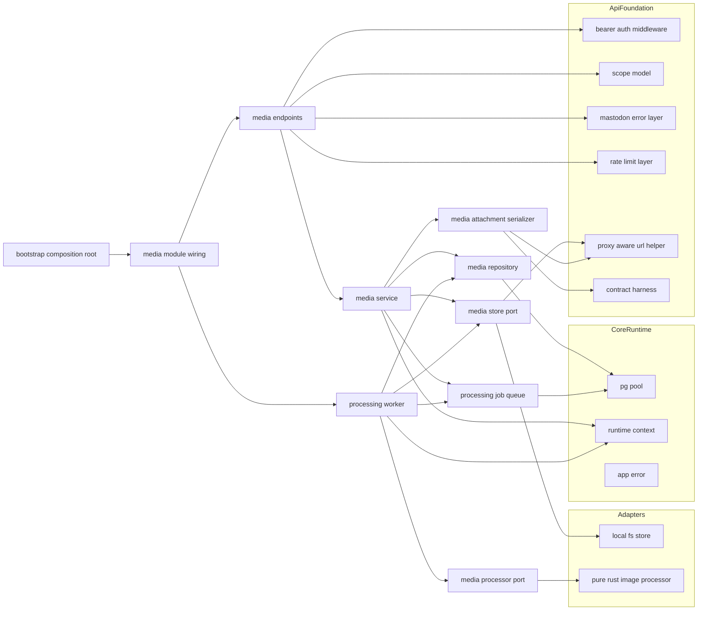
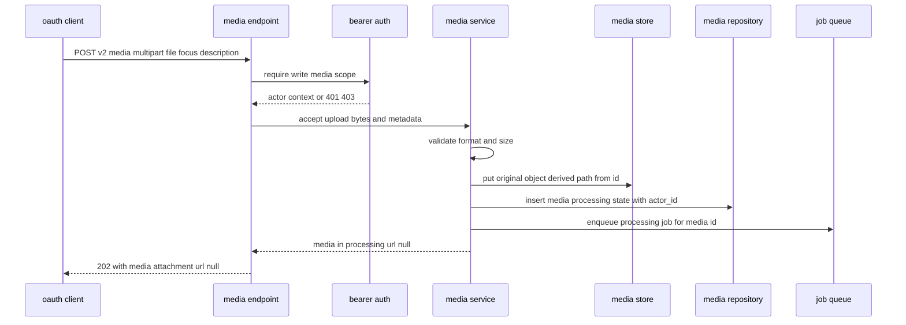
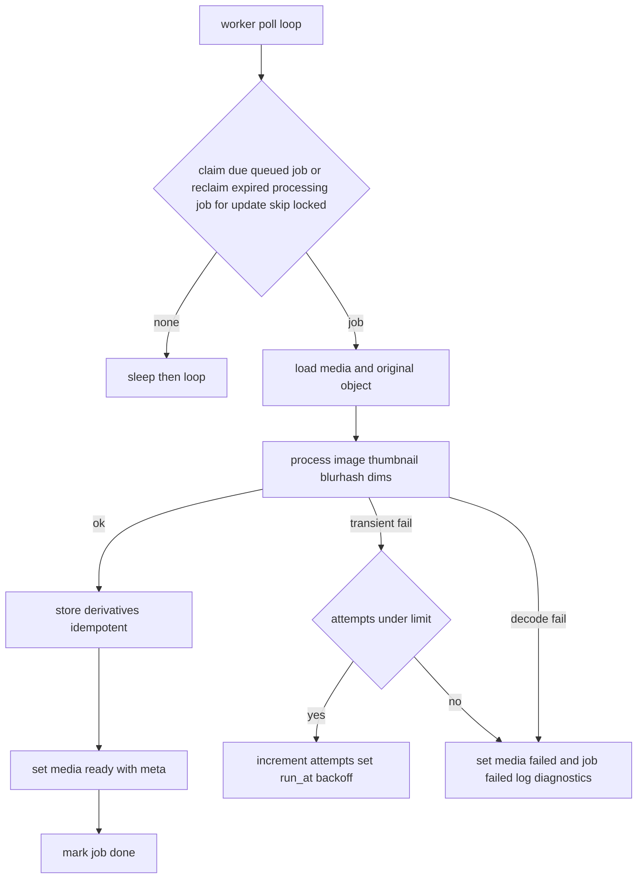
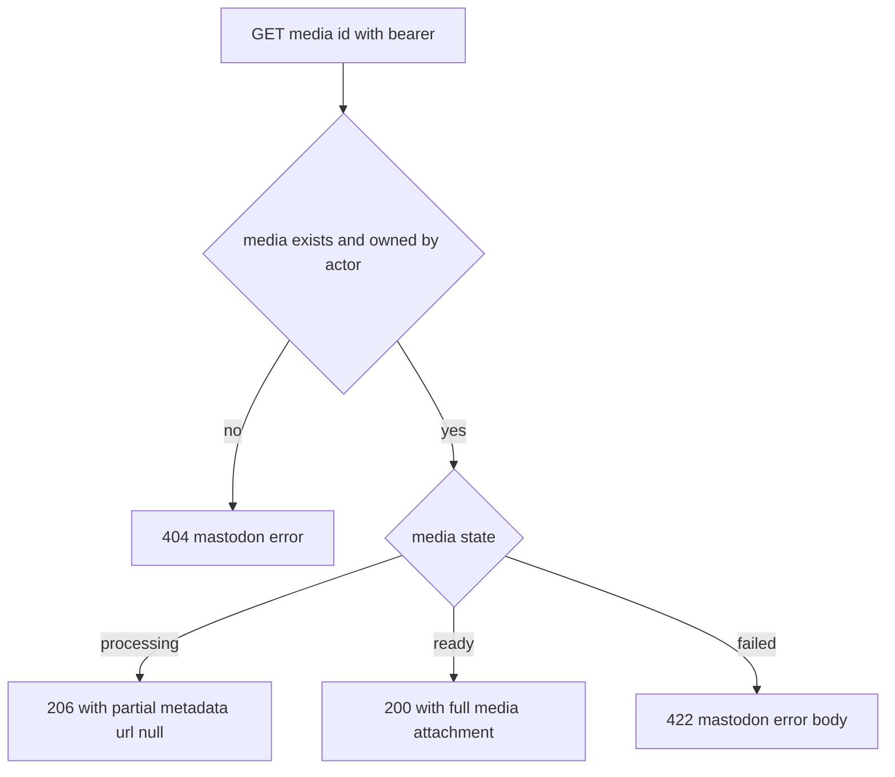

# Design Document

## Overview

**Purpose**: media-pipeline は、メディア添付を要する全下流機能（statuses-core / accounts-and-instance / custom_emojis）が共通して乗る「メディアの非同期処理土台」を提供する。クライアントからの非同期アップロード受理（`202`）、DB ジョブキューによる派生物生成、処理状態のポーリング取得（`206`/`200`）、メタデータ更新、ストレージ抽象境界、画像派生物（サムネイル・BlurHash・寸法メタ）、フォーカルポイント、MediaAttachment エンティティ契約、そして画像処理のネイティブ依存判断ゲートを担う。

**Users**: 後続のメディア消費 spec の実装者（AI 自律 TDD を含む）が、本土台に「乗るだけ」でメディア識別子・処理完了状態・MediaAttachment 契約を得る。一人鯖の運用者は、標準クライアント（Ivory・Elk・Phanpy 等）からメディアを添付した投稿を作成でき、外部ブローカー無し（アプリ + PostgreSQL のみ）でメディア処理が回る恩恵を受ける。distribution の判断者は、本 spec が確定する「画像処理 = pure-Rust / 動画 = ネイティブ依存で後回し」の決定を配布形態判断の入力として受け取る。

**Impact**: core-runtime のランタイム土台（`AppState`・`RuntimeContext`・`PgPool`・`AppError`・テストハーネス）と api-foundation の横断土台（Bearer 認証・スコープ・Mastodon 互換エラー・`X-RateLimit-*`・プロキシ尊重 URL・契約ハーネス）の上に、メディアモジュール群（`src/media/`）と永続テーブル（メディア・処理ジョブ）と常駐ワーカーを追加する。アップロードはオーナーのアクターに結びつくが、投稿等への紐付けは下流が行う。

### Goals

- 標準クライアントがメディアを非同期アップロード（`202`）でき、処理完了をポーリング（`206`→`200`）で取得できる。
- メディア処理を外部ブローカー無しの DB ジョブキューで非同期実行し、排他取得・再試行バックオフ・冪等・失敗状態を担保する。
- メディア実体と派生物をストレージ抽象境界の背後に置き、ローカル FS 実装を提供しつつ将来差し替え可能にする。
- 画像のサムネイル・BlurHash・寸法メタ・フォーカルポイントを決定的に生成・提供し、MediaAttachment 契約をゴールデンで固定する。
- 画像処理を処理抽象の背後に隔離し、MVP は pure-Rust（ネイティブ依存ゼロ）と決定して配布判断へ引き渡す。

### Non-Goals

- 動画・音声処理の実処理（ネイティブ依存範囲のみ判断し、実装は後回し）。
- 配布パッケージング・単一バイナリ/Docker の実装（distribution。本 spec は依存判断結果を渡すのみ）。
- 投稿/アバター/ヘッダ/カスタム絵文字へのメディア紐付けロジック（下流 spec が消費）。
- リモート連合経由のメディア取り込み（`remote_url`。federation-core 以降）。
- 未添付メディアの長期保持・クリーンアップ運用ポリシー（後続/運用設定）。
- 認証・スコープ・エラー・レート制限・ページネーション・契約ハーネスの規約そのもの（api-foundation 所有。本 spec は適用のみ）。

## Boundary Commitments

### This Spec Owns

- メディアアップロード API（`POST /api/v2/media`）・状態取得 API（`GET /api/v1/media/:id`）・メタ更新 API（`PUT /api/v1/media/:id`）と、それらの受理/検証/応答コード規律（`202`/`206`/`200`/`422`/`404`）。
- メディアの永続モデル（識別子・所有アクター・種別・状態・説明・フォーカルポイント・派生メタ）と、その状態遷移（`processing → ready/failed`）。
- メディア処理の DB ジョブキュー（投入・排他取得・完了・再試行/バックオフ・失敗・冪等）と常駐ワーカー。
- ストレージ抽象境界（`MediaStore` port）とローカル FS 実装、保管・取得・削除・公開 URL 生成。
- 画像処理抽象（`MediaProcessor` port）と pure-Rust 実装（サムネイル・BlurHash・寸法メタ生成）。
- フォーカルポイントの保持・既定値・範囲検証。
- MediaAttachment エンティティ JSON 契約（シリアライズ）と、api-foundation 契約ハーネスへのゴールデン登録。
- 画像処理のネイティブ依存判断ゲートの結果（pure-Rust 採用 / 動画後回し / 抽象隔離）の確定と記録。

### Out of Boundary

- 統一エラー型 `AppError` の分類・`IntoResponse` 骨格、設定/DB プール/DI 境界 trait/マイグレーション基盤/テストハーネス土台（core-runtime）。
- Bearer 認証・スコープ内包判定・Mastodon 互換エラー本文・`X-RateLimit-*`・ページネーション・プロキシ尊重 URL ヘルパ・契約ハーネス基盤（api-foundation）。
- アクター/オーナーのデータモデル・署名鍵（actor-model。本 spec は `actor_id` を論理参照するのみ）。
- メディアの投稿/プロフィール/絵文字への紐付け（statuses-core / accounts-and-instance / custom_emojis）。
- 動画/音声の実処理、リモートメディア取り込み、配布パッケージングそのもの。

### Allowed Dependencies

- core-runtime: `AppState` / `RuntimeContext`（`Clock` / `IdGenerator`）/ `PgPool` / `AppError`（Mastodon 互換変換は api-foundation 拡張を経由）/ 起動設定（保管ルート・上限値・サムネイル寸法等）/ 構造化ログ / マイグレーション基盤 / テストハーネス（`spawn_test_app`）/ axum・tower・tokio 基盤。
- api-foundation: Bearer 認証ミドルウェア（`RequestActorContext`：単一アクター + 承認スコープ）/ `Scope`（`write:media` 等の内包判定）/ `MastodonError`（互換エラー本文・ステータス対応）/ `X-RateLimit-*` レイヤー / プロキシ尊重の絶対 URL 生成 / 契約テストハーネス（`assert_golden` / `register_fixture`）。
- 画像処理 crate（pure-Rust、ネイティブ依存なし）と BlurHash 生成。下流仕様（投稿/プロフィール JSON 形）を本 spec に持ち込まない。

### Revalidation Triggers

- MediaAttachment JSON 契約の形（フィールド・型・null 規律）の変更。
- メディア識別子の採番規約・保管パス導出規約の変更。
- メディア状態モデル・状態遷移・ポーリング応答コード（`202`/`206`/`200`）の変更。
- `MediaStore` / `MediaProcessor` port のシグネチャ・差し替え契約の変更。
- DB ジョブキューのスキーマ・排他取得/再試行規約の変更。
- ネイティブ依存判断結果（pure-Rust 採用範囲・動画方針）の変更（distribution に波及）。
- 上流（core-runtime `AppState`/`RuntimeContext` / api-foundation Bearer・Scope・MastodonError・URL ヘルパ・契約ハーネス）の契約変更。

## Architecture

### Architecture Pattern & Boundary Map

選択パターン: **Ports & Adapters + DB ジョブキュー（core-runtime の Composition Root に配線）**。横断関心（認証・エラー・レート制限）は api-foundation のレイヤー/抽出器を再利用し、メディア固有の業務は API → サービス → リポジトリ/キュー、外部副作用（保管・画像処理）は port（`MediaStore` / `MediaProcessor`）の背後に隔離する。非同期処理は DB キューに投入し常駐ワーカーが消費する。依存方向は一方向（左→右）。



**Architecture Integration**:
- Selected pattern: Ports & Adapters + DB キュー。差し替え境界（Store/Processor）を 2 つの port に限定し、過抽象を避ける。
- Domain/feature boundaries: メディア業務（service/repository/queue/serializer）と外部副作用（store/processor adapter）と HTTP 表層（endpoints）を分離。アクター/オーナーは `actor_id` 論理参照のみ。
- Existing patterns preserved: core-runtime「Composition Root」「注入可能な非決定性境界」「`AppError`」、api-foundation「Bearer 認証」「Mastodon 互換エラー」「契約ハーネス」「プロキシ尊重 URL」、steering「抽象境界」「決定性の強制」「契約の集約」。
- New components rationale: 各コンポーネントは Boundary Commitments の 1 関心に 1:1 対応。
- Steering compliance: 外部ブローカー/検索エンジン非依存（DB キューのみ）、ネイティブ依存ゼロ（pure-Rust 画像処理）、可観測性（失敗時診断）、決定性（時刻/ID は `RuntimeContext`）。

### Technology Stack

| Layer | Choice / Version | Role in Feature | Notes |
|-------|------------------|-----------------|-------|
| Backend / Services | Rust (edition 2021) + axum 0.7 系 | メディアエンドポイント（multipart 受理含む）・サービス | core-runtime クレートに `src/media/` を追加 |
| Middleware | api-foundation の tower レイヤー/抽出器 | Bearer 認証・エラー変換・レート制限の再利用 | 新規ミドルウェアは作らない |
| Data / Storage | PostgreSQL + sqlx 0.7 系 | メディア・処理ジョブの永続化、`FOR UPDATE SKIP LOCKED` 排他取得 | 既存 `PgPool` を共有 |
| Async Worker | tokio タスク（常駐ワーカー） | DB キューのポーリング消費・派生物生成 | graceful shutdown は core-runtime のライフサイクルに従う |
| Media Processing | pure-Rust 画像処理 + BlurHash（ネイティブ依存なし） | 復号・縮小・符号化・BlurHash・寸法抽出 | `MediaProcessor` port の adapter。決定的 |
| Object Storage | ローカルファイルシステム | メディア/派生物の保管・取得・削除 | `MediaStore` port の adapter。将来 S3 等へ差替 |
| Test | core-runtime `spawn_test_app` + api-foundation 契約ハーネス | 統合テスト・MediaAttachment ゴールデン | 決定的 `RuntimeContext` 上で再現 |

> バージョンは系列の目安。実装時に最新互換版へ固定する。選定理由・代替比較は `research.md` 参照。

## File Structure Plan

### Directory Structure

```
migrations/
└── 0004_media.sql                # media / media_processing_jobs テーブルと制約・インデックス（連番・前方追加規約に従う）

src/
└── media/
    ├── mod.rs                    # MediaModule 組み立て（サービス/リポジトリ/キュー/ストア/プロセッサ/ワーカーのハンドル束ね）と公開
    ├── model.rs                  # Media, MediaId, MediaState, MediaType, Focus, MediaMeta, ProcessingJob 等のドメイン型
    ├── media_repository.rs       # MediaRepository（メディアの挿入・所有スコープ付き取得・状態/メタ更新）
    ├── job_queue.rs             # ProcessingJobQueue（投入・FOR UPDATE SKIP LOCKED 取得・完了・再試行/バックオフ・失敗）
    ├── store.rs                 # MediaStore port（put/get/delete + 公開 URL 生成）
    ├── local_fs.rs             # LocalFsStore（ローカル FS adapter。保管ルートは起動設定）
    ├── processor.rs            # MediaProcessor port（画像処理抽象＝ネイティブ依存ゲート）と処理結果型
    ├── image_processor.rs      # PureRustImageProcessor（pure-Rust adapter：サムネイル/BlurHash/寸法）
    ├── service.rs              # MediaService（受理・検証・ジョブ投入・状態取得・メタ更新の業務集約）
    ├── worker.rs              # ProcessingWorker（常駐ループ：ジョブ取得→処理→保管→状態遷移、冪等/再試行）
    ├── serializer.rs         # MediaAttachment JSON 契約のシリアライズ（プロキシ尊重 URL 反映）
    └── endpoints.rs          # POST /api/v2/media, GET /api/v1/media/:id, PUT /api/v1/media/:id ハンドラ

tests/
├── media_upload_it.rs          # 受理(202)・検証拒否(422)・所有アクター結びつけ（統合）
├── media_poll_it.rs           # ポーリング 206→200・未検出404・他者メディア不可視（統合）
├── media_update_it.rs         # 説明/フォーカル更新・範囲外拒否・処理中更新（統合）
├── media_processing_it.rs     # ワーカーによる派生物生成・再試行/バックオフ・失敗状態・冪等（統合）
├── media_store_it.rs          # ローカル FS 保管/取得/削除・プロキシ尊重 URL（統合）
└── media_attachment_contract_it.rs  # MediaAttachment ゴールデン（決定的・null 規律）（契約）
```

### Modified Files

- `src/state.rs`（core-runtime）— `AppState` に `MediaModule`（`MediaService` / `MediaStore` / `ProcessingJobQueue` ハンドル）を追加。
- `src/bootstrap.rs`（core-runtime）— プール確立後にメディアのリポジトリ/キュー/ストア/プロセッサ/サービスを構築し、`MediaModule` を `AppState` に格納、常駐ワーカーを起動。
- `src/server.rs`（core-runtime）— ルータにメディアエンドポイントを mount し、api-foundation の横断レイヤー（認証・エラー・レート制限）が適用される装着点に乗せる。
- `src/config/mod.rs`（core-runtime）— 起動設定にメディア保管ルート・アップロード上限サイズ・サムネイル寸法・対応形式・ワーカー並行度/再試行上限・処理ジョブのリース期間（`lease_duration`。クラッシュしたワーカーからジョブを再取得するまでの猶予。既定は想定処理時間を十分に上回る値、例: 5 分）を追加。

> 各ファイルは単一責務。メディア業務（service/repository/queue/serializer）と外部副作用 adapter（local_fs/image_processor）と HTTP 表層（endpoints）とワーカーを分離し、core-runtime の Composition Root へ一方向に配線する。

## System Flows

### 非同期アップロード受理とジョブ投入



未対応形式・上限超過は保管前に `422` で拒否（1.3, 1.4）。原本保管パスはメディア識別子から導出し決定的にする（5.3, 6.4）。受理時にアクターへ結びつけ（1.2）、派生物生成をジョブ投入（1.6, 4.1）。

### ワーカーによる派生物生成（DB キュー消費）



ジョブは `FOR UPDATE SKIP LOCKED` で 1 件を排他取得しワーカー競合を防ぐ（4.2）。再試行は `attempts` と指数バックオフ（4.4）、上限到達で失敗状態（4.5, 6.5）。再実行時は既存派生物を上書き/スキップしメディア状態を真実源に冪等化（4.6）。クラッシュ等でロックされたまま完了しないジョブは、`locked_at` がリース期間（`lease_duration`）を超えたとき `claim_due` が `state='processing'` のまま再取得（reclaim）し、reclaim 自体を 1 回の試行として `attempts` を加算する（4.2, 4.4）。上限判定は通常の失敗経路（`fail_or_retry`）に委ねるため、reclaim 直後に再度クラッシュした場合でも次の失敗判定時に上限到達で `failed` 化される（許容するトレードオフ）。

### 処理状態のポーリング取得



未存在・非所有は `404`（または権限エラー）で実体を秘匿（2.3, 2.4）。処理中は `206`（`url` 未確定）、完了は `200`（実体/プレビュー URL + 派生メタ）（2.1, 2.2, 8.2）。処理失敗（`state=failed`）は `422` で Mastodon 互換のエラー本文（`{"error": "..."}`）を返す（6.5, 9.4）。

## Requirements Traceability

| Requirement | Summary | Components | Interfaces | Flows |
|-------------|---------|------------|------------|-------|
| 1.1–1.6 | 非同期受理・アクター結びつけ・検証拒否・ジョブ投入 | MediaEndpoints, MediaService, MediaStore, MediaRepository, ProcessingJobQueue | accept_upload(), put(), insert_media(), enqueue() | 非同期アップロード受理 |
| 2.1–2.4 | ポーリング 206/200・未検出・非所有秘匿 | MediaEndpoints, MediaService, MediaRepository, MediaAttachmentSerializer | show_media(), find_owned() | ポーリング取得 |
| 3.1–3.4 | 説明/フォーカル更新・範囲検証・非所有・処理中更新 | MediaEndpoints, MediaService, MediaRepository | update_metadata() | （更新フロー） |
| 4.1–4.6 | DB キュー・排他取得・完了・再試行/バックオフ・失敗・冪等 | ProcessingJobQueue, ProcessingWorker, MediaRepository | enqueue(), claim_due(), complete(), fail_or_retry() | ワーカーによる派生物生成 |
| 5.1–5.5 | ストレージ抽象・ローカル FS・URL・プロキシ尊重・差替 | MediaStore, LocalFsStore | put()/get()/delete()/public_url() | 非同期受理 / ワーカー |
| 6.1–6.5 | サムネイル・BlurHash・寸法メタ・決定性・失敗 | MediaProcessor, PureRustImageProcessor, ProcessingWorker | process_image() | ワーカーによる派生物生成 |
| 7.1–7.4 | フォーカル保持・既定中央・反映・範囲検証 | Media model, MediaService, MediaAttachmentSerializer | Focus, update_metadata() | （更新/ポーリング） |
| 8.1–8.4 | MediaAttachment 契約・null 規律・ゴールデン・決定性 | MediaAttachmentSerializer, ContractHarness(参照) | to_json(), assert_golden() | （契約テスト時） |
| 9.1–9.5 | スコープ・401/403・互換エラー・レート制限 | MediaEndpoints, Bearer(参照), Scope(参照), MastodonError(参照), RateLimit(参照) | require_scope(), authenticate() | 全フロー横断 |
| 10.1–10.4 | 処理抽象隔離・pure-Rust 決定・動画後回し・差替 | MediaProcessor, PureRustImageProcessor | process_image() | ワーカーによる派生物生成 |

## Components and Interfaces

| Component | Domain/Layer | Intent | Req Coverage | Key Dependencies (P0/P1) | Contracts |
|-----------|--------------|--------|--------------|--------------------------|-----------|
| model | Media Domain | メディア/ジョブのドメイン型・状態・フォーカル | 1,2,3,4,6,7 | core-runtime Id/時刻型 (P0) | State |
| MediaRepository | Data | メディアの挿入・所有スコープ取得・状態/メタ更新 | 1,2,3,4 | PgPool (P0) | Service, State |
| ProcessingJobQueue | Data | DB ジョブの投入・排他取得・完了・再試行・失敗 | 4 | PgPool (P0), Clock (P0) | Service, State |
| MediaStore | Storage Port | 保管/取得/削除/公開 URL の抽象境界 | 5 | api-foundation URL ヘルパ (P1) | Service |
| LocalFsStore | Storage Adapter | ローカル FS による MediaStore 実装 | 5 | 起動設定 保管ルート (P0) | Service |
| MediaProcessor | Processing Port | 画像処理の抽象境界（ネイティブ依存ゲート） | 6,10 | なし (P0) | Service |
| PureRustImageProcessor | Processing Adapter | pure-Rust のサムネイル/BlurHash/寸法生成 | 6,10 | 画像処理 crate (P0) | Service |
| MediaService | Media Service | 受理・検証・ジョブ投入・状態取得・メタ更新の業務集約 | 1,2,3,7 | Repo, Queue, Store, RuntimeContext (P0) | Service |
| ProcessingWorker | Media Runtime | 常駐ループ：ジョブ消費→処理→保管→状態遷移 | 4,6 | Queue, Repo, Store, Processor (P0) | Batch |
| MediaAttachmentSerializer | Media API | MediaAttachment JSON 契約のシリアライズ | 2,7,8 | URL ヘルパ (P1), 契約ハーネス (P1) | Service |
| MediaEndpoints | Media API | upload/show/update の HTTP 表層と応答コード | 1,2,3,9 | MediaService, Bearer, Scope, MastodonError (P0) | API |
| MediaModule(bootstrap wiring) | Runtime | 配線（構築・ルータ装着・AppState 格納・ワーカー起動） | 1,2,3,4,9 | core-runtime bootstrap (P0) | Service |

依存方向（左→右、上位は下位のみ参照）: `model → MediaRepository / ProcessingJobQueue / MediaStore(+LocalFs) / MediaProcessor(+ImageProcessor) → MediaService / MediaAttachmentSerializer → ProcessingWorker / MediaEndpoints → MediaModule wiring`。

### Media Domain / ドメイン層

#### model

| Field | Detail |
|-------|--------|
| Intent | メディアと処理ジョブのドメイン型・状態・フォーカルポイントを型で表現する |
| Requirements | 1.1, 1.2, 2.1, 3.1, 4.1, 6.3, 7.1 |

**Responsibilities & Constraints**
- `Media` は `id`・`actor_id`（actor-model 論理参照）・`media_type`・`state`・`description`・`focus`・`meta`・タイムスタンプを持つ（1.2, 7.1）。
- `MediaState` は `Processing` / `Ready` / `Failed` の 3 値で状態遷移を表す（2.1, 4.3, 4.5）。
- `Focus` は `x`,`y` を `-1.0`〜`1.0` に制約し、既定を中央 `(0.0, 0.0)` とする（7.1, 7.2）。
- `ProcessingJob` は対象 `media_id`・`attempts`・`run_at`・`locked_at`・状態を持つ（4.1, 4.4）。

**Dependencies**
- Inbound: 全メディアコンポーネント (P0)
- Outbound: core-runtime の Id 型・時刻型 (P0)

**Contracts**: State [x]

##### 型定義（抜粋）
```rust
pub enum MediaType { Image, Gifv, Video, Audio, Unknown } // MVP は Image を生成対象
pub enum MediaState { Processing, Ready, Failed }
pub struct Focus { pub x: f32, pub y: f32 } // -1.0..=1.0, 既定 (0.0, 0.0)
pub struct Dimensions { pub width: u32, pub height: u32, pub aspect: f32 }
pub struct MediaMeta { pub original: Dimensions, pub small: Option<Dimensions> }
pub struct Media {
    pub id: Id, pub actor_id: Id, pub media_type: MediaType, pub state: MediaState,
    pub description: Option<String>, pub focus: Focus, pub meta: Option<MediaMeta>,
    pub blurhash: Option<String>, pub created_at: OffsetDateTime,
}
pub struct ProcessingJob { pub id: Id, pub media_id: Id, pub attempts: u32, pub run_at: OffsetDateTime, pub locked_at: Option<OffsetDateTime>, pub state: JobState }
```
- Invariants: `actor_id` は必須。`Focus` は範囲内。`state=Ready` のとき `meta` と実体 URL が確定。

### Data / データ層

#### MediaRepository

| Field | Detail |
|-------|--------|
| Intent | メディアの挿入・所有スコープ付き取得・状態/メタ更新を提供する |
| Requirements | 1.1, 1.2, 2.2, 2.3, 2.4, 3.1, 3.3, 4.3 |

**Responsibilities & Constraints**
- 挿入時に `actor_id` を必須で記録（1.2）。識別子は `IdGenerator`、時刻は `Clock`（決定性）。
- 取得は `media_id` + `actor_id` の所有スコープで行い、非所有/未存在は `None` 相当（2.3, 2.4, 3.3）。
- 状態/メタ更新（`processing→ready/failed`、派生メタ反映、説明/フォーカル更新）（2.2, 3.1, 4.3）。

**Dependencies**
- Inbound: MediaService, ProcessingWorker (P0)
- Outbound: PgPool (P0)

**Contracts**: Service [x] / State [x]

##### Service Interface
```rust
pub async fn insert_media(pool: &PgPool, media: &Media) -> Result<(), AppError>;
pub async fn find_owned(pool: &PgPool, media_id: Id, actor_id: Id) -> Result<Option<Media>, AppError>;
pub async fn update_metadata(pool: &PgPool, media_id: Id, actor_id: Id, desc: Option<&str>, focus: Option<Focus>) -> Result<Option<Media>, AppError>;
pub async fn set_ready(pool: &PgPool, media_id: Id, meta: &MediaMeta, blurhash: &str) -> Result<(), AppError>;
pub async fn set_failed(pool: &PgPool, media_id: Id) -> Result<(), AppError>;
```
- Postconditions: `find_owned` は他アクターのメディアを返さない（2.4）。

#### ProcessingJobQueue

| Field | Detail |
|-------|--------|
| Intent | メディア処理ジョブの投入・排他取得・完了・再試行/バックオフ・失敗を提供する |
| Requirements | 4.1, 4.2, 4.4, 4.5, 4.6 |

**Responsibilities & Constraints**
- 投入は受理時（1.6）。取得は `FOR UPDATE SKIP LOCKED` で、`state='queued' AND run_at <= now` の新規ジョブ、または `state='processing' AND locked_at < now - lease_duration` のリース期限切れジョブ（ワーカークラッシュ後の再取得＝reclaim）のいずれかを 1 件排他取得（4.2）。
- reclaim 時は `locked_at` を更新し `attempts++` する（クラッシュによる再取得も 1 試行として消費し、`fail_or_retry` の会計と整合させる）（4.2, 4.4）。
- 完了でジョブ削除/完了化（4.3）。一時失敗は `attempts++` と指数バックオフで `run_at` 後退（4.4）。
- 上限到達でジョブ失敗化（4.5）。状態を真実源にして冪等取得を保証（4.6）。
- 時刻は `Clock` から取得（決定性）。`lease_duration` は起動設定（想定処理時間を十分に上回る値）。

**Dependencies**
- Inbound: MediaService（投入）, ProcessingWorker（消費） (P0)
- Outbound: PgPool (P0), Clock (P0)

**Contracts**: Service [x] / State [x]

##### Service Interface
```rust
pub async fn enqueue(pool: &PgPool, ids: &dyn IdGenerator, media_id: Id, now: OffsetDateTime) -> Result<(), AppError>;
pub async fn claim_due(pool: &PgPool, now: OffsetDateTime, lease_duration: Duration) -> Result<Option<ProcessingJob>, AppError>; // FOR UPDATE SKIP LOCKED; queued(run_at<=now) を新規取得、または processing(locked_at<now-lease_duration) を reclaim（attempts++）
pub async fn complete(pool: &PgPool, job_id: Id) -> Result<(), AppError>;
pub async fn fail_or_retry(pool: &PgPool, job: &ProcessingJob, max_attempts: u32, now: OffsetDateTime) -> Result<JobOutcome, AppError>; // Retried | Failed
```
- Postconditions: `claim_due` が返したジョブは他ワーカーから同時取得されない（4.2）。reclaim されたジョブは `attempts` が加算された状態で返る（4.2, 4.4）。

### Storage / ストレージ層

#### MediaStore（port）/ LocalFsStore（adapter）

| Field | Detail |
|-------|--------|
| Intent | メディア実体の保管/取得/削除と公開 URL を抽象境界の背後に置く |
| Requirements | 5.1, 5.2, 5.3, 5.4, 5.5 |

**Responsibilities & Constraints**
- `MediaStore` は保管/取得/削除/公開 URL を定義し、呼び出し側を実装非依存にする（5.1, 5.5）。
- `LocalFsStore` は起動設定の保管ルート配下に、メディア識別子から導出した決定的パスで保管（5.2, 5.3）。
- 公開 URL は api-foundation のプロキシ尊重ヘルパで外部ホスト/スキームを反映した絶対 URL を生成（5.4）。

**Dependencies**
- Inbound: MediaService, ProcessingWorker, MediaAttachmentSerializer (P0)
- Outbound: 起動設定 保管ルート (P0), api-foundation URL ヘルパ (P1)

**Contracts**: Service [x]

##### Service Interface
```rust
pub trait MediaStore: Send + Sync {
    async fn put(&self, key: &ObjectKey, bytes: &[u8], content_type: &str) -> Result<(), AppError>;
    async fn get(&self, key: &ObjectKey) -> Result<Vec<u8>, AppError>;
    async fn delete(&self, key: &ObjectKey) -> Result<(), AppError>;
    fn public_url(&self, key: &ObjectKey, req_uri: &RequestUriContext) -> String; // プロキシ尊重の絶対 URL
}
pub struct ObjectKey(/* media id 由来の決定的キー（original / small）*/);
```
- Invariants: 同一 `ObjectKey` は同一実体を指す。`public_url` は外部ホスト/スキームを尊重（5.4）。

### Processing / 画像処理層（ネイティブ依存ゲート）

#### MediaProcessor（port）/ PureRustImageProcessor（adapter）

| Field | Detail |
|-------|--------|
| Intent | 画像処理を抽象境界の背後に隔離し、MVP は pure-Rust（ネイティブ依存ゼロ）で実装する |
| Requirements | 6.1, 6.2, 6.3, 6.4, 6.5, 10.1, 10.2, 10.3, 10.4 |

**Responsibilities & Constraints**
- `MediaProcessor` は入力バイト列から「サムネイル・BlurHash・原寸法/アスペクト」を生成する単一 port（10.1, 10.4）。
- `PureRustImageProcessor` は pure-Rust crate で復号→縮小→符号化→BlurHash→寸法抽出を行い、ネイティブ依存を要求しない（6.1, 6.2, 6.3, 10.2, 10.3）。
- 同一入力 + 固定パラメータで決定的出力（6.4）。復号/生成失敗は明示的エラーで返し、ワーカーが失敗状態へ（6.5）。
- 動画/音声は MVP 非対象（`MediaType::Image` のみ処理。10.3）。判断結果（pure-Rust 採用 / 動画後回し / 抽象隔離）は `research.md` に記録し distribution へ引き渡す（10.2）。

**Dependencies**
- Inbound: ProcessingWorker (P0)
- Outbound: 画像処理 crate（pure-Rust） (P0)

**Contracts**: Service [x]

##### Service Interface
```rust
pub struct ProcessedImage { pub thumbnail: Vec<u8>, pub thumbnail_dims: Dimensions, pub original_dims: Dimensions, pub blurhash: String, pub content_type: String }
pub trait MediaProcessor: Send + Sync {
    fn process_image(&self, original: &[u8], thumb_target: ThumbnailSpec) -> Result<ProcessedImage, AppError>;
}
```
- Postconditions: 同一入力で `ProcessedImage` は再現可能（6.4）。

### Media Service / サービス層

#### MediaService

| Field | Detail |
|-------|--------|
| Intent | 受理・検証・ジョブ投入・状態取得・メタ更新の業務を集約する |
| Requirements | 1.1, 1.3, 1.4, 1.5, 1.6, 2.1, 2.2, 3.1, 3.2, 7.4 |

**Responsibilities & Constraints**
- 受理: 形式/サイズ検証（未対応/上限超過は `AppError`→`422`）→ 原本保管 → メディア挿入（`processing`）→ ジョブ投入（1.3, 1.4, 1.1, 1.6）。
- 任意の説明/フォーカルを受理時に記録（1.5）。フォーカル範囲外は拒否（3.2, 7.4 と整合）。
- 状態取得: 所有スコープで取得し、状態に応じた表現を返す（2.1, 2.2）。
- メタ更新: 所有スコープで説明/フォーカルを更新（処理中でも可）（3.1, 3.4）。識別子/時刻は `RuntimeContext`。

**Dependencies**
- Inbound: MediaEndpoints (P0)
- Outbound: MediaRepository, ProcessingJobQueue, MediaStore, RuntimeContext (P0)

**Contracts**: Service [x]

##### Service Interface
```rust
pub async fn accept_upload(&self, actor_id: Id, input: UploadInput) -> Result<Media, AppError>; // 検証→保管→挿入→投入
pub async fn show_media(&self, actor_id: Id, media_id: Id) -> Result<Option<Media>, AppError>;
pub async fn update_metadata(&self, actor_id: Id, media_id: Id, patch: MetadataPatch) -> Result<Option<Media>, AppError>;
```

### Media Runtime / ワーカー層

#### ProcessingWorker

| Field | Detail |
|-------|--------|
| Intent | DB キューを消費し、派生物生成→保管→状態遷移を冪等・再試行付きで実行する |
| Requirements | 4.2, 4.3, 4.4, 4.5, 4.6, 6.1, 6.5 |

**Responsibilities & Constraints**
- 常駐ループで `claim_due` → 原本取得 → `process_image` → 派生物保管 → `set_ready` → `complete`（4.2, 4.3, 6.1）。
- 一時失敗は `fail_or_retry`（バックオフ）、上限到達/復号失敗は `set_failed` + ジョブ失敗 + 診断出力（4.4, 4.5, 6.5）。
- 冪等: メディア状態を真実源に、再実行時は既存派生物を上書き/スキップ（4.6）。
- graceful shutdown は core-runtime のライフサイクルに従う。ワーカーが応答なく停止（クラッシュ）した場合はロック解放処理を待たず、`claim_due` の reclaim（`locked_at` がリース期間 `lease_duration` を超過した `processing` ジョブの再取得。`attempts++`）で自動的に復旧する（4.2, 4.4）。

**Dependencies**
- Inbound: MediaModule wiring（起動） (P0)
- Outbound: ProcessingJobQueue, MediaRepository, MediaStore, MediaProcessor, RuntimeContext (P0)

**Contracts**: Batch [x]

##### Batch / Job Contract
- Trigger: 常駐ループ（`run_at <= now` のジョブ出現時）。
- Input / validation: `media_processing_jobs` の取得済みジョブ + 原本オブジェクト。
- Output / destination: 派生物（サムネイル）保管 + メディア状態 `ready/failed` 反映。
- Idempotency & recovery: メディア状態を真実源に冪等。失敗は再試行/失敗状態化、クラッシュ等でロックされたジョブは `lease_duration` 経過後に `claim_due` が reclaim し `attempts` を加算した上で再処理する。

### Media API / エンドポイント層

#### MediaEndpoints / MediaAttachmentSerializer

| Field | Detail |
|-------|--------|
| Intent | upload/show/update の HTTP 表層と応答コード規律、MediaAttachment 契約のシリアライズ |
| Requirements | 1.1, 2.1, 2.2, 2.3, 3.1, 3.2, 7.2, 7.3, 8.1, 8.2, 8.3, 8.4, 9.1, 9.2, 9.3, 9.4, 9.5 |

**Responsibilities & Constraints**
- アップロード・取得・更新はいずれも `write:media` スコープ要求（Bearer + Scope 再利用。Mastodon の実挙動では `GET` もアップロードフローに束ねられ読み取り専用スコープを持たないため、取得にも `write:media` を要求する）、受理で `202`（9.1, 1.1）。
- 取得は状態に応じ `206`/`200`/`422`（処理失敗、`{"error": "..."}`）、未存在/非所有は `404`（2.1, 2.2, 2.3, 6.5）。更新は範囲検証後 `200`、範囲外 `422`（3.1, 3.2）。
- 失敗は全て api-foundation の Mastodon 互換エラー本文（9.2, 9.3, 9.4）。レート制限ヘッダは横断レイヤーで付与（9.5）。
- Serializer は `id`/`type`/`url`/`preview_url`/`remote_url`/`meta`/`focus`/`description`/`blurhash` を出力。処理中は `url=null`、`focus` 既定中央（8.1, 8.2, 7.2, 7.3）。`remote_url` は MVP 常に `null`。契約はハーネスにゴールデン登録（8.3, 8.4）。

**Dependencies**
- Inbound: MediaModule wiring（mount） (P0)
- Outbound: MediaService, api-foundation Bearer/Scope/MastodonError/URL ヘルパ/契約ハーネス (P0/P1)

**Contracts**: API [x] / Service [x]

##### API Contract
| Method | Endpoint | Request | Response | Errors |
|--------|----------|---------|----------|--------|
| POST | /api/v2/media | multipart: file, 任意 thumbnail/description/focus（`write:media`） | 202 MediaAttachment(url=null) | 401, 403, 422 |
| GET | /api/v1/media/:id | Bearer（所有アクター、`write:media`） | 206（処理中）/ 200 MediaAttachment / 422 `{"error": "..."}`（処理失敗） | 401, 403, 404, 422 |
| PUT | /api/v1/media/:id | description, focus（`write:media`） | 200 MediaAttachment | 401, 403, 404, 422 |

## Data Models

### Logical Data Model

- `media (1) ──< media_processing_jobs (N)`（MVP では 1 メディア 1 ジョブだが N 対応可能なスキーマ）。
- `media.actor_id` は actor-model `local_actors.id` を論理参照（FK はモジュール境界方針に従い任意）。
- メディア状態（`processing`/`ready`/`failed`）が処理進捗の真実源。ジョブは処理の駆動・再試行管理に限定。

### Physical Data Model

```sql
-- 0004_media.sql （連番・前方追加規約。既存に 0003 重複があるため実装時に未使用番号と整合させる）
CREATE TABLE media (
    id            BIGINT PRIMARY KEY,            -- core-runtime IdGenerator 採番
    actor_id      BIGINT NOT NULL,               -- 所有アクター（actor-model 論理参照）
    media_type    TEXT   NOT NULL,               -- image/gifv/video/audio/unknown
    state         TEXT   NOT NULL,               -- processing/ready/failed
    description   TEXT,
    focus_x       REAL   NOT NULL DEFAULT 0,      -- -1.0..1.0
    focus_y       REAL   NOT NULL DEFAULT 0,
    orig_width    INTEGER,
    orig_height   INTEGER,
    small_width   INTEGER,
    small_height  INTEGER,
    blurhash      TEXT,
    object_key    TEXT   NOT NULL,               -- 原本の決定的ストレージキー
    thumb_key     TEXT,                          -- サムネイルの決定的ストレージキー
    content_type  TEXT   NOT NULL,
    created_at    TIMESTAMPTZ NOT NULL,
    updated_at    TIMESTAMPTZ NOT NULL
);
CREATE INDEX media_actor_idx ON media(actor_id);

CREATE TABLE media_processing_jobs (
    id            BIGINT PRIMARY KEY,
    media_id      BIGINT NOT NULL REFERENCES media(id),
    state         TEXT   NOT NULL,               -- queued/processing/failed
    attempts      INTEGER NOT NULL DEFAULT 0,
    run_at        TIMESTAMPTZ NOT NULL,          -- 取得対象は run_at <= now
    locked_at     TIMESTAMPTZ,
    last_error    TEXT,
    created_at    TIMESTAMPTZ NOT NULL
);
CREATE INDEX media_jobs_due_idx ON media_processing_jobs(state, run_at)
    WHERE state IN ('queued', 'processing');     -- 新規 queued(run_at<=now) と reclaim 対象 processing(locked_at<now-lease_duration) の双方を1本の部分インデックスでカバーする。locked_at 側の条件は now() 依存で部分インデックス述語にできないため、state='processing' に絞り込んだ後 locked_at を残余フィルタとして評価する（選択性はやや低下するが、単一鯖規模のテーブルサイズでは許容範囲）。
```

- Consistency: ジョブ取得は `SELECT ... FOR UPDATE SKIP LOCKED` + 同一トランザクションで `locked_at`/`state`/`attempts` を更新し排他化（4.2）。reclaim（`state='processing' AND locked_at < now - lease_duration`）も同一クエリ内で `attempts++` する。
- Temporal: `run_at`/`created_at`/`updated_at` は `Clock` 由来（決定性、6.4 と整合）。

### Data Contracts & Integration

- MediaAttachment JSON は Mastodon 互換（`id`/`type`/`url`/`preview_url`/`remote_url`/`meta`(`original`,`small`,`focus`)/`description`/`blurhash`）。処理中は `url=null`。
- エラー応答は api-foundation の `{"error": ...}`（+ `error_description`）に統一。
- 起動設定追加: メディア保管ルート・アップロード上限サイズ・サムネイル寸法・対応形式・ワーカー並行度/再試行上限・処理ジョブのリース期間（`lease_duration`）を core-runtime config へ。

## Error Handling

### Error Strategy
- 全失敗を core-runtime `AppError` に集約し、api-foundation の `MastodonError` 変換層で互換本文 + ステータスへ写像する（新エラー型を作らない）。
- 受理時の検証失敗（形式/サイズ/フォーカル範囲）は fail fast で `422`、認証/権限は Bearer/Scope が `401`/`403`、未存在/非所有は `404`。
- ワーカー内の処理失敗はメディア状態 `failed` に反映し、HTTP には影響させない（非同期）。

### Error Categories and Responses
- **利用者起因**: 未対応形式/上限超過/フォーカル範囲外→`422`、認証欠如/無効→`401`、スコープ不足→`403`、未存在/非所有→`404`。いずれも互換エラー本文。
- **処理起因（非同期）**: 復号/生成失敗・再試行上限到達→メディア `failed` + ジョブ失敗 + 診断ログ。`GET` は失敗を互換応答で表現。
- **システム起因（5xx）**: 内部詳細を本文に出さず互換本文のみ。診断は core-runtime ログへ。

### Monitoring
- 受理・ジョブ投入/取得/完了/失敗・再試行は構造化ログ（core-runtime 相関 ID に乗る）。失敗時は原因特定に十分な診断（失敗マイグレーション同様の粒度）。

## Testing Strategy

### Unit Tests
- `Focus`: 範囲検証（`-1.0`〜`1.0`）と既定中央、範囲外拒否（7.1, 7.2, 7.4）。
- `PureRustImageProcessor`: 同一入力で同一の BlurHash/サムネイル/寸法（決定性）、未対応/破損入力で明示的エラー（6.4, 6.5）。
- `MediaAttachmentSerializer`: 処理中 `url=null`・完了で実体/プレビュー URL・`focus` 既定中央・`remote_url=null`（8.1, 8.2, 7.2）。
- `ProcessingJobQueue` バックオフ計算: `attempts` に応じた `run_at` 後退と上限判定（4.4, 4.5）。

### Integration Tests（`spawn_test_app` 上）
- 受理: 有効画像で `202`（`url=null`）・アクター結びつけ、未対応形式/上限超過で `422`（1.1, 1.2, 1.3, 1.4）。
- ポーリング: 投入直後 `206`、ワーカー処理後 `200`（派生メタ付き）、未存在 `404`、他アクター不可視（2.1, 2.2, 2.3, 2.4）。
- 更新: 説明/フォーカル更新が反映、範囲外 `422`、処理中でも更新可、非所有 `404`（3.1, 3.2, 3.3, 3.4）。
- 処理/キュー: ワーカーが派生物を生成し `ready` 化、一時失敗で再試行・バックオフ、上限到達で `failed`、再実行で重複派生物を生まない（4.2, 4.3, 4.4, 4.5, 4.6, 6.1, 6.5）。
- ストレージ: ローカル FS で保管/取得/削除でき、公開 URL がプロキシ尊重の絶対 URL になる（5.1, 5.2, 5.3, 5.4）。
- 横断: 認証欠如で `401`、`write:media` 不足で `403`、エラーが互換 JSON、`X-RateLimit-*` 付与（9.1, 9.2, 9.3, 9.4, 9.5）。

### Contract Tests（api-foundation ハーネス上）
- MediaAttachment ゴールデン: 決定的境界で処理中/完了の双方の JSON が再現され、null 規律・focus・meta・blurhash が固定される（8.1, 8.2, 8.3, 8.4）。

## Security Considerations
- アップロードは `write:media` スコープと所有アクター文脈を要求し、他アクターのメディアを参照/更新させない（2.4, 3.3, 9.1, 9.3）。
- 受理時に形式/サイズを検証し、未対応・過大入力を拒否してリソース枯渇を防ぐ（1.3, 1.4）。pure-Rust 復号で外部プロセス起動を伴わない（攻撃面の縮小、10.1）。
- 公開 URL とストレージキーはメディア識別子由来で推測可能性を抑え、所有チェックは API 層で行う。
