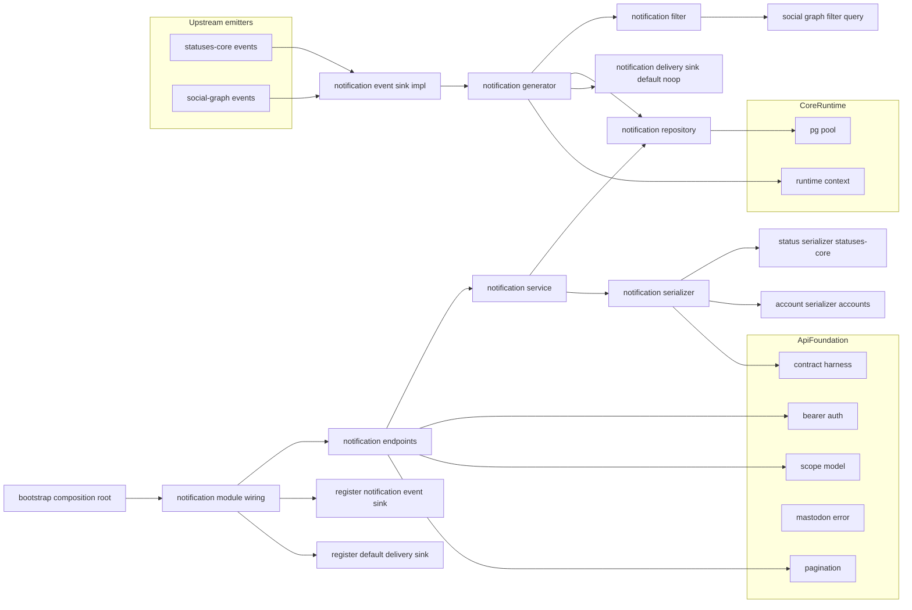
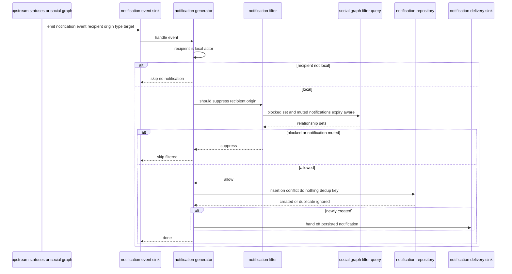
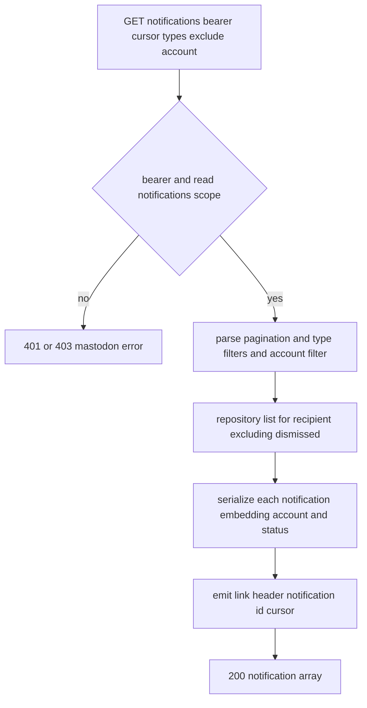

# Design Document

## Overview

**Purpose**: notifications は kawasemi の通知（Notification）v1 を提供する。Notification エンティティの JSON 契約（ゴールデン固定）と取得 API（一覧 / 単一 / clear / dismiss）を所有し、最重要制約である「**通知を再検出せず上流イベントの消費で単一の生成点から生成する**」を体現する。statuses-core（お気に入り・ブースト・メンション・投票終了・編集）と social-graph（フォロー・フォローリクエスト）が状態遷移確定後に発生させるドメインイベントを、本 spec が所有する通知生成シーム（`NotificationEventSink`、既定 no-op）で受け、単一の `NotificationGenerator` が「ブロック/ミュートフィルタ → 重複排除 → 永続化 → 配信シーム引き渡し」を一箇所で担う。これにより後段の Streaming / Web Push が同一の生成点に乗れる（二重発火しない）。

**Users**: 標準クライアント（Ivory・Elk・Phanpy 等）のユーザーが本 spec を通じて自分宛の通知を取得・整理する。下流 spec（streaming / web-push）の実装者は、本 spec が確立する単一の通知生成点（`NotificationGenerator`）と配信シーム（`NotificationDeliverySink`）に乗る。上流 spec（statuses-core / social-graph）は本 spec が公開する `NotificationEventSink` へイベントを emit する。

**Impact**: core-runtime のランタイム土台、api-foundation の横断土台（Bearer/スコープ/エラー/ページネーション/契約ハーネス）、statuses-core の Status 契約・シリアライザとイベント源、social-graph の関係状態問い合わせ（`FilterQuery`）とイベント源、accounts-and-instance の Account 契約・シリアライザの上に、通知モジュール群（`src/notifications/`）と通知の永続テーブル（`migrations/0009_notifications.sql`）を追加する。通知生成シーム（`NotificationEventSink`）と配信シーム（`NotificationDeliverySink`）を `AppState` に既定 no-op で配線し、上流が emit・下流が delivery を差し替えられるようにする。

### Goals

- Notification v1 の取得 API（一覧 / 単一 / clear / dismiss）を Mastodon 互換で提供する。
- Notification の JSON 契約をゴールデン固定し、Account / Status は上流シリアライザへ委譲して埋め込む（再定義しない）。
- 上流イベントを消費する単一の通知生成点を提供し、ローカル/リモート対称・二重発火なしで通知を生成する。
- ブロック / ミュート（通知ミュート・期限考慮）に基づき生成段で通知を抑制する。
- 通知生成を冪等化（重複排除）する。
- 後段（Streaming / Web Push）が再利用する配信シームを提供する（配信手段は実装しない）。

### Non-Goals

- notifications v2（グループ化・`group_key`）・notification policy・notification requests（experience-expansion）。
- `admin.sign_up` / `admin.report` 等の管理通知。
- Streaming の WebSocket 配信（streaming）・Web Push の購読/VAPID/配送（web-push）。
- Status / Account / Relationship エンティティの JSON 契約定義（statuses-core / accounts-and-instance。本 spec は埋め込み参照のみ）。
- お気に入り / ブースト / メンション / 投票・フォロー / ブロック / ミュートの検出・状態モデル・関係操作（statuses-core / social-graph）。
- OAuth・ページネーション・エラー・契約ハーネス基盤（api-foundation。本 spec は適用のみ）。

## Boundary Commitments

### This Spec Owns

- 通知 API: 一覧（`GET /api/v1/notifications`）・単一（`GET /api/v1/notifications/:id`）・全消去（`POST /api/v1/notifications/clear`）・個別消去（`POST /api/v1/notifications/:id/dismiss`）の HTTP 表層・スコープ要求・応答コード規律。
- Notification エンティティの JSON 契約（外殻: `id` / `type` / `created_at` + `account` / `status` 埋め込み点）とシリアライズ、api-foundation 契約ハーネスへのゴールデン登録。
- 通知 v1 の種別集合（`mention` / `follow` / `follow_request` / `favourite` / `reblog` / `poll` / `status` / `update`）の定義。
- 通知の永続モデル（受信者・種別・通知元・対象・消去状態・作成時刻）と、その重複排除規律。
- 単一の通知生成点（`NotificationGenerator`）= フィルタ → 重複排除 → 永続化 → 配信シーム引き渡しの集約。
- 通知生成シーム（`NotificationEventSink` trait + `NotificationEvent` 型 + 既定 `NoopSink`）の**定義と本実装供給**、および `AppState` レジストリへの配線。
- 配信シーム（`NotificationDeliverySink` trait + 既定 no-op）の**定義**（後段 streaming / web-push が実装供給）。
- ブロック / ミュートに基づく生成段フィルタ（`NotificationFilter`、social-graph の関係問い合わせを消費）。
- 本 spec が所有する永続テーブル（`notifications`）とそのマイグレーション（0009）。

### Out of Boundary

- Status / Account / Relationship の JSON 契約・シリアライザ定義（statuses-core / accounts-and-instance。本 spec は委譲呼び出しのみ）。
- お気に入り / ブースト / メンション / 投票終了 / フォロー / フォローリクエストの**検出・状態遷移**そのもの（statuses-core / social-graph。本 spec は確定後イベントを消費）。
- ブロック / ミュートの関係状態の保持・期限判定ロジック（social-graph。本 spec は `FilterQuery` を消費）。
- Streaming の WebSocket 配信・Web Push の配送（streaming / web-push。本 spec は配信シームを定義するのみ）。
- notifications v2 / policy / requests / 管理通知（後回し）。
- 認証 / スコープ / エラー / ページネーション / レート制限 / 契約ハーネス基盤（api-foundation）、起動 / 設定 / DI / マイグレーション基盤（core-runtime）。

### Allowed Dependencies

- core-runtime: `AppState` / `RuntimeContext`（`Clock` / `IdGenerator`）/ `PgPool` / `AppError` / 構造化ログ / マイグレーション基盤 / テストハーネス（`spawn_test_app`）。
- api-foundation: Bearer 認証（`RequestActorContext`）/ `Scope`（`read:notifications` / `write:notifications` 内包判定）/ `MastodonError` / `Pagination`（`PageParams` / `Cursor` / `Page<T>` / `build_link_header`）/ `X-RateLimit-*` レイヤー / 契約ハーネス（`assert_golden` / `register_fixture`）。
- statuses-core: `StatusSerializer.status_to_json`（`status` 埋め込み・受信者視点）/ Status 取得（対象投稿の解決）/ 通知生成イベント源（お気に入り・ブースト・メンション・投票終了・編集の確定後 emit）。
- social-graph: `FilterQuery`（`blocked_set`: blocked/blocked_by/muted/muted_notifications・期限考慮）/ フォロー・フォローリクエストの確定後 emit。
- accounts-and-instance: `AccountSerializer`（`account` 埋め込み・ローカル/リモート統一）/ `AccountRef` / アカウント解決。
- 下流仕様（Streaming / Web Push の配信実体）を本 spec に持ち込まない（配信シームの背後に置く）。

### Revalidation Triggers

- Notification JSON 契約の外殻（`id` / `type` / `created_at` / `account` / `status` 埋め込み点・null 規律・`type` 種別集合）の変更。
- 通知の永続モデル・重複排除キー規約の変更。
- 通知生成シーム（`NotificationEventSink` / `NotificationEvent` のペイロード・種別）の変更（**上流 statuses-core / social-graph の emit 接合点に波及**）。
- 配信シーム（`NotificationDeliverySink`）のシグネチャ変更（**下流 streaming / web-push に波及**）。
- ブロック / ミュートフィルタが消費する social-graph `FilterQuery` の問い合わせ契約の変更。
- 上流（api-foundation の Bearer/Scope/Pagination/MastodonError/Harness、statuses-core の `StatusSerializer`、social-graph の `FilterQuery`、accounts-and-instance の `AccountSerializer`/`AccountRef`、core-runtime の `AppState`/`RuntimeContext`）の契約変更。

## Architecture

### Architecture Pattern & Boundary Map

選択パターン: **イベント消費 + 単一 Generator + 委譲 Port（core-runtime の Composition Root に配線、api-foundation のレイヤー/抽出器を再利用）**。横断関心（Bearer・スコープ・エラー・ページネーション・レート制限）は api-foundation に「乗るだけ」。通知の取得業務は API → サービス → リポジトリに分離する。通知生成は上流が emit するイベントを `NotificationEventSink` 本実装で受け、単一の `NotificationGenerator` が「フィルタ（social-graph 消費）→ 重複排除 → 永続化 → 配信シーム引き渡し」を一箇所で担う。配信手段は `NotificationDeliverySink`（既定 no-op）の背後に隔離し、後段 spec が差し替える。依存方向は一方向（左→右）。



**Architecture Integration**:
- Selected pattern: イベント消費 + 単一 Generator + 委譲 Port。生成点を一箇所に集約し、配信を port の背後へ隔離。
- Domain/feature boundaries: 取得業務（service/repository/serializer）と生成業務（event sink/generator/filter）と配信シーム（delivery sink）を分離。
- Existing patterns preserved: api-foundation「乗るだけ」、accounts-and-instance / social-graph「委譲 Port 実装供給」、core-runtime「Composition Root」「決定性」、tech.md「意味論対称・物理配送のみ最適化」「契約の集約」、roadmap「Streaming の単一生成点」。
- New components rationale: 各コンポーネントは Boundary Commitments の 1 関心に 1:1 対応。生成点を単一 Generator に集約し二重発火を構造的に排除。
- Steering compliance: 外部ブローカー非依存（DB 完結）、決定性（時刻/ID は `RuntimeContext`、ミュート期限は social-graph 側の注入 `Clock`）、可観測性（生成・フィルタ抑制・配信引き渡しの診断）、一次情報は Mastodon 実レスポンス（Notification ゴールデン）。

### Technology Stack

| Layer | Choice / Version | Role in Feature | Notes |
|-------|------------------|-----------------|-------|
| Backend / Services | Rust (edition 2021) + axum 0.7 系 | 通知エンドポイント・サービス・生成 | core-runtime クレートに `src/notifications/` を追加 |
| Middleware | api-foundation の tower レイヤー/抽出器 | Bearer 認証・スコープ・エラー変換・ページネーション・レート制限の再利用 | 新規ミドルウェアは作らない |
| Data / Storage | PostgreSQL + sqlx 0.7 系 | 通知の永続化・重複排除・カーソル取得 | 既存 `PgPool` を共有 |
| Serialization | serde / serde_json | Notification JSON 契約（外殻）。Account/Status は上流委譲 | 決定的ゴールデン |
| Test | core-runtime `spawn_test_app` + api-foundation 契約ハーネス | 統合 / 契約テスト | 決定的 `RuntimeContext` |

> バージョンは系列の目安。実装時に最新互換版へ固定する。選定理由・代替比較は `research.md` 参照。

## File Structure Plan

### Directory Structure

```
migrations/
└── 0009_notifications.sql       # notifications テーブルと重複排除の部分一意制約（未消去限定）・受信者カーソルインデックス（research.md の Migration Numbering Coordination 参照）

src/
├── notifications.rs             # NotificationModule 組み立て・公開・ルータ装着点・EventSink/DeliverySink 登録
└── notifications/
    ├── model.rs                 # NotificationType, Notification, NotificationEvent, NotificationFilterDecision 等のドメイン型
    ├── repository.rs            # NotificationRepository（重複排除付き挿入・カーソル/フィルタ一覧・単一取得・dismiss・clear）
    ├── ports.rs                 # NotificationEventSink trait + NoopSink（既定）/ NotificationDeliverySink trait + 既定 no-op + レジストリ
    ├── filter.rs               # NotificationFilter（social-graph FilterQuery を消費しブロック/通知ミュートで抑制判定）
    ├── generator.rs             # NotificationGenerator（単一生成点: フィルタ → 重複排除 → 永続化 → DeliverySink 引き渡し）
    ├── event_sink.rs            # NotificationEventSink 本実装（NotificationEvent を受け Generator へ流す）
    ├── serializer.rs            # NotificationSerializer（Notification JSON 外殻・Account/Status 上流委譲・契約ハーネス登録）
    ├── service.rs               # NotificationService（一覧/単一/clear/dismiss の業務集約）
    └── endpoints.rs             # 通知エンドポイントの HTTP ハンドラと応答コード規律
tests/
├── notification_contract_it.rs  # Notification 外殻ゴールデン（type 種別・account/status 埋め込み・null 規律・決定性）（契約）
├── notification_list_it.rs      # 一覧・ページネーション・types/exclude_types/account_id フィルタ・消去済み除外・スコープ（統合）
├── notification_show_dismiss_it.rs # 単一取得・他者宛 404・dismiss/clear・消去後除外・スコープ（統合）
├── notification_generation_it.rs # 種別ごと生成・受信者ローカル限定・重複排除・配信シーム引き渡し（統合）
└── notification_filter_it.rs    # ブロック/被ブロック/通知ミュート（期限考慮）での生成抑制（統合）
```

### Modified Files

- `src/state.rs`（core-runtime）— `AppState` に `NotificationModule`（サービス/リポジトリのハンドル）と `NotificationEventSink` / `NotificationDeliverySink` レジストリを追加。
- `src/bootstrap.rs`（core-runtime）— プール・api-foundation・statuses-core・social-graph・accounts-and-instance モジュール構築後に `NotificationModule` を組み立て、(1) `NotificationEventSink` 本実装をレジストリへ登録（上流の既定 no-op を差し替え）、(2) `NotificationDeliverySink` を既定 no-op で初期化（下流が後で差し替え）、`AppState` に格納。
- `src/server.rs`（core-runtime）— 通知ルータを土台ルータへ装着し、api-foundation の横断レイヤー（認証・エラー・レート制限）適用点に乗せる。

> 各ファイルは単一責務。取得業務（service/repository/serializer）と生成業務（event_sink/generator/filter）と委譲 port（ports）を分離し、core-runtime の Composition Root へ一方向に配線する。

## System Flows

### 通知生成（単一生成点・上流イベント消費・フィルタ・重複排除・配信シーム）



通知は上流イベントの消費のみで生成し再検出しない（5.1）。受信者ローカル限定（5.3）。ブロック/通知ミュートは生成段で抑制し関係判定は social-graph に委譲（7.1–7.4）。未消去の同一通知との重複は部分一意インデックスで冪等化し新規時のみ配信シームへ引き渡す（消去済みは一意制約の対象外のため取り消し→再実行で再生成される、8.1, 8.2, 5.5）。

### 通知一覧の取得（ページネーション・フィルタ）



`read:notifications` を要求（2.1, 9.1）。`types[]` / `exclude_types[]` / `account_id` を適用（2.2, 2.3）。消去済みは除外（2.4）。`Link` + 通知 ID カーソル（2.1, 9.3）。

## Requirements Traceability

| Requirement | Summary | Components | Interfaces | Flows |
|-------------|---------|------------|------------|-------|
| 1.1–1.6 | Notification 契約・type 種別・account/status 埋め込み・null 規律・ゴールデン | NotificationSerializer | to_json(), register golden | （契約テスト） |
| 2.1–2.5 | 一覧・ページネーション・types/exclude_types/account_id・消去済み除外・スコープ | NotificationService, NotificationRepository, NotificationEndpoints | list() | 一覧取得 |
| 3.1–3.2 | 単一取得・他者宛/未存在 404 | NotificationService, NotificationRepository, NotificationEndpoints | show() | （取得） |
| 4.1–4.4 | clear/dismiss・所有検証・消去後除外 | NotificationService, NotificationRepository, NotificationEndpoints | clear(), dismiss() | （消去） |
| 5.1–5.5 | 上流イベント消費・単一生成点・受信者ローカル限定・no-op 既定・配信シーム | NotificationEventSink, NotificationGenerator, NotificationDeliverySink, NotificationModule | handle_event(), generate() | 通知生成 |
| 6.1–6.6 | 種別ごと生成（fav/reblog/mention/follow/follow_request/poll） | NotificationGenerator, NotificationEventSink, model | generate() | 通知生成 |
| 7.1–7.4 | ブロック/被ブロック/通知ミュート（期限考慮）抑制・関係委譲 | NotificationFilter | should_suppress() | 通知生成 |
| 8.1–8.2 | 重複排除・冪等生成 | NotificationRepository, NotificationGenerator | insert_dedup() | 通知生成 |
| 9.1–9.4 | スコープ・エラー互換・ページネーション・レート制限 | NotificationEndpoints | （全エンドポイント） | 全フロー横断 |

## Components and Interfaces

| Component | Domain/Layer | Intent | Req Coverage | Key Dependencies (P0/P1) | Contracts |
|-----------|--------------|--------|--------------|--------------------------|-----------|
| model | Notification Domain | 通知・通知イベント・種別のドメイン型 | 1,5,6,8 | core-runtime Id/時刻型, accounts AccountRef (P0) | State |
| NotificationRepository | Data | 重複排除付き挿入・カーソル/フィルタ一覧・単一・dismiss・clear | 2,3,4,8 | PgPool (P0) | Service, State |
| NotificationEventSink + NoopSink | Port Impl | 上流イベント受領（既定 no-op）→ Generator 委譲 | 5,6 | NotificationGenerator (P0) | Service |
| NotificationDeliverySink | Port Def | 配信シーム定義（既定 no-op、下流が実装） | 5 | model (P0) | Service |
| NotificationFilter | Generation | ブロック/通知ミュートでの生成抑制（social-graph 消費） | 7 | FilterQuery (P0) | Service |
| NotificationGenerator | Generation | 単一生成点: フィルタ→重複排除→永続化→配信引き渡し | 5,6,8 | NotificationFilter, NotificationRepository, DeliverySink, RuntimeContext (P0) | Service |
| NotificationSerializer | Serialize | Notification JSON 外殻・Account/Status 上流委譲・ゴールデン | 1 | StatusSerializer, AccountSerializer, Harness (P0/P1) | Service |
| NotificationService | Service | 一覧/単一/clear/dismiss 業務集約 | 2,3,4 | NotificationRepository, NotificationSerializer (P0) | Service |
| NotificationEndpoints | API | 通知の HTTP 表層・スコープ・応答コード | 2,3,4,9 | NotificationService, Bearer, Scope, MastodonError, Pagination (P0) | API |
| NotificationModule(wiring) | Runtime | 配線・EventSink/DeliverySink 登録・ルータ装着・AppState 格納 | 5,9 | core-runtime bootstrap (P0) | Service |

依存方向（左→右、上位は下位のみ参照）: `model → NotificationRepository / NotificationDeliverySink / NotificationFilter → NotificationSerializer / NotificationGenerator → NotificationService / NotificationEventSink → NotificationEndpoints → NotificationModule wiring`。

### Notification Domain / ドメイン層

#### model

| Field | Detail |
|-------|--------|
| Intent | 通知・通知生成イベント・種別をドメイン型で表現する |
| Requirements | 1.1, 1.5, 5.1, 6.1, 8.1 |

**Responsibilities & Constraints**
- `NotificationType` は v1 種別集合（`Mention` / `Follow` / `FollowRequest` / `Favourite` / `Reblog` / `Poll` / `Status` / `Update`）の列挙に限定し、範囲外を表現不能にする（1.5）。
- `Notification` は `id`・`recipient_id`（ローカルアクター）・`type`・`account`（通知元 `AccountRef`、ローカル/リモート）・`status_id`（任意）・`dismissed`・`created_at` を持つ（1.1）。
- `NotificationEvent` は通知生成イベント（`recipient`・`origin`（通知元 `AccountRef`）・`type`・`target_status_id`（任意）・`occurred_at`）を表す。上流が emit する不変ペイロード（5.1）。
- 重複排除キーは (`recipient_id`, `type`, `origin`, `status_id`) について**未消去の通知間でのみ**論理的に一意（8.1）。「重複」とは同一の未消去（表示中）通知が既に存在することを指し、「当該イベントが過去に一度でも発生したか」を恒久的に記録するものではない。消去済み通知は重複判定の対象から外れるため、取り消し→再実行（unfollow→re-follow、unfavourite→re-favourite、dismiss 後の同一操作の再発生 等）は新規通知として生成される。

**Dependencies**
- Inbound: 全通知コンポーネント (P0)
- Outbound: core-runtime Id/時刻型・accounts-and-instance `AccountRef` (P0)

**Contracts**: State [x]

##### 型定義（抜粋）
```rust
pub enum NotificationType { Mention, Follow, FollowRequest, Favourite, Reblog, Poll, Status, Update }
pub struct Notification {
    pub id: Id, pub recipient_id: Id, pub kind: NotificationType,
    pub origin: AccountRef, pub status_id: Option<Id>,
    pub dismissed: bool, pub created_at: OffsetDateTime,
}
pub struct NotificationEvent {
    pub recipient: AccountRef, pub origin: AccountRef,
    pub kind: NotificationType, pub target_status_id: Option<Id>,
    pub occurred_at: OffsetDateTime,
}
```
- Invariants: `recipient` がローカルアクターでないイベントは通知化されない（5.3）。`status` を伴わない種別（`Follow` / `FollowRequest`）は `status_id=None`。

### Data / データ層

#### NotificationRepository

| Field | Detail |
|-------|--------|
| Intent | 通知の重複排除付き挿入・カーソル/フィルタ一覧・単一取得・dismiss・clear を提供する |
| Requirements | 2.1, 2.2, 2.3, 2.4, 3.1, 4.1, 4.2, 4.4, 8.1, 8.2 |

**Responsibilities & Constraints**
- 挿入は重複排除キー (recipient, type, origin, status) に対する `ON CONFLICT (recipient_id, kind, origin_kind, origin_id, COALESCE(status_id, 0)) WHERE NOT dismissed DO NOTHING`（部分一意インデックス `notifications_dedup_idx` を衝突対象に指定）で冪等化し、新規作成か既存無視かを返す（8.1, 8.2）。衝突対象は未消去の通知に限るため、消去済みの同一キー通知は新規挿入を妨げない（取り消し→再実行の再通知を許容）。ID/時刻は `RuntimeContext`（決定性）。
- 一覧は受信者スコープ・消去済み除外・通知 ID カーソル（`max_id`/`since_id`/`min_id`）・種別フィルタ（`types`/`exclude_types`）・`account_id` フィルタを適用（2.1–2.4）。`account_id` フィルタは呼び出し側（`NotificationEndpoints`）で文字列 ID から解決済みの `AccountRef` を受け取り、本層では ID 解決を行わない。
- 単一取得は (id, recipient) で取得し、他者宛/未存在は `None`（3.1）。dismiss は単一を消去、clear は受信者の全通知を消去（4.1, 4.2）。消去は以降の取得から除外（4.4）。

**Contracts**: Service [x] / State [x]

##### Service Interface
```rust
pub async fn insert_dedup(pool: &PgPool, n: &Notification) -> Result<InsertOutcome, AppError>; // Created(Notification) | Duplicate
pub async fn list(pool: &PgPool, recipient: Id, page: &PageParams, filter: &ListFilter) -> Result<Page<Notification>, AppError>;
pub async fn find_for_recipient(pool: &PgPool, id: Id, recipient: Id) -> Result<Option<Notification>, AppError>;
pub async fn dismiss(pool: &PgPool, id: Id, recipient: Id) -> Result<bool, AppError>;
pub async fn clear(pool: &PgPool, recipient: Id) -> Result<(), AppError>;
pub struct ListFilter { pub types: Option<Vec<NotificationType>>, pub exclude_types: Option<Vec<NotificationType>>, pub account_id: Option<AccountRef> }
```
- Postconditions: `list` は消去済みを返さない（2.4）。`insert_dedup` は重複キーで二重永続化しない（8.2）。

### Port / 委譲層

#### NotificationEventSink / NotificationDeliverySink

| Field | Detail |
|-------|--------|
| Intent | 上流イベント受領シーム（既定 no-op）と、後段配信のための配信シーム（既定 no-op）を供給する |
| Requirements | 5.1, 5.2, 5.4, 5.5, 6.1, 6.2, 6.3, 6.4, 6.5, 6.6 |

**Responsibilities & Constraints**
- `NotificationEventSink` は `NotificationEvent` を受け `NotificationGenerator` へ委譲する本実装と、既定 `NoopSink` を提供する。既定 no-op により上流は notifications 未登録でも成功する（5.4）。
- 上流（statuses-core / social-graph）はローカル発生・受信のいずれの経路でも、状態遷移確定後に同一の sink へ emit する（単一生成点・対称、5.1, 5.2）。種別ごとのイベントマッピングは 6.1–6.6 に対応。
- `NotificationDeliverySink` は永続化済み通知を後段（streaming / web-push）へ引き渡す trait（既定 no-op）。本 spec は定義と既定のみ所有し、配信手段は実装しない（5.5）。レジストリは `AppState` に保持し下流が差し替える。

**Contracts**: Service [x]

##### Service Interface
```rust
pub trait NotificationEventSink: Send + Sync {
    async fn emit(&self, event: NotificationEvent) -> Result<(), AppError>;
}
pub struct NoopSink; // 既定（上流が notifications 未登録でも no-op）
pub trait NotificationDeliverySink: Send + Sync {
    async fn deliver(&self, notification: &Notification) -> Result<(), AppError>; // 既定 no-op
}
```
- Postconditions: 既定実装はネットワーク/DB に触れず何もしない（5.4, 5.5）。

### Generation / 生成層

#### NotificationFilter

| Field | Detail |
|-------|--------|
| Intent | ブロック / 通知ミュートに基づき通知生成を抑制するか判定する（social-graph 消費） |
| Requirements | 7.1, 7.2, 7.3, 7.4 |

**Responsibilities & Constraints**
- 受信者と通知元について social-graph `FilterQuery` からブロック/被ブロック/通知ミュート集合（期限考慮）を取得し、いずれかに該当すれば抑制を返す（7.1, 7.2, 7.3）。
- ブロック/ミュートの関係状態・期限判定を本 spec で再保持・再判定しない（7.4）。

**Contracts**: Service [x]

##### Service Interface
```rust
pub async fn should_suppress(&self, recipient: &AccountRef, origin: &AccountRef) -> Result<bool, AppError>;
```
- Invariants: 期限切れミュートは抑制対象に含めない（social-graph の期限考慮に委譲、7.3）。

#### NotificationGenerator

| Field | Detail |
|-------|--------|
| Intent | 単一の通知生成点として、フィルタ → 重複排除 → 永続化 → 配信シーム引き渡しを集約する |
| Requirements | 5.1, 5.2, 5.3, 5.5, 6.1, 6.2, 6.3, 6.4, 6.5, 6.6, 8.1, 8.2 |

**Responsibilities & Constraints**
- 受信者がローカルアクターのイベントのみ通知化（5.3）。`NotificationFilter` で抑制判定（7.x）。
- 種別ごと（fav/reblog/mention/follow/follow_request/poll、加えて status/update）の `NotificationEvent` を `Notification` へ写像し `insert_dedup` で冪等永続化（6.1–6.6, 8.1, 8.2）。
- 重複排除の意図は「同一の未消去通知を二重に見せない」ことであり、「同一イベントが過去に一度でも起きたか」を恒久的に記録することではない。dismiss/clear 済みの通知は重複判定の対象から外れ、取り消し→再実行（unfollow→re-follow・unfavourite→re-favourite・dismiss 後の同一操作の再発生 等）による同一キーのイベントは新規通知として生成される（8.1, 8.2）。
- 新規作成された通知のみ `NotificationDeliverySink.deliver` へ引き渡す（二重発火防止、5.5）。配信失敗は本 spec の生成成否に影響させない（後段の関心）。
- ID/時刻は `RuntimeContext`（決定性）。この 1 コンポーネントが唯一の生成点であり、ローカル/リモート由来イベントが合流する（5.1, 5.2）。

**Contracts**: Service [x]

##### Service Interface
```rust
pub async fn generate(&self, event: NotificationEvent) -> Result<GenerateOutcome, AppError>; // Created | Suppressed | Duplicate | SkippedNonLocal
```
- Postconditions: 抑制/重複/非ローカルでは永続化も配信引き渡しも行わない（5.3, 7.x, 8.2）。

### Serialize / シリアライズ層

#### NotificationSerializer

| Field | Detail |
|-------|--------|
| Intent | Notification の JSON 外殻をシリアライズし Account/Status を上流委譲で埋め込み、契約ハーネスに登録する |
| Requirements | 1.1, 1.2, 1.3, 1.4, 1.5, 1.6 |

**Responsibilities & Constraints**
- 外殻フィールド（`id`/`type`/`created_at`）を出力し（1.1）、`type` は v1 種別集合に限定（1.5）。
- 投稿関連種別（mention/favourite/reblog/poll/status/update）では関連投稿を受信者視点で statuses-core `StatusSerializer` により `status` に埋め込む（1.2）。`account` は通知元を accounts-and-instance `AccountSerializer` で構成（1.3）。Account/Status 契約は再定義しない。
- null 規律（follow/follow_request では `status` を含めない/`null`）を Mastodon 実レスポンスに合わせ一貫維持（1.4）。
- Notification 外殻を api-foundation 契約ハーネスへゴールデン登録し、決定的 `RuntimeContext` で再現可能にする（埋め込み内側は上流ゴールデンに委ねる）（1.6）。

**Contracts**: Service [x]

##### Service Interface
```rust
pub fn to_json(&self, n: &Notification, ctx: &SerializeContext) -> serde_json::Value; // account/status は上流シリアライザへ委譲
pub struct SerializeContext { pub viewer: Id, pub now: OffsetDateTime } // viewer = 通知受信者
```
- Invariants: 同一入力で決定的 JSON（ゴールデン再現）。`type` は v1 種別のみ（1.5）。

### Service / サービス層

#### NotificationService

| Field | Detail |
|-------|--------|
| Intent | 通知の一覧/単一/clear/dismiss の業務を集約する |
| Requirements | 2.1, 2.2, 2.3, 2.4, 3.1, 3.2, 4.1, 4.2, 4.3, 4.4 |

**Responsibilities & Constraints**
- 一覧: 受信者スコープ + ページネーション + 種別/account フィルタで取得し、各通知を `NotificationSerializer` でシリアライズ（2.1–2.4）。
- 単一: (id, recipient) で取得、他者宛/未存在は 404 相当（3.1, 3.2）。
- dismiss: 当該通知を消去、他者宛/未存在は 404 相当（4.2, 4.3）。clear: 受信者の全通知を消去（4.1）。消去後は取得から除外（4.4）。

**Contracts**: Service [x]

##### Service Interface
```rust
pub async fn list(&self, ctx: &RequestActorContext, page: PageParams, filter: ListFilter) -> Result<Page<serde_json::Value>, AppError>;
pub async fn show(&self, ctx: &RequestActorContext, id: Id) -> Result<serde_json::Value, AppError>;
pub async fn dismiss(&self, ctx: &RequestActorContext, id: Id) -> Result<(), AppError>;
pub async fn clear(&self, ctx: &RequestActorContext) -> Result<(), AppError>;
```

### API / エンドポイント層

#### NotificationEndpoints

| Field | Detail |
|-------|--------|
| Intent | 通知の HTTP 表層・スコープ要求・応答コード規律 |
| Requirements | 2.1, 2.3, 2.5, 3.1, 3.2, 4.1, 4.2, 4.3, 9.1, 9.2, 9.3, 9.4 |

**Responsibilities & Constraints**
- スコープ: 取得系（一覧/単一）= `read:notifications`、消去系（clear/dismiss）= `write:notifications`（9.1）。Bearer + Scope は api-foundation 再利用。
- `account_id` クエリパラメータ（Mastodon 互換のアカウント ID 文字列）は、accounts-and-instance のアカウント解決（`AccountService::show_account` が用いるものと同じ解決区分: ローカルは `ActorDirectory`、既知リモートは `RemoteAccountRepository` による解決。accounts-and-instance design.md の「accounts/:id 取得」フロー参照）を用いて `AccountRef` へ解決し、`NotificationRepository::ListFilter.account_id` へ渡す（2.3）。解決できない（未知の ID）場合はエラーにせず、`NotificationRepository` を呼ばずに空の結果一覧（`Notification[] = []` + 通常のページネーションヘッダ）を返す（最も単純かつ安全な既定動作として採用）。
- 失敗は api-foundation の Mastodon 互換エラー本文（9.2）。他者宛/未存在は 404（3.2, 4.3）。一覧は `Link` + 通知 ID カーソル（9.3）。レート制限は横断レイヤー（9.4）。

**Contracts**: API [x]

##### API Contract
| Method | Endpoint | Request | Response | Errors |
|--------|----------|---------|----------|--------|
| GET | /api/v1/notifications | Bearer(`read:notifications`), max_id/since_id/min_id/limit, types[], exclude_types[], account_id | 200 Notification[] + Link（`account_id` が未知の ID に解決できない場合も 200 + 空配列。404 にはしない） | 401, 403 |
| GET | /api/v1/notifications/:id | Bearer(`read:notifications`) | 200 Notification | 401, 403, 404 |
| POST | /api/v1/notifications/clear | Bearer(`write:notifications`) | 200 {} | 401, 403 |
| POST | /api/v1/notifications/:id/dismiss | Bearer(`write:notifications`) | 200 {} | 401, 403, 404 |

### Runtime / 配線層

#### NotificationModule（wiring）

| Field | Detail |
|-------|--------|
| Intent | 配線・EventSink/DeliverySink 登録・ルータ装着・AppState 格納 |
| Requirements | 5.4, 5.5, 9.1 |

**Responsibilities & Constraints**
- リポジトリ/サービス/シリアライザ/フィルタ/ジェネレータを構築し、(1) `NotificationEventSink` 本実装をレジストリへ登録（上流既定 no-op を差し替え）、(2) `NotificationDeliverySink` を既定 no-op で初期化（下流が後で差し替え）（5.4, 5.5）。
- 通知ルータを土台ルータへ装着し、api-foundation の横断レイヤー適用点に乗せて `AppState` に格納（9.1）。

**Contracts**: Service [x]

## Data Models

### Logical Data Model

本 spec が所有する永続構造（`migrations/0009_notifications.sql`）。Account 実体（actor-model / accounts-and-instance / remote_accounts）・Status 実体（statuses-core）は上流所有で論理参照のみ。

- `notifications`: 通知本体（受信者ローカルアクター・種別・通知元（ローカル/リモート kind）・対象投稿（任意）・消去フラグ・作成時刻）。重複排除は (recipient, type, origin, status) について**未消去（`dismissed=false`）の間のみ**一意（部分インデックス）。消去済み通知は一意制約の対象外とし、同一操作の取り消し→再実行（unfollow→re-follow 等）で新たな通知を生成できるようにする。

### Physical Data Model

```sql
-- 0009_notifications.sql （research.md の Migration Numbering Coordination 参照。既使用 0001-0007 / social-graph 0006 と非衝突、search 想定 0009 と一致）
CREATE TABLE notifications (
    id            BIGINT PRIMARY KEY,             -- core-runtime IdGenerator（通知 ID カーソル兼用）
    recipient_id  BIGINT NOT NULL,                -- 受信者ローカルアクター（actor-model 論理参照）
    kind          TEXT   NOT NULL,                -- mention/follow/follow_request/favourite/reblog/poll/status/update
    origin_id     BIGINT NOT NULL,                -- 通知元アカウント（local/remote 論理参照）
    origin_kind   TEXT   NOT NULL,                -- 'local' | 'remote'
    status_id     BIGINT,                         -- 対象投稿 statuses(id) 論理参照（任意）
    dismissed     BOOLEAN NOT NULL DEFAULT FALSE,
    created_at    TIMESTAMPTZ NOT NULL
);
CREATE INDEX notifications_recipient_idx ON notifications(recipient_id, id DESC);
-- 重複排除: status を伴う種別と伴わない種別の双方を一意化（status_id は NULL を一意キーに含める運用）。
-- 部分インデックス（WHERE NOT dismissed）: 「重複」は未消去（現在提示中）の同一通知に限定し、消去済み通知は一意制約の対象外とする。
-- これにより dismiss 後や unfollow→re-follow 等の取り消し→再実行で、同一キーの通知を新規生成できる（Mastodon の実挙動に合わせる）。
CREATE UNIQUE INDEX notifications_dedup_idx
    ON notifications(recipient_id, kind, origin_kind, origin_id, COALESCE(status_id, 0))
    WHERE NOT dismissed;
```

- Consistency: 生成は `ON CONFLICT (recipient_id, kind, origin_kind, origin_id, COALESCE(status_id, 0)) WHERE NOT dismissed DO NOTHING`（部分一意インデックス `notifications_dedup_idx` を衝突対象に指定）で冪等（8.1, 8.2）。衝突判定は**未消去の通知同士**に限られるため、消去済み通知は新規挿入を妨げない（=取り消し→再実行の再通知を許容する）。消去は `dismissed=TRUE` 更新（または受信者全件更新）で取得から除外（4.4）。
- Temporal: `created_at` は `Clock` 由来（決定性）。一覧カーソルは `id` 降順（受信者インデックス）。
- Referential: 受信者・通知元・対象投稿は論理参照（FK はモジュール境界方針に従い任意）。受信者ローカル限定は生成段（`NotificationGenerator`）で担保。

### Data Contracts & Integration

- Notification JSON は Mastodon 互換（外殻 `id`/`type`/`created_at` + `account`/`status` 埋め込み）。`account` は accounts-and-instance、`status` は statuses-core のシリアライズへ委譲（受信者視点）。
- 生成入力: `NotificationEvent`（上流 statuses-core / social-graph が状態遷移確定後に emit）。配信出力: `NotificationDeliverySink`（下流 streaming / web-push が消費）。フィルタ入力: social-graph `FilterQuery`。
- エラー応答は api-foundation の `{"error": ...}`（+ `error_description`）。ページネーションは `Link` + 通知 ID カーソル。

## Error Handling

### Error Strategy
- 全失敗を core-runtime `AppError` に集約し、api-foundation の `MastodonError` 変換層で互換本文 + ステータスへ写像する（新エラー型を作らない）。
- 通知生成（上流 emit 経由）の失敗は上流の状態遷移を巻き戻さない（生成は状態遷移確定後の副作用）。生成失敗は構造化ログに記録し、上流処理の成否に影響させない。

### Error Categories and Responses
- **利用者起因**: 認証欠如/無効 → 401、スコープ不足 → 403（9.1）、他者宛/未存在通知 → 404（3.2, 4.3）。いずれも互換エラー本文（9.2）。
- **生成段**: 非ローカル受信者・ブロック/通知ミュート・重複（未消去の同一通知が既に存在する場合）は通知を生成しない（エラーではなくスキップ、5.3/7.x/8.x）。
- **配信シーム**: `NotificationDeliverySink` の失敗は後段（streaming/web-push）の関心であり、生成の成否に同期しない（5.5）。
- **システム起因（5xx）**: 内部詳細を本文に出さず互換本文のみ。診断は core-runtime ログへ。

### Monitoring
- 通知生成（種別・受信者・通知元）・フィルタ抑制理由（ブロック/通知ミュート）・重複スキップ・配信シーム引き渡しを相関 ID 付き構造化ログに出力。秘匿値は出さない。

## Testing Strategy

### Unit Tests
- `NotificationSerializer`: `type` v1 種別のみ、follow/follow_request で `status` null 規律、投稿関連種別で `status` 埋め込み点が受信者 viewer になる（1.2, 1.4, 1.5）。
- `NotificationFilter`: ブロック/被ブロック/通知ミュートで抑制、期限切れミュートは抑制しない（7.1, 7.2, 7.3）。
- `NotificationGenerator`: 非ローカル受信者でスキップ、抑制/重複で永続化も配信引き渡しもしない、新規時のみ配信シームへ引き渡す（5.3, 5.5, 8.2）。
- `NotificationRepository.insert_dedup`: 同一重複排除キーの二重挿入が冪等（8.1, 8.2）。消去済み（`dismissed=TRUE`）にした通知と同一キーの新規挿入は部分インデックスの対象外として新規作成される（取り消し→再実行の再通知、8.1）。

### Integration Tests（`spawn_test_app` 上）
- 一覧: ページネーション（通知 ID カーソル・`Link`）、`types[]`/`exclude_types[]`/`account_id` フィルタ、消去済み除外、`read:notifications` 必須（2.1–2.5, 9.3）。
- 単一/消去: 単一取得・他者宛 404、dismiss/clear 後に取得から除外、`write:notifications` 必須（3.1, 3.2, 4.1–4.4）。
- 生成: 各種別（fav/reblog/mention/follow/follow_request/poll）でイベント消費 → 受信者宛通知が作成、受信者ローカル限定、重複イベントで二重生成されない、新規時に配信シームが呼ばれる（5.1–5.5, 6.1–6.6, 8.1, 8.2）。取り消し→再実行の再通知: 同一キーの通知を dismiss 済みにした後、同一イベント（unfollow→re-follow / unfavourite→re-favourite 等）を再度消費すると新規通知が生成される。未消去のまま同一イベントが再送された場合は重複として抑制される（8.1, 8.2）。
- フィルタ: ブロック/被ブロック/通知ミュート（期限考慮）で通知が生成されない（7.1–7.4）。

### Contract Tests（api-foundation ハーネス上）
- Notification 外殻ゴールデン: 決定的境界で各種別（mention/follow/favourite/poll 等）の JSON が再現され、`type` 種別・`account`/`status` 埋め込み点・null 規律が固定される（埋め込み内側は上流ゴールデンに委譲）（1.6）。実クライアントキャプチャをフィクスチャ登録。

## Security Considerations
- 取得/消去は単一アクター文脈（`RequestActorContext`）に限定し、他アクター宛の通知を取得/消去させない（3.1, 4.2, 4.3）。
- 通知元のブロック/通知ミュートを生成段で適用し、遮断/抑制の意図を通知にも一貫して反映する（7.x）。関係判定は social-graph に委譲し本 spec で再保持しない（7.4）。
- 受信者をローカルアクターに限定し、リモート宛通知を生成しない（5.3）。
- Notification 埋め込みの Account/Status は上流シリアライザに委譲し、owner 情報や不可視内容を本 spec で新たに露出しない（受信者視点シリアライズ）。
