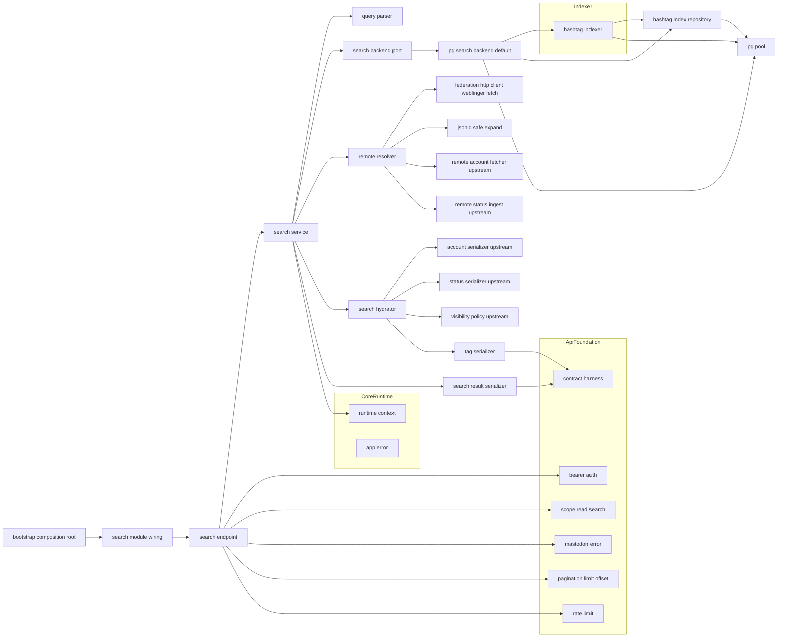
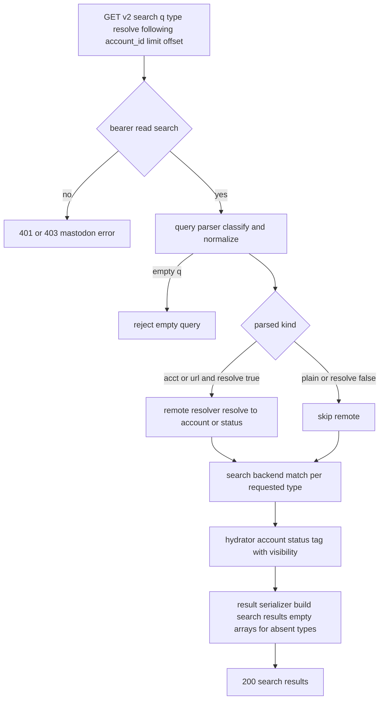
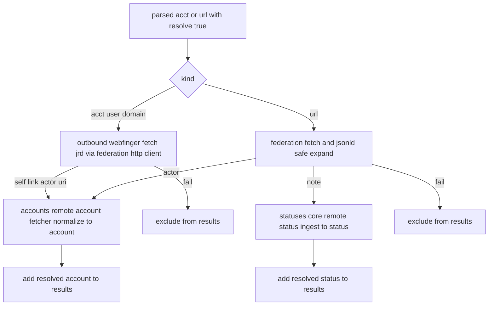
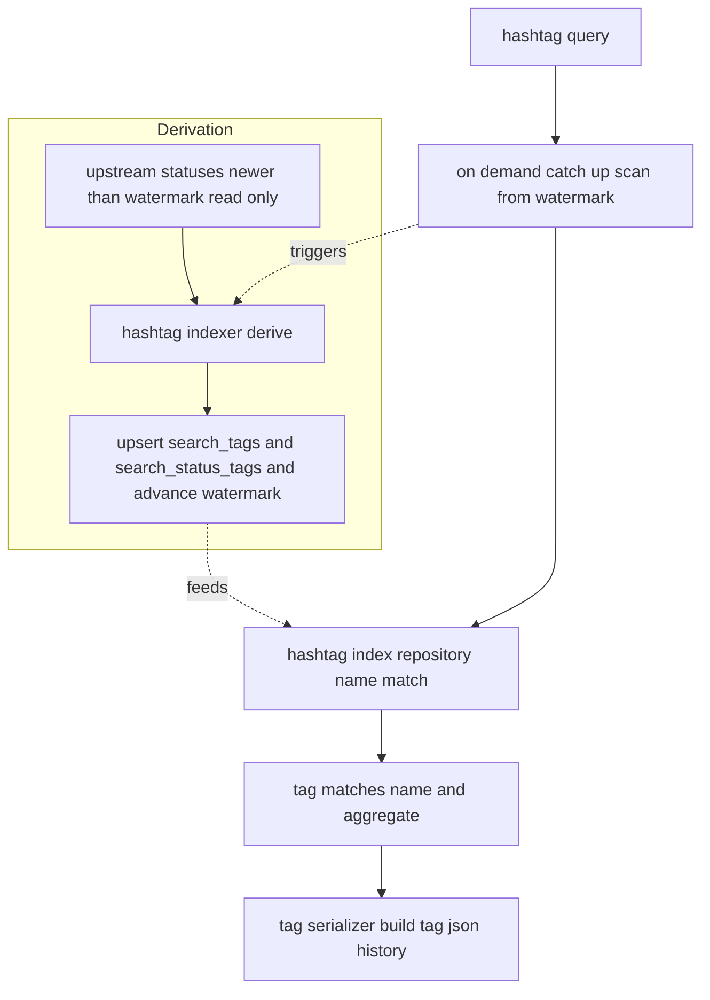

# Design Document

## Overview

**Purpose**: search は、標準クライアント（Ivory・Elk・Phanpy 等）が前提とする検索（アカウント・投稿・ハッシュタグ）を Mastodon 互換 API（`GET /api/v2/search`）として提供する。本 spec の中核は「検索照合を `SearchBackend` 抽象ポートの背後に隔離し、呼び出し側・API 契約を特定エンジン実装に依存させない」ことと、「初期は標準 PostgreSQL の最小実装で配布の簡単さ（拡張不要）を保ちつつ、`pg_bigm` 等の日本語拡張や将来エンジンを後付けマイグレーション + バックエンド差し替えで導入できる経路を確保する」ことである。

**Users**: 標準クライアントのユーザーが本 spec を通じてアカウント/投稿/ハッシュタグを横断検索し、`acct:user@domain` や URL でリモート対象を解決する。将来 spec（日本語検索強化）の実装者は、`SearchBackend` ポートの新実装を配線点で差し替えるだけで、API 契約・結果組み立てを変えずに検索品質を置換できる。

**Impact**: core-runtime のランタイム土台、api-foundation の横断土台（Bearer/`read:search` スコープ/エラー/ページネーション/`X-RateLimit-*`/契約ハーネス）、accounts-and-instance（Account 契約・アカウント解決・リモート正規化）、statuses-core（Status 契約・可視性判定・可視投稿解決）、federation-core（WebFinger 用 `FederationHttpClient`・JSON-LD 安全展開・`ActorUrls`）、actor-model（`ActorDirectory`）の上に、検索モジュール群 `src/search/` とハッシュタグ読み取りインデックスの永続テーブル（`migrations/0010_search.sql`）を追加する。検索照合は `SearchBackend` ポートの背後、エンティティ具体化は上流シリアライザの消費に分離し、契約の再定義を構造的に避ける。

### Goals

- `GET /api/v2/search` を Mastodon 互換で提供し、`accounts` / `statuses` / `hashtags` を含む SearchResults を返す。
- 検索照合を `SearchBackend` ポートに隔離し、標準 PostgreSQL 最小実装 `PgSearchBackend` を既定配線、将来差し替えを呼び出し側非依存にする。
- Account / Status 契約を再定義せず、上流シリアライザを消費して結果を具体化する。Tag 契約とハッシュタグ読み取りインデックスのみ本 spec が所有。
- 投稿検索を閲覧者の可視性に閉じ、不可視投稿を漏らさない（statuses-core 可視性へ委譲）。
- `acct:`/URL のリモート解決を WebFinger（federation-core）と上流正規化へ委譲し、`resolve=true` かつ認証済みに限定して提供する。
- `pg_bigm` 等を必須化せず、後付けの独立マイグレーション経路を設計上確保する。

### Non-Goals

- trends（流行ハッシュタグ）・suggestions（おすすめアカウント）等のディスカバリ（別 spec / stub）。
- `pg_bigm` 等の日本語拡張の**必須化**、外部検索エンジンの導入（任意・将来 `SearchBackend` 実装としてのみ）。
- Account / Status / Poll / CustomEmoji エンティティ契約そのものの定義（accounts-and-instance / statuses-core 所有。本 spec は消費）。
- tag タイムライン・featured_tags・フォロー対象ハッシュタグ管理（timelines / 別 spec）。
- 認証・スコープ・エラー・ページネーション・レート制限・契約ハーネス基盤（api-foundation）。WebFinger ハンドラ・連合取得配管そのもの（federation-core）。

## Boundary Commitments

### This Spec Owns

- `GET /api/v2/search` の HTTP 表層（`read:search` 要求・パラメータ解釈・応答コード規律）と SearchResults の組み立て。
- SearchResults（`accounts`/`statuses`/`hashtags`）と Tag エンティティ（検索結果用最小契約 `name`/`url`/`history`）の JSON シリアライズと api-foundation 契約ハーネスへのゴールデン登録。
- 検索の抽象境界 `SearchBackend` ポートの**定義**と、標準 PostgreSQL 最小実装 `PgSearchBackend`、およびモック/スタブ実装。
- 検索クエリの解析（プレーン語 / `acct:user@domain`・`@user@domain` / URL の判別と正規化）。
- `acct:`/URL リモート解決の**オーケストレーション**（種別判定・アウトバウンド WebFinger 照会の起点・上流取得への委譲・失敗時の結果除外）。
- ハッシュタグ読み取りインデックス（`search_tags` / `search_status_tags`）の所有・upstream 投稿データからの導出・更新と、本 spec 所有テーブルのマイグレーション（0010）。
- 検索結果の具体化オーケストレーション（識別子 → 上流シリアライザ消費 → 可視性適用 → 一意化）。

### Out of Boundary

- Account / Status エンティティ契約・シリアライズ実体（accounts-and-instance / statuses-core が供給。本 spec は消費）。
- 可視性判定の実体（statuses-core `VisibilityPolicy`）。フォロー関係状態の実体（social-graph 供給、accounts-and-instance 経由）。
- リモートアカウントの取得・正規化・キャッシュ実体（accounts-and-instance `RemoteAccountFetcher`）。リモート投稿の取り込み実体（statuses-core の公開 `StatusIngestService`: ingest-by-document/URL エントリポイント。本 spec は呼ぶだけで取り込み実体は再実装しない）。
- WebFinger ハンドラ・`FederationHttpClient`・JSON-LD 安全展開・`ActorUrls` の実装（federation-core）。
- OAuth/スコープ/エラー本文/ページネーション/レート制限/契約ハーネス基盤（api-foundation）。アクター解決・署名鍵（actor-model）。起動/設定/DI/マイグレーション基盤（core-runtime）。
- trends / suggestions / tag タイムライン / 日本語拡張の必須化 / 外部検索エンジン。

### Allowed Dependencies

- core-runtime: `AppState` / `RuntimeContext`（`Clock` / `IdGenerator`）/ `PgPool` / `AppError` / 構造化ログ / マイグレーション基盤 / テストハーネス（`spawn_test_app`）。
- api-foundation: Bearer 認証（`RequestActorContext`・`authenticate` / `require_scope`）/ `Scope`（`read:search` の内包判定）/ `MastodonError` / ページネーション（`PageParams` / `build_link_header`・`limit`/`offset`）/ `X-RateLimit-*` レイヤー / 契約ハーネス（`assert_golden` / `register_fixture`）。
- accounts-and-instance: Account シリアライズ（複数 ID 一括含む）/ `AccountService` のローカル・既知リモート解決 / `RemoteAccountFetcher.fetch_and_normalize(actor_uri)` / `AccountRef`（ローカル/リモート識別）。
- statuses-core: Status シリアライズ / `VisibilityPolicy`（可視判定）/ 可視投稿の解決（ID 群 → 可視 Status）/ リモート投稿取り込み経路。
- federation-core: `FederationHttpClient.fetch`（アウトバウンド WebFinger JRD 取得・連合取得）/ JSON-LD 安全展開 / `ActorUrls`。
- actor-model: `ActorDirectory`（ローカルアクター参照、owner 非露出）。
- 下流仕様（日本語検索強化・代替エンジン）を本 spec に持ち込まない（`SearchBackend` ポート背後に置く）。

### Revalidation Triggers

- SearchResults / Tag の JSON 契約（フィールド・型・空配列規律）の変更。
- `SearchBackend` ポートのシグネチャ・返却識別子契約（`AccountRef` / Status `Id` / タグ）・既定配線規約の変更。
- ハッシュタグ読み取りインデックス（`search_tags` / `search_status_tags`）のスキーマ・導出規約の変更。
- `GET /api/v2/search` のパラメータ・スコープ・応答コードの変更。
- マイグレーション番号規約・本 spec 所有テーブルのスキーマ変更。
- 上流契約の変更（api-foundation の Bearer/Scope/MastodonError/Pagination/Harness、accounts-and-instance の Account シリアライズ/`RemoteAccountFetcher`/`AccountRef`、statuses-core の Status シリアライズ/`VisibilityPolicy`/可視投稿解決、federation-core の `FederationHttpClient`/JSON-LD/`ActorUrls`、actor-model の `ActorDirectory`、core-runtime の `AppState`/`RuntimeContext`）。
- statuses-core が第一級の tags 問い合わせ境界を公開した場合（本 spec の読み取りインデックスを置換）/ federation-core がアウトバウンド WebFinger リゾルバを公開した場合（本 spec の薄い照会を置換）。
- `PgSearchBackend` が生 SQL で直接参照する upstream カラム（`account_profiles.display_name`、`remote_accounts.username`/`domain`/`display_name`、`statuses.content`/`created_at`/`id`。Logical Data Model の「`PgSearchBackend` が依存する upstream カラム」参照）のカラム名・型を accounts-and-instance / statuses-core が変更した場合、本 spec の SQL の再検証が必要。

## Architecture

### Architecture Pattern & Boundary Map

選択パターン: **Ports & Adapters（検索照合をポートに外出し）+ 結果具体化サービス（上流シリアライザ消費）+ core-runtime Composition Root 配線**。横断関心（Bearer/`read:search`・エラー・ページネーション・レート制限）は api-foundation の既存実装に「乗るだけ」。検索照合は `SearchBackend` ポート（標準 PostgreSQL 既定実装）に隔離し、識別子のみを返す。エンティティ具体化（Account/Status/Tag 構築・可視性適用）はポートの外の `SearchHydrator` が上流シリアライザを消費して行う。`acct:`/URL のリモート解決は `RemoteResolver` がオーケストレーションし実体取得を上流へ委譲する。依存方向は一方向（左→右、上位は下位のみ参照）。



**Architecture Integration**:
- Selected pattern: Ports & Adapters + 具体化サービス。照合（エンジン依存）を `SearchBackend` に、表現（上流契約依存）を `SearchHydrator`/シリアライザに直交分離。
- Domain/feature boundaries: クエリ解析・照合ポート・既定 PG 実装・リモート解決・結果具体化・Tag/結果シリアライズ・ハッシュタグインデックスを分離。
- Existing patterns preserved: api-foundation「乗るだけ」、accounts-and-instance/federation-core「委譲境界・上流消費」、core-runtime「Composition Root」「決定性」「`AppError`」、steering「検索の抽象境界」「契約の集約（再定義回避）」「レイヤー分離」。
- New components rationale: 各コンポーネントは Boundary Commitments の 1 関心に 1:1 対応。`SearchBackend` は brief の最重要制約（呼び出し側非依存・差し替え可能）に直接対応。
- Steering compliance: 外部検索エンジン/必須拡張に非依存（標準 PostgreSQL）、決定性（時刻/ID は `RuntimeContext`、`FederationHttpClient`/`SearchBackend` はモック可能）、可観測性（検索失敗の診断）、一次情報は Mastodon 実レスポンス（SearchResults/Tag ゴールデン固定）。

### Technology Stack

| Layer | Choice / Version | Role in Feature | Notes |
|-------|------------------|-----------------|-------|
| Backend / Services | Rust (edition 2021) + axum 0.7 系 | `/api/v2/search` エンドポイント・検索サービス | core-runtime クレートに `src/search/` を追加 |
| Middleware | api-foundation の tower レイヤー/抽出器 | Bearer 認証・`read:search`・エラー変換・レート制限・ページネーション再利用 | 新規ミドルウェアは作らない |
| Data / Storage | PostgreSQL + sqlx 0.7 系 | ハッシュタグ読み取りインデックス・標準 SQL 照合（upstream 投稿/アカウントを read-only 参照） | 既存 `PgPool` を共有。`pg_bigm` 等は任意・後付け |
| Search abstraction | `SearchBackend` port + `PgSearchBackend`（標準 PostgreSQL） | 照合の抽象境界・既定最小実装・差し替え点 | モック可能。将来エンジンは新実装で差し替え |
| Federation access | federation-core `FederationHttpClient` / JSON-LD 安全展開 / `ActorUrls` | アウトバウンド WebFinger 照会・連合取得 | port 背後でモック可能 |
| Upstream serialization | accounts-and-instance Account シリアライズ / statuses-core Status シリアライズ・`VisibilityPolicy` | 結果具体化・可視性適用 | 契約を再定義せず消費 |
| Serialization | serde / serde_json | SearchResults / Tag JSON 契約 | 決定的ゴールデン |
| Test | core-runtime `spawn_test_app` + api-foundation 契約ハーネス | 統合 / 契約テスト | 決定的 `RuntimeContext` 上で再現 |

> バージョンは系列の目安。実装時に最新互換版へ固定する。選定理由・代替比較は `research.md` 参照。

## File Structure Plan

### Directory Structure

```
migrations/
└── 0010_search.sql              # search_tags / search_status_tags（0001-0009 と非衝突。0003=api-foundation(oauth) / 0008=federation-core の確定連番。研究ログ「Migration Numbering Coordination」参照）

src/
└── search/
    ├── mod.rs                    # SearchModule 組み立て（サービス/バックエンド/リゾルバ/シリアライザ/インデクサのハンドル束ね）と公開・ルータ装着点
    ├── model.rs                  # SearchParams, SearchType, ParsedQuery(Plain/Acct/Url), SearchMatches(AccountRef[]/StatusId[]/TagMatch[]), TagView ドメイン型
    ├── query_parser.rs          # QueryParser（q を Plain / Acct(user,domain) / Url に判別・正規化、空クエリ検出）
    ├── ports.rs                  # SearchBackend trait（search_accounts / search_statuses / search_hashtags、識別子のみ返す）+ 既定/モックの差し替え規約
    ├── pg_backend.rs            # PgSearchBackend（標準 PostgreSQL 最小実装。識別子部分一致・本文可視範囲一致・ハッシュタグ名一致）
    ├── hashtag_repository.rs     # HashtagIndexRepository（search_tags / search_status_tags の read/upsert・名前一致クエリ・history 取得）
    ├── hashtag_indexer.rs        # HashtagIndexer（upstream 投稿データから search_tags/search_status_tags を導出・バックフィル/更新）
    ├── remote_resolver.rs        # RemoteResolver（acct: のアウトバウンド WebFinger 照会→actor_uri、URL 連合取得、上流取得/正規化への委譲、失敗時除外）
    ├── hydrator.rs               # SearchHydrator（AccountRef→Account JSON / StatusId→可視 Status JSON / TagMatch→Tag JSON、一意化）
    ├── tag_serializer.rs         # TagSerializer（Tag JSON 契約・ゴールデン登録）
    ├── result_serializer.rs      # SearchResultSerializer（SearchResults JSON 組み立て・空配列規律・ゴールデン登録）
    ├── service.rs               # SearchService（解析→（任意）リモート解決→バックエンド照合→具体化→組み立て、type/limit/offset/resolve/following/account_id 適用）
    └── endpoint.rs              # GET /api/v2/search ハンドラ（read:search 要求・パラメータ抽出・応答コード規律）

tests/
├── search_contract_it.rs        # SearchResults / Tag ゴールデン（決定的・空配列規律・Account/Status 埋め込み形）（契約）
├── search_accounts_it.rs        # アカウント検索（ローカル/既知リモート一致・following 絞り・一意化・limit/offset）（統合, SearchBackend 実体）
├── search_statuses_it.rs        # 投稿検索（可視性に閉じる・account_id 絞り・不可視除外・limit/offset・オーバーフェッチ後の limit 切り詰め）（統合）
├── search_hashtags_it.rs        # ハッシュタグ検索（名前一致・インデックス導出・exclude_unreviewed 受理）（統合）
├── search_resolve_it.rs         # acct:/URL リモート解決（resolve=true 認証時のみ・WebFinger モック・取得失敗除外）（統合, FederationHttpClient モック）
├── search_type_scope_it.rs      # type 絞り込み・空クエリ拒否・read:search 認証/スコープ・空配列規律（統合）
└── search_backend_swap_it.rs    # SearchBackend をスタブ実装へ差し替えても呼び出し側/結果組み立てが不変（統合）
```

### Modified Files

- `src/state.rs`（core-runtime）— `AppState` に `SearchModule`（`SearchService`・`SearchBackend` ハンドル・インデクサ）を追加。
- `src/bootstrap.rs`（core-runtime）— プール・api-foundation・accounts-and-instance・statuses-core・federation-core モジュール構築後に `SearchModule` を組み立て、既定 `PgSearchBackend` を `SearchBackend` として配線、ハッシュタグインデクサを初期化し `AppState` に格納。
- `src/server.rs`（core-runtime）— ルータに `/api/v2/search` を mount し、api-foundation の横断レイヤー（認証・エラー・レート制限）適用点に乗せる。

> 各ファイルは単一責務。照合（pg_backend/ports）・具体化（hydrator/シリアライザ）・リモート解決（remote_resolver）・ハッシュタグインデックス（hashtag_*）・解析（query_parser）を分離し、core-runtime の Composition Root へ一方向に配線する。

## System Flows

### 統一検索（解析→照合→具体化→組み立て）



`type` 指定時は対象種別のみ照合し他種別は空配列（2.2）。空クエリは拒否（2.3）。`resolve=true` かつ認証時のみリモート解決（6.1, 6.5）。照合は `SearchBackend`、具体化は上流シリアライザ消費（7.1, 7.2, 1.2）。投稿検索は `PgSearchBackend` が事後可視性フィルタを見込んでオーバーフェッチし、`Hydrator` が可視性適用後に要求 `limit` へ切り詰める（4.6、ベストエフォートの緩和策でありページが稀に `limit` 未満になり得ることを許容する）。

### `acct:` / URL リモート解決（オーケストレーション委譲）



`acct:` は WebFinger JRD の `self`（activity+json）から actor_uri を得て accounts-and-instance で正規化（6.1）。URL は連合取得で Account/Status へ（6.2）。取得/正規化失敗は結果から除外しエンドポイントは正常応答（6.4）。未認証はこの経路に入らない（6.5, 5.x の `resolve=false` 相当）。

### ハッシュタグ照合と読み取りインデックス導出



照合は本 spec 所有の `search_tags`/`search_status_tags` に対して行う（5.1）。インデックスは upstream 投稿の保持タグから read-only 導出し、ハッシュタグ検索リクエストの先頭で watermark（最終処理済み `statuses.created_at`/`id`）以降の新規投稿をオンデマンドでキャッチアップスキャンして更新する（新規投稿取り込み時のフック/通知には依存しない、5.3）。`history` は最小集計で開始（1.3）。

## Requirements Traceability

| Requirement | Summary | Components | Interfaces | Flows |
|-------------|---------|------------|------------|-------|
| 1.1–1.5 | SearchResults/Tag 契約・上流契約消費・空配列規律・ゴールデン | SearchResultSerializer, TagSerializer, SearchHydrator | build_search_results(), build_tag() | 統一検索（組み立て） |
| 2.1–2.5 | search v2・read:search・type 絞り・空クエリ拒否・limit | SearchEndpoint, SearchService, QueryParser | search() | 統一検索 |
| 3.1–3.5 | アカウント検索・Account 消費・following・limit/offset・一意化 | SearchBackend, PgSearchBackend, SearchHydrator | search_accounts() | 統一検索 |
| 4.1–4.6 | 投稿検索・可視性に閉じる・account_id・標準 PG・縮退許容・limit/offset | SearchBackend, PgSearchBackend, SearchHydrator(VisibilityPolicy 消費) | search_statuses() | 統一検索 |
| 5.1–5.5 | ハッシュタグ検索・Tag 表現・インデックス導出・exclude_unreviewed・limit/offset | SearchBackend, HashtagIndexRepository, HashtagIndexer, TagSerializer | search_hashtags(), derive_index() | ハッシュタグ照合 |
| 6.1–6.5 | acct:/URL 解決・WebFinger・上流委譲・失敗除外・認証限定 | RemoteResolver, FederationHttpClient(消費), RemoteAccountFetcher(消費) | resolve_remote() | リモート解決 |
| 7.1–7.5 | 抽象境界・識別子返却・既定 PG 配線・差し替え・モック可能 | SearchBackend(ports), PgSearchBackend, SearchModule(wiring) | trait SearchBackend | 統一検索・配線 |
| 8.1–8.4 | 拡張不要・非衝突マイグレーション・後付け経路・API 不変 | Migration(0010), PgSearchBackend, SearchEndpoint | （スキーマ・配線） | （配線/マイグレーション） |
| 9.1–9.5 | 認証/スコープ・エラー・ページネーション・レート制限・診断 | SearchEndpoint, Bearer/Scope/MastodonError/Pagination/RateLimit(参照), SearchService | search() | 全フロー横断 |

## Components and Interfaces

| Component | Domain/Layer | Intent | Req Coverage | Key Dependencies (P0/P1) | Contracts |
|-----------|--------------|--------|--------------|--------------------------|-----------|
| model | Search Domain | 検索パラメータ・解析クエリ・照合結果・Tag のドメイン型 | 1,2,3,4,5,7 | core-runtime Id/時刻型, accounts AccountRef (P0) | State |
| QueryParser | Search Domain | q を Plain/Acct/Url に判別・正規化・空検出 | 2,6 | model (P0) | Service |
| SearchBackend(ports) | Search Port | 照合の抽象境界（識別子のみ返す）+ 差し替え規約 | 7 | model (P0) | Service |
| PgSearchBackend | Search Adapter | 標準 PostgreSQL 最小照合（既定実装） | 3,4,5,7,8 | PgPool, HashtagIndexRepository (P0) | Service |
| HashtagIndexRepository | Data | search_tags/search_status_tags の read/upsert・名前一致 | 5 | PgPool (P0) | Service, State |
| HashtagIndexer | Service | upstream 投稿タグから読み取りインデックス導出 | 5 | HashtagIndexRepository, PgPool(read-only upstream) (P0) | Service, Batch |
| RemoteResolver | Service | acct:/URL 解決のオーケストレーション・上流委譲・失敗除外 | 6 | FederationHttpClient, JsonLd, RemoteAccountFetcher, StatusIngestService (P0) | Service |
| SearchHydrator | Service | 識別子→Account/Status(可視)/Tag 具体化・一意化 | 1,3,4,5 | AccountSerializer(上流), StatusSerializer+VisibilityPolicy(上流), TagSerializer (P0) | Service |
| TagSerializer | Serialization | Tag JSON 契約・ゴールデン | 1,5 | Harness (P1) | Service |
| SearchResultSerializer | Serialization | SearchResults JSON 組み立て・空配列規律・ゴールデン | 1 | TagSerializer, Harness (P0/P1) | Service |
| SearchService | Service | 解析→（任意）解決→照合→具体化→組み立ての業務集約 | 2,3,4,5,6,7,9 | QueryParser, SearchBackend, RemoteResolver, SearchHydrator, SearchResultSerializer, RuntimeContext (P0) | Service |
| SearchEndpoint | API | /api/v2/search HTTP 表層・read:search・応答コード | 2,9 | SearchService, Bearer, Scope, MastodonError, Pagination (P0) | API |
| SearchModule(wiring) | Runtime | 配線（既定 PgSearchBackend 配線・インデクサ初期化・ルータ装着・AppState 格納） | 7,8,9 | core-runtime bootstrap (P0) | Service |

依存方向（左→右、上位は下位のみ参照）: `model → QueryParser / SearchBackend(ports) / HashtagIndexRepository → PgSearchBackend / HashtagIndexer / TagSerializer → RemoteResolver / SearchHydrator / SearchResultSerializer → SearchService → SearchEndpoint → SearchModule wiring`。

### Search Domain / ドメイン層

#### model / QueryParser

| Field | Detail |
|-------|--------|
| Intent | 検索パラメータ・解析済みクエリ・照合結果・Tag のドメイン型を定義し、q を種別判別・正規化する |
| Requirements | 2.1, 2.2, 2.3, 6.1, 6.2, 1.3 |

**Responsibilities & Constraints**
- `SearchParams` は `q` / `type`（`Option<SearchType>`）/ `resolve` / `following` / `account_id` / `limit` / `offset` / `exclude_unreviewed`（受理用）/ `viewer`（認証アクター）を保持（2.1, 2.2, 2.5）。
- `ParsedQuery` は `Plain(String)` / `Acct{ user, domain }` / `Url(String)` の 3 値。`QueryParser` が `acct:user@domain`・`@user@domain`・URL（スキーム付き）・プレーン語を判別し正規化、空/空白のみは検出してエラーにする（2.3, 6.1, 6.2）。
- `SearchMatches` は照合結果（`accounts: Vec<AccountRef>` / `statuses: Vec<Id>` / `hashtags: Vec<TagMatch>`）。エンティティ JSON は持たない（7.2）。
- `TagView` は Tag 契約の論理表現（`name` / `url` / `history`）。`history` は最小集計（または空）。

**Dependencies**
- Inbound: 全検索コンポーネント (P0)
- Outbound: core-runtime Id/時刻型, accounts-and-instance `AccountRef` (P0)

**Contracts**: State [x] / Service [x]

##### 型定義（抜粋）
```rust
pub enum SearchType { Accounts, Statuses, Hashtags }
pub struct SearchParams {
    pub q: String, pub kind: Option<SearchType>, pub resolve: bool, pub following: bool,
    pub account_id: Option<Id>, pub limit: u32, pub offset: u32, pub exclude_unreviewed: bool,
    pub viewer: Id,            // read:search は認証必須のため viewer は常に存在
}
pub enum ParsedQuery { Plain(String), Acct { user: String, domain: String }, Url(String) }
pub struct TagMatch { pub name: String }
pub struct TagHistoryEntry { pub day: String, pub uses: String, pub accounts: String }
pub struct TagView { pub name: String, pub url: String, pub history: Vec<TagHistoryEntry> }
pub struct SearchMatches { pub accounts: Vec<AccountRef>, pub statuses: Vec<Id>, pub hashtags: Vec<TagMatch> }
pub fn parse_query(q: &str) -> Result<ParsedQuery, AppError>; // 空/空白は AppError(422)
```
- Invariants: `limit`/`offset` は api-foundation 規約で丸め済み。`SearchMatches` は識別子のみ（JSON 非保持）。

### Search Port / 照合境界層

#### SearchBackend(ports) / PgSearchBackend

| Field | Detail |
|-------|--------|
| Intent | 検索照合を抽象ポートに隔離し、標準 PostgreSQL の既定実装を提供する |
| Requirements | 3.1, 4.1, 4.4, 4.5, 5.1, 7.1, 7.2, 7.3, 7.4, 7.5, 8.1 |

**Responsibilities & Constraints**
- `SearchBackend` は種別ごとに照合し**識別子のみ**返す（7.2）。エンティティ JSON 構築・可視性適用はポート外（7.1）。本 spec は port の定義と既定/モック実装を所有、将来エンジンは新実装で差し替え（7.3, 7.4, 7.5）。
- `PgSearchBackend`（既定）:
  - `search_accounts`: ローカルアクター（`ActorDirectory`/`account_profiles`）と既知リモート（`remote_accounts`）に対し display_name/username/acct の部分一致（標準 SQL、`ILIKE`）で `AccountRef` 群を返す。`following` は照合段では候補抽出に留め、フォロー限定は Hydrator/上流関係に委譲（3.1, 3.3）。
  - `search_statuses`: 閲覧者可視候補の投稿 `Id` 群を標準 SQL で抽出（本文部分一致）。`account_id` 指定時は当該アカウントに限定。最終可視性は Hydrator が `VisibilityPolicy` で再適用（4.1, 4.2, 4.3, 4.4, 4.5）。**オーバーフェッチ規約**: `search_statuses` は Hydrator の事後可視性フィルタで縮む分を吸収するため、SQL 上の `LIMIT` に要求 `limit` そのものではなく `limit` に固定マージンまたは倍率を加えたオーバーフェッチ件数（実装定数、例: `limit * 2` または `limit + 固定マージン` のいずれか大きい方）を用いる。`OFFSET` は要求 `offset` をそのまま用いる（オーバーフェッチはページ境界=`offset` を動かさない）。返却件数はオーバーフェッチ件数以下で `limit` を超えうる（切り詰めは Hydrator 側の責務）。
  - `search_hashtags`: `HashtagIndexRepository` の名前一致で `TagMatch` を返す（5.1）。
  - すべて `limit`/`offset` を SQL に反映（3.4, 4.6, 5.5）。ただし `search_statuses` は上記オーバーフェッチ規約に従い SQL `LIMIT` に要求 `limit` を超える値を用いる。外部エンジン・必須拡張に依存しない（4.4, 8.1）。
- 日本語本文の縮退は許容し、将来差し替えで拡張可能に保つ（4.5）。

**Dependencies**
- Inbound: SearchService (P0)
- Outbound: PgPool, HashtagIndexRepository, （read-only）upstream account/status データ (P0)

**Contracts**: Service [x]

##### Service Interface
```rust
pub struct AccountQuery { pub term: String, pub following_of: Option<Id>, pub limit: u32, pub offset: u32 }
pub struct StatusQuery { pub term: String, pub viewer: Id, pub account_id: Option<Id>, pub limit: u32, pub offset: u32 }
pub struct HashtagQuery { pub term: String, pub limit: u32, pub offset: u32 }

pub trait SearchBackend: Send + Sync {
    async fn search_accounts(&self, q: &AccountQuery) -> Result<Vec<AccountRef>, AppError>;
    async fn search_statuses(&self, q: &StatusQuery) -> Result<Vec<Id>, AppError>;       // 可視候補の識別子
    async fn search_hashtags(&self, q: &HashtagQuery) -> Result<Vec<TagMatch>, AppError>;
}
// 既定: PgSearchBackend（標準 PostgreSQL） / テスト: StubSearchBackend
```
- Postconditions: 返却は識別子のみ。`search_statuses` は可視候補に限定（最終可視は Hydrator が再適用）。`search_statuses` の返却件数は要求 `limit` ちょうどではなく、上記オーバーフェッチ規約により `limit` を上回りうる（Hydrator が事後フィルタ後に `limit` へ切り詰める前提、4.6）。これは事後の可視性除外を吸収するためのベストエフォートの緩和策であり、除外件数がオーバーフェッチ分を上回る場合はページが `limit` 件に満たないことを許容する（4.5 の標準 PG 縮退許容と同じリスク許容に整合、ハードな保証ではない）。同一実装差し替えで `SearchService` を変更不要（7.4）。

### Data / データ層

#### HashtagIndexRepository / HashtagIndexer

| Field | Detail |
|-------|--------|
| Intent | ハッシュタグ読み取りインデックスの保持・名前一致照合と、upstream 投稿タグからの導出 |
| Requirements | 5.1, 5.2, 5.3, 8.2 |

**Responsibilities & Constraints**
- `HashtagIndexRepository`: `search_tags`（正規化名・url 構築元・使用集計）と `search_status_tags`（status_id↔tag）に対し、名前の前方/部分一致で `TagMatch` を返し、`TagView` の `history` 用の最小集計を提供（5.1, 5.2）。read/upsert に加え、導出カーソル（最終処理済み `statuses.created_at`/`id` の watermark）の read/upsert を提供する。
- `HashtagIndexer`: statuses-core の投稿保持データ（抽出済みハッシュタグ）から read-only で `search_tags`/`search_status_tags` を導出・upsert する。差分更新のトリガーは upstream からの通知/フック（statuses-core は投稿取り込みイベントを公開しない）に依存せず、**watermark カーソル方式のオンデマンドキャッチアップスキャン**で行う: 保持している watermark（最終処理済み `statuses.created_at`/`id`）より新しい `statuses` 行を read-only で走査し、抽出済みタグを `search_tags`/`search_status_tags` へ upsert したのち watermark を進める。watermark 未保持時（初回）は全件走査となり、これがバックフィルを兼ねる（5.3）。
  - 実行タイミング: ハッシュタグ検索リクエストの先頭で本キャッチアップスキャンをオンデマンド実行し、常に検索直前までのタグ状態で照合する。追加のスケジューラ/バックグラウンドジョブ基盤を新設しない最小実装とする。将来、運用上の要求があれば同一手続きを周期実行するバックグラウンドスキャンとして追加してもよいが、本 spec の必須要件ではない。
  - 時刻/ID は `RuntimeContext`。
- upstream→downstream の通知（イベント/フック）に依存しない（read-only 導出、watermark カーソルによる自己完結的なキャッチアップ）。statuses-core が第一級 tags 問い合わせ境界を公開したら本導出機構を置換（Revalidation Trigger）。

**Contracts**: Service [x] / State [x] / Batch [x]

##### Service Interface
```rust
pub async fn match_hashtags(pool: &PgPool, term: &str, limit: u32, offset: u32) -> Result<Vec<TagView>, AppError>;
pub async fn upsert_tag_usage(pool: &PgPool, name: &str, status_id: Id, now: OffsetDateTime) -> Result<(), AppError>;
pub async fn load_watermark(pool: &PgPool) -> Result<Option<(OffsetDateTime, Id)>, AppError>; // 最終処理済み statuses.created_at/id（未保持ならバックフィル扱い）
pub async fn save_watermark(pool: &PgPool, created_at: OffsetDateTime, status_id: Id) -> Result<(), AppError>;
pub async fn catch_up_from_watermark(pool: &PgPool, now: OffsetDateTime) -> Result<u64, AppError>; // watermark より新しい statuses を read-only 走査し導出・upsert・watermark 更新（初回は全走査＝バックフィル相当）
```
- Postconditions: `match_hashtags` は本 spec 所有テーブルのみ参照。`catch_up_from_watermark` は upstream を変更しない（read-only）。watermark は本 spec 所有テーブルに保持する。ハッシュタグ検索は `catch_up_from_watermark` 実行後に `match_hashtags` を呼ぶ（オンデマンドキャッチアップ、5.3）。

### Service / サービス層

#### RemoteResolver

| Field | Detail |
|-------|--------|
| Intent | `acct:`/URL を解決対象として判定し、WebFinger 照会と上流取得へ委譲して Account/Status を得る |
| Requirements | 6.1, 6.2, 6.3, 6.4, 6.5 |

**Responsibilities & Constraints**
- `acct:user@domain`: `https://domain/.well-known/webfinger?resource=acct:user@domain` を `FederationHttpClient.fetch` で取得し、JRD の `self`（`type=application/activity+json`）から actor_uri を抽出 → accounts-and-instance `RemoteAccountFetcher.fetch_and_normalize(actor_uri)` で Account 化（6.1）。
- URL: `FederationHttpClient.fetch` + JSON-LD 安全展開で種別判定し、アクターは正規化、Note は statuses-core 取り込み経路で Status 化（6.2）。
- `resolve=false`/未認証はこの経路を呼ばない（6.3, 6.5）。取得/正規化/解析失敗は対象を返さず（None）、上位は結果から除外しエンドポイントは正常応答（6.4）。

**Contracts**: Service [x]

##### Service Interface
```rust
pub enum Resolved { Account(AccountRef), Status(Id), None }
pub async fn resolve_remote(&self, parsed: &ParsedQuery, viewer: Id) -> Result<Resolved, AppError>; // 失敗は Resolved::None に正規化
```
- Postconditions: 失敗は呼び出し側で除外可能な形（`None`）に正規化し、検索全体を失敗させない（6.4）。

#### SearchHydrator

| Field | Detail |
|-------|--------|
| Intent | 照合識別子を上流シリアライザで Account/Status(可視)/Tag に具体化し、結果を一意化する |
| Requirements | 1.2, 3.2, 3.5, 4.2, 5.2 |

**Responsibilities & Constraints**
- `AccountRef` 群を accounts-and-instance の Account シリアライズ（複数 ID 一括）で Account JSON 化（1.2, 3.2）。重複 `AccountRef` を一意化（3.5）。
- Status `Id` 群を statuses-core の可視投稿解決 + Status シリアライズで具体化し、`VisibilityPolicy` で閲覧者不可視を除外（1.2, 4.2）。`PgSearchBackend.search_statuses` はオーバーフェッチした候補（`limit` 超過あり）を渡すため、可視性フィルタ適用後に要求 `limit` 件まで切り詰めて返す（4.6）。オーバーフェッチはベストエフォートの緩和策であり、除外件数が多い場合は切り詰め前の件数が `limit` に満たないことがある（その場合はそのまま返す。ハードな保証ではない）。
- `TagMatch` を `HashtagIndexRepository` の `TagView` 経由で `TagSerializer` により Tag JSON 化（5.2）。
- `following=true` の最終フィルタはフォロー関係（social-graph 供給、accounts-and-instance 経由）に委ね、Hydrator で適用（3.3）。

**Contracts**: Service [x]

##### Service Interface
```rust
pub async fn hydrate_accounts(&self, refs: &[AccountRef], viewer: Id, following_only: bool) -> Result<Vec<serde_json::Value>, AppError>;
pub async fn hydrate_statuses(&self, ids: &[Id], viewer: Id, limit: u32) -> Result<Vec<serde_json::Value>, AppError>; // 不可視除外 + limit へ切り詰め
pub async fn hydrate_hashtags(&self, tags: &[TagMatch]) -> Result<Vec<serde_json::Value>, AppError>;
```
- Invariants: `hydrate_statuses` は viewer から不可視の投稿を返さない（4.2）。返却件数は `limit` を超えない（`PgSearchBackend` のオーバーフェッチ規約に対応する切り詰め、4.6。ベストエフォートのため `limit` 未満になることは許容する）。出力は決定的（ゴールデン再現）。

#### SearchService

| Field | Detail |
|-------|--------|
| Intent | 検索の業務を集約する（解析→任意のリモート解決→バックエンド照合→具体化→組み立て） |
| Requirements | 2.1, 2.2, 2.3, 2.5, 3.1, 3.3, 3.4, 4.1, 4.3, 4.6, 5.1, 5.4, 5.5, 6.1, 6.3, 7.1 |

**Responsibilities & Constraints**
- `QueryParser` で解析し空クエリは 422（2.3）。`type` 指定時は対象種別のみ照合、他種別は空配列（2.2）。`limit`/`offset` を各 `*Query` に渡す（2.5, 3.4, 4.6, 5.5）。投稿検索では `PgSearchBackend` がオーバーフェッチした候補を受け取り、`Hydrator.hydrate_statuses` へ要求 `limit` を渡して事後可視性フィルタ後に切り詰めさせる（4.6、オーバーフェッチ規約は PgSearchBackend/SearchHydrator 参照）。
- `resolve=true` かつ認証時、`Acct`/`Url` は `RemoteResolver` を先に呼び解決結果を該当配列へ加える（6.1, 6.3）。`resolve=false` はローカル既知のみ（6.3）。
- 照合は `SearchBackend` 経由（呼び出し側はエンジン非依存、7.1）。具体化は `SearchHydrator`、組み立ては `SearchResultSerializer`。
- `exclude_unreviewed` は受理し最小実装に整合（5.4）。ID/時刻は `RuntimeContext`（決定性）。

**Contracts**: Service [x]

##### Service Interface
```rust
pub async fn search(&self, params: SearchParams) -> Result<serde_json::Value, AppError>; // SearchResults JSON
```

### Serialization / シリアライズ層

#### TagSerializer / SearchResultSerializer

| Field | Detail |
|-------|--------|
| Intent | Tag と SearchResults の JSON 契約を生成し契約ハーネスへゴールデン登録する |
| Requirements | 1.1, 1.2, 1.3, 1.4, 1.5 |

**Responsibilities & Constraints**
- `TagSerializer`: `TagView` から `name`/`url`/`history` の Tag JSON を生成（1.3）。`url` は `ActorUrls`/サーバードメイン由来のタグ URL。`history` は最小集計（または空配列）。
- `SearchResultSerializer`: `accounts`（Account JSON 配列、上流シリアライズ済み）/ `statuses`（Status JSON 配列、上流シリアライズ済み）/ `hashtags`（Tag JSON 配列）を組み立て、存在しない種別は空配列（`[]`、非 null）（1.1, 1.4）。Account/Status は再シリアライズせず上流出力をそのまま格納（1.2、契約再定義回避）。
- 双方を api-foundation 契約ハーネスへゴールデン登録し決定的に再現（1.5）。

**Contracts**: Service [x]

##### Service Interface
```rust
pub fn build_tag(&self, tag: &TagView) -> serde_json::Value;
pub fn build_search_results(&self, accounts: Vec<serde_json::Value>, statuses: Vec<serde_json::Value>, hashtags: Vec<serde_json::Value>) -> serde_json::Value;
```
- Invariants: 空種別は `[]`。同一入力で決定的 JSON。

### API / エンドポイント層

#### SearchEndpoint

| Field | Detail |
|-------|--------|
| Intent | `/api/v2/search` の HTTP 表層・スコープ要求・応答コード規律 |
| Requirements | 2.1, 2.3, 2.4, 9.1, 9.2, 9.3, 9.4, 9.5 |

**Responsibilities & Constraints**
- Bearer 認証 + `read:search` を要求（9.1）。未認証/スコープ不足は 401/403（2.4）。
- `q`/`type`/`resolve`/`following`/`account_id`/`limit`/`offset`/`exclude_unreviewed` を抽出し `SearchParams` を構築、空クエリは 422（2.3）。`limit`/`offset` は api-foundation 規約で丸め（2.5, 9.3）。
- 失敗は api-foundation Mastodon 互換エラー本文（9.2）。レート制限レイヤー装着点に乗せる（9.4）。検索失敗は構造化診断（9.5）。

**Contracts**: API [x]

##### API Contract
| Method | Endpoint | Request | Response | Errors |
|--------|----------|---------|----------|--------|
| GET | /api/v2/search | Bearer（`read:search`）, `q`, 任意 `type`/`resolve`/`following`/`account_id`/`limit`/`offset`/`exclude_unreviewed`/`max_id`/`min_id` | 200 SearchResults `{accounts, statuses, hashtags}` | 401, 403, 422 |

### Runtime / 配線層

#### SearchModule（wiring）

| Field | Detail |
|-------|--------|
| Intent | 構築・既定 `PgSearchBackend` 配線・インデクサ初期化・ルータ装着・AppState 格納 |
| Requirements | 7.3, 7.4, 8.1, 8.2, 9.1, 9.4 |

**Responsibilities & Constraints**
- `PgSearchBackend` を `SearchBackend` 既定実装として構築・配線（差し替え点を 1 箇所に集約、7.3, 7.4）。`HashtagIndexer` を初期化（必要ならバックフィル起動、8.x）。
- `/api/v2/search` ルータを土台ルータへ装着し、api-foundation 横断レイヤー適用点に乗せる（9.1, 9.4）。`SearchService` を `AppState` に格納。
- 既定構成で必須拡張・外部エンジンを要しない（8.1）。

**Contracts**: Service [x]

## Data Models

### Logical Data Model

- `search_tags`: ハッシュタグ読み取りインデックス（正規化名 UNIQUE・使用集計）。本 spec 所有。upstream 投稿タグから導出。
- `search_status_tags`: タグ↔投稿の関連（status_id は statuses-core `statuses.id` を論理参照、read-only 導出）。
- アカウント/投稿の照合は upstream の `account_profiles`/`remote_accounts`/`statuses` を read-only 参照（本 spec はテーブルを所有しない）。
- 可視性・関係状態・Account/Status JSON は上流所有（委譲/消費）。

#### `PgSearchBackend` が依存する upstream カラム（生 SQL 直接参照）

`PgSearchBackend` は以下の upstream カラムを生 SQL で直接参照する。これらはテーブル所有元（accounts-and-instance / statuses-core）のスキーマ変更の影響を直接受けるため、カラム名・型の変更時は本 spec の SQL 再検証が必要（下記 Revalidation Triggers 参照）。

| Upstream Table | Column | Owner Spec | 用途 |
|-----------------|--------|------------|------|
| `account_profiles` | `display_name` | accounts-and-instance | ローカルアカウント名の部分一致照合 |
| `remote_accounts` | `username` | accounts-and-instance | 既知リモートアカウントのハンドル部分一致照合 |
| `remote_accounts` | `domain` | accounts-and-instance | 既知リモートアカウントの `acct`（`username@domain`）部分一致照合 |
| `remote_accounts` | `display_name` | accounts-and-instance | 既知リモートアカウント名の部分一致照合 |
| `statuses` | `content` | statuses-core | 投稿本文の部分一致照合（`search_statuses`） |
| `statuses` | `created_at` / `id` | statuses-core | ハッシュタグ導出の watermark カーソル基準（`HashtagIndexer.catch_up_from_watermark`） |

- `remote_accounts` に `acct` という単一カラムは存在しない（`username`/`domain` から合成）ため、`PgSearchBackend` は両カラムを直接参照する。
- 上記以外のカラム（`account_profiles.note` 等）は `PgSearchBackend` の SQL 照合が参照しない（Account/Status の具体化は上流シリアライザに委譲、7.1）。

### Physical Data Model

```sql
-- 0010_search.sql （0001 core-runtime / 0002 actor-model / 0003 api-foundation(oauth) / 0004 media / 0005 accounts / 0006 social-graph / 0007 statuses / 0008 federation / 0009 notifications と非衝突。研究ログ参照）
CREATE TABLE search_tags (
    id            BIGINT PRIMARY KEY,             -- core-runtime IdGenerator 採番
    name          TEXT   NOT NULL UNIQUE,         -- 正規化ハッシュタグ名（小文字化等）
    last_status_at TIMESTAMPTZ,                    -- history/鮮度用の最小集計
    statuses_count BIGINT NOT NULL DEFAULT 0,     -- 使用件数の最小集計
    updated_at    TIMESTAMPTZ NOT NULL
);
CREATE INDEX search_tags_name_idx ON search_tags(name text_pattern_ops);  -- 前方一致の標準索引（拡張不要）

CREATE TABLE search_status_tags (
    tag_id        BIGINT NOT NULL REFERENCES search_tags(id) ON DELETE CASCADE,
    status_id     BIGINT NOT NULL,                -- statuses-core statuses(id) 論理参照（read-only 導出）
    created_at    TIMESTAMPTZ NOT NULL,
    PRIMARY KEY (tag_id, status_id)
);
CREATE INDEX search_status_tags_status_idx ON search_status_tags(status_id);

-- 後付け（任意・別マイグレーション、初期配布には含めない）:
--   CREATE EXTENSION pg_bigm;  CREATE INDEX ... USING gin (... gin_bigm_ops);
--   既定 PgSearchBackend の SQL 契約・API 契約は不変。拡張バックエンドが利用する。
```

- Consistency: `search_tags` は `name` UNIQUE で upsert。`search_status_tags` は (tag_id, status_id) 一意。時刻/ID は `RuntimeContext` 由来（決定性）。
- Temporal: `last_status_at`/`updated_at` は `Clock` 由来。`history` は最小集計（または空）で開始。
- 既定構成は `CREATE EXTENSION` を含まない（拡張不要、8.1）。日本語拡張は後付け独立マイグレーションで追加し本テーブル・既定契約を破壊しない（8.3, 8.4）。

### Data Contracts & Integration

- SearchResults / Tag JSON は Mastodon 互換（一次情報は実レスポンス、ゴールデン固定）。`accounts`/`statuses` は上流シリアライズ出力をそのまま格納（再定義しない、1.2）。
- エラー応答は api-foundation の `{"error": ...}`（+ `error_description`）。ページネーションは `limit`/`offset` 規約（必要に応じ `Link`）。
- 照合境界: `SearchBackend`（識別子のみ返す）。具体化: 上流 Account/Status シリアライザ + 本 spec Tag シリアライザ。
- 上流消費: accounts-and-instance（Account シリアライズ・`RemoteAccountFetcher`・`AccountRef`）、statuses-core（Status シリアライズ・`VisibilityPolicy`・可視投稿解決・リモート取り込み）、federation-core（`FederationHttpClient`・JSON-LD 安全展開・`ActorUrls`）、actor-model（`ActorDirectory`）、api-foundation（Bearer/Scope/MastodonError/Pagination/Harness）。

## Error Handling

### Error Strategy
- 全失敗を core-runtime `AppError` に集約し、api-foundation の `MastodonError` 変換層で互換本文 + ステータスへ写像する（新エラー型を作らない）。
- 空クエリは fail fast で 422、認証/スコープは Bearer/Scope が 401/403。
- リモート解決の失敗は検索全体を失敗させず、対象を結果から除外して 200 を維持する（6.4）。

### Error Categories and Responses
- **利用者起因**: 空/空白クエリ→422（2.3）、認証欠如/無効→401、スコープ不足（`read:search` 欠落）→403（2.4, 9.1）。いずれも互換エラー本文（9.2）。
- **連合起因**: `acct:`/URL の取得・正規化・解析失敗→当該対象を結果から除外し正常応答（6.4）。未知プロパティで失敗させない（federation-core JSON-LD 安全展開に従う）。
- **システム起因（5xx）**: 内部詳細を本文に出さず互換本文のみ。診断は core-runtime ログへ。

### Monitoring
- 検索処理（解析・照合・リモート解決・具体化・組み立て）を相関 ID 付き構造化ログに出力。失敗時はクエリ種別・対象種別・失敗箇所を診断に含め、秘匿値は出さない（9.5）。

## Testing Strategy

### Unit Tests
- `QueryParser`: `acct:user@domain`/`@user@domain`/URL/プレーン語の判別・正規化、空/空白の 422（2.3, 6.1, 6.2）。
- `SearchResultSerializer`: 空種別が `[]`（非 null）、上流 Account/Status 出力を再シリアライズせず格納（1.2, 1.4）。
- `TagSerializer`: `name`/`url`/`history` 形、`history` 空時の規律（1.3）。
- `PgSearchBackend`（標準 SQL 照合の単体）: 識別子のみ返す、`limit`/`offset` 反映、必須拡張非依存（4.4, 7.2, 8.1）。

### Integration Tests（`spawn_test_app` 上）
- アカウント検索: ローカル/既知リモートの一致、`following` 絞り、重複の一意化、`limit`/`offset`（3.1, 3.3, 3.4, 3.5）。
- 投稿検索: 可視範囲に閉じる（不可視除外）、`account_id` 絞り、標準 PG 縮退の範囲、`limit`/`offset`、オーバーフェッチ後に `limit` へ切り詰められること（ページが稀に `limit` 未満でも許容）（4.1, 4.2, 4.3, 4.6）。
- ハッシュタグ検索: 名前一致、インデックス導出（バックフィル）反映、`exclude_unreviewed` 受理（5.1, 5.3, 5.4）。
- リモート解決: `resolve=true` 認証時に WebFinger（`FederationHttpClient` モック）→正規化→Account、URL→Status、取得失敗は除外し 200、未認証/`resolve=false` はローカル既知のみ（6.1, 6.2, 6.3, 6.4, 6.5）。
- type/スコープ: `type` 絞りで他種別が空配列、空クエリ 422、`read:search` 欠落で 403/未認証で 401（2.2, 2.3, 2.4）。
- バックエンド差し替え: `SearchBackend` をスタブ実装へ差し替えても `SearchService`/結果組み立て/エンドポイントが不変に動作（7.4, 7.5）。
- 横断: 全エラーが互換 JSON、`limit`/`offset` 規約、`X-RateLimit-*` 付与（9.2, 9.3, 9.4）。

### Contract Tests（api-foundation ハーネス上）
- SearchResults / Tag のゴールデン: 決定的 `RuntimeContext` で再現、空配列規律・`accounts`/`statuses` の上流埋め込み形・Tag の `name`/`url`/`history` を固定（1.1, 1.3, 1.4, 1.5）。実クライアントキャプチャをフィクスチャ登録。

## Security Considerations
- 投稿検索は閲覧者の可視性に閉じ、`VisibilityPolicy` を必ず最終適用して不可視投稿を漏らさない（4.2、最重要・プライバシー）。`SearchBackend` の可視候補抽出だけに依存せず Hydrator で再適用する。
- `resolve=true` のリモート取得は認証済みリクエストに限定し、未認証による外部取得の濫用を防ぐ（6.5）。
- リモート正規化は accounts-and-instance / statuses-core の標準フィールド取り込みに委ね、未検証の独自方言をコアに持ち込まない。owner 情報は `ActorDirectory`/上流契約に従い Account に出さない。
- `read:search` を要求し、トークンの単一アクター文脈に検索（特に `following`/可視性）を閉じる（9.1, 4.2, 3.3）。
