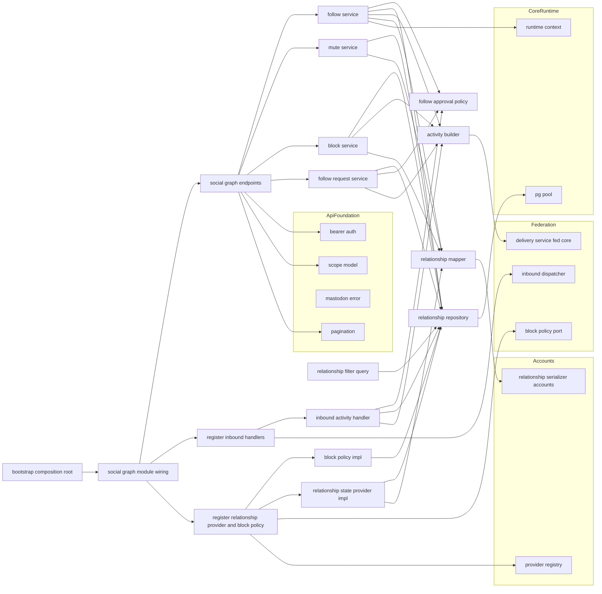
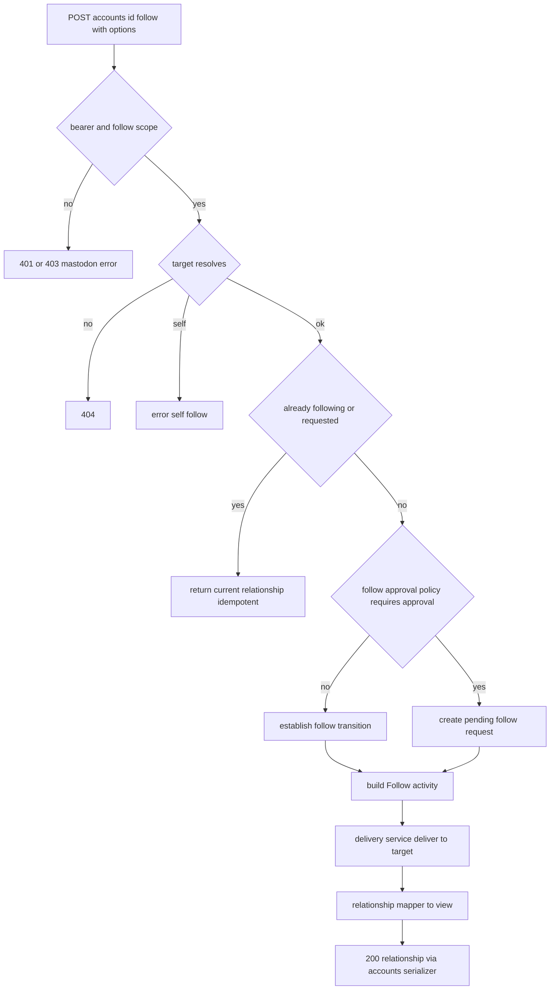
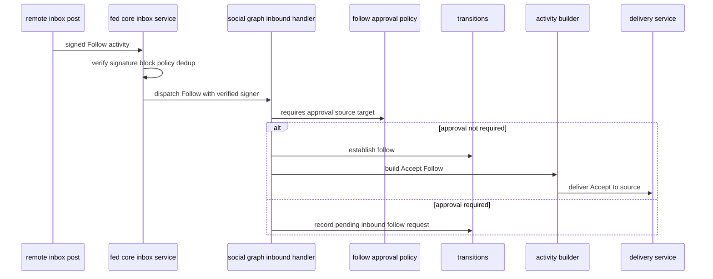
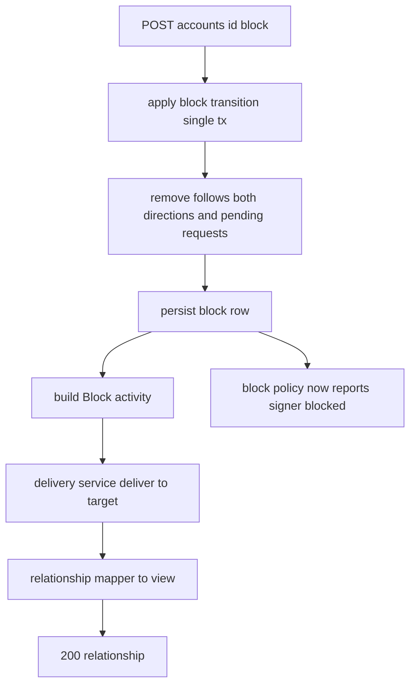

# Design Document

## Overview

**Purpose**: social-graph は kawasemi のソーシャルグラフ（フォロー・フォローリクエスト・ミュート・ブロック）の Mastodon 互換 API と、その連合往復（Follow / Accept / Reject / Block / Undo）を提供する。本 spec は関係状態（follows / follow_requests / mutes / blocks）の**単一の真実源**を所有し、各操作を federation-core の共通配送パス（`DeliveryService`）に乗せて意味論対称に往復させ、受信側 Activity を `InboundActivityHandler` で処理し、ブロック先からの署名を `BlockPolicy` で拒否させ、「同一サーバー承認スキップ」を単一の管理者特権として閉じ込める。

**Users**: 標準クライアント（Ivory・Elk・Phanpy 等）の利用者がフォロー/ミュート/ブロックを行い、一人鯖オーナーがロック済みアクターのフォローリクエストを承認/拒否する。下流の accounts-and-instance（`RelationshipStateProvider`）・timelines・notifications・inbound-move-flag が、本 spec の関係状態を委譲境界・問い合わせ経由で消費する。

**Impact**: core-runtime のランタイム土台、api-foundation の横断土台（Bearer / Scope / Pagination / MastodonError）、federation-core の連合配管（`DeliveryService` / `InboundActivityDispatcher` / `BlockPolicy`）、accounts-and-instance の Relationship / カウント契約（`RelationshipView` / `RelationshipSerializer` / `RelationshipStateProvider` / `AccountCountsProvider`）、notifications の通知生成シーム（`NotificationEventSink`）の上に、API モジュール群 `src/social_graph/` と関係状態テーブル（`migrations/0006_social_graph.sql`）を追加する。本 spec は accounts-and-instance の `RelationshipStateProvider` / `AccountCountsProvider`（followers/following 部分）と federation-core の `BlockPolicy` の既定実装を本実装へ差し替え、notifications の `NotificationEventSink`（既定 no-op）へ `follow` / `follow_request` を emit する。

### Goals

- follow / unfollow / follow_requests(authorize/reject) / mute / unmute / block / unblock を Mastodon 互換で提供する。
- Follow / Accept / Reject / Block / Undo を `DeliveryService` 共通パスで生成し、ローカル/リモートで同一の関係状態遷移にする。
- 受信側 Activity を処理し、フォロー・ブロックの往復をローカル・リモート対称に成立させる。
- ブロック関係を federation-core `BlockPolicy` に供給し、ブロック先署名を連合層で拒否させる。
- 「同一サーバー承認スキップ」を意味論対称の上に乗る単一の管理者特権として一箇所に定義する。
- 関係状態の真実源を所有し、accounts-and-instance `RelationshipStateProvider` とタイムライン/通知フィルタ問い合わせへ供給する。

### Non-Goals

- Relationship / Account エンティティの JSON 契約定義・`relationships` 読み取りエンドポイント本体（accounts-and-instance 所有。本 spec は消費）。
- ホーム/公開タイムライン・通知の本体実装とフィルタ適用処理（timelines / notifications。本 spec は関係状態供給のみ）。
- `domain_blocks`（ドメインブロック）の実装（後回し / later）。
- HTTP Signatures の生成・検証・double-knock・配送キュー・受信パイプライン骨格（federation-core）。
- 認証・スコープ・エラー本文・ページネーション・レート制限・契約ハーネス基盤（api-foundation）。
- リモートアカウントのフェッチ・正規化、アクター・署名鍵モデル（accounts-and-instance / actor-model）。

## Boundary Commitments

### This Spec Owns

- follow / unfollow、follow_requests（一覧 / authorize / reject）、mute / unmute、block / unblock の HTTP 表層・スコープ要求・応答コード規律。
- 関係状態（フォロー・送信中/受信保留フォローリクエスト・ミュート・ブロック・被ブロック）の永続モデルと書き込み（単一の真実源）。
- Follow / Accept / Reject / Block / Undo の Activity 論理生成（`ActivityBuilder`）と、共通配送パス（`DeliveryService`）への配送依頼。
- 上記 Activity の受信処理ハンドラ（`InboundActivityHandler` 実装）と、それに伴う関係状態遷移。
- フォロー承認要否の単一判定（`FollowApprovalPolicy`）— 同一サーバー承認スキップ特権の唯一の定義点。
- 関係状態 → `RelationshipView` 写像と、accounts-and-instance `RelationshipStateProvider` への本実装供給。
- accounts-and-instance `AccountCountsProvider` のフォロワー数（`followers_count`）/ フォロー中数（`following_count`）部分を follows グラフから算出して供給する本実装（投稿数 / `last_status_at` は本 spec 範囲外で既定 0 / None）。
- フォロー / フォローリクエストの状態遷移コミット後に notifications `NotificationEventSink` へ `follow` / `follow_request` の `NotificationEvent` を冪等に emit（既定 no-op シームに乗る）。
- federation-core `BlockPolicy` への本実装供給（ブロック先署名拒否）。
- タイムライン/通知フィルタが消費する関係状態問い合わせ（ブロック/被ブロック/ミュート/フォロー集合、およびブースト表示無効 `show_reblogs=false` 集合）の公開。
- 本 spec が所有する永続テーブル（`follows` / `follow_requests` / `mutes` / `blocks`）とそのマイグレーション（0006）。

### Out of Boundary

- Relationship / Account の JSON 契約・シリアライザ定義、`relationships` 読み取りエンドポイント（accounts-and-instance）。
- タイムライン/通知のフィルタ適用・配信本体（timelines / notifications）。
- `domain_blocks` の保持・適用（後回し。`domain_blocking` は常に false 供給）。
- 署名生成/検証・配送キュー・double-knock・受信パイプライン骨格・Activity 重複排除（federation-core）。
- 認証/スコープ/エラー/ページネーション/レート制限/契約ハーネス（api-foundation）、アクター/署名鍵（actor-model）、リモートアカウント正規化（accounts-and-instance）、起動/設定/DI/マイグレーション基盤（core-runtime）。

### Allowed Dependencies

- core-runtime: `AppState` / `RuntimeContext`（`Clock` / `IdGenerator`）/ `PgPool` / `AppError` / 構造化ログ / マイグレーション基盤 / テストハーネス（`spawn_test_app`）。
- api-foundation: Bearer 認証（`RequestActorContext`）/ `Scope`（`follow` / `read:follows` / `write:follows` 内包判定）/ `MastodonError` / `Pagination`（`PageParams` / `Cursor` / `build_link_header`）/ `X-RateLimit-*` レイヤー。
- federation-core: `DeliveryService`（`DeliveryRequest` / `Recipient`）/ `InboundActivityDispatcher.register`（`InboundActivityHandler` / `InboundContext.signer` / `ParsedActivity`）/ `BlockPolicy` trait（destination-aware、`LocalRecipientContext::Actor` / `LocalRecipientContext::SharedInbox`）/ `ActorUrls`（アクター/inbox URL）/ `ActorDirectory` 経由のアクター解決。
- accounts-and-instance: `RelationshipView` / `RelationshipSerializer.build_relationship` / `RelationshipStateProvider` trait（登録先レジストリ）/ `AccountCountsProvider` trait（登録先レジストリ、`AccountCounts { followers, following, statuses, last_status_at }`）/ ローカル・リモートアカウント解決（`AccountRef`）。
- notifications: `NotificationEventSink` trait（`AppState` レジストリ経由、既定 `NoopSink`）/ `NotificationEvent`（`recipient` / `origin` / `kind`（`Follow` / `FollowRequest`）/ `target_status_id`（常に `None`）/ `occurred_at`）。
- actor-model: `ActorDirectory`（ローカルアクター解決、owner 非露出）。
- 下流仕様（タイムライン/通知のフィルタ実装・ドメインブロック）を本 spec に持ち込まない。

### Revalidation Triggers

- 関係状態テーブル（`follows` / `follow_requests` / `mutes` / `blocks`）のスキーマ・一意制約・マイグレーション番号の変更。
- `RelationshipStateProvider` / `BlockPolicy`（destination-aware `LocalRecipientContext` を含む）/ `AccountCountsProvider` 実装が依存する上流 trait シグネチャの変更。
- `FollowApprovalPolicy`（同一サーバー承認スキップ）の判定規約の変更（`AccountRef` のバリアント構成が変わる場合を含む）。
- Activity 生成（Follow/Accept/Reject/Block/Undo の論理形）・Undo 対象 id 保持規約の変更。
- タイムライン/通知向け関係状態問い合わせの公開シグネチャの変更。
- notifications `NotificationEventSink` / `NotificationEvent`（`Follow` / `FollowRequest` のペイロード形状）の変更。
- 上流（federation-core の `DeliveryService` / `InboundActivityHandler` / `BlockPolicy`、accounts-and-instance の `RelationshipView` / `RelationshipStateProvider` / `AccountCountsProvider`、notifications の `NotificationEventSink`、api-foundation の Bearer/Scope/Pagination）契約の変更。

## Architecture

### Architecture Pattern & Boundary Map

選択パターン: **Service + Repository + 委譲 Port 実装供給（core-runtime の Composition Root に配線、api-foundation / federation-core / accounts-and-instance の確立済み境界に乗る）**。横断関心（Bearer・スコープ・エラー・ページネーション）は api-foundation に「乗るだけ」。関係操作は API → サービス → リポジトリに分離し、連合は `ActivityBuilder` で論理生成して `DeliveryService` へ委譲、受信は `InboundActivityHandler` 実装が状態遷移へ合流させる。承認要否は `FollowApprovalPolicy` 単一点に集約。関係状態は `RelationshipMapper` 経由で `RelationshipView` へ写像し、`RelationshipStateProvider` / `BlockPolicy` / フィルタ問い合わせとして下流へ供給する。依存方向は一方向（左→右）。



**Architecture Integration**:
- Selected pattern: Service + Repository + 委譲 Port 実装供給。意味論対称を Service に集約し、配送/受信/署名拒否/関係供給を上流境界へ委譲。
- Domain/feature boundaries: フォロー / フォローリクエスト / ミュート / ブロックを別 Service に分離。承認要否は `FollowApprovalPolicy` 単一点、関係→契約写像は `RelationshipMapper` 単一点。
- Existing patterns preserved: federation-core「意味論対称・配送のみ分岐」「委譲境界」、accounts-and-instance「委譲 Port 実装供給」、api-foundation「乗るだけ」、core-runtime「Composition Root」「決定性」、structure.md「明示的管理者特権を一箇所に定義」。
- New components rationale: 各コンポーネントは Boundary Commitments の 1 関心に 1:1 対応。`ActivityBuilder` と受信ハンドラが同じ状態遷移関数に合流することでローカル/リモート対称を構造的に担保。
- Steering compliance: 外部ブローカー非依存（DB 完結）、決定性（時刻/ID は `RuntimeContext`、ミュート期限は注入 `Clock`）、可観測性（関係遷移・配送依頼・受信拒否の診断）、一次情報は Mastodon 実レスポンス（Relationship は accounts-and-instance のゴールデンに整合）。

### Technology Stack

| Layer | Choice / Version | Role in Feature | Notes |
|-------|------------------|-----------------|-------|
| Backend / Services | Rust (edition 2021) + axum 0.7 系 | 関係操作エンドポイント・サービス・受信ハンドラ | core-runtime クレートに `src/social_graph/` を追加 |
| Middleware | api-foundation の tower レイヤー/抽出器 | Bearer 認証・スコープ・エラー変換・ページネーション再利用 | 新規ミドルウェアは作らない |
| Data / Storage | PostgreSQL + sqlx 0.7 系 | follows / follow_requests / mutes / blocks の永続化 | 既存 `PgPool` を共有 |
| Federation access | federation-core `DeliveryService` / `InboundActivityDispatcher` / `BlockPolicy` / `ActorUrls` | Activity 配送・受信・署名拒否・URL 構築 | port 背後でモック可能 |
| Relationship contract | accounts-and-instance `RelationshipView` / `RelationshipSerializer` / `RelationshipStateProvider` | Relationship JSON 生成・委譲供給 | 本 spec は消費・供給のみ |

> バージョンは系列の目安。実装時に最新互換版へ固定する。選定理由・代替比較は `research.md` 参照。

## File Structure Plan

### Directory Structure

```
migrations/
└── 0006_social_graph.sql        # follows / follow_requests / mutes / blocks と各種一意制約・インデックス（0001-0005,0007 と非衝突。0003/0006 の二重利用を回避し 0006 を採用）

src/
├── social_graph.rs               # SocialGraphModule 組み立て・公開・ルータ装着点・受信ハンドラ/RelationshipStateProvider/AccountCountsProvider/BlockPolicy 登録・NotificationEventSink 注入
└── social_graph/
    ├── model.rs                  # Follow, FollowRequest, Mute, Block, RelationshipState, FollowOptions, MuteOptions 等のドメイン型
    ├── repository.rs            # RelationshipRepository（follows/follow_requests/mutes/blocks の取得・upsert・削除・バッチ逆引き・期限考慮）
    ├── approval_policy.rs        # FollowApprovalPolicy（承認要否の単一判定 = 同一サーバー承認スキップ特権の唯一の定義点）
    ├── activity_builder.rs       # ActivityBuilder（Follow/Accept/Reject/Block/Undo の正規 Activity 論理生成・Undo 対象 id 解決）
    ├── transitions.rs           # 関係状態遷移の共通関数群（establish_follow / remove_follow / apply_block / clear_block 等。API 経路と受信経路が合流。establish_follow/record_pending は notifications NotificationEventSink への follow/follow_request emit を内包）
    ├── relationship_mapper.rs    # RelationshipMapper（関係状態 → accounts-and-instance RelationshipView 写像、期限切れミュート除外、domain_blocking=false）
    ├── follow_service.rs         # FollowService（follow/unfollow 業務集約。配送依頼・承認要否・冪等）
    ├── follow_request_service.rs # FollowRequestService（一覧/authorize/reject 業務集約）
    ├── mute_service.rs           # MuteService（mute/unmute 業務集約。連合なし）
    ├── block_service.rs          # BlockService（block/unblock 業務集約。関係解消・配送依頼）
    ├── inbound.rs                # InboundActivityHandler 実装（Follow/Accept/Reject/Block/Undo 受信→transitions 合流）
    ├── providers.rs              # RelationshipStateProvider 実装 + BlockPolicy 実装 + AccountCountsProvider 実装（followers/following） + フィルタ問い合わせ（FilterQuery）
    └── endpoints.rs              # 各エンドポイントハンドラ（スコープ要求・応答コード規律・Relationship 応答生成）

tests/
├── follow_unfollow_it.rs        # follow/unfollow（ローカル/リモート・冪等・自己フォロー拒否・オプション反映・Relationship 応答・follow 通知イベント emit）（統合）
├── follow_request_it.rs         # ロック済み宛保留・一覧ページネーション・authorize/reject と Accept/Reject 配送・follow_request 通知イベント emit（統合）
├── same_server_skip_it.rs       # 同一サーバー承認スキップ特権（ローカル間は即時確立、片側リモートは通常承認）（統合）
├── mute_block_it.rs             # mute/unmute（通知・期限）・block/unblock（関係解消・配送）（統合）
├── inbound_activities_it.rs     # 受信 Follow/Accept/Reject/Block/Undo の状態遷移・冪等（統合）
├── block_policy_it.rs           # ブロック先署名拒否（BlockPolicy 実装が federation-core に効く）（統合）
├── relationship_provider_it.rs  # RelationshipStateProvider / AccountCountsProvider 供給で accounts-and-instance の relationships/counts が実値を返す（統合）
└── federation_symmetry_it.rs    # 2 インスタンス往復でローカル/HTTP 同一結果（連合）
```

### Modified Files

- `src/state.rs`（core-runtime）— `AppState` に `SocialGraphModule`（各サービス・リポジトリのハンドル）を追加。
- `src/bootstrap.rs`（core-runtime）— プール・api-foundation・federation-core・accounts-and-instance モジュール構築後に `SocialGraphModule` を組み立て、(1) 受信ハンドラを `InboundActivityDispatcher` へ登録、(2) `RelationshipStateProvider` 実装を accounts-and-instance のレジストリへ登録（既定差し替え）、(3) `BlockPolicy` 実装を federation-core へ登録（既定 no-op 差し替え）、(4) `AccountCountsProvider` の followers/following 部分の実装を accounts-and-instance のレジストリへ登録（既定 0 を差し替え）、(5) notifications の `NotificationEventSink` レジストリからハンドルを取得し `Transitions` へ注入（notifications 未構築でも既定 `NoopSink` として安全）、`AppState` に格納。
- `src/server.rs`（core-runtime）— ルータに social_graph エンドポイントを mount し、api-foundation の横断レイヤー適用点に乗せる。

> 各ファイルは単一責務。承認要否は `approval_policy.rs`、状態遷移は `transitions.rs`、関係→契約写像は `relationship_mapper.rs` に集約し、Composition Root へ一方向に配線する。

## System Flows

### フォロー（ローカル/リモート対称・承認要否単一判定）



承認要否は `FollowApprovalPolicy::requires_approval`（同一サーバー特権の単一定義点）でのみ判定する（3.1–3.4）。ローカル/リモートは同一 Follow Activity を生成し配送手段のみ分岐（1.2, 1.3, 10.3）。重複は冪等（1.6）、自己フォローは拒否（1.7）。

### フォローリクエスト承認 / 受信 Follow（共通の状態遷移へ合流）



受信 Follow も API フォローと同じ `FollowApprovalPolicy` と `transitions` に合流する（7.2, 7.3, 3.x）。Accept/Reject 受信は送信中フォローリクエストを確立/削除へ遷移（2.5, 2.6, 7.x）。署名検証・ブロック判定・重複排除は federation-core が前段で実施（7.7 は本 spec 側でも状態遷移を冪等化）。

### ブロック（関係解消 + 連合 + 署名拒否供給）



ブロックは単一トランザクションで双方向フォロー・保留を解消し block 行を確定（5.1, 5.2）。確定後は `BlockPolicy` 実装が当該署名者をブロック対象として報告し、federation-core が以降の受信を拒否する（6.1–6.3）。Undo(Block) は block 行削除 + Undo 配送で逆操作（5.4, 6.4）。

## Requirements Traceability

| Requirement | Summary | Components | Interfaces | Flows |
|-------------|---------|------------|------------|-------|
| 1.1–1.8 | follow/unfollow・ローカル/リモート対称・オプション・冪等・自己拒否・スコープ | FollowService, ApprovalPolicy, ActivityBuilder, RelationshipRepository, RelationshipMapper | follow(), unfollow() | フォロー |
| 2.1–2.7 | フォローリクエスト保留・一覧・authorize/reject・Accept/Reject 送受信 | FollowRequestService, InboundHandler, ActivityBuilder, RelationshipRepository | list_requests(), authorize(), reject() | 承認/受信 Follow |
| 3.1–3.4 | 同一サーバー承認スキップの単一定義・即時確立・リモートは通常 | FollowApprovalPolicy, Transitions | requires_approval() | フォロー / 受信 Follow |
| 4.1–4.6 | mute/unmute・通知ミュート・期限・連合なし・スコープ | MuteService, RelationshipRepository, RelationshipMapper | mute(), unmute() | （状態更新） |
| 5.1–5.6 | block/unblock・関係解消・Block/Undo 連合・対称・スコープ | BlockService, Transitions, ActivityBuilder, RelationshipRepository | block(), unblock() | ブロック |
| 6.1–6.4 | ブロック先署名拒否・BlockPolicy 供給・継続拒否・解除 | BlockPolicyImpl, RelationshipRepository | is_blocked() | ブロック |
| 7.1–7.7 | 受信 Follow/Accept/Reject/Block/Undo 処理・冪等 | InboundHandler, Transitions, ApprovalPolicy, ActivityBuilder | handle() | 承認/受信 Follow / ブロック |
| 8.1–8.5 | 関係真実源・Provider 供給・Relationship 契約消費・全フラグ導出・domain_blocking=false | RelationshipRepository, RelProviderImpl, RelationshipMapper | relationships() | （委譲） |
| 8.1（Boundary Commitments） | followers/following カウントの算出・供給（accounts-and-instance `AccountCountsProvider`） | AccountCountsProviderImpl, RelationshipRepository | counts() | （委譲） |
| 1.1, 3.1–3.2, 7.2, 7.3（Boundary Commitments） | follow / follow_request 通知イベントの emit（notifications `NotificationEventSink`） | Transitions, FollowService, InboundHandler | establish_follow(), record_pending() | フォロー / 承認・受信 Follow |
| 9.1–9.4 | フィルタ向け関係集合公開・期限考慮・フィルタ本体は非実装 | FilterQuery, RelationshipRepository | blocked_set(), muted_set(), following_set() | （問い合わせ） |
| 10.1–10.5 | 認証/スコープ・エラー互換・対称性・ページネーション・404 | SocialGraphEndpoints, ApiFoundation(参照) | （全エンドポイント） | 全フロー横断 |

## Components and Interfaces

| Component | Domain/Layer | Intent | Req Coverage | Key Dependencies (P0/P1) | Contracts |
|-----------|--------------|--------|--------------|--------------------------|-----------|
| model | Social Graph Domain | フォロー/リクエスト/ミュート/ブロックのドメイン型 | 1,2,4,5,8 | core-runtime Id/時刻型 (P0) | State |
| RelationshipRepository | Data | 関係状態の永続化・バッチ逆引き・期限考慮 | 1,2,4,5,8,9 | PgPool (P0) | Service, State |
| FollowApprovalPolicy | Domain Policy | 承認要否の単一判定（同一サーバー特権。`AccountRef` バリアントを直接検査、外部解決不要） | 3 | model（`AccountRef`）(P0) | Service |
| ActivityBuilder | Federation | Follow/Accept/Reject/Block/Undo 論理生成・Undo id 解決 | 1,2,5,7 | ActorUrls, RelationshipRepository (P0) | Service |
| Transitions | Domain | 関係状態遷移の共通関数（API/受信が合流）。確立/保留コミット後に notifications へ follow/follow_request emit | 1,2,3,5,7 | RelationshipRepository, NotificationEventSink (P0) | Service |
| RelationshipMapper | Serialization | 関係状態 → RelationshipView 写像・期限/ドメインブロック規律 | 8,4,9 | RelationshipRepository, RelationshipSerializer(参照) (P0/P1) | Service |
| FollowService | Service | follow/unfollow 業務集約 | 1 | ApprovalPolicy, ActivityBuilder, Transitions, Delivery, RelationshipMapper (P0) | Service |
| FollowRequestService | Service | 一覧/authorize/reject 業務集約 | 2 | RelationshipRepository, ActivityBuilder, Transitions, Pagination (P0) | Service |
| MuteService | Service | mute/unmute 業務集約（連合なし） | 4 | RelationshipRepository, RelationshipMapper (P0) | Service |
| BlockService | Service | block/unblock 業務集約（関係解消・配送） | 5 | Transitions, ActivityBuilder, Delivery, RelationshipMapper (P0) | Service |
| InboundHandler | Federation Inbound | 受信 Activity → 状態遷移合流 | 7,2,3 | Transitions, ApprovalPolicy, ActivityBuilder, Delivery (P0) | Service |
| BlockPolicyImpl | Port Impl | federation-core BlockPolicy の本実装 | 6 | RelationshipRepository (P0) | Service |
| RelProviderImpl | Port Impl | accounts RelationshipStateProvider の本実装 | 8 | RelationshipRepository, RelationshipMapper (P0) | Service |
| AccountCountsProviderImpl | Port Impl | accounts-and-instance AccountCountsProvider の followers/following 部分の本実装 | 8 | RelationshipRepository (P0) | Service |
| FilterQuery | Query | タイムライン/通知向け関係集合問い合わせ | 9 | RelationshipRepository (P0) | Service |
| SocialGraphEndpoints | API | 各エンドポイント HTTP 表層・スコープ・応答コード | 1,2,4,5,10 | Services, Bearer, Scope, MastodonError, Pagination, RelationshipSerializer (P0) | API |
| SocialGraphModule(wiring) | Runtime | 構築・受信/RelationshipStateProvider/AccountCountsProvider/BlockPolicy 登録・NotificationEventSink 注入・ルータ装着・AppState 格納 | 6,7,8,10 | core-runtime bootstrap (P0) | Service |

依存方向（左→右、上位は下位のみ参照）: `model → RelationshipRepository → FollowApprovalPolicy / ActivityBuilder / Transitions / RelationshipMapper / FilterQuery → FollowService / FollowRequestService / MuteService / BlockService / InboundHandler / BlockPolicyImpl / RelProviderImpl / AccountCountsProviderImpl → SocialGraphEndpoints → SocialGraphModule wiring`。

### Social Graph Domain / ドメイン層

#### model

| Field | Detail |
|-------|--------|
| Intent | フォロー・フォローリクエスト・ミュート・ブロックのドメイン型と操作オプションを定義する |
| Requirements | 1.1, 1.5, 2.1, 4.1, 4.2, 4.3, 5.1, 8.1 |

**Responsibilities & Constraints**
- `Follow` は `showing_reblogs` / `notifying` / `languages` 属性と送信 Activity id（Undo 用）を保持（1.5）。
- `FollowRequest` は方向（送信中 outbound / 受信保留 inbound）を型で区別し、送信中は送信 Follow Activity id を保持（2.5, 2.6）。
- `Mute` は `notifications` と任意 `expires_at`（期限付き）を保持（4.2, 4.3）。`Block` は送信 Block Activity id（Undo 用）を保持（5.4）。
- `AccountRef`（ローカル/リモート）は core-runtime の domain-primitives が正準所有する型を import して使用し（本 spec では定義しない）、被ブロックは「相手→自分」方向の `Block` 行で表現する（8.1）。

**Dependencies**
- Inbound: 全 social_graph コンポーネント (P0)
- Outbound: core-runtime の Id 型・時刻型・domain-primitives の正準共有型（`AccountRef`） (P0)

**Contracts**: State [x]

##### 型定義（抜粋）
```rust
use core_runtime::domain_primitives::AccountRef; // 正準共有型: core-runtime が所有（本 spec では定義せず import）
pub struct FollowOptions { pub reblogs: bool, pub notify: bool, pub languages: Vec<String> }
pub struct Follow { pub follower: AccountRef, pub followee: AccountRef, pub reblogs: bool, pub notify: bool, pub languages: Vec<String>, pub activity_id: String, pub created_at: OffsetDateTime }
pub enum FollowRequestDirection { Outbound, Inbound }
pub struct FollowRequest { pub requester: AccountRef, pub target: AccountRef, pub direction: FollowRequestDirection, pub activity_id: String, pub created_at: OffsetDateTime }
pub struct MuteOptions { pub notifications: bool, pub duration: Option<i64> }
pub struct Mute { pub muter: AccountRef, pub muted: AccountRef, pub notifications: bool, pub expires_at: Option<OffsetDateTime>, pub created_at: OffsetDateTime }
pub struct Block { pub blocker: AccountRef, pub blocked: AccountRef, pub activity_id: String, pub created_at: OffsetDateTime }
```
- Invariants: フォロー/被フォロー・保留方向・ブロックは (主体, 対象) で一意。秘匿値は持たない。

#### FollowApprovalPolicy

| Field | Detail |
|-------|--------|
| Intent | フォロー承認の要否を単一点で判定し、同一サーバー承認スキップ特権を一箇所にのみ定義する |
| Requirements | 3.1, 3.2, 3.3, 3.4 |

**Responsibilities & Constraints**
- 宛先ローカルアクターがロック済みなら原則承認必要（2.1）。
- 例外（管理者特権）: `source` と `target` がともに `AccountRef::Local`（＝同一サーバーのローカルアクター。kawasemi は一人のオーナーが複数ローカルアクターを保持する構成のため、ローカル同士は常に同一サーバー）のときは、ロック済みでも承認不要（3.1）。
- **同一サーバー判定（両者がローカルか）は本メソッドが `source`・`target` の `AccountRef`（core-runtime `domain-primitives` の正準定義。`Local(Id)` / `Remote(Id)`）バリアントを直接検査して内部で行う**。呼び出し側（API 経路の `FollowService` / 受信経路の `InboundHandler`）は同一サーバー判定ロジックを持たず、素の `source` / `target` と宛先のロック状態のみを渡す。この分岐は本コンポーネント内にのみ存在し、呼び出し点ごとに重複・分岐実装させない（3.3）。これにより API 経路と受信経路で判定が乖離するリスク（リモート特権漏れ）を構造的に排除する。
- `source` または `target` のいずれかが `AccountRef::Remote` のときは特権を適用せず通常判定（3.4）。

**Contracts**: Service [x]

##### Service Interface
```rust
pub enum FollowDecision { Establish, RequireApproval }
/// 同一サーバー（両者ローカル）判定は本メソッド内部で AccountRef のバリアントを検査して完結させる。
/// 呼び出し側は same-server 判定を自前で行わない。
pub fn requires_approval(&self, source: &AccountRef, target: &AccountRef, target_locked: bool) -> FollowDecision;
```
- Postconditions: `source` と `target` がともに `AccountRef::Local` なら常に `Establish`（同一サーバー特権の唯一の表現。判定はメソッド内部で完結し、呼び出し側は同一サーバー判定ロジックを持たない）。

#### Transitions

| Field | Detail |
|-------|--------|
| Intent | 関係状態遷移の共通関数群。API 経路と受信 Activity 経路が同一関数へ合流し意味論対称を担保する |
| Requirements | 1.1, 1.4, 2.3, 2.4, 2.5, 2.6, 3.2, 5.1, 5.2, 7.2, 7.3, 7.4, 7.5, 7.6, 7.7 |

**Responsibilities & Constraints**
- `establish_follow` / `remove_follow` / `record_pending` / `promote_pending`（Accept 受領）/ `drop_pending`（Reject 受領）/ `apply_block` / `clear_block` / `mark_blocked_by` / `clear_blocked_by` を提供。
- `apply_block` は単一トランザクションで双方向フォロー・両方向保留を解消してから block 行を確定（5.2）。
- すべての遷移は冪等（既存状態と一致するなら二重適用しない）（1.6, 7.7）。
- 通知イベント emit（Boundary Commitments）: `establish_follow` はコミット後、`followee` が `AccountRef::Local` のとき notifications `NotificationEventSink` へ `NotificationEvent{ recipient: followee, origin: follower, kind: NotificationType::Follow, target_status_id: None, occurred_at }` を emit する（`followee` がリモートなら emit しない。通知の recipient はローカル限定という notifications 側の型不変条件と整合）。`record_pending` はコミット後、`req.direction == Inbound`（受信 Follow によるローカル宛の保留）のとき `NotificationEvent{ recipient: req.target, origin: req.requester, kind: NotificationType::FollowRequest, target_status_id: None, occurred_at }` を emit する（`direction == Outbound` は宛先がリモートのため emit しない）。
- emit は `establish_follow` / `record_pending` という単一の合流点でのみ行い、`FollowService`（API 経路）・`InboundHandler`（受信経路）のどちらから呼ばれても二重に生成しない（steering の単一生成点原則、notifications 側の「単一の生成点から生成」制約と整合）。`Transitions` は `NotificationEventSink` の実装ハンドルを保持する（`AppState` 上のレジストリ経由。notifications 未構築時は既定 `NoopSink` のため安全に no-op）。

**Contracts**: Service [x]

##### Service Interface
```rust
pub async fn establish_follow(&self, follower: &AccountRef, followee: &AccountRef, opts: &FollowOptions, activity_id: &str) -> Result<(), AppError>;
pub async fn remove_follow(&self, follower: &AccountRef, followee: &AccountRef) -> Result<(), AppError>;
pub async fn record_pending(&self, req: &FollowRequest) -> Result<(), AppError>;
pub async fn promote_pending(&self, requester: &AccountRef, target: &AccountRef) -> Result<(), AppError>; // Accept
pub async fn drop_pending(&self, requester: &AccountRef, target: &AccountRef) -> Result<(), AppError>;    // Reject
pub async fn apply_block(&self, blocker: &AccountRef, blocked: &AccountRef, activity_id: &str) -> Result<(), AppError>; // 関係解消込み・単一tx
pub async fn clear_block(&self, blocker: &AccountRef, blocked: &AccountRef) -> Result<(), AppError>;
pub async fn mark_blocked_by(&self, source: &AccountRef, target: &AccountRef) -> Result<(), AppError>;     // 受信 Block
pub async fn clear_blocked_by(&self, source: &AccountRef, target: &AccountRef) -> Result<(), AppError>;    // 受信 Undo Block
```
- Invariants: API 経路と受信経路は同じ遷移関数を呼び、ローカル/リモートで同一結果になる（10.3）。`establish_follow` / `record_pending` の notifications emit も同じ理由で API/受信経路間で重複しない。

### Data / データ層

#### RelationshipRepository

| Field | Detail |
|-------|--------|
| Intent | follows / follow_requests / mutes / blocks の永続化アクセスと、関係導出のためのバッチ逆引き・期限考慮 |
| Requirements | 1.1, 1.6, 2.1, 2.2, 4.1, 4.3, 5.1, 8.1, 8.4, 9.1, 9.2, 9.3 |

**Responsibilities & Constraints**
- 各関係の upsert / 削除 / 存在確認。フォロー/被フォロー・保留は (主体, 対象, 方向) 一意制約で冪等化（1.6, 7.7）。
- 閲覧者 + 対象 id 群に対する関係フラグのバッチ逆引き（`RelationshipView` 導出のため、N+1 を避ける）（8.4）。
- ミュート期限切れは導出・フィルタ集合から除外（取得時に `Clock` 由来 now で判定）（4.3, 9.3）。
- 時刻/ID は `RuntimeContext`（決定性）。
- 対象アカウントを主体としたフォロワー数/フォロー中数の集計（`follows` テーブルの単純 COUNT）を提供し、`AccountCountsProviderImpl` の供給元となる（Boundary Commitments）。

**Contracts**: Service [x] / State [x]

##### Service Interface
```rust
pub async fn upsert_follow(&self, f: &Follow) -> Result<(), AppError>;
pub async fn delete_follow(&self, follower: &AccountRef, followee: &AccountRef) -> Result<bool, AppError>;
pub async fn upsert_request(&self, r: &FollowRequest) -> Result<(), AppError>;
pub async fn delete_request(&self, requester: &AccountRef, target: &AccountRef, dir: FollowRequestDirection) -> Result<bool, AppError>;
pub async fn list_inbound_requests(&self, target: &AccountRef, page: &PageParams) -> Result<Page<FollowRequest>, AppError>;
pub async fn upsert_mute(&self, m: &Mute) -> Result<(), AppError>;
pub async fn delete_mute(&self, muter: &AccountRef, muted: &AccountRef) -> Result<bool, AppError>;
pub async fn upsert_block(&self, b: &Block) -> Result<(), AppError>;
pub async fn delete_block(&self, blocker: &AccountRef, blocked: &AccountRef) -> Result<bool, AppError>;
pub async fn load_states(&self, viewer: &AccountRef, targets: &[AccountRef], now: OffsetDateTime) -> Result<Vec<RelationshipState>, AppError>; // 逆引き合成
pub async fn blocked_targets(&self, viewer: &AccountRef) -> Result<Vec<AccountRef>, AppError>;       // 9.1
pub async fn blocked_by(&self, viewer: &AccountRef) -> Result<Vec<AccountRef>, AppError>;            // 9.1
pub async fn muted_targets(&self, viewer: &AccountRef, now: OffsetDateTime, notifications_only: bool) -> Result<Vec<AccountRef>, AppError>; // 9.1,9.3
pub async fn following_targets(&self, viewer: &AccountRef) -> Result<Vec<AccountRef>, AppError>;     // 9.2
pub async fn count_followers(&self, target: &AccountRef) -> Result<i64, AppError>;  // followee=target の確立済み follows 件数（AccountCountsProvider 供給用）
pub async fn count_following(&self, target: &AccountRef) -> Result<i64, AppError>;  // follower=target の確立済み follows 件数（AccountCountsProvider 供給用）
```

### Federation / 連合層

#### ActivityBuilder

| Field | Detail |
|-------|--------|
| Intent | Follow / Accept / Reject / Block / Undo の正規 Activity を論理生成し、Undo の対象 Activity を解決する |
| Requirements | 1.2, 1.3, 1.4, 2.3, 2.4, 5.3, 5.4, 7.2 |

**Responsibilities & Constraints**
- 各 Activity を ActivityPub 正規形（actor / object / type）で生成。アクター/object URL は `ActorUrls` から取得（1.2）。
- ローカル/リモート同一の論理 Activity を生成し、配送手段は `DeliveryService` 側に委ねる（1.3, 10.3）。
- Undo(Follow/Block) は元 Activity の id（関係行に保持）を object に埋めて生成（1.4, 5.4）。Accept/Reject は受信 Follow の id を object に参照（2.3, 2.4）。

**Contracts**: Service [x]

##### Service Interface
```rust
pub fn build_follow(&self, follower: &AccountRef, followee: &AccountRef) -> (String, serde_json::Value);  // (activity_id, json)
pub fn build_accept(&self, target: &AccountRef, follow_activity_id: &str, source: &AccountRef) -> serde_json::Value;
pub fn build_reject(&self, target: &AccountRef, follow_activity_id: &str, source: &AccountRef) -> serde_json::Value;
pub fn build_block(&self, blocker: &AccountRef, blocked: &AccountRef) -> (String, serde_json::Value);
pub fn build_undo(&self, actor: &AccountRef, wrapped_activity_id: &str, wrapped: serde_json::Value) -> serde_json::Value;
```

### Serialization / 写像層

#### RelationshipMapper

| Field | Detail |
|-------|--------|
| Intent | 本 spec の関係状態を accounts-and-instance の `RelationshipView` へ写像する単一点 |
| Requirements | 8.3, 8.4, 8.5, 4.3, 9.3 |

**Responsibilities & Constraints**
- 閲覧者と対象の関係から全フラグ（following/showing_reblogs/notifying/languages/followed_by/blocking/blocked_by/muting/muting_notifications/requested/requested_by/endorsed/note）を決定論的に導出（8.4）。
- 期限切れミュートは `muting` / `muting_notifications` を偽として扱う（4.3）。`domain_blocking` は常に偽（8.5）。`endorsed` / `note` は本 spec が機能を持たないため既定（false / 空）。
- 写像結果は accounts-and-instance `RelationshipSerializer.build_relationship` へ渡し JSON を生成（Relationship 契約は再定義しない）（8.3）。

**Contracts**: Service [x]

##### Service Interface
```rust
pub fn to_view(&self, state: &RelationshipState) -> RelationshipView;   // accounts-and-instance の型へ写像
```

### Service / サービス層

#### FollowService / FollowRequestService / MuteService / BlockService

| Field | Detail |
|-------|--------|
| Intent | 各関係操作エンドポイントの業務を集約する |
| Requirements | 1.1, 1.4, 1.5, 1.6, 1.7, 2.1, 2.2, 2.3, 2.4, 4.1, 4.2, 4.3, 4.4, 4.5, 5.1, 5.2, 5.3, 5.4 |

**Responsibilities & Constraints**
- `FollowService.follow`: 自己フォロー拒否（1.7）→ 既存確認で冪等（1.6）→ `FollowApprovalPolicy` で承認要否（3.x）→ `Transitions` で確立 or 保留 → `ActivityBuilder` + `DeliveryService` で Follow 配送（1.2, 1.3）→ `RelationshipMapper` で応答（1.1）。`unfollow` は逆操作 + Undo 配送（1.4）。`Transitions.establish_follow`/`record_pending` 呼び出しは notifications への `follow`/`follow_request` emit を内包するため、本サービス自身は emit を行わない（Boundary Commitments）。
- `FollowRequestService`: 受信保留一覧をページネーションで返す（2.2）。authorize は `promote_pending` + Accept 配送（2.3）、reject は `drop_pending` + Reject 配送（2.4）。
- `MuteService`: mute/unmute は DB 状態のみ更新（連合なし、4.5）。通知ミュート（4.2）・期限（4.3）を反映。
- `BlockService`: `apply_block`（関係解消込み単一tx, 5.2）→ Block 配送（5.3）。unblock は `clear_block` + Undo(Block) 配送（5.4）。

**Contracts**: Service [x]

##### Service Interface
```rust
pub async fn follow(&self, viewer: &RequestActorContext, target: &str, opts: FollowOptions) -> Result<serde_json::Value, AppError>;
pub async fn unfollow(&self, viewer: &RequestActorContext, target: &str) -> Result<serde_json::Value, AppError>;
pub async fn list_requests(&self, viewer: &RequestActorContext, page: PageParams) -> Result<Page<serde_json::Value>, AppError>;
pub async fn authorize_request(&self, viewer: &RequestActorContext, requester: &str) -> Result<serde_json::Value, AppError>;
pub async fn reject_request(&self, viewer: &RequestActorContext, requester: &str) -> Result<serde_json::Value, AppError>;
pub async fn mute(&self, viewer: &RequestActorContext, target: &str, opts: MuteOptions) -> Result<serde_json::Value, AppError>;
pub async fn unmute(&self, viewer: &RequestActorContext, target: &str) -> Result<serde_json::Value, AppError>;
pub async fn block(&self, viewer: &RequestActorContext, target: &str) -> Result<serde_json::Value, AppError>;
pub async fn unblock(&self, viewer: &RequestActorContext, target: &str) -> Result<serde_json::Value, AppError>;
```
- Postconditions: 関係変更後は常に最新の Relationship JSON を返す（`RelationshipMapper` + accounts `RelationshipSerializer`）。

### Federation Inbound / 受信層

#### InboundHandler

| Field | Detail |
|-------|--------|
| Intent | federation-core の受信ディスパッチに Follow/Accept/Reject/Block/Undo ハンドラを登録し状態遷移へ合流させる |
| Requirements | 7.1, 7.2, 7.3, 7.4, 7.5, 7.6, 7.7, 2.5, 2.6, 3.2 |

**Responsibilities & Constraints**
- `activity_types()` は Follow/Accept/Reject/Block/Undo を宣言（7.1）。
- 受信 Follow: `FollowApprovalPolicy` で承認要否 → 確立なら `establish_follow` + Accept 配送、要承認なら `record_pending`（inbound）（7.2, 7.3, 3.2）。呼び出す `establish_follow`/`record_pending`（`direction=Inbound`）は notifications への `follow`/`follow_request` emit を内包し、API 経路と同一関数のため二重生成しない（Boundary Commitments）。
- 受信 Accept: `promote_pending`（2.5）。受信 Reject: `drop_pending`（2.6）。
- 受信 Block: `mark_blocked_by` + 関係解消（7.4）。受信 Undo は wrap 種別で分岐し `remove_follow`（7.5）/ `clear_blocked_by`（7.6）。
- すべて冪等（既処理は状態を二重変更しない）（7.7）。`InboundContext.signer` の検証済み URI を関係主体の特定に用いる。

**Contracts**: Service [x]

##### Service Interface
```rust
impl InboundActivityHandler for SocialGraphInbound {
    fn activity_types(&self) -> &[&str]; // ["Follow","Accept","Reject","Block","Undo"]
    async fn handle(&self, activity: &ParsedActivity, ctx: &InboundContext) -> Result<(), AppError>;
}
```

### Port Impl / 委譲実装層

#### BlockPolicyImpl / RelProviderImpl / AccountCountsProviderImpl / FilterQuery

| Field | Detail |
|-------|--------|
| Intent | federation-core `BlockPolicy`・accounts-and-instance `RelationshipStateProvider` / `AccountCountsProvider` の本実装供給と、タイムライン/通知向け関係問い合わせ |
| Requirements | 6.1, 6.2, 6.3, 6.4, 8.2, 8.3, 8.4, 9.1, 9.2, 9.3, 9.4 |

**Responsibilities & Constraints**
- `BlockPolicyImpl.is_blocked(actor_uri, local_recipient)`: federation-core の destination-aware `BlockPolicy` 契約に従う。`local_recipient` が `LocalRecipientContext::Actor { actor_uri: recipient_uri }` のとき、`recipient_uri` が指すローカルアクターを主体として、署名者 URI（`AccountRef` へ解決）に対する `blocks` 行（宛先アクター→署名者方向）の有無を `RelationshipRepository` から判定する（6.1, 6.2）。Follow/Accept/Reject/Block/Undo（本 spec が処理する種別）は常にアクター個別 inbox へ配送されるため、本 spec の判定は実質的にこの分岐のみで完結する。`local_recipient` が `LocalRecipientContext::SharedInbox`（宛先アクターを一意に決定できない共有 inbox 受信）のときは、federation-core の契約に従い常に `false` を返し一括拒否しない（本 spec が扱う Activity 種別は shared inbox 経由では到達しない想定のため、この分岐が実質的な判定精度を落とすことはない）。ブロック継続中は真、解除後は偽（6.3, 6.4）。
- `RelProviderImpl.relationships(viewer, targets)`: `RelationshipRepository.load_states` → `RelationshipMapper.to_view` で `Vec<RelationshipView>` を返す（8.2, 8.3, 8.4）。
- `AccountCountsProviderImpl.counts(target)`: `RelationshipRepository` から `target` を主体に `followers`（`followee` = target の確立済み `follows` 件数）と `following`（`follower` = target の確立済み `follows` 件数）を集計して `AccountCounts` の当該フィールドへ設定する（Boundary Commitments、follows テーブルが単一の真実源）。`statuses` / `last_status_at` は本 spec の範囲外のため常に accounts-and-instance の既定値（`0` / `None`）のまま返す（statuses-core が別途上書きする分担）。
- `FilterQuery`: ブロック/被ブロック/ミュート（期限考慮）/フォロー集合を返す（9.1, 9.2, 9.3）。フィルタ適用自体は実装しない（9.4）。

**Contracts**: Service [x]

##### Service Interface
```rust
impl BlockPolicy for BlockPolicyImpl {
    // LocalRecipientContext::Actor は宛先ローカルアクター視点で blocks を判定、SharedInbox は常に false（federation-core 契約）。
    async fn is_blocked(&self, actor_uri: &str, local_recipient: LocalRecipientContext) -> Result<bool, AppError>;
}
impl RelationshipStateProvider for RelProviderImpl { async fn relationships(&self, viewer: Id, targets: &[AccountRef]) -> Result<Vec<RelationshipView>, AppError>; }
impl AccountCountsProvider for AccountCountsProviderImpl {
    // followers/following は follows テーブルから集計。statuses/last_status_at は既定のまま（0/None）。
    async fn counts(&self, target: &AccountRef) -> Result<AccountCounts, AppError>;
}
pub async fn blocked_set(&self, viewer: &AccountRef) -> Result<RelationshipSets, AppError>; // blocked/blocked_by/muted/muted_notifications
pub async fn following_set(&self, viewer: &AccountRef) -> Result<Vec<AccountRef>, AppError>;
```

### API / エンドポイント層

#### SocialGraphEndpoints

| Field | Detail |
|-------|--------|
| Intent | 関係操作の HTTP 表層・スコープ要求・応答コード規律・Relationship 応答生成 |
| Requirements | 1.8, 2.7, 4.6, 5.6, 10.1, 10.2, 10.4, 10.5 |

**Responsibilities & Constraints**
- スコープ: follow/unfollow/mute/unmute/block/unblock = `follow`（または `write:follows`）、follow_requests 一覧 = `read:follows`、authorize/reject = `follow`（10.1）。Bearer + Scope は api-foundation 再利用。
- 失敗は api-foundation の Mastodon 互換エラー本文（10.2）。未存在アカウントは 404（10.5）。リスト系（follow_requests）は `Link` + カーソル（10.4）。
- 応答 Relationship は accounts-and-instance `RelationshipSerializer` で生成（契約再定義なし）。

**Contracts**: API [x]

##### API Contract
| Method | Endpoint | Request | Response | Errors |
|--------|----------|---------|----------|--------|
| POST | /api/v1/accounts/:id/follow | Bearer(`follow`), reblogs/notify/languages | Relationship | 401, 403, 404, 422 |
| POST | /api/v1/accounts/:id/unfollow | Bearer(`follow`) | Relationship | 401, 403, 404 |
| GET | /api/v1/follow_requests | Bearer(`read:follows`), cursor | Account[] + Link | 401, 403 |
| POST | /api/v1/follow_requests/:id/authorize | Bearer(`follow`) | Relationship | 401, 403, 404 |
| POST | /api/v1/follow_requests/:id/reject | Bearer(`follow`) | Relationship | 401, 403, 404 |
| POST | /api/v1/accounts/:id/mute | Bearer(`follow`/`write:mutes`), notifications/duration | Relationship | 401, 403, 404 |
| POST | /api/v1/accounts/:id/unmute | Bearer(`follow`/`write:mutes`) | Relationship | 401, 403, 404 |
| POST | /api/v1/accounts/:id/block | Bearer(`follow`/`write:blocks`) | Relationship | 401, 403, 404 |
| POST | /api/v1/accounts/:id/unblock | Bearer(`follow`/`write:blocks`) | Relationship | 401, 403, 404 |

### Runtime / 配線層

#### SocialGraphModule（wiring）

| Field | Detail |
|-------|--------|
| Intent | 構築・受信ハンドラ/RelationshipStateProvider/AccountCountsProvider/BlockPolicy 登録・NotificationEventSink 注入・ルータ装着・AppState 格納 |
| Requirements | 6.1, 7.1, 8.2, 10.1 |

**Responsibilities & Constraints**
- 各リポジトリ/サービス/ビルダを構築し、(1) `InboundHandler` を `InboundActivityDispatcher` に登録、(2) `RelProviderImpl` を accounts-and-instance レジストリへ登録（既定差し替え）、(3) `BlockPolicyImpl` を federation-core へ登録（既定 no-op 差し替え）、(4) `AccountCountsProviderImpl`（followers/following 部分）を accounts-and-instance の `AccountCountsProvider` レジストリへ登録（既定 0 を差し替え）、(5) notifications の `NotificationEventSink` レジストリからハンドルを取得し `Transitions` へ注入（notifications 未構築でも既定 `NoopSink` のため安全）。
- social_graph ルータを土台ルータへ装着し、api-foundation の横断レイヤー適用点に乗せる。

**Contracts**: Service [x]

## Data Models

### Logical Data Model

本 spec が所有する永続構造（`migrations/0006_social_graph.sql`）。アカウント実体は actor-model / accounts-and-instance 所有で論理参照のみ。

- `follows`: 確立済みフォロー（follower → followee、reblogs/notify/languages・送信 Activity id）。
- `follow_requests`: 保留フォローリクエスト（requester → target、direction で送信中/受信保留を区別、送信 Activity id）。
- `mutes`: ミュート（muter → muted、notifications・任意 expires_at）。
- `blocks`: ブロック（blocker → blocked、送信 Activity id）。被ブロックは逆方向行で表現。

### Physical Data Model

```sql
-- 0006_social_graph.sql （0001-0005 / 0007 と非衝突）
CREATE TABLE follows (
    id            BIGINT PRIMARY KEY,             -- core-runtime IdGenerator
    follower_id   BIGINT NOT NULL,                -- local/remote アカウント論理参照
    follower_kind TEXT   NOT NULL,                -- 'local' | 'remote'
    followee_id   BIGINT NOT NULL,
    followee_kind TEXT   NOT NULL,
    show_reblogs  BOOLEAN NOT NULL DEFAULT TRUE,
    notify        BOOLEAN NOT NULL DEFAULT FALSE,
    languages     JSONB  NOT NULL DEFAULT '[]',
    activity_id   TEXT   NOT NULL,                -- 送信 Follow Activity id（Undo 用）
    created_at    TIMESTAMPTZ NOT NULL,
    UNIQUE (follower_kind, follower_id, followee_kind, followee_id)
);
CREATE INDEX follows_followee_idx ON follows(followee_kind, followee_id);

CREATE TABLE follow_requests (
    id            BIGINT PRIMARY KEY,
    requester_id  BIGINT NOT NULL,
    requester_kind TEXT  NOT NULL,
    target_id     BIGINT NOT NULL,
    target_kind   TEXT   NOT NULL,
    direction     TEXT   NOT NULL,                -- 'outbound' | 'inbound'
    activity_id   TEXT   NOT NULL,                -- Follow Activity id（Accept/Reject 参照）
    created_at    TIMESTAMPTZ NOT NULL,
    UNIQUE (requester_kind, requester_id, target_kind, target_id, direction)
);
CREATE INDEX follow_requests_target_idx ON follow_requests(target_kind, target_id, direction);

CREATE TABLE mutes (
    id            BIGINT PRIMARY KEY,
    muter_id      BIGINT NOT NULL,
    muter_kind    TEXT   NOT NULL,
    muted_id      BIGINT NOT NULL,
    muted_kind    TEXT   NOT NULL,
    notifications BOOLEAN NOT NULL DEFAULT TRUE,
    expires_at    TIMESTAMPTZ,                    -- NULL = 無期限
    created_at    TIMESTAMPTZ NOT NULL,
    UNIQUE (muter_kind, muter_id, muted_kind, muted_id)
);

CREATE TABLE blocks (
    id            BIGINT PRIMARY KEY,
    blocker_id    BIGINT NOT NULL,
    blocker_kind  TEXT   NOT NULL,
    blocked_id    BIGINT NOT NULL,
    blocked_kind  TEXT   NOT NULL,
    activity_id   TEXT   NOT NULL,                -- 送信 Block Activity id（Undo 用）
    created_at    TIMESTAMPTZ NOT NULL,
    UNIQUE (blocker_kind, blocker_id, blocked_kind, blocked_id)
);
CREATE INDEX blocks_blocked_idx ON blocks(blocked_kind, blocked_id);
```

- Consistency: `apply_block` は follows（双方向）・follow_requests（両方向）削除 + blocks 挿入を単一トランザクションで実行（5.2）。各関係の UNIQUE 制約で冪等 upsert を担保（1.6, 7.7）。
- Temporal: `mutes.expires_at` で期限判定（`Clock` 由来 now）。`created_at` / Activity id は `RuntimeContext` 由来（決定性）。
- Referential: アカウント参照は (kind, id) 論理参照（FK はモジュール境界方針に従い任意）。被ブロック判定は blocked 側インデックスで逆引き。

### Data Contracts & Integration

- 操作応答は accounts-and-instance の Relationship JSON（`RelationshipView` → `RelationshipSerializer`）。follow_requests 一覧は Account JSON（accounts-and-instance のアカウント解決を利用）+ `Link`。
- 下流供給: `RelationshipStateProvider`（accounts へ登録）、`AccountCountsProvider` の followers/following 部分（accounts へ登録）、`BlockPolicy`（federation-core へ登録、destination-aware）、`NotificationEventSink` への `follow`/`follow_request` emit（notifications のレジストリへ）、`FilterQuery`（timelines/notifications が消費）。
- 上流消費: federation-core（`DeliveryService` / `InboundActivityDispatcher` / `ActorUrls`）、accounts-and-instance（`RelationshipView` / `RelationshipSerializer` / アカウント解決）、notifications（`NotificationEventSink` / `NotificationEvent`）、api-foundation（Bearer/Scope/MastodonError/Pagination）。

## Error Handling

### Error Strategy
- 全失敗を core-runtime `AppError` に集約し、api-foundation の `MastodonError` 変換層で互換本文 + ステータスへ写像する（新エラー型を作らない）。
- 関係変更（特に block の関係解消）は単一トランザクションで原子的に行い、部分適用を残さない。

### Error Categories and Responses
- **利用者起因**: 認証欠如/無効 → 401、スコープ不足 → 403（1.8, 2.7, 4.6, 5.6, 10.1）、未存在アカウント → 404（10.5）、自己フォロー等の不正操作 → 422 相当（1.7）。いずれも互換エラー本文（10.2）。
- **連合起因**: 配送依頼は `DeliveryService` に委譲し非同期化（即時失敗にしない）。受信 Activity の不正は federation-core が前段で弾く。本 spec は状態遷移を冪等に保つ（7.7）。
- **システム起因（5xx）**: 内部詳細を本文に出さず互換本文のみ。診断は core-runtime ログへ。

### Monitoring
- フォロー/承認/ブロック/受信処理/配送依頼は構造化ログ（core-runtime 相関 ID）。承認スキップ特権の適用・ブロックに伴う関係解消・受信拒否（BlockPolicy 真）を診断レベルで記録。秘匿値は出さない。

## Testing Strategy

### Unit Tests
- `FollowApprovalPolicy`: `source`/`target` がともに `AccountRef::Local` なら常に `Establish`、いずれかが `AccountRef::Remote` かつ `target_locked=true` は `RequireApproval`（同一サーバー判定はメソッド内部で `AccountRef` バリアントから導出されることを検証）（3.1, 3.4）。
- `RelationshipMapper`: 関係状態から全フラグを決定論的に導出、期限切れミュートで `muting` 偽、`domain_blocking` 常に偽（8.4, 8.5, 4.3）。
- `ActivityBuilder`: Follow/Accept/Reject/Block/Undo の正規形、Undo に元 Activity id を埋め込む（1.4, 5.4）。
- `Transitions.apply_block`: 双方向フォロー・両方向保留の解消と block 確定が冪等（5.2, 7.7）。

### Integration Tests（`spawn_test_app` 上）
- follow/unfollow: ローカル/リモートで Relationship 応答、重複フォロー冪等、自己フォロー拒否、オプション（reblogs/notify/languages）反映（1.1, 1.5, 1.6, 1.7）。
- follow_requests: ロック済み宛で保留生成、一覧のページネーション、authorize で Accept 配送 + 確立、reject で Reject 配送 + 削除（2.1, 2.2, 2.3, 2.4）。
- 同一サーバースキップ: ローカル間フォローはロック済みでも即時確立、片側リモートは保留（3.1, 3.4）。
- mute/block: 通知ミュート・期限付きミュート・期限後の解除扱い、block で双方向関係解消 + Block 配送、unblock で Undo 配送（4.1, 4.2, 4.3, 5.1, 5.2, 5.4）。
- 受信 Activity: 受信 Follow（承認要否分岐）・Accept/Reject・Block・Undo(Follow/Block) の状態遷移と冪等（7.2–7.7, 2.5, 2.6）。
- BlockPolicy: ブロック後に当該署名者の受信が federation-core で拒否され、解除後は通る（6.1–6.4）。
- RelationshipStateProvider: 本 spec 登録後に accounts-and-instance の relationships が実フラグを返す（8.2, 8.3）。
- AccountCountsProvider: フォロー確立/解消後に accounts-and-instance の counts（`followers_count` / `following_count`）が実値を返す（Boundary Commitments）。
- 通知イベント emit: フォロー確立時（同一サーバースキップ・受信 Follow 即時確立の双方）に `follow` の `NotificationEvent` が、ロック済みローカル宛の受信保留時に `follow_request` の `NotificationEvent` が、登録された notifications `NotificationEventSink` へ冪等に届く（重複再処理で二重 emit しない）（Boundary Commitments）。

### Federation Tests（2 インスタンス往復）
- A→B のフォローで B にフォロワー確立・A に following 反映、ロック済み B では承認後に確立、A のブロックで B からの受信が拒否される（1.2, 2.x, 6.x, 7.x）。
- 同一 Follow/Block を local in-process と HTTP 配送で実行し、関係状態遷移結果が同値であることを検証（10.3）。

## Security Considerations
- 各操作は単一アクター文脈（`RequestActorContext`）に限定し、他アクターの関係を変更させない（10.1）。
- ブロックは API 層の遮断にとどまらず `BlockPolicy` 経由で連合層でも受信拒否を強制する（6.x）。
- 同一サーバー承認スキップは管理者特権として単一点に閉じ込め、リモートには適用しない（プロトコル層へローカル特権を漏らさない、3.3, 3.4）。
- Activity id・受信署名者 URI は federation-core の検証済み値のみを関係主体特定に用い、未検証データで状態遷移しない。
