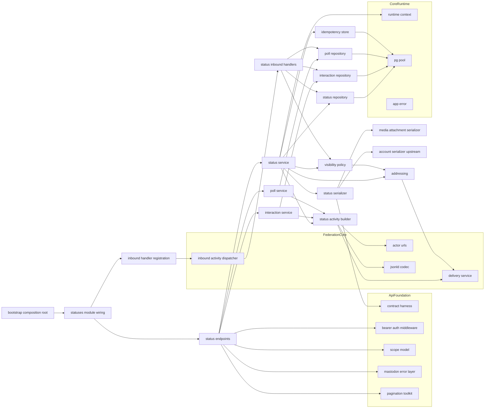
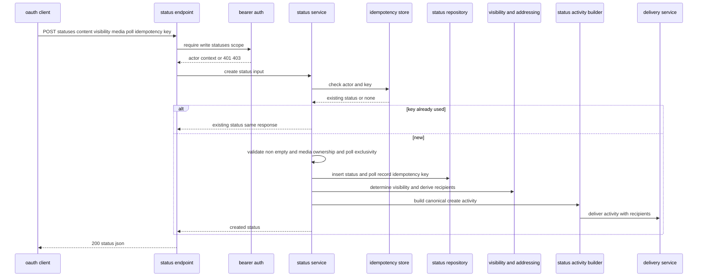
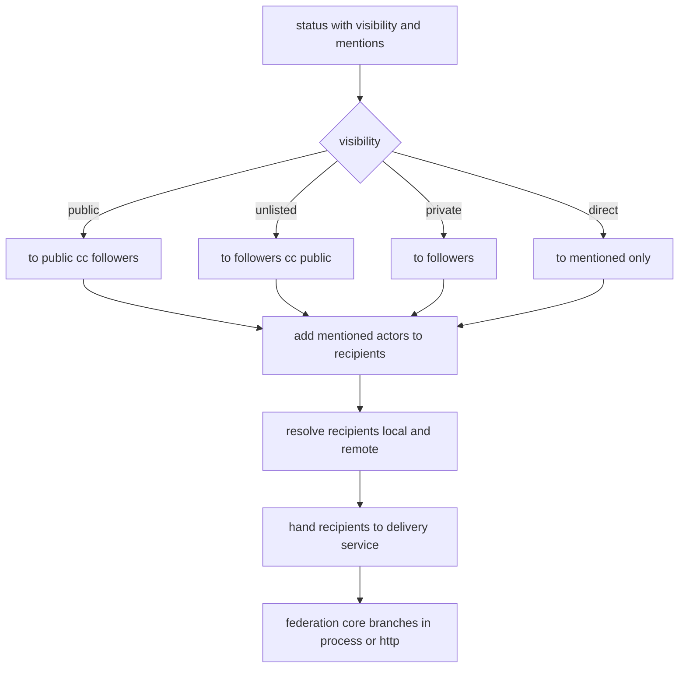
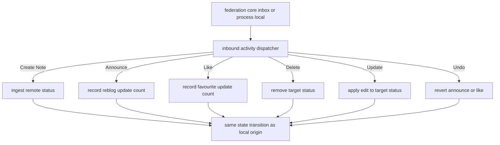

# Design Document

## Overview

**Purpose**: statuses-core は kawasemi の投稿（Status）コア状態モデルと Mastodon 互換 API を提供する。投稿の作成/取得/削除/編集（履歴・source）/スレッド context、ブースト（reblog）・お気に入り（favourite）・ブックマーク（bookmark）・ピン留め（pin）、投票（Poll）、投稿時の冪等性（`Idempotency-Key`）、そして本プロジェクト最重要制約である「可視性 / addressing がローカル最適化パスとリモート連合パスで同一結果」を体現する可視性・addressing 共通パスを担う。Status / Poll の JSON 契約を所有し、ゴールデンで固定する。

**Users**: 標準クライアント（Ivory・Elk・Phanpy 等）のユーザーが本 spec を通じて投稿の一連操作を行う。下流 spec（timelines / notifications / search / custom-federation）の実装者は、本 spec が確立する Status / Poll 契約・投稿状態モデル・受信ディスパッチ登録に乗る。

**Impact**: core-runtime のランタイム土台、api-foundation の横断土台（Bearer/スコープ/エラー/ページネーション/契約ハーネス）、federation-core の配送共通パス（`DeliveryService`）と受信ディスパッチ境界（`InboundActivityHandler` レジストリ）、media-pipeline の MediaAttachment 契約の上に、投稿モジュール群（`src/statuses/`）と投稿関連の永続テーブルを追加する。可視性/addressing を単一ロジックで所有し、federation-core へ確定済み recipient を渡すことで意味論対称を構造的に担保する。

### Goals

- Mastodon 互換の投稿操作（作成/取得/削除/編集/context、reblog/favourite/bookmark/pin、Poll）を提供する。
- 可視性と addressing を単一ロジックで決定し、ローカル/リモートで同一結果になることを連合テストで担保する。
- Status / Poll の JSON 契約をゴールデン固定し、出力ドリフトを防ぐ。
- `Idempotency-Key` で投稿の二重作成を防止する。
- 投稿関連の受信 Activity（Create/Announce/Like/Delete/Update + Undo）の意味論を federation-core の受信境界に登録する。
- 連合方言（引用・絵文字リアクション）をコア状態モデルから隔離する。

### Non-Goals

- タイムライン集約（home/public/local/tag）、通知生成（timelines / notifications）。
- 引用・絵文字リアクション・MFM の方言正規化（custom-federation）。検索（search）。
- フォロー/ブロック/ミュートの関係操作（social-graph）。Account / Instance エンティティ契約そのもの（accounts-and-instance。本 spec は埋め込み参照のみ）。
- OAuth・ページネーション・エラー・契約ハーネス基盤（api-foundation）。HTTP Signatures・配送キュー・受信パイプライン配管（federation-core）。メディアの非同期処理・MediaAttachment 契約そのもの（media-pipeline）。
- pin の featured collection 連合（MVP では pin はローカル状態のみ）。

## Boundary Commitments

### This Spec Owns

- 投稿 API: 作成（`POST /api/v1/statuses`）・取得（`GET /api/v1/statuses/:id`）・削除（`DELETE /api/v1/statuses/:id`）・編集（`PUT /api/v1/statuses/:id`）・編集履歴（`GET /api/v1/statuses/:id/history`）・編集ソース（`GET /api/v1/statuses/:id/source`）・context（`GET /api/v1/statuses/:id/context`）。
- 操作 API: reblog/unreblog・favourite/unfavourite・bookmark/unbookmark・pin/unpin・ブックマーク一覧（`GET /api/v1/bookmarks`）。
- 投票 API: Poll 取得（`GET /api/v1/polls/:id`）・投票（`POST /api/v1/polls/:id/votes`）と、投稿作成時の Poll 作成。
- 投稿の永続モデル（投稿・編集履歴・お気に入り・ブースト・ブックマーク・ピン・投票・投票選択・投票回答）と、その状態遷移・カウンタ。
- 可視性判定（`VisibilityPolicy`）と addressing 導出（`Addressing`：`to`/`cc`/recipient 集合）の単一ロジック（ローカル/リモート共通）。
- 正規 Activity の生成（`StatusActivityBuilder`：Create/Announce/Like/Delete/Update + Undo + Vote）と、federation-core 配送共通パスへの依頼。
- 投稿関連受信 Activity の意味論処理（`InboundActivityHandler` 実装群）と、federation-core ディスパッチ境界への登録。
- 投稿時の冪等性（`Idempotency-Key` の記録と再送時の同一応答）。
- Status / Poll エンティティ JSON 契約（シリアライズ）と、api-foundation 契約ハーネスへのゴールデン登録。
- accounts-and-instance が定義する委譲ポートの**実装供給**: `AccountStatusesProvider`（`GET /accounts/:id/statuses` 用の投稿ページ供給）を実装し、`AccountCountsProvider` へ `statuses_count`（および `last_status_at`）を供給する。ポートの契約定義自体は accounts-and-instance が所有し、本 spec は実装登録のみ。Account 契約は再定義しない。
- notifications が定義する `NotificationEventSink`（既定 no-op）への `NotificationEvent` の emit: favourite / reblog(Announce) / mention / poll-end / （任意で）edit の状態遷移コミット後に、冪等に通知イベントを emit する。`NotificationEvent` / シンク契約は notifications が所有し、本 spec は emit のみ。
- ハッシュタグの永続化（`tags` / `status_tags` 関連テーブル）と、タグ関連付けの照会可能な読み取り境界（タグ→投稿関連付け / 投稿→タグの取得）。下流（timelines のタグタイムライン・search のハッシュタグインデックス）が永続化済みタグ関連付けを消費できるようにする。
- リモート投稿取り込みエントリポイント `StatusIngestService`（ドキュメント/URL → Status）: 既存の受信 Create(Note) 正規化パスを再利用し、受信 Activity ディスパッチの外（search の `RemoteResolver` 等）からも呼び出せる形で公開する。

### Out of Boundary

- タイムライン集約・通知生成（timelines / notifications）。検索（search）。
- 引用・絵文字リアクション・MFM の方言正規化（custom-federation）。
- フォロー/ブロック/ミュート実体・関係操作（social-graph。本 spec はブロック/ミュートの可視性影響を上流の判定結果として受け取るのみ）。
- Account / Instance / Relationship 契約（accounts-and-instance。Status への Account 埋め込みは上流のシリアライズを委譲）。
- 認証・スコープ・エラー本文・ページネーション・レート制限・契約ハーネス基盤（api-foundation）。
- 署名・配送キュー・受信パイプライン配管・WebFinger・JSON-LD codec（federation-core。本 spec は配送依頼とハンドラ登録のみ）。
- メディアの非同期処理・保管・MediaAttachment 契約（media-pipeline。識別子で添付するのみ）。
- 統一エラー型骨格・DI 境界・マイグレーション基盤・テストハーネス土台（core-runtime）。

### Allowed Dependencies

- core-runtime: `AppState` / `RuntimeContext`（`Clock` / `IdGenerator` / `Rng`）/ `PgPool` / `AppError` / 構造化ログ / マイグレーション基盤 / テストハーネス（`spawn_test_app`）/ axum・tower・tokio 基盤。加えて、共有ドメインプリミティブモジュール（core-runtime が正準所有）の `Visibility` enum と `AccountRef` を消費する（本 spec はこれらを再定義せず import する）。
- api-foundation: Bearer 認証（`RequestActorContext` = 単一アクター + `ScopeSet`、`authenticate` / `require_scope`）/ `Scope`（`read:statuses` / `write:statuses` / `write:favourites` / `write:bookmarks` / `read:bookmarks` 等の内包判定）/ `MastodonError`（互換エラー本文・ステータス対応）/ ページネーション（`PageParams` / `Cursor` / `Page<T>` / `build_link_header`）/ `X-RateLimit-*` レイヤー / 契約ハーネス（`assert_golden` / `register_fixture`）。
- federation-core: `DeliveryService::deliver(DeliveryRequest)`（配送共通パス）/ `InboundActivityHandler` + `InboundActivityDispatcher::register`（受信委譲）/ `ActorUrls`（オブジェクト/コレクション URL）/ `JsonLdCodec`（@context 付与・安全展開）/ `ParsedActivity` / `InboundContext`。
- media-pipeline: MediaAttachment シリアライズと `find_owned(media_id, actor_id)`（所有スコープ取得）。
- accounts-and-instance: Account シリアライズ点（埋め込み用）。並行生成のため抽象参照で受け、契約確定後に結線。加えて委譲ポート契約 `AccountStatusesProvider`（`StatusesQuery` → `Page<serde_json::Value>`）/ `AccountCountsProvider`（`AccountCounts`：`statuses_count` / `last_status_at` 等）を消費し、本 spec が実装供給する（契約は accounts-and-instance 所有）。既定実装（空ページ / 0）は accounts-and-instance が保持し、本 spec の実装が bootstrap で差し替える。
- notifications: 通知生成シーム `NotificationEventSink`（trait・既定 no-op）と `NotificationEvent` 型（`recipient` / `origin`（`AccountRef`）/ `kind`（`NotificationType`）/ `target_status_id` / `occurred_at`）を消費し、状態遷移コミット後に emit する。契約は notifications 所有。既定 no-op のため notifications 未配線でも本 spec は成功する。
- 下流仕様（タイムライン集約・通知生成本体・方言正規化・検索）の業務ロジックを本 spec に持ち込まない（通知は emit のみ、タグは永続化と読み取り境界のみ）。

### Revalidation Triggers

- Status / Poll JSON 契約の形（フィールド・型・null 規律・reblog ネスト・編集表現）の変更。
- 投稿状態モデル（投稿・お気に入り・ブースト・ブックマーク・ピン・投票）のスキーマ・カウンタ規約の変更。
- 可視性判定（`VisibilityPolicy`）・addressing 導出（`Addressing`）のロジック・出力 recipient 契約の変更。
- 正規 Activity 生成（`StatusActivityBuilder`）の Activity 形・配送依頼契約の変更。
- 受信ハンドラが処理する Activity 種別集合・状態反映規約の変更。
- 冪等キーの一意化規約・再送応答契約の変更。
- 上流（core-runtime / api-foundation / federation-core / media-pipeline / accounts-and-instance）の消費契約変更（上流発の再検証）。

## Architecture

### Architecture Pattern & Boundary Map

選択パターン: **レイヤード（API → Service → Repository）+ 可視性/配送の共通サービス**。横断関心（認証・スコープ・エラー・ページネーション・レート制限）は api-foundation のレイヤー/抽出器を再利用し、投稿業務は API → サービス → リポジトリに分離する。可視性判定・addressing 導出・正規 Activity 生成を独立コンポーネントに切り出し、federation-core の `DeliveryService` 共通パスへ確定 recipient を渡す。受信は `InboundActivityHandler` 実装をディスパッチ境界へ登録する。依存方向は一方向（左→右、上位は下位のみ参照）。



**Architecture Integration**:
- Selected pattern: レイヤード + 共通サービス。投稿業務を service に集約し、可視性/addressing/Activity 生成を独立化して federation-core 共通パスへ委譲。
- Domain/feature boundaries: 投稿本体（status）・操作（interaction: reblog/fav/bookmark/pin）・投票（poll）・可視性/配送（visibility/addressing/activity builder）・シリアライズ（serializer）・受信（inbound handlers）を分離。
- Existing patterns preserved: steering「意味論対称・物理配送最適化」「レイヤー分離」「契約の集約」「決定性の強制」「方言隔離」。api-foundation「Bearer/スコープ/エラー/契約ハーネス」、federation-core「配送共通パス/受信委譲」。
- New components rationale: 各コンポーネントは Boundary Commitments の 1 関心に 1:1 対応。可視性/addressing/Activity 生成を分離し最重要リスクを封じ込め。
- Steering compliance: 外部ブローカー非依存（配送は federation-core DB キュー）、決定性（時刻/ID/乱数は `RuntimeContext`）、可観測性（失敗時診断）、方言非依存。

### Technology Stack

| Layer | Choice / Version | Role in Feature | Notes |
|-------|------------------|-----------------|-------|
| Backend / Services | Rust (edition 2021) + axum 0.7 系 | 投稿エンドポイント・サービス | core-runtime クレートに `src/statuses/` を追加 |
| Middleware | api-foundation の tower レイヤー/抽出器 | Bearer 認証・スコープ・エラー変換・ページネーション・レート制限の再利用 | 新規ミドルウェアは作らない |
| Federation | federation-core `DeliveryService` / `InboundActivityHandler` | 配送共通パス・受信意味論登録 | 物理配送分岐は federation-core が所有 |
| Data / Storage | PostgreSQL + sqlx 0.7 系 | 投稿・操作・投票・冪等キーの永続化 | 既存 `PgPool` を共有 |
| Media | media-pipeline MediaAttachment | 添付の所有検証・シリアライズ | 識別子で添付 |
| Test | core-runtime `spawn_test_app` + api-foundation 契約ハーネス + federation-core `spawn_federation_pair` | 統合 / 契約 / 連合（2 インスタンス）テスト | 決定的 `RuntimeContext` |

> バージョンは系列の目安。実装時に最新互換版へ固定する。選定理由・代替比較は `research.md` 参照。

## File Structure Plan

### Directory Structure

```
migrations/
└── 0007_statuses.sql            # statuses / status_edits / favourites / reblogs / bookmarks / pins / polls / poll_options / poll_votes / status_idempotency_keys（仮番号。research.md の調整事項参照）

src/
└── statuses/
    ├── mod.rs                   # StatusesModule 組み立て（サービス/リポジトリのハンドル束ね）・ルータ装着点・受信ハンドラ登録の公開
    ├── model.rs                 # Status, StatusEdit, Favourite, Reblog, Bookmark, Pin, Poll, PollOption, PollVote, IdempotencyRecord 等のドメイン型（Visibility / AccountRef は core-runtime の domain-primitives を import）
    ├── status_repository.rs     # StatusRepository（投稿の挿入・可視スコープ取得・削除・編集・context 走査・カウンタ更新）
    ├── interaction_repository.rs # InteractionRepository（favourite/reblog/bookmark/pin の記録・取消・存在判定・一覧）
    ├── poll_repository.rs       # PollRepository（poll/option/vote の挿入・投票記録・集計取得）
    ├── idempotency.rs           # IdempotencyStore（(actor_id, key) 一意記録・再送時の status 解決）
    ├── visibility.rs            # VisibilityPolicy（可視性判定・可視フィルタ。ローカル/リモート共通）
    ├── addressing.rs            # Addressing（可視性→to/cc/recipient 集合の導出）
    ├── activity_builder.rs      # StatusActivityBuilder（Create/Announce/Like/Delete/Update/Undo/Vote の正規 Activity 生成＋配送依頼）
    ├── serializer.rs            # StatusSerializer / PollSerializer（Mastodon 互換 JSON。Account/Media は上流委譲・契約ハーネス登録）
    ├── status_service.rs        # StatusService（作成・取得・削除・編集・履歴・source・context、冪等性、可視性/配送結線）
    ├── interaction_service.rs   # InteractionService（reblog/fav/bookmark/pin と連合配送・カウンタ）
    ├── poll_service.rs          # PollService（poll 取得・投票・連合配送）
    ├── inbound.rs               # 受信ハンドラ群（CreateNoteHandler/AnnounceHandler/LikeHandler/DeleteHandler/UpdateHandler/UndoHandler）と種別登録
    └── endpoints.rs             # statuses/polls/bookmarks の HTTP ハンドラと応答コード規律

tests/
├── status_contract_it.rs       # Status / Poll ゴールデン（決定的・null 規律・reblog ネスト・編集表現）（契約）
├── status_crud_it.rs           # 作成/取得/削除/編集/履歴/source・冪等性・スコープ・空投稿拒否（統合）
├── status_context_it.rs        # context 祖先/子孫・可視フィルタ・未認証公開のみ（統合）
├── interactions_it.rs          # reblog/fav/bookmark/pin 登録/解除・重複防止・カウンタ・スコープ・ブックマーク一覧（統合）
├── polls_it.rs                 # poll 作成/投票・締切/範囲/重複拒否・集計・メディア排他（統合）
├── visibility_addressing_it.rs # 可視性→addressing 導出・可視フィルタ・direct/private/unlisted/public（統合）
└── statuses_federation_pair_it.rs # 2 インスタンス往復：投稿/ブースト/お気に入り/削除/編集のローカルとHTTPで結果同値（連合）
```

### Modified Files

- `src/state.rs`（core-runtime）— `AppState` に `StatusesModule`（各サービス/リポジトリのハンドル）を追加。
- `src/bootstrap.rs`（core-runtime）— プール確立・api-foundation・federation-core・media-pipeline モジュール構築後に `StatusesModule` を構築し、`DeliveryService` への依頼経路を結線、受信ハンドラを `InboundActivityDispatcher` へ登録、`AppState` に格納。
- `src/server.rs`（core-runtime）— 投稿/投票/ブックマークのルータを土台ルータへ装着し、api-foundation 横断レイヤー（認証・エラー・レート制限）が適用される装着点に乗せる。
- `src/config/mod.rs`（core-runtime）— 投稿最大文字数・投票選択肢上限/最小締切・冪等キー保持方針等の運用関連設定項目を追加。

> 各ファイルは単一責務。投稿本体（status）・操作（interaction）・投票（poll）・可視性/配送（visibility/addressing/activity_builder）・シリアライズ（serializer）・受信（inbound）を分離し、core-runtime の Composition Root へ一方向に配線する。

## System Flows

### 投稿作成（冪等性・可視性・配送共通パス）



冪等キーは (actor, key) で一意化し、再送は新規作成せず同一応答（5.1, 5.2）。可視性/addressing は単一ロジックで recipient を確定し、`DeliveryService` へ渡す（4.1–4.3）。配送手段の分岐は federation-core 側（4.3, 4.4）。

### 可視性と addressing の導出（ローカル/リモート共通）



可視性から `to`/`cc` と recipient 集合を単一導出（4.1, 4.2）。ローカル/リモート受信者が混在しても同一意味論を適用し、物理配送だけ federation-core が分岐（4.4）。同一導出をローカル発生・リモート配送の双方で使う（4.5）。

### 受信 Activity の意味論処理（ディスパッチ委譲）



federation-core が署名検証・重複排除・ブロック判定を終えた `ParsedActivity` をハンドラへ委譲する（14.1）。各ハンドラはローカル発生時と同一の状態遷移ロジックを呼ぶ（14.5）。未知方言プロパティは解釈せず継続（15.2）。

## Requirements Traceability

| Requirement | Summary | Components | Interfaces | Flows |
|-------------|---------|------------|------------|-------|
| 1.1–1.6 | Status JSON 契約・操作状態・reblog ネスト・ゴールデン・null 規律・方言非含有 | StatusSerializer | to_json(), register golden | （契約テスト） |
| 2.1–2.4 | Poll JSON 契約・投票状態・expired・ゴールデン | PollSerializer | to_json(), register golden | （契約テスト） |
| 3.1–3.6 | 投稿作成・空拒否・CW/sensitive・メディア所有・返信・言語/抽出 | StatusEndpoints, StatusService, StatusRepository | create_status() | 投稿作成 |
| 4.1–4.5 | 可視性単一判定・addressing 導出・正規 Activity・混在同一意味論・結果同値 | VisibilityPolicy, Addressing, StatusActivityBuilder | determine(), derive_recipients(), build_create() | 可視性/addressing・投稿作成 |
| 5.1–5.3 | 冪等キー記録・再送同一応答・キー無し通常作成 | IdempotencyStore, StatusService | check_or_record() | 投稿作成 |
| 6.1–6.4 | 取得可視フィルタ・context 祖先/子孫・不可視除外・未認証公開のみ | StatusService, StatusRepository, VisibilityPolicy | show(), context() | （取得） |
| 7.1–7.4 | 削除・所有検証・Delete 配送・関連整合 | StatusService, StatusActivityBuilder, InteractionRepository | delete_status() | 受信/配送 |
| 8.1–8.5 | 編集・履歴・source・Update 配送・所有検証 | StatusService, StatusRepository, StatusActivityBuilder | edit_status(), history(), source() | 配送 |
| 9.1–9.5 | reblog/unreblog・Announce/Undo 配送・重複防止・カウンタ・可視性 | InteractionService, InteractionRepository, StatusActivityBuilder | reblog(), unreblog() | 配送 |
| 10.1–10.4 | favourite/unfavourite・Like/Undo 配送・カウンタ・重複防止 | InteractionService, InteractionRepository, StatusActivityBuilder | favourite(), unfavourite() | 配送 |
| 11.1–11.4 | bookmark/unbookmark・一覧・ローカルのみ非連合 | InteractionService, InteractionRepository | bookmark(), list_bookmarks() | （ローカル） |
| 12.1–12.4 | pin/unpin・所有検証・direct 不可・ローカル状態 | InteractionService, InteractionRepository | pin(), unpin() | （ローカル） |
| 13.1–13.6 | poll 作成・投票・締切/範囲/重複拒否・メディア排他・集計・連合 | PollService, PollRepository, StatusActivityBuilder | create_poll(), vote() | 投稿作成/配送 |
| 14.1–14.5 | 受信ハンドラ登録・Create/Announce/Like/Delete/Update 反映・共通遷移 | InboundHandlers, InboundReg | register(), handle() | 受信 |
| 15.1–15.3 | 方言非保持・未知プロパティ継続・方言非依存登録 | model, InboundHandlers | - | 受信 |

## Components and Interfaces

| Component | Domain/Layer | Intent | Req Coverage | Key Dependencies (P0/P1) | Contracts |
|-----------|--------------|--------|--------------|--------------------------|-----------|
| model | Status Domain | 投稿/操作/投票/冪等のドメイン型・可視性・状態 | 1,2,3,7,8,9,10,11,12,13,15 | core-runtime Id/時刻型 (P0) | State |
| StatusRepository | Data | 投稿の挿入・可視取得・削除・編集・context・カウンタ | 3,6,7,8 | PgPool (P0) | Service, State |
| InteractionRepository | Data | fav/reblog/bookmark/pin の記録・取消・判定・一覧 | 9,10,11,12 | PgPool (P0) | Service, State |
| PollRepository | Data | poll/option/vote の挿入・投票・集計 | 13 | PgPool (P0) | Service, State |
| IdempotencyStore | Data | (actor,key) 一意記録・再送解決 | 5 | PgPool (P0) | Service, State |
| VisibilityPolicy | Visibility | 可視性判定・可視フィルタ（共通） | 4,6,9,10,12 | model (P0) | Service |
| Addressing | Visibility | 可視性→to/cc/recipient 導出（共通） | 4 | VisibilityPolicy (P0), ActorUrls (P1) | Service |
| StatusActivityBuilder | Federation Bridge | 正規 Activity 生成＋配送依頼 | 4,7,8,9,10,13 | DeliveryService, ActorUrls, JsonLdCodec, Addressing (P0) | Service |
| StatusSerializer | API/Serialize | Status JSON 契約・操作状態・reblog ネスト | 1 | MediaSerializer, AccountSerializer(上流), 契約ハーネス (P0/P1) | Service |
| PollSerializer | API/Serialize | Poll JSON 契約・投票状態・expired | 2 | 契約ハーネス (P1) | Service |
| StatusService | Service | 作成/取得/削除/編集/履歴/source/context・冪等・可視性配送結線 | 3,5,6,7,8 | StatusRepo, IdempotencyStore, Visibility, Addressing, ActivityBuilder, RuntimeContext (P0) | Service |
| InteractionService | Service | reblog/fav/bookmark/pin と連合配送・カウンタ | 9,10,11,12 | InteractionRepo, StatusRepo, VisibilityPolicy, ActivityBuilder (P0) | Service |
| PollService | Service | poll 取得・投票・連合配送 | 13 | PollRepo, StatusRepo, VisibilityPolicy, ActivityBuilder (P0) | Service |
| InboundHandlers | Inbound | 受信 Activity の意味論反映（共通遷移） | 14,15 | StatusRepo, InteractionRepo, PollRepo, VisibilityPolicy (P0) | Service |
| StatusEndpoints | API | statuses/polls/bookmarks の HTTP 表層・応答コード | 3,6,7,8,9,10,11,12,13 | 各 Service, Bearer, Scope, MastodonError, Pagination (P0) | API |
| StatusesModule(wiring) | Runtime | 配線・ルータ装着・受信ハンドラ登録・AppState 格納 | 4,14 | core-runtime bootstrap, Dispatcher (P0) | Service |

依存方向（左→右、上位は下位のみ参照）: `model → StatusRepository / InteractionRepository / PollRepository / IdempotencyStore / VisibilityPolicy → Addressing / StatusSerializer / PollSerializer → StatusActivityBuilder → StatusService / InteractionService / PollService / InboundHandlers → StatusEndpoints → StatusesModule wiring`。

### Status Domain / ドメイン層

#### model

| Field | Detail |
|-------|--------|
| Intent | 投稿・操作・投票・冪等のドメイン型と可視性・状態を型で表現する |
| Requirements | 1.1, 2.1, 3.1, 7.1, 8.1, 9.1, 10.1, 11.1, 12.1, 13.1, 15.1 |

**Responsibilities & Constraints**
- `Status` は `id`・`actor_id`（投稿者、actor-model 論理参照）・`uri`・`content`・`visibility`・`sensitive`・`spoiler_text`・`in_reply_to_id`・`language`・カウンタ（`reblogs_count`/`favourites_count`/`replies_count`）・`reblog_of_id`（ブースト時）・`poll_id`・`edited_at`・タイムスタンプを持つ（1.1, 3.x）。
- `Visibility` は `Public` / `Unlisted` / `Private` / `Direct` の 4 値（4.1）。
- コア状態モデルに連合方言フィールド（引用・絵文字リアクション）を含めない（15.1）。
- リモート投稿は `uri` がリモート URL、ローカル投稿は `ActorUrls` 由来の URL を持つ（ローカル/リモート同一モデル）。

**Dependencies**
- Inbound: 全投稿コンポーネント (P0)
- Outbound: core-runtime Id 型・時刻型 (P0)

**Contracts**: State [x]

##### 型定義（抜粋）
```rust
use core_runtime::domain_primitives::{Visibility, AccountRef}; // 正準共有型: core-runtime が所有（本 spec では定義せず import。VisibilityPolicy の振る舞いのみ本 spec が所有）
pub struct Status {
    pub id: Id, pub actor_id: Id, pub uri: String, pub url: Option<String>,
    pub content: String, pub visibility: Visibility, pub sensitive: bool,
    pub spoiler_text: String, pub in_reply_to_id: Option<Id>, pub in_reply_to_account_id: Option<Id>,
    pub reblog_of_id: Option<Id>, pub poll_id: Option<Id>, pub language: Option<String>,
    pub reblogs_count: i64, pub favourites_count: i64, pub replies_count: i64,
    pub created_at: OffsetDateTime, pub edited_at: Option<OffsetDateTime>, pub local: bool,
}
pub struct StatusEdit { pub status_id: Id, pub content: String, pub spoiler_text: String, pub sensitive: bool, pub created_at: OffsetDateTime }
pub struct Poll { pub id: Id, pub status_id: Id, pub expires_at: Option<OffsetDateTime>, pub multiple: bool }
pub struct PollOption { pub poll_id: Id, pub idx: i32, pub title: String, pub votes_count: i64 }
pub struct IdempotencyRecord { pub actor_id: Id, pub key: String, pub status_id: Id, pub created_at: OffsetDateTime }
```
- Invariants: `actor_id` は必須。`reblog_of_id=Some` のブーストは本文系を持たず元投稿を参照。`poll_id` と添付は排他（13.1）。

### Data / データ層

#### StatusRepository

| Field | Detail |
|-------|--------|
| Intent | 投稿の挿入・可視スコープ取得・削除・編集・context 走査・カウンタ更新を提供する |
| Requirements | 3.1, 3.5, 6.1, 6.2, 7.1, 7.4, 8.1, 8.2 |

**Responsibilities & Constraints**
- 挿入時に `actor_id`・`uri`・可視性・返信関係を記録（3.1, 3.5）。ID/時刻は `RuntimeContext`（決定性）。
- 取得は可視性フィルタ（`VisibilityPolicy` 判定）を反映した可視スコープで行い、不可視/未存在は `None` 相当（6.1）。
- context は返信関係を辿って祖先・子孫を取得（6.2）。削除は投稿と関連参照の整合を保つ（7.4）。
- 編集は本文系を更新し `edited_at` を設定、編集前内容を `status_edits` に保存（8.1, 8.2）。カウンタは原子的に増減。

**Contracts**: Service [x] / State [x]

##### Service Interface
```rust
pub async fn insert_status(pool: &PgPool, status: &Status) -> Result<(), AppError>;
pub async fn find_visible(pool: &PgPool, id: Id, viewer: Option<Id>) -> Result<Option<Status>, AppError>;
pub async fn ancestors(pool: &PgPool, id: Id, viewer: Option<Id>) -> Result<Vec<Status>, AppError>;
pub async fn descendants(pool: &PgPool, id: Id, viewer: Option<Id>) -> Result<Vec<Status>, AppError>;
pub async fn delete_status(pool: &PgPool, id: Id) -> Result<(), AppError>; // 関連整合を保つ
pub async fn apply_edit(pool: &PgPool, id: Id, edit: &StatusEdit, now: OffsetDateTime) -> Result<(), AppError>;
pub async fn list_edits(pool: &PgPool, id: Id) -> Result<Vec<StatusEdit>, AppError>;
pub async fn adjust_counts(pool: &PgPool, id: Id, kind: CountKind, delta: i64) -> Result<(), AppError>;
```
- Postconditions: `find_visible` は viewer から不可視の投稿を返さない（6.1）。

#### InteractionRepository

| Field | Detail |
|-------|--------|
| Intent | favourite/reblog/bookmark/pin の記録・取消・存在判定・一覧を提供する |
| Requirements | 9.1, 9.3, 9.4, 10.1, 10.3, 10.4, 11.1, 11.2, 11.3, 12.1, 12.2 |

**Responsibilities & Constraints**
- 各操作は (actor_id, status_id) を一意キーとし重複記録を防ぐ（9.3, 10.4）。取消は当該行削除。
- ブックマークは `read:bookmarks` 一覧用にブックマーク固有カーソル（ブックマーク作成順）で取得（11.3）。
- reblog は status テーブルに `reblog_of_id` を持つ専用 status として記録（reblog のネスト表現に整合）。

**Contracts**: Service [x] / State [x]

##### Service Interface
```rust
pub async fn add_favourite(pool: &PgPool, actor_id: Id, status_id: Id) -> Result<bool, AppError>; // 新規 true / 既存 false
pub async fn remove_favourite(pool: &PgPool, actor_id: Id, status_id: Id) -> Result<bool, AppError>;
pub async fn add_bookmark(pool: &PgPool, actor_id: Id, status_id: Id) -> Result<bool, AppError>;
pub async fn list_bookmarks(pool: &PgPool, actor_id: Id, page: PageParams) -> Result<Page<Status>, AppError>;
pub async fn set_pin(pool: &PgPool, actor_id: Id, status_id: Id, pinned: bool) -> Result<bool, AppError>;
pub async fn find_reblog(pool: &PgPool, actor_id: Id, status_id: Id) -> Result<Option<Status>, AppError>;
```

#### PollRepository / IdempotencyStore

| Field | Detail |
|-------|--------|
| Intent | 投票の永続化・集計取得と、投稿冪等キーの一意記録・再送解決 |
| Requirements | 5.1, 5.2, 13.1, 13.2, 13.5 |

**Responsibilities & Constraints**
- Poll: 選択肢・締切・単一/複数を記録し、投票は (poll_id, actor_id) 一意で重複防止（13.5）。集計は選択肢別 votes_count と voters_count。
- Idempotency: `(actor_id, key)` 一意制約で初回作成 status_id を記録、再送時は記録済み status_id を返す（5.1, 5.2）。競合は一意制約で原子化。

**Contracts**: Service [x] / State [x]

##### Service Interface
```rust
// Poll
pub async fn insert_poll(pool: &PgPool, poll: &Poll, options: &[PollOption]) -> Result<(), AppError>;
pub async fn record_vote(pool: &PgPool, poll_id: Id, actor_id: Id, choices: &[i32], now: OffsetDateTime) -> Result<VoteOutcome, AppError>; // 締切/範囲/重複は AppError or Skipped
pub async fn tally(pool: &PgPool, poll_id: Id, viewer: Option<Id>) -> Result<PollTally, AppError>;
// Idempotency
pub async fn check_or_reserve(pool: &PgPool, actor_id: Id, key: &str) -> Result<IdempotencyLookup, AppError>; // Existing(status_id) | Reserved
pub async fn bind(pool: &PgPool, actor_id: Id, key: &str, status_id: Id) -> Result<(), AppError>;
```

### Visibility / 可視性層

#### VisibilityPolicy / Addressing

| Field | Detail |
|-------|--------|
| Intent | 可視性を単一判定し、可視性から to/cc/recipient を導出する（ローカル/リモート共通） |
| Requirements | 4.1, 4.2, 6.1, 6.3, 6.4, 9.5, 12.4 |

**Responsibilities & Constraints**
- `VisibilityPolicy`: 投稿が viewer から可視かを単一ロジックで判定し、取得・context・操作の可視性チェックで同一適用（4.1, 6.1, 6.3, 9.5）。未認証は公開のみ可視（6.4）。
- `Addressing`: 可視性から `to`/`cc`（public collection・followers collection・メンション宛先）と recipient 集合を導出（4.2）。`direct` はメンション宛のみ、`public`/`unlisted` は public collection の配置差を持つ。
- 本層は意味論のみ。ローカル/リモートの物理差を持たず、recipient を確定して `StatusActivityBuilder` 経由で `DeliveryService` へ渡す（4.2, 4.4）。

**Contracts**: Service [x]

##### Service Interface
```rust
pub fn is_visible(status: &Status, viewer: Option<Id>, rel: &ViewerRelation) -> bool; // フォロー/メンション関係は上流結果を受ける
pub fn derive_addressing(status: &Status, mentions: &[ActorRef], followers_uri: &str) -> Addressing; // to/cc
pub fn derive_recipients(addressing: &Addressing, mentions: &[ActorRef]) -> Vec<Recipient>; // DeliveryService 用
pub struct Addressing { pub to: Vec<String>, pub cc: Vec<String> }
```
- Invariants: 同一入力に対しローカル発生・リモート配送で同一 `Addressing`/recipient を返す（4.5）。

### Federation Bridge / 連合橋渡し層

#### StatusActivityBuilder

| Field | Detail |
|-------|--------|
| Intent | 投稿関連の正規 Activity を生成し federation-core 配送共通パスへ依頼する |
| Requirements | 4.3, 7.3, 8.4, 9.2, 9.4, 10.2, 10.3, 13.6 |

**Responsibilities & Constraints**
- Create(Note) / Announce / Like / Delete / Update / Undo(Announce|Like) / Vote の正規 Activity を `JsonLdCodec`・`ActorUrls` を用いて生成（4.3）。
- 生成した Activity と `Addressing` 由来 recipient を `DeliveryService::deliver(DeliveryRequest)` に渡す。物理配送分岐は federation-core が所有（4.3, 4.4）。
- ローカル発生の状態反映は、必要に応じ federation-core の in-process 経路（`process_local`）を通して受信ハンドラと同一遷移に合流させ、意味論対称を担保。

**Contracts**: Service [x]

##### Service Interface
```rust
pub async fn deliver_create(&self, status: &Status, addressing: &Addressing, recipients: Vec<Recipient>) -> Result<(), AppError>;
pub async fn deliver_announce(&self, reblog: &Status, target: &Status, recipients: Vec<Recipient>) -> Result<(), AppError>;
pub async fn deliver_like(&self, actor: Id, target: &Status) -> Result<(), AppError>;
pub async fn deliver_undo(&self, actor: Id, undone: UndoKind, target: &Status) -> Result<(), AppError>;
pub async fn deliver_delete(&self, status: &Status, recipients: Vec<Recipient>) -> Result<(), AppError>;
pub async fn deliver_update(&self, status: &Status, recipients: Vec<Recipient>) -> Result<(), AppError>;
pub async fn deliver_vote(&self, actor: Id, poll: &Poll, target: &Status, choices: &[i32]) -> Result<(), AppError>;
```
- Postconditions: 同一投稿に対し local 経路と remote 経路が同一正規 Activity を扱う（4.5、federation-core 10.5 と整合）。

### API / Serialize 層

#### StatusSerializer / PollSerializer

| Field | Detail |
|-------|--------|
| Intent | Status / Poll の Mastodon 互換 JSON 契約をシリアライズし契約ハーネスに登録する |
| Requirements | 1.1, 1.2, 1.3, 1.4, 1.5, 1.6, 2.1, 2.2, 2.3, 2.4 |

**Responsibilities & Constraints**
- Status: 1.1 のフィールドを出力。認証文脈の操作状態（`favourited`/`reblogged`/`bookmarked`/`pinned`/`muted`）を反映（1.2）。reblog は `reblog` にネスト（1.3）。null 規律を Mastodon 実レスポンスに合わせ一貫維持（1.5）。方言フィールドを含めない（1.6）。
- Account は accounts-and-instance のシリアライズへ委譲、`media_attachments` は media-pipeline の Serializer を再利用（埋め込み境界）。
- Poll: 2.1 のフィールド、投票状態（`voted`/`own_votes`）（2.2）、`expired` は締切と現在時刻で判定（2.3）。
- 双方を api-foundation 契約ハーネスへゴールデン登録し、決定的 `RuntimeContext` で再現可能にする（1.4, 2.4）。

**Contracts**: Service [x]

##### Service Interface
```rust
pub fn status_to_json(status: &Status, ctx: &SerializeContext) -> serde_json::Value; // viewer 操作状態・reblog ネスト・null 規律
pub fn poll_to_json(poll: &Poll, tally: &PollTally, ctx: &SerializeContext) -> serde_json::Value;
pub struct SerializeContext { pub viewer: Option<Id>, pub now: OffsetDateTime, pub req_uri: RequestUriContext }
```

### Service / サービス層

#### StatusService

| Field | Detail |
|-------|--------|
| Intent | 投稿の作成/取得/削除/編集/履歴/source/context と冪等性・可視性配送結線を集約する |
| Requirements | 3.1, 3.2, 3.3, 3.4, 3.5, 3.6, 5.1, 5.2, 5.3, 6.1, 6.2, 6.3, 6.4, 7.1, 7.2, 7.3, 7.4, 8.1, 8.2, 8.3, 8.4, 8.5 |

**Responsibilities & Constraints**
- 作成: 冪等確認（5.x）→ 空投稿拒否（3.2）→ メディア所有検証（3.4）→ 投票排他（13.1）→ 本文から言及/タグ/絵文字抽出（3.6）→ 挿入 → 可視性/addressing 導出 → `StatusActivityBuilder` で配送（3.1, 4.x）。
- 取得/context: 可視性フィルタを適用（6.1–6.4）。削除/編集: 所有検証（7.2, 8.5）後に状態変更し Delete/Update を配送（7.1, 7.3, 8.1, 8.4）。履歴/source を返す（8.2, 8.3）。
- ID/時刻/乱数は `RuntimeContext`（決定性）。

**Contracts**: Service [x]

##### Service Interface
```rust
pub async fn create_status(&self, actor_id: Id, input: CreateStatus, idem: Option<&str>) -> Result<Status, AppError>;
pub async fn show(&self, viewer: Option<Id>, id: Id) -> Result<Option<Status>, AppError>;
pub async fn context(&self, viewer: Option<Id>, id: Id) -> Result<StatusContext, AppError>;
pub async fn delete_status(&self, actor_id: Id, id: Id) -> Result<Status, AppError>;
pub async fn edit_status(&self, actor_id: Id, id: Id, input: EditStatus) -> Result<Status, AppError>;
pub async fn history(&self, viewer: Option<Id>, id: Id) -> Result<Vec<StatusEdit>, AppError>;
pub async fn source(&self, actor_id: Id, id: Id) -> Result<StatusSource, AppError>;
```

#### InteractionService / PollService

| Field | Detail |
|-------|--------|
| Intent | reblog/fav/bookmark/pin と poll 投票の業務・連合配送・カウンタを集約する |
| Requirements | 9.1, 9.2, 9.3, 9.4, 9.5, 10.1, 10.2, 10.3, 10.4, 11.1, 11.2, 11.3, 11.4, 12.1, 12.2, 12.3, 12.4, 13.2, 13.3, 13.4, 13.5, 13.6 |

**Responsibilities & Constraints**
- reblog/favourite: 可視性チェック（9.5）→ 重複防止（9.3, 10.4）→ 記録 → カウンタ更新 → Announce/Like 配送（9.2, 10.2）。取消は Undo 配送（9.4, 10.3）。
- bookmark: ローカルのみ、連合配送なし（11.4）。一覧は `read:bookmarks` + ブックマークカーソル（11.3）。
- pin: 所有検証（12.3）、direct 不可（12.4）、ローカル状態（12.1, 12.2）。
- poll vote: 締切/範囲/重複/単複の検証（13.2, 13.3, 13.4, 13.5）→ 記録 → 集計反映 → 投票 Activity 配送（13.6）。

**Contracts**: Service [x]

##### Service Interface
```rust
pub async fn reblog(&self, actor_id: Id, status_id: Id) -> Result<Status, AppError>;
pub async fn unreblog(&self, actor_id: Id, status_id: Id) -> Result<Status, AppError>;
pub async fn favourite(&self, actor_id: Id, status_id: Id) -> Result<Status, AppError>;
pub async fn unfavourite(&self, actor_id: Id, status_id: Id) -> Result<Status, AppError>;
pub async fn bookmark(&self, actor_id: Id, status_id: Id, on: bool) -> Result<Status, AppError>;
pub async fn list_bookmarks(&self, actor_id: Id, page: PageParams) -> Result<Page<Status>, AppError>;
pub async fn pin(&self, actor_id: Id, status_id: Id, on: bool) -> Result<Status, AppError>;
pub async fn vote(&self, actor_id: Id, poll_id: Id, choices: &[i32]) -> Result<Poll, AppError>;
```

### Inbound / 受信層

#### InboundHandlers

| Field | Detail |
|-------|--------|
| Intent | 投稿関連受信 Activity の意味論をローカル発生と同一遷移で反映する |
| Requirements | 14.1, 14.2, 14.3, 14.4, 14.5, 15.2, 15.3 |

**Responsibilities & Constraints**
- `InboundActivityHandler` を Create(Note)/Announce/Like/Delete/Update/Undo ごとに実装し、`activity_types()` で対象種別を宣言して `InboundActivityDispatcher::register` で登録（14.1）。
- Create(Note): リモート投稿を Status モデルへ取り込む（返信/可視性/添付/メンション）（14.2）。Announce/Like: ローカル対象のカウンタ/状態更新（14.3）。Delete/Update: 対象の削除/編集反映（14.4）。
- 各ハンドラはローカル発生時と同一の Repository/状態遷移を呼ぶ（共通コードパス、14.5）。未知方言プロパティは解釈せず継続（15.2）。登録は方言非依存（15.3）。

**Contracts**: Service [x]

##### Service Interface
```rust
// federation-core の InboundActivityHandler を実装
impl InboundActivityHandler for CreateNoteHandler { /* ingest remote status */ }
impl InboundActivityHandler for AnnounceHandler { /* record reblog + count */ }
impl InboundActivityHandler for LikeHandler { /* record favourite + count */ }
impl InboundActivityHandler for DeleteHandler { /* remove target */ }
impl InboundActivityHandler for UpdateHandler { /* apply edit */ }
impl InboundActivityHandler for UndoHandler { /* revert announce/like */ }
pub fn register_status_handlers(dispatcher: &mut InboundActivityDispatcher, deps: StatusInboundDeps);
```

### API / エンドポイント層

#### StatusEndpoints

| Field | Detail |
|-------|--------|
| Intent | statuses/polls/bookmarks の HTTP 表層と応答コード・スコープ規律 |
| Requirements | 3.1, 3.2, 6.1, 7.1, 7.2, 8.1, 8.5, 9.1, 9.5, 10.1, 11.1, 11.3, 12.1, 12.3, 12.4, 13.2 |

**Responsibilities & Constraints**
- 各エンドポイントで Bearer 認証 + 必要スコープ（`write:statuses`/`write:favourites`/`write:bookmarks`/`read:bookmarks`/`read:statuses`）を要求（再利用）。
- `Idempotency-Key` ヘッダを作成エンドポイントで受理し StatusService へ渡す（5.x）。
- 失敗は全て api-foundation Mastodon 互換エラー本文。ブックマーク一覧は `Link` ヘッダ付与。レート制限は横断レイヤー。

**Contracts**: API [x]

##### API Contract
| Method | Endpoint | Request | Response | Errors |
|--------|----------|---------|----------|--------|
| POST | /api/v1/statuses | status, media_ids, poll, visibility, spoiler_text, in_reply_to_id, language（`write:statuses`, `Idempotency-Key` 任意） | 200 Status | 401, 403, 422 |
| GET | /api/v1/statuses/:id | Bearer 任意 | 200 Status | 404 |
| DELETE | /api/v1/statuses/:id | Bearer（所有, `write:statuses`） | 200 Status | 401, 403, 404 |
| PUT | /api/v1/statuses/:id | 編集内容（所有, `write:statuses`） | 200 Status | 401, 403, 404, 422 |
| GET | /api/v1/statuses/:id/history | Bearer 任意 | 200 StatusEdit[] | 404 |
| GET | /api/v1/statuses/:id/source | Bearer（所有） | 200 StatusSource | 401, 403, 404 |
| GET | /api/v1/statuses/:id/context | Bearer 任意 | 200 Context | 404 |
| POST | /api/v1/statuses/:id/reblog | `write:statuses` | 200 Status | 401, 403, 404 |
| POST | /api/v1/statuses/:id/unreblog | `write:statuses` | 200 Status | 401, 403, 404 |
| POST | /api/v1/statuses/:id/favourite | `write:favourites` | 200 Status | 401, 403, 404 |
| POST | /api/v1/statuses/:id/unfavourite | `write:favourites` | 200 Status | 401, 403, 404 |
| POST | /api/v1/statuses/:id/bookmark | `write:bookmarks` | 200 Status | 401, 403, 404 |
| POST | /api/v1/statuses/:id/unbookmark | `write:bookmarks` | 200 Status | 401, 403, 404 |
| POST | /api/v1/statuses/:id/pin | `write:statuses` | 200 Status | 401, 403, 404, 422 |
| POST | /api/v1/statuses/:id/unpin | `write:statuses` | 200 Status | 401, 403, 404 |
| GET | /api/v1/bookmarks | `read:bookmarks`, pagination | 200 Status[] + Link | 401, 403 |
| GET | /api/v1/polls/:id | Bearer 任意 | 200 Poll | 404 |
| POST | /api/v1/polls/:id/votes | choices[]（`write:statuses`） | 200 Poll | 401, 403, 404, 422 |

### Runtime / 配線層

#### StatusesModule（wiring）

| Field | Detail |
|-------|--------|
| Intent | 配線・ルータ装着・受信ハンドラ登録・AppState 格納 |
| Requirements | 4.x, 14.1 |

**Responsibilities & Constraints**
- 各サービス/リポジトリを構築し、`StatusActivityBuilder` を `DeliveryService` に結線、受信ハンドラ群を `InboundActivityDispatcher` へ登録（14.1）。
- 投稿/投票/ブックマークのルータを土台ルータへ装着、`AppState` に格納。Account シリアライズ点は accounts-and-instance 契約確定後に結線（並行生成）。

**Contracts**: Service [x]

### Test / テスト層

連合テストは federation-core `spawn_federation_pair` を再利用し、A→B の投稿/ブースト/お気に入り/削除/編集を往復させ、ローカル in-process 配送と HTTP 配送で業務処理結果が同値であることを検証する（4.5、federation-core 13.4 と整合）。

## Data Models

### Logical Data Model

本 spec が所有する永続構造（`migrations/0007_statuses.sql`、仮番号）。Account・メディア実体は上流所有で論理参照のみ。

- `statuses`: 投稿本体（ローカル/リモート共通モデル）。`reblog_of_id` でブースト、`in_reply_to_id` で返信、`poll_id` で投票紐付け、カウンタ・`edited_at` を保持。
- `status_edits`: 編集履歴（本文系の版）。
- `favourites` / `reblogs`（reblog は `statuses` の専用行で表現）/ `bookmarks` / `pins`: 操作状態。(actor_id, status_id) 一意。
- `polls` / `poll_options` / `poll_votes`: 投票。投票は (poll_id, actor_id) 一意。
- `status_idempotency_keys`: (actor_id, key) 一意で作成 status を記録。

### Physical Data Model

```sql
-- 0007_statuses.sql （仮番号。研究ログの「Migration Numbering Coordination」参照。統合時にグローバル連番へリナンバリング）
CREATE TABLE statuses (
    id              BIGINT PRIMARY KEY,           -- core-runtime IdGenerator
    actor_id        BIGINT NOT NULL,              -- 投稿者（actor-model 論理参照）
    uri             TEXT   NOT NULL UNIQUE,       -- AP オブジェクト URI（ローカルは ActorUrls 由来）
    url             TEXT,
    content         TEXT   NOT NULL DEFAULT '',
    visibility      TEXT   NOT NULL,              -- public/unlisted/private/direct
    sensitive       BOOLEAN NOT NULL DEFAULT FALSE,
    spoiler_text    TEXT   NOT NULL DEFAULT '',
    in_reply_to_id  BIGINT,                       -- statuses(id) 論理参照
    in_reply_to_account_id BIGINT,
    reblog_of_id    BIGINT,                       -- ブースト元 statuses(id)
    poll_id         BIGINT,                       -- polls(id)
    language        TEXT,
    reblogs_count   BIGINT NOT NULL DEFAULT 0,
    favourites_count BIGINT NOT NULL DEFAULT 0,
    replies_count   BIGINT NOT NULL DEFAULT 0,
    local           BOOLEAN NOT NULL,
    created_at      TIMESTAMPTZ NOT NULL,
    edited_at       TIMESTAMPTZ
);
CREATE INDEX statuses_actor_idx ON statuses(actor_id);
CREATE INDEX statuses_in_reply_idx ON statuses(in_reply_to_id);
CREATE INDEX statuses_reblog_of_idx ON statuses(reblog_of_id);

CREATE TABLE status_edits (
    id            BIGINT PRIMARY KEY,
    status_id     BIGINT NOT NULL REFERENCES statuses(id) ON DELETE CASCADE,
    content       TEXT   NOT NULL,
    spoiler_text  TEXT   NOT NULL,
    sensitive     BOOLEAN NOT NULL,
    created_at    TIMESTAMPTZ NOT NULL
);
CREATE INDEX status_edits_status_idx ON status_edits(status_id);

CREATE TABLE status_media (                       -- 投稿への添付（media-pipeline の media を論理参照）
    status_id     BIGINT NOT NULL REFERENCES statuses(id) ON DELETE CASCADE,
    media_id      BIGINT NOT NULL,
    position      INT    NOT NULL,
    PRIMARY KEY (status_id, media_id)
);

CREATE TABLE favourites (
    actor_id      BIGINT NOT NULL,
    status_id     BIGINT NOT NULL REFERENCES statuses(id) ON DELETE CASCADE,
    created_at    TIMESTAMPTZ NOT NULL,
    PRIMARY KEY (actor_id, status_id)
);

CREATE TABLE bookmarks (
    id            BIGINT PRIMARY KEY,             -- ブックマーク固有カーソル用
    actor_id      BIGINT NOT NULL,
    status_id     BIGINT NOT NULL REFERENCES statuses(id) ON DELETE CASCADE,
    created_at    TIMESTAMPTZ NOT NULL,
    UNIQUE (actor_id, status_id)
);
CREATE INDEX bookmarks_actor_idx ON bookmarks(actor_id, id DESC);

CREATE TABLE pins (
    actor_id      BIGINT NOT NULL,
    status_id     BIGINT NOT NULL REFERENCES statuses(id) ON DELETE CASCADE,
    created_at    TIMESTAMPTZ NOT NULL,
    PRIMARY KEY (actor_id, status_id)
);

CREATE TABLE polls (
    id            BIGINT PRIMARY KEY,
    status_id     BIGINT NOT NULL REFERENCES statuses(id) ON DELETE CASCADE,
    expires_at    TIMESTAMPTZ,
    multiple      BOOLEAN NOT NULL DEFAULT FALSE
);

CREATE TABLE poll_options (
    poll_id       BIGINT NOT NULL REFERENCES polls(id) ON DELETE CASCADE,
    idx           INT    NOT NULL,
    title         TEXT   NOT NULL,
    votes_count   BIGINT NOT NULL DEFAULT 0,
    PRIMARY KEY (poll_id, idx)
);

CREATE TABLE poll_votes (
    poll_id       BIGINT NOT NULL REFERENCES polls(id) ON DELETE CASCADE,
    actor_id      BIGINT NOT NULL,
    choice        INT    NOT NULL,
    created_at    TIMESTAMPTZ NOT NULL,
    PRIMARY KEY (poll_id, actor_id, choice)   -- 単一選択は1行、複数選択は複数行（重複防止）
);

CREATE TABLE status_idempotency_keys (
    actor_id      BIGINT NOT NULL,
    idempotency_key TEXT NOT NULL,
    status_id     BIGINT NOT NULL REFERENCES statuses(id) ON DELETE CASCADE,
    created_at    TIMESTAMPTZ NOT NULL,
    PRIMARY KEY (actor_id, idempotency_key)
);
```

- Consistency: カウンタ更新は条件付き原子更新。冪等キー・操作（fav/bookmark/pin/vote）の重複は一意制約で防止。削除は `ON DELETE CASCADE` で関連整合（7.4）。
- Temporal: `created_at` / `edited_at` / `expires_at` は `Clock` 由来（決定性）。`expired` 判定は `expires_at` と現在時刻で算出（2.3）。

### Data Contracts & Integration

- Status / Poll JSON は Mastodon 互換（フィールド・null 規律・reblog ネスト・編集表現）。Account は accounts-and-instance、`media_attachments` は media-pipeline のシリアライズへ委譲。
- 配送は federation-core `DeliveryService::deliver(DeliveryRequest{activity, sender, recipients})`。recipient は本 spec の `Addressing` が確定。
- 受信は federation-core `InboundActivityHandler` 実装を `InboundActivityDispatcher` へ登録。
- エラー応答は api-foundation の `{"error": ...}`（+ `error_description`）。ページネーションは `Link` + カテゴリ別カーソル（ブックマークは作成順カーソル）。

## Error Handling

### Error Strategy
- 全失敗を core-runtime `AppError` に集約し、api-foundation の `MastodonError` 変換層で互換本文 + ステータスへ写像する（新エラー型を作らない）。
- 受信側（連合）の意味論処理失敗は federation-core のディスパッチ契約に従い、業務エラーを返す（受信パイプラインの拒否は federation-core 所有）。

### Error Categories and Responses
- **利用者起因**: 空投稿・非所有メディア・投票範囲外/締切後/メディア排他違反・direct のピン留め → `422`。認証欠如/無効 → `401`。スコープ不足 → `403`。未存在/不可視 → `404`。いずれも互換エラー本文。
- **冪等**: 同一キー再送は新規作成せず初回結果を `200` で返す（エラーではない、5.2）。
- **連合配送失敗**: 配送は federation-core の DB キュー・再試行に委譲。API 応答は配送依頼の受理で完結し、配送の最終結果に同期しない。
- **システム起因（5xx）**: 内部詳細を本文に出さず互換本文のみ。診断は core-runtime ログへ。

### Monitoring
- 作成/編集/削除/操作/投票・配送依頼・受信反映を相関 ID 付き構造化ログに出力。可視性判定の不一致検出（連合テスト）を診断対象にする。

## Testing Strategy

### Unit Tests
- `VisibilityPolicy`: public/unlisted/private/direct の可視判定と未認証公開のみ（4.1, 6.4）。
- `Addressing`: 各可視性からの `to`/`cc`/recipient 導出と direct のメンション限定（4.2）。
- `StatusSerializer` / `PollSerializer`: null 規律・reblog ネスト・操作状態・`expired`・方言非含有（1.x, 2.x, 15.1）。
- `PollRepository` 投票検証: 締切後/範囲外/単複違反/重複の拒否（13.2–13.5）。
- `IdempotencyStore`: (actor,key) 一意・再送同一解決（5.1, 5.2）。

### Integration Tests（`spawn_test_app` 上）
- CRUD: 作成（CW/sensitive/メディア所有/返信/言語抽出）・空拒否・取得可視フィルタ・削除所有検証・編集/履歴/source（3.x, 6.1, 7.x, 8.x）。
- 冪等性: 同一キー再送で二重作成されず同一応答、キー無しは毎回作成（5.1–5.3）。
- context: 祖先/子孫・不可視除外・未認証公開のみ（6.2–6.4）。
- 操作: reblog/fav/bookmark/pin の登録/解除・重複防止・カウンタ・スコープ・ブックマーク一覧ページネーション・pin の direct 拒否（9.x, 10.x, 11.x, 12.x）。
- 投票: 作成/投票・締切/範囲/重複/単複拒否・集計反映・メディア排他（13.x）。

### Contract Tests（api-foundation ハーネス上）
- Status / Poll ゴールデン: 決定的境界で各状態（通常/reblog/編集済み/投票付き）の JSON が再現され、null 規律・操作状態・`expired` が固定される（1.4, 2.4）。実クライアントキャプチャをフィクスチャ登録。

### Federation Tests（2 インスタンス往復、`spawn_federation_pair`）
- A→B の投稿/ブースト/お気に入り/削除/編集を往復させ、受信ハンドラが意味論を反映（14.x）。
- 同一操作をローカル in-process 配送と HTTP 配送で実行し業務処理結果が同値（最重要、4.5）。

## Security Considerations
- 全変更系は Bearer + 適切なスコープと所有/可視性検証を要求し、他アクターの投稿の削除/編集/ピン留めや不可視投稿への操作を拒否する（7.2, 8.5, 9.5, 12.3）。
- 冪等キーで二重作成を防止し再送を安全化する（5.x）。
- 可視性/addressing を単一ロジックに集約し、ローカル特権的な可視性ショートカットを作らない（4.x、最重要リスク対応）。
- 連合方言をコア状態モデルへ持ち込まず、未検証/未知のプロパティを意味論解釈しない（15.x）。
