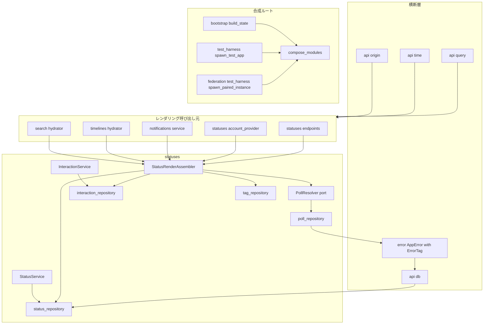
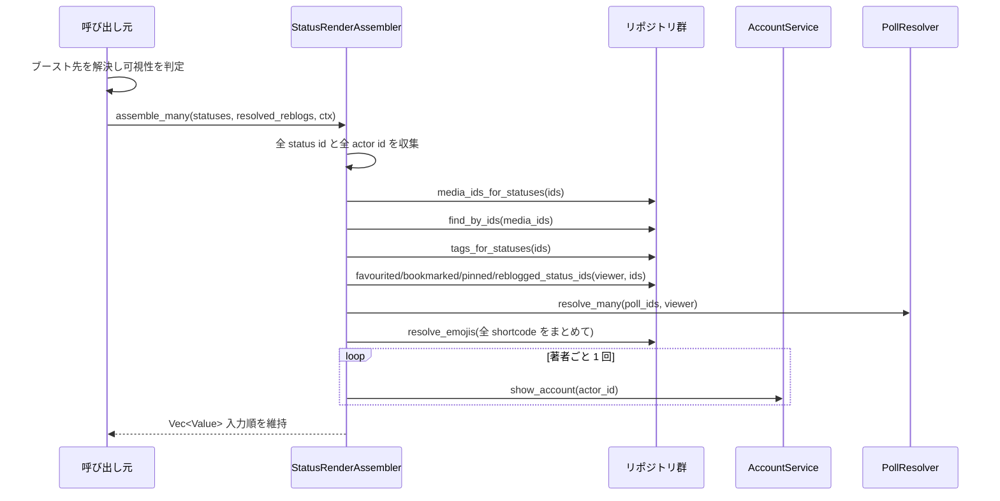
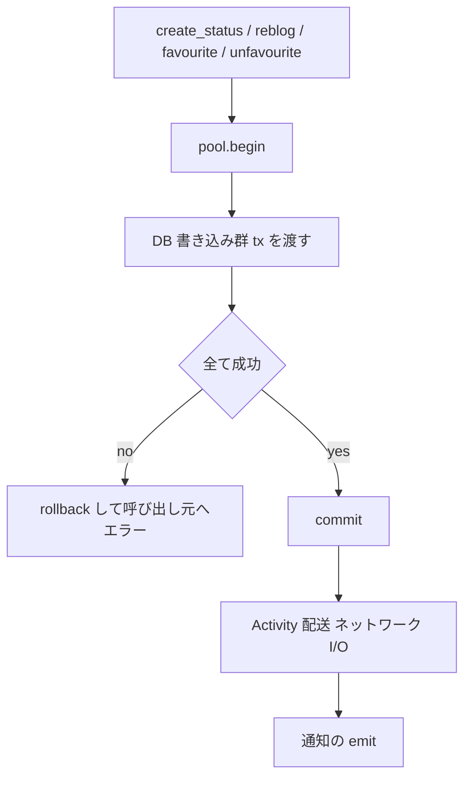
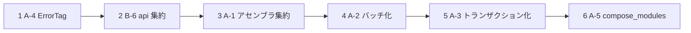

# 技術設計書 — structural-refactor

## Overview

**目的**：Phase 1（全 11 spec）完了後のコードベースから、Phase 2 以降で複製が拡大し続ける構造的負債を取り除く。対象は `docs/refactor-analysis-2026-08.md`「E. 推奨着手順」1〜5。

**利用者**：kawasemi の実装者（人間および AI エージェント）。新しい spec を足すたびに、レンダリンググルー・エンドポイント定型文・モジュール配線を既存の N 箇所へコピーする作業と、それに伴う「どれが意図的な差異でどれが直し忘れか判別できない」状態が解消される。

**影響**：これは**振る舞いを変えない内部リファクタリング**である。API レスポンスと Activity 表現は不変。例外は 3 つで、いずれも「現状が壊れている／壊れかけている」ことの是正である：(1) A-4 は文字列一致に依存した分岐を型に移す、(2) A-3 は部分失敗時の残留状態を除去する（成功パスは不変）、(3) A-5 は **`src/federation/test_harness.rs` で既に発生している配線の欠落**（`statuses::register_account_ports` の未呼び出し）を解消する。

### Goals

- Status レンダリンググルー約 750 行の 5 重複製を単一コンポーネントに集約し、経路ごとの差異を暗黙の既定値ではなく明示的な入力にする
- 一覧取得における Status 固有の付随データ取得を、件数に依存しない一定回数に収める
- エンドポイント横断の定型処理を `src/api/` 配下の単一実装に寄せる
- 複合書き込みを原子化し、カウンタと実体の不整合を構造的に不可能にする
- モジュール配線シーケンスを単一実装にし、型で守られていない順序制約を統合テストで検証する
- 「重複投票か否か」の判定をエラーメッセージ文字列から型に移す

### Non-Goals

- テストフィクスチャ集約 / テスト階層再設計 / golden 浸透 / `testing` feature 化 / 孤立スキーマ回収（B-1〜B-5）
- 連合ヘルパー統合 / レジストリ抽象化 / `server.rs`・`inbound_handlers.rs` 分割 / ジェネリック引数整理（B-7〜B-11）
- ドキュメント圧縮 / CONCERN 棚卸し / 命名統一 / `error ↔ api` 循環解消（C 群）
- `AccountService::show_account` 自体のバッチ化（accounts-and-instance の内部構造に踏み込むため。本 spec は一覧単位のメモ化で代替する）
- Mastodon 互換 API の機能追加、および API 契約そのものの変更

## Boundary Commitments

### This Spec Owns

- **`AppError` のドメイン識別機構**：`AppError` に「どのドメイン条件で失敗したか」を型で問える識別子を持たせる契約と、その既定値
- **`StatusRenderAssembler`**：`Status` 行 → `StatusRenderInput` の組み立て（`account` / `media_attachments` / `tags` / `emojis` / `interactions` / `poll`）。1 件版と N 件版の両方
- **`StatusRenderAssembler` が使う一括取得**：メディア・タグ・インタラクション状態・投票の複数 id 一括解決、および一覧単位のアカウント／絵文字ディレクトリのメモ化
- **`src/api/` 配下の定型処理**：`limit` 解釈、真偽値クエリ解釈、RFC3339 時刻整形、`sqlx::Error → AppError` の標準変換、自オリジン解決
- **`StatusService::create_status` / `InteractionService::reblog` / `favourite` / `unfavourite` のトランザクション境界**
- **`compose_modules`**：9 モジュールの配線シーケンスと、その順序制約を検証する統合テスト

### Out of Boundary

- `AccountService::show_account` の内部実装（`resolve_local` / `ports.counts` / `emoji_candidates` の構造）。本 spec は呼び出し回数を減らすのみで、中身を書き換えない
- **ブースト先 Status の解決と可視性判定**。5 経路で協調オブジェクトが本質的に異なる（`StatusService::show` / `FilterContext` ベース / `SearchHydrator::status_visible`）。取り込めば除去した複製が「どの経路か」の内部分岐として復活する。`StatusRenderAssembler` は**解決済みのブースト先を受け取る**
- `StatusJson` / `AccountJson` / `NotificationJson` / `PollJson` の**定義そのもの**（分析レポート D 群「単一定義済み・良好」）。本 spec が触るのは組み立てグルーのみ
- `api::pagination` / `api::error` / `api::ratelimit` / `oauth::middleware` の**既存の中身**。追加するのは「それらを呼ぶ最後の定型文」のみ
- 連合コア設計（`DeliveryService::deliver` の配送分岐一本化、`InboxService` の `process_verified` 収斂、`InboundActivityDispatcher`）
- `src/server.rs` のルーター合成構造、`src/state.rs` の `AppState::new` 13 引数

### Allowed Dependencies

- `src/error.rs`（`AppError`）— 全モジュールが依存する既存の横断型。**フィールド追加のみ**で、既存の `client` / `server` コンストラクタのシグネチャは変えない
- `src/api/pagination.rs` の `ForwardedOrigin` / `RequestUriContext` / `build_link_header` / `PageParams`
- `sqlx::PgExecutor<'e>`（`src/social_graph/repository.rs:371, 442, 655` で確立済みのイディオム）
- `src/statuses/serializer.rs` の `StatusRenderInput` / `status_to_json` / `SerializeContext`（読むだけ、変更しない）
- **依存方向**：`error` → `api` → 各 feature モジュール → `bootstrap`/`test_harness`。`StatusRenderAssembler` は `statuses` 配下に置き、`notifications` / `timelines` / `search` がそれを利用する（現状これら 3 つは既に `statuses::serializer` に依存しており、依存方向は変わらない）

### Revalidation Triggers

- `AppError` の新フィールドが公開 API 形状に影響した場合（**しない設計にする**：`ErrorTag` はレスポンスボディに出さない）
- `StatusRenderAssembler` の入力契約（`PollResolver` / `muted` の注入形）が変わった場合 — 5 呼び出し元すべてが再検証対象
- リポジトリ関数のシグネチャが `&PgPool` から `E: PgExecutor` に変わることで、**呼び出し側に変更が要る**ケースが出た場合（設計上は出ない。`&PgPool` が `PgExecutor<'_>` を満たすため）
- `compose_modules` の入力構造体にフィールドが増えた場合 — 3 起動経路すべてが再検証対象
- 一覧レスポンスの JSON 表現や並び順が変わった場合 — 契約テスト・golden の再確認

## Architecture

### Existing Architecture Analysis

保つべき既存パターン（分析レポート D 群、および steering `structure.md`）：

- **リポジトリ層は自由関数**：`pub async fn name(pool: &PgPool, ...)`。`&self` ベースのリポジトリ構造体はこのリポジトリに存在しない（`social_graph/repository.rs:32-47` が明記）
- **`mod.rs` を使わない**：ディレクトリ名と同名の `.rs` でモジュールを定義する
- **ハンドラ引数順序**：`State` → `RequiredActor`/`OptionalActor` → `ResolvedOrigin` → `Path` → `Query`/`Body`
- **エラー → HTTP 変換の一元化**：`AppError::into_response_with` + `api::error::mastodon_error_body`
- **DI の判断基準**（`search/ports.rs:160-164`）：AppState 構築後に差し替えが要る → boxed future の `dyn`、起動時 1 回選ぶだけ → ジェネリック／具体値

解消する負債と、その手段：

| 負債 | 現状 | 手段 |
|---|---|---|
| A-4 文字列一致がエラー制御フロー | `err.public_message == "actor has already voted in this poll"` | `AppError.tag: Option<ErrorTag>` |
| B-6 定型文の N 重化 | 各モジュールの private fn | `src/api/` 配下の `pub(crate)` 関数 |
| A-1 レンダリンググルー 5 重化 | 各モジュールの private メソッド群 | `StatusRenderAssembler` |
| A-2 N+1 | `for ... await` の逐次処理 | `assemble_many` + `UNNEST` 一括取得 |
| A-3 非トランザクション複合書き込み | 個別の `&self.pool` 呼び出し | `E: PgExecutor` 化 + `pool.begin()` |
| A-5 配線 3 重化 | 3 ファイルに独立実装 | `compose_modules` |

### Architecture Pattern & Boundary Map



**Architecture Integration**

- **選択パターン**：既存の階層（横断層 → feature モジュール → 合成ルート）を維持したまま、各層内で重複していた実装を単一実装へ寄せる。新しい層は導入しない
- **責務分離**：`StatusRenderAssembler` は「解決済みの材料から `StatusRenderInput` を組み立てる」ことだけを持つ。「何を材料として解決するか」のうち、経路ごとに本質的に異なる 2 点（投票の解決経路、ミュートの解決）は**ポート／注入値**として外に出す
- **既存パターンの維持**：リポジトリは自由関数のまま。追加する一括取得関数も自由関数。`PollResolver` は boxed future の `dyn` トレイト（`search/ports.rs:160-164` の判断基準に従う。`StatusesEndpointsState` は既にジェネリック 6 個を抱えており、ここでジェネリックを足さない）
- **新規コンポーネントの根拠**：`StatusRenderAssembler`（5 重複製の受け皿）、`PollResolver`（5 経路で唯一本質的に異なる解決経路の抽象）、`compose_modules`（3 重配線の受け皿）、`ErrorTag`（文字列一致の代替）。これ以外の新規抽象は導入しない
- **steering 準拠**：`mod.rs` 不使用、リポジトリ自由関数、決定性の強制（新規コードは `runtime.clock` 経由で時刻を取る）、ローカル/リモート単一経路（本 spec は配送経路に触れない）

### Technology Stack

| Layer | Choice / Version | Role in Feature | Notes |
|-------|------------------|-----------------|-------|
| Backend / Services | Rust Edition 2024 | 全実装 | 新規クレート追加なし |
| Data / Storage | PostgreSQL + sqlx | 一括取得・トランザクション | `UNNEST` / `= ANY($1)` / `PgExecutor<'e>` は既存イディオム |
| Infrastructure / Runtime | tokio, axum | 変更なし | `compose_modules` は既存の構築順を関数化するのみ |

新規依存はゼロ。

## File Structure Plan

### Directory Structure

```
src/
├── api.rs                      # pub mod query; pub mod time; pub mod db; pub mod origin; を追加
├── api/
│   ├── error.rs                # 変更なし
│   ├── pagination.rs           # 変更なし
│   ├── ratelimit.rs            # 変更なし
│   ├── query.rs                # 新規: parse_optional_limit / parse_loose_bool / parse_optional_bool_query
│   ├── time.rs                 # 新規: format_time (RFC3339)
│   ├── db.rs                   # 新規: map_server_error (sqlx::Error -> AppError)
│   └── origin.rs               # 新規: self_origin(domain) -> ForwardedOrigin
├── error.rs                    # ErrorTag 追加、AppError.tag フィールド追加、client_tagged コンストラクタ
├── bootstrap.rs                # build_state を compose_modules 呼び出しへ縮退 / mod wiring; を追加
├── bootstrap/
│   ├── tests.rs                # 既存
│   └── wiring.rs               # 新規: ModuleWiringInput / ComposedModules / compose_modules
├── statuses/
│   ├── render_assembler.rs     # 新規: StatusRenderAssembler / RenderContext / PollResolver
│   └── render_assembler/
│       └── tests.rs            # 新規: アセンブラの単体/統合テスト
└── ...
tests/
└── module_wiring_it.rs         # 新規: 「最後勝ち」合成が実際に効いているかの統合テスト
```

`mod.rs` は使わない（steering `structure.md`）。`src/bootstrap/wiring.rs` と `src/statuses/render_assembler.rs` はそれぞれ `src/bootstrap.rs` / `src/statuses.rs` の `mod` 宣言で登録する。

### Modified Files

**A-4（エラー識別）**
- `src/error.rs` — `ErrorTag` enum（当面 `DuplicateVote` の 1 バリアント）、`AppError.tag: Option<ErrorTag>`、`AppError::client_tagged`。既存 `client`/`server` は `tag: None` を埋めるだけでシグネチャ不変。`tag` はレスポンスボディに一切出さない
- `src/statuses/poll_repository.rs` — `:295` の重複投票拒否を `client_tagged(422, "actor has already voted in this poll", ErrorTag::DuplicateVote)` へ。**文言は変えない**（Requirement 2.6）
- `src/statuses/inbound_handlers.rs` — `:1067-1074` の分岐条件を `err.tag == Some(ErrorTag::DuplicateVote)` へ。`status` の比較は不要になる

**B-6（定型文集約）**
- `src/accounts/endpoints.rs` / `src/social_graph/endpoints.rs` / `src/timelines/endpoints.rs` / `src/notifications/endpoints.rs` / `src/statuses/endpoints.rs` — private `parse_optional_limit` を削除し `api::query::parse_optional_limit` を使用
- `src/accounts/endpoints.rs` / `src/timelines/endpoints.rs` / `src/search/endpoint.rs` — private `parse_loose_bool` / `parse_optional_bool_query` を削除し `api::query` を使用
- `src/accounts/serializer.rs` / `src/statuses/serializer.rs` / `src/notifications/serializer.rs` / `src/statuses/endpoints.rs` — private `format_time` を削除し `api::time::format_time` を使用
- `src/notifications/service.rs` / `src/search/hydrator.rs` / `src/search/tag_serializer.rs` / `src/statuses/account_provider.rs` / `src/social_graph/follow_request_service.rs` — `ForwardedOrigin::resolve("https", &self.domain, None, None)` を `api::origin::self_origin(&self.domain)` へ
- `map_server_error` を定義している 11 ファイル — private 定義を削除し `api::db::map_server_error` を使用。`map_query_error` / `map_insert_error` / `map_tx_error`（残り 15 件）は**返す `AppError` が同一であることを確認できたものだけ**寄せる（research.md の Open Questions）

**A-1 + A-2（レンダリング集約とバッチ化）**
- `src/statuses/status_repository.rs` — `media_ids_for_statuses(&[Id]) -> HashMap<Id, Vec<Id>>` 追加
- `src/media/media_repository.rs` — `find_by_ids(&[Id]) -> HashMap<Id, Media>` 追加
- `src/statuses/tag_repository.rs` — `tags_for_statuses(&[Id]) -> HashMap<Id, Vec<Tag>>` 追加
- `src/statuses/interaction_repository.rs` — `favourited_status_ids` / `bookmarked_status_ids` / `pinned_status_ids` / `reblogged_status_ids`（いずれも `(viewer, &[Id]) -> HashSet<Id>`）追加
- `src/statuses/poll_repository.rs` — `find_polls_by_ids(&[Id]) -> HashMap<Id, Poll>` / `tally_many(&[Id], viewer) -> HashMap<Id, PollTally>` 追加
- `src/statuses/endpoints.rs` — 組み立てメソッド群（`:400-598`）を削除し `StatusRenderAssembler` へ委譲。`PollResolver` は `PollService` 経由の実装を供給
- `src/statuses/account_provider.rs` — 同（`:266-496`）。`PollResolver` は「行必須・`not_found()`」実装
- `src/notifications/service.rs` — 同（`:250-510`）。`PollResolver` は「行必須・`poll_not_found()`」実装
- `src/timelines/hydrator.rs` — 同（`:340-519`）。`muted` に `Some(&ctx.muted)` を注入、`PollResolver` は「行任意」実装。`hydrate` は `assemble_many` を呼ぶ
- `src/search/hydrator.rs` — 同（`:415-593`）。`PollResolver` は「行任意」実装。`:59-74` の CONCERN を削除

**A-3（トランザクション化）**
- `src/statuses/status_repository.rs` — `insert_status` / `attach_media` / `adjust_counts` を `<'e, E: sqlx::PgExecutor<'e>>` 化
- `src/statuses/poll_repository.rs` — `insert_poll` を同様に
- `src/statuses/tag_repository.rs` — `upsert_tag` / `associate_tag` を同様に
- `src/statuses/interaction_repository.rs` — `add_favourite` / `remove_favourite` を同様に
- `src/statuses/status_service.rs` — `create_status`（`:808-853`）の DB 書き込み群を `pool.begin()` で包み、**commit 後に配送**
- `src/statuses/interaction_service.rs` — `reblog`（`:382`）/ `favourite`（`:460`）/ `unfavourite`（`:508`）を同様に

**A-5（配線一本化）**
- `src/bootstrap.rs` — `build_state`（`:337-710`）を「config/pool/migration/actor wiring → `compose_modules` → `AppState::new`」に縮退
- `src/test_harness.rs` — `spawn_test_app`（`:513-885`）の配線部を `compose_modules` 呼び出しに置換
- `src/federation/test_harness.rs` — `spawn_paired_instance`（`:247-600`）を同様に置換。**これにより欠落していた `register_account_ports` が自動的に補われる**

## System Flows

### Status 一覧の組み立て（A-1 + A-2 後）



**流れ上の決定**
- ブースト先の解決と可視性判定は**呼び出し元に残る**。アセンブラは解決済みのブースト先を受け取り、それ自身も一括取得の対象 id 集合に含める（Requirement 5.6）
- `assemble_one` は `assemble_many` に長さ 1 のスライスを渡す薄いラッパー。1 件と N 件で経路を分けない
- 一括取得の結果に含まれない id は、現行の各経路の規約どおりに縮退する（media は黙って省く、poll は `PollResolver` の実装が決める）

### 複合書き込みのトランザクション境界（A-3 後）



**流れ上の決定**
- **配送と通知は必ず commit の後**。トランザクション内で外部 HTTP を待つと DB 接続を占有し、配送失敗が正常なローカル書き込みを巻き戻す
- ロールバックは呼び出し元にエラーを返す（Requirement 6.4）。「成功したように振る舞う」経路を作らない

## Requirements Traceability

| Requirement | Summary | Components | Interfaces | Flows |
|---|---|---|---|---|
| 1.1 | HTTP 応答の不変性 | 全コンポーネント | 既存の契約テスト・golden | — |
| 1.2 | Activity 表現の不変性 | A-3 の配送位置、A-5 の配線 | `deliver_*`（変更しない） | 複合書き込み |
| 1.3 | 失敗時は実装を直す | 実装プロセス | — | — |
| 1.4 | テスト期待値変更の記録 | 実装プロセス | — | — |
| 1.5 | 既定 clippy 警告ゼロ | 全コンポーネント | `cargo clippy` | — |
| 1.6 | 項目完了時にグリーン | 全コンポーネント | `cargo test` | — |
| 2.1 | 重複投票をべき等扱い | `ErrorTag`, `inbound_handlers` | `AppError.tag` | — |
| 2.2 | ループバックで 422 を出さない | 同上 | 同上 | — |
| 2.3 | 文言変更に非依存 | `ErrorTag` | `client_tagged` | — |
| 2.4 | 識別手段喪失をコンパイル時検出 | `ErrorTag` enum | `match` の網羅性 | — |
| 2.5 | 他の 422 は伝播 | `inbound_handlers` | `tag == Some(DuplicateVote)` のみ捕捉 | — |
| 2.6 | 文言自体は不変 | `poll_repository` | 文字列リテラル据え置き | — |
| 3.1 | `limit` 解釈の統一 | `api::query` | `parse_optional_limit` | — |
| 3.2 | `Link` ヘッダー形式の統一 | 既存 `api::pagination` | `build_link_header` | — |
| 3.3 | 時刻形式の統一 | `api::time` | `format_time` | — |
| 3.4 | 真偽値解釈の統一 | `api::query` | `parse_loose_bool` | — |
| 3.5 | サーバーエラー形式の統一 | `api::db` | `map_server_error` | — |
| 3.6 | 自オリジン解決の統一 | `api::origin` | `self_origin` | — |
| 3.7 | 新規エンドポイントは再実装不要 | `src/api/` 全体 | `pub(crate)` 公開 | — |
| 4.1 | 経路によらず同一 JSON | `StatusRenderAssembler` | `assemble_many` | 一覧組み立て |
| 4.2 | 単一箇所の変更で全経路反映 | 同上 | 同上 | — |
| 4.3 | 差異は明示的入力 | `RenderContext`, `PollResolver` | `muted: Option<&HashSet<Id>>` | — |
| 4.4 | 文脈なしなら `muted = false` | `RenderContext` | `muted: None` の既定 | — |
| 4.5 | 文脈ありならその値 | 同上 | `muted: Some(&ctx.muted)` | — |
| 4.6 | 新経路で複製不要 | `StatusRenderAssembler` | `pub(crate)` 公開 | — |
| 5.1 | 付随データは一定回数 | 一括取得関数群 | `*_for_statuses` / `*_status_ids` | 一覧組み立て |
| 5.2 | 同一著者は 1 回 | `StatusRenderAssembler` | 著者単位メモ化 | 同上 |
| 5.3 | 解決回数は K に比例 | 同上 | 同上 | 同上 |
| 5.4 | メディア一括取得 | `media_repository::find_by_ids` | `= ANY($1)` | 同上 |
| 5.5 | インタラクション一括取得 | `interaction_repository` の 4 関数 | `= ANY($1)` | 同上 |
| 5.6 | ブースト先も対象 | `assemble_many` | 対象 id 集合に含める | 同上 |
| 5.7 | JSON と並び順は不変 | `assemble_many` | 入力順の維持 | 同上 |
| 6.1 | 投稿作成の原子性 | `StatusService::create_status` | `pool.begin()` | 複合書き込み |
| 6.2 | ブースト等の原子性 | `InteractionService` の 3 メソッド | 同上 | 同上 |
| 6.3 | カウンタと実体の一致 | 同上 | 同上 | 同上 |
| 6.4 | 部分失敗はエラー | 同上 | rollback + `Err` | 同上 |
| 6.5 | 成功パスは不変 | 同上 | 既存テスト | 同上 |
| 7.1 | 3 経路が同一シーケンス | `compose_modules` | `ModuleWiringInput` | — |
| 7.2 | 単一箇所の変更で 3 経路反映 | 同上 | 同上 | — |
| 7.3 | 合成実装が実際に有効 | `compose_modules` の順序 | `register_account_ports` の位置 | — |
| 7.4 | 順序破壊をテストが検出 | `tests/module_wiring_it.rs` | 統合テスト | — |
| 7.5 | 経路固有の差分のみ残す | 3 呼び出し元 | config / listener / shutdown | — |
| 7.6 | 本番経路の挙動は不変 | `bootstrap.rs` | 既存テスト | — |
| 7.7 | 既存の食い違いを記録 | research.md + 実装記録 | — | — |

## Components and Interfaces

| Component | Domain/Layer | Intent | Req Coverage | Key Dependencies (P0/P1) | Contracts |
|---|---|---|---|---|---|
| `ErrorTag` / `AppError.tag` | 横断（error） | 失敗理由を型で識別 | 2.1–2.6 | なし | Service |
| `api::query` | 横断（api） | クエリパラメータ解釈の単一実装 | 3.1, 3.4, 3.7 | `AppError` (P0) | Service |
| `api::time` | 横断（api） | RFC3339 整形の単一実装 | 3.3, 3.7 | `time` (P0) | Service |
| `api::db` | 横断（api） | `sqlx::Error → AppError` の単一実装 | 3.5, 3.7 | `AppError` (P0) | Service |
| `api::origin` | 横断（api） | 自オリジン解決の単一実装 | 3.6, 3.7 | `ForwardedOrigin` (P0) | Service |
| `StatusRenderAssembler` | statuses | Status 組み立ての単一実装 | 4.1–4.6, 5.1–5.7 | リポジトリ群 (P0), `AccountService` (P0), `PollResolver` (P0) | Service, Batch |
| `PollResolver` | statuses | 経路ごとに異なる投票解決の抽象 | 4.3, 5.1 | `poll_repository`/`PollService` (P0) | Service |
| 一括取得関数群 | statuses/media | 複数 id の単発解決 | 5.1, 5.4–5.6 | sqlx (P0) | Service |
| トランザクション化 | statuses | 複合書き込みの原子化 | 6.1–6.5 | `PgExecutor` (P0) | State |
| `compose_modules` | 合成ルート | 配線シーケンスの単一実装 | 7.1–7.3, 7.5, 7.6 | 全 `build_*_module` (P0) | Service |
| 配線順序テスト | テスト | 「最後勝ち」合成の検証 | 7.4 | `compose_modules` (P0) | — |

---

### 横断層

#### `ErrorTag` / `AppError.tag`

| Field | Detail |
|---|---|
| Intent | 「どのドメイン条件で失敗したか」を文字列ではなく型で問えるようにする |
| Requirements | 2.1, 2.2, 2.3, 2.4, 2.5, 2.6 |

**Responsibilities & Constraints**
- `AppError` は横断型である。**ドメイン固有のバリアントを `ErrorKind` に足さない**。足せば横断型でなくなり、全モジュールが全ドメインの語彙を知ることになる
- `tag` は**レスポンスボディに一切出さない**。`api::error::mastodon_error_body` も `default_response` も `tag` を読まない。したがって Requirement 1.1（HTTP 応答の不変性）に影響しない
- 現時点のバリアントは `DuplicateVote` のみ。「将来使うかもしれない」バリアントを先回りで足さない
- `AppError` の直接構造体リテラル構築は `src/error.rs` 内の 2 箇所のみ（research.md で確認済み）。フィールド追加は既存呼び出し側を壊さない

**Dependencies**
- Inbound: `poll_repository`（tag を付ける）、`inbound_handlers`（tag を読む）(P0)
- Outbound: なし

**Contracts**: Service [x]

##### Service Interface

```rust
#[derive(Debug, Clone, Copy, PartialEq, Eq)]
#[non_exhaustive]
pub enum ErrorTag {
    /// 同一アクターが同一投票に二度目の投票をした。
    /// ローカル投稿主への Activity ループバックでは正常なべき等ケース。
    DuplicateVote,
}

pub struct AppError {
    pub kind: ErrorKind,
    pub status: StatusCode,
    pub public_message: String,
    pub source: Option<BoxError>,
    /// 呼び出し側が「この理由での失敗か」を型で判別するための識別子。
    /// レスポンスボディには決して現れない。
    pub tag: Option<ErrorTag>,
}

impl AppError {
    pub fn client(status: StatusCode, public_message: impl Into<String>) -> Self; // tag: None
    pub fn server(status: StatusCode, source: impl Into<BoxError>) -> Self;       // tag: None
    pub fn client_tagged(
        status: StatusCode,
        public_message: impl Into<String>,
        tag: ErrorTag,
    ) -> Self;
}
```

- 事前条件：`client_tagged` は 4xx でのみ使う（`client` と同じ規約）
- 事後条件：`tag` を設定しても `status` / `public_message` / ボディ表現は変わらない
- 不変条件：`ErrorKind::Server` の `AppError` は `tag` を持たない（`server` コンストラクタが `None` 固定）

**Implementation Notes**
- Integration: `poll_repository.rs` の `rejected()` は他の 3 つの拒否理由（期限切れ・範囲外・単一/複数違反）にも使われている。**重複投票の呼び出しだけを `client_tagged` に差し替える**。他の 3 つは `tag: None` のまま（Requirement 2.5）
- Validation: `inbound_handlers.rs:1067-1074` の分岐は `err.tag == Some(ErrorTag::DuplicateVote)` の 1 条件になる。`status` の比較は冗長になるため削除する
- Risks: `#[non_exhaustive]` を付けると外部クレートからの `match` が網羅できなくなるが、本クレート内では網羅チェックが効く。Requirement 2.4 は本クレート内の話なので問題ない

#### `api::query` / `api::time` / `api::db` / `api::origin`

| Field | Detail |
|---|---|
| Intent | エンドポイント／シリアライザが繰り返している定型文の単一実装 |
| Requirements | 3.1, 3.3, 3.4, 3.5, 3.6, 3.7 |

**Responsibilities & Constraints**
- **既存の実装を寄せるだけで、挙動を「改善」しない**。5 箇所の `parse_optional_limit` はバイト単位で同一なので、そのまま移す
- `map_query_error` / `map_insert_error` / `map_tx_error` は名前が違うだけで同一とは限らない。返す `AppError` が `map_server_error` と同一であることを確認できたものだけ寄せ、確認できないものは残す
- `src/api/` は既存の 3 モジュール（`error` / `pagination` / `ratelimit`）が「横断的な道具」を提供している。追加する 4 モジュールも同じ性格を保ち、ドメイン知識を持ち込まない

**Contracts**: Service [x]

##### Service Interface

```rust
// src/api/query.rs
pub fn parse_optional_limit(raw: Option<&str>) -> Result<Option<u32>, AppError>;
pub fn parse_loose_bool(field_name: &str, raw: &str) -> Result<bool, AppError>;
pub fn parse_optional_bool_query(field_name: &str, raw: Option<&str>) -> Result<bool, AppError>;

// src/api/time.rs
pub fn format_time(when: OffsetDateTime) -> String;

// src/api/db.rs
pub fn map_server_error(source: sqlx::Error) -> AppError;

// src/api/origin.rs
/// 受信リクエストの `Forwarded`/`X-Forwarded-*` に依らず、自インスタンスの
/// 正規オリジンを組み立てる。リクエスト文脈を持たない場所（Activity 構築、
/// 通知やハッシュタグのシリアライズ）から呼ばれる。
pub fn self_origin(domain: &str) -> ForwardedOrigin;
```

- 事前条件：なし（すべて純粋関数）
- 事後条件：移設前の各 private 実装とバイト単位で同一の結果を返す
- 不変条件：`AppError` の `status` / `public_message` が移設前と一致する

**Implementation Notes**
- Integration: 各モジュールの private 定義を削除し `use crate::api::...` に置換。private 定義に紐づく既存の単体テスト（`accounts/endpoints/tests.rs` 等）は `src/api/*/tests.rs` へ移すか、呼び出し経由で残す。**削除はしない**（Requirement 1.3）
- Validation: 移設対象の関数それぞれについて、移設前後で既存テストがグリーンであること
- Risks: `parse_loose_bool` は accounts / timelines / search の 3 箇所にあり、レポートの「2 箇所」は search を数え落としている。3 箇所すべてを対象にする

---

### statuses 層

#### `StatusRenderAssembler`

| Field | Detail |
|---|---|
| Intent | `Status` 行から `StatusRenderInput` を組み立てる唯一の実装 |
| Requirements | 4.1, 4.2, 4.3, 4.4, 4.5, 4.6, 5.1, 5.2, 5.3, 5.4, 5.5, 5.6, 5.7 |

**Responsibilities & Constraints**
- 責務は「**解決済みの材料から `StatusRenderInput` を作る**」ことに限る。ブースト先の解決・可視性判定は呼び出し元の責務（Out of Boundary）
- 経路ごとの差異は**2 つの注入点にのみ**存在する：`muted` の解決元と、投票の解決経路。これ以外の分岐をアセンブラ内部に持たない
- `assemble_one` は `assemble_many` の長さ 1 の呼び出し。1 件と N 件で別実装を持たない（乖離の再発を構造的に防ぐ）
- 出力の並び順は入力 `&[Status]` の順を維持する
- `mentions` は現状 5 箇所すべてで `Vec::new()` 固定。この既定を維持する（変えれば振る舞いが変わる）

**Dependencies**
- Outbound: `status_repository` / `tag_repository` / `interaction_repository` / `media_repository` / `emoji_repository` — 材料の解決 (P0)
- Outbound: `AccountService::show_account` — Account JSON の解決（**中身は変えない**） (P0)
- Outbound: `PollResolver` — 投票の解決 (P0)
- Outbound: `statuses::serializer::status_to_json` / `poll_to_json` — 最終的な JSON 化 (P0)
- Inbound: 5 つの呼び出し元 (P0)

**Contracts**: Service [x] / Batch [x]

##### Service Interface

```rust
pub(crate) struct StatusRenderAssembler {
    pool: PgPool,
    accounts: Arc<AccountService<LocalFsStore, ReqwestFederationHttpClient>>,
    media_store: LocalFsStore,
}

/// 1 回の組み立て呼び出しに固有の文脈。経路ごとの差異はここに集約する。
pub(crate) struct RenderContext<'a> {
    pub viewer: Option<Id>,
    pub now: OffsetDateTime,
    pub origin: &'a ForwardedOrigin,
    /// ミュート判定の材料。`None` の経路では `muted` は常に `false`
    /// （Requirement 4.4）。`Some` を渡すのは現状 timelines のみ
    /// （Requirement 4.5）。キーは「相手アカウントの id」であり、
    /// 各 Status の `actor_id` で引く。
    pub muted: Option<&'a HashSet<Id>>,
    pub polls: &'a dyn PollResolver,
}

/// 呼び出し元が解決済みのブースト先。アセンブラは解決も可視性判定もしない。
pub(crate) struct ResolvedReblog {
    /// 入力 `statuses` のうち何番目に対応するか
    pub index: usize,
    pub target: Status,
}

impl StatusRenderAssembler {
    pub(crate) fn new(
        pool: PgPool,
        accounts: Arc<AccountService<LocalFsStore, ReqwestFederationHttpClient>>,
        media_store: LocalFsStore,
    ) -> Self;

    /// N 件を組み立てる。付随データの取得回数は N に依存しない
    /// （Requirement 5.1）。アカウント解決は著者の種類数 K 回
    /// （Requirement 5.2, 5.3）。出力は入力順（Requirement 5.7）。
    pub(crate) async fn assemble_many(
        &self,
        statuses: &[Status],
        reblogs: &[ResolvedReblog],
        ctx: &RenderContext<'_>,
    ) -> Result<Vec<Value>, AppError>;

    /// 1 件を組み立てる。`assemble_many` に長さ 1 で委譲する薄いラッパー。
    pub(crate) async fn assemble_one(
        &self,
        status: &Status,
        reblog: Option<&Status>,
        ctx: &RenderContext<'_>,
    ) -> Result<Value, AppError>;
}
```

- 事前条件：`reblogs` の `index` は `statuses` の有効な添字であること
- 事後条件：出力の長さは `statuses` の長さと等しく、順序が保たれる
- 不変条件：同一の `(Status, RenderContext)` に対する出力は、どの呼び出し元から呼んでも同一（Requirement 4.1）

##### Batch / Job Contract

- トリガー：`assemble_many` の呼び出し
- 入力の集約：`statuses` と `reblogs.target` の全 `id` を 1 つの集合に、全 `actor_id` を 1 つの集合に、全 `poll_id` を 1 つの集合にまとめる
- 発行するクエリ（件数に依存しない一定回数）：
  1. `status_repository::media_ids_for_statuses(status_ids)`
  2. `media_repository::find_by_ids(media_ids)`
  3. `tag_repository::tags_for_statuses(status_ids)`
  4. `emoji_repository::resolve_emojis(全 shortcode の和集合)`（`content` と投票選択肢のタイトルから抽出）
  5–8. `interaction_repository::{favourited,bookmarked,pinned,reblogged}_status_ids(viewer, status_ids)`（`viewer` が `None` なら 0 回）
  9. `PollResolver::resolve_many(poll_ids, viewer)`
- アカウント解決：`actor_id` の重複を除いた K 件について `AccountService::show_account` を呼ぶ。**1 回の `assemble_many` 内でのみメモ化する**（呼び出しをまたぐキャッシュは持たない。ステイルなデータを返す新しい失敗モードを作らないため）
- 冪等性・回復：読み取りのみ。部分的な解決失敗は現行の各経路の規約どおりに縮退する（media は省略、poll は `PollResolver` 実装が決める）

**Implementation Notes**
- Integration: 5 つの呼び出し元は「ブースト先の解決 → `assemble_*` の呼び出し」だけに縮退する。`notifications/service.rs` は `viewer: Id`（非 Option）を取っていたが、`Some(viewer)` を渡せば挙動は同一（research.md で確認済み）
- Integration: `timelines/hydrator.rs` の `now` は `ctx.now`（`FilterContext` 由来）、他 4 経路は `self.runtime.clock.now()`。`RenderContext.now` に呼び出し元がそのまま渡す
- Validation: 5 経路それぞれの既存テスト（`src/statuses/endpoints/tests.rs`、`src/timelines/hydrator/tests.rs` 等）と golden 契約テストがグリーンであること。加えて「同一 Status を 5 経路から取得して JSON が一致する」テストを追加（Requirement 4.1）
- Validation: 一覧のクエリ数が件数に依存しないことを検証するテストを追加（Requirement 5.1）
- Risks: 一括取得への切り替えで、`media_json` の「解決できない media id は黙って省く」規約や poll の縮退規約を落とすと振る舞いが変わる。一括版でも同じ規約を明示的に実装する

#### `PollResolver`

| Field | Detail |
|---|---|
| Intent | 5 経路で本質的に異なる唯一の材料解決を、内部分岐ではなくポートとして外に出す |
| Requirements | 4.3, 5.1 |

**Responsibilities & Constraints**
- 現状の 3 種類の挙動を**そのまま**保存する（research.md の差異表）：
  1. `PollService` 経由（可視性チェック込み。行が無い／見えない場合はエラー）— `statuses/endpoints.rs`
  2. リポジトリ経由・行必須（行が無ければ呼び出し元固有のエラー）— `account_provider.rs`（`not_found()`）、`notifications/service.rs`（`poll_not_found()`）
  3. リポジトリ経由・行任意（行が無ければ `None` に縮退）— `timelines/hydrator.rs`、`search/hydrator.rs`
- boxed future の `dyn` トレイトにする。ジェネリックにすると `StatusesEndpointsState` の 6 個のジェネリック引数がさらに増える（既知の負債 B-11 の悪化）

**Contracts**: Service [x]

##### Service Interface

```rust
pub(crate) trait PollResolver: Send + Sync {
    /// `poll_ids` をまとめて解決する。戻り値に含まれない id は
    /// 「行が無く、かつ実装がそれを許容した」ことを意味する。
    /// 行の不在を許容しない実装は `Err` を返す。
    fn resolve_many<'a>(
        &'a self,
        poll_ids: &'a [Id],
        viewer: Option<Id>,
    ) -> Pin<Box<dyn Future<Output = Result<HashMap<Id, (Poll, PollTally)>, AppError>> + Send + 'a>>;
}
```

- 事前条件：`poll_ids` は重複を含まない
- 事後条件：戻り値のキーは `poll_ids` の部分集合
- 不変条件：実装ごとの「行が無い場合」の挙動は移設前と一致する

**Implementation Notes**
- Integration: 実装は 3 つ。`statuses/endpoints.rs` の `PollService` 経由版は、現状 `poll_service.poll()` を投票ごとに呼んでいるため一括化の余地が限られる。**この経路は単一 Status の取得が主用途**なので、`poll_ids` を順に `poll_service.poll()` に渡す実装で構わない（Requirement 5.1 が対象とするのは一覧経路）
- Risks: 「行が無ければエラー」の 2 実装は、返すエラーが `not_found()` と `poll_not_found()` で異なる。各呼び出し元が自分のエラーを供給する形にし、統一しない（統一すれば振る舞いが変わる）

#### 一括取得関数群

| Field | Detail |
|---|---|
| Intent | 複数 id の単発解決。`load_states` の `UNNEST`／`= ANY($1)` イディオムの横展開 |
| Requirements | 5.1, 5.4, 5.5, 5.6 |

**Responsibilities & Constraints**
- 既存の単数版関数は**削除しない**（他に呼び出し元がある）。複数版を追加する
- リポジトリ自由関数の規約に従う（`pub async fn name(pool: &PgPool, ...)`）
- 単数版と複数版で結果が食い違わないこと。複数版は単数版と同じ `WHERE` 条件・同じ `ORDER BY` を使う

**Contracts**: Service [x]

##### Service Interface

```rust
// src/statuses/status_repository.rs
pub async fn media_ids_for_statuses(
    pool: &PgPool, status_ids: &[Id],
) -> Result<HashMap<Id, Vec<Id>>, AppError>;

// src/media/media_repository.rs
pub async fn find_by_ids(pool: &PgPool, ids: &[Id]) -> Result<HashMap<Id, Media>, AppError>;

// src/statuses/tag_repository.rs
pub async fn tags_for_statuses(
    pool: &PgPool, status_ids: &[Id],
) -> Result<HashMap<Id, Vec<Tag>>, AppError>;

// src/statuses/interaction_repository.rs — 4 関数、同一形状
pub async fn favourited_status_ids(
    pool: &PgPool, viewer: Id, status_ids: &[Id],
) -> Result<HashSet<Id>, AppError>;
// bookmarked_status_ids / pinned_status_ids / reblogged_status_ids も同様

// src/statuses/poll_repository.rs
pub async fn find_polls_by_ids(
    pool: &PgPool, poll_ids: &[Id],
) -> Result<HashMap<Id, Poll>, AppError>;
pub async fn tally_many(
    pool: &PgPool, poll_ids: &[Id], viewer: Option<Id>,
) -> Result<HashMap<Id, PollTally>, AppError>;
```

- 事前条件：空スライスを渡した場合は空のコレクションを返す（クエリを発行しない）
- 事後条件：`media_ids_for_statuses` は各 status 内のメディア順序を単数版と同じに保つ
- 不変条件：単数版を N 回呼んだ結果と複数版の結果が一致する

**Implementation Notes**
- Integration: `= ANY($1::bigint[])` を第一候補とする（`emoji_repository::resolve_emojis` の先例）。`(kind, id)` のような複合キーが要るのは `load_states` の事情であり、ここでは単一カラムで足りる
- Validation: 各関数について「単数版 N 回 == 複数版 1 回」を直接比較する単体テストを置く
- Risks: `tally_many` は `viewer` の投票済み判定を含む。単数版 `tally` の SQL を素直に複数化できるか、実装時に確認する

#### 複合書き込みのトランザクション化

| Field | Detail |
|---|---|
| Intent | カウンタと実体レコードの不整合を構造的に不可能にする |
| Requirements | 6.1, 6.2, 6.3, 6.4, 6.5 |

**Contracts**: State [x]

##### State Management

- **状態モデル**：`status` 行 / `poll` 行 / `status_media` 行 / `status_tags` 行 / `favourites` 行 / 親 status の `replies_count` / 対象 status の `reblogs_count`・`favourites_count`
- **永続化と一貫性**：1 つの複合操作が触る上記すべてを単一トランザクションに入れる。トランザクション境界は **DB 書き込みのみ**
- **並行性**：`adjust_counts` は既に `UPDATE ... SET c = c + $1` の相対更新であり、トランザクション化してもロストアップデートは発生しない

対象と境界：

| メソッド | トランザクション内 | トランザクション外（commit 後） |
|---|---|---|
| `StatusService::create_status` | `insert_status` / `attach_media` / `insert_poll` / `persist_tags` / `adjust_counts(Replies,+1)` | `build_addressing`（読み取り）/ `deliver_create` / 通知 emit |
| `InteractionService::reblog` | `insert_status` / `adjust_counts(Reblogs,+1)` | `deliver_announce` / 通知 emit |
| `InteractionService::favourite` | `add_favourite` / `adjust_counts(Favourites,+1)` | `deliver_like` / 通知 emit |
| `InteractionService::unfavourite` | `remove_favourite` / `adjust_counts(Favourites,-1)` | `deliver_undo` |

**Implementation Notes**
- Integration: リポジトリ関数を `<'e, E: sqlx::PgExecutor<'e>>` 化する。`&PgPool` が同トレイトを満たすため**既存呼び出し側は無変更**（`social_graph/repository.rs:168-180` の doc が明記）。この変換は純粋に追加的
- Integration: `add_favourite` / `remove_favourite` は `bool`（新規か／削除したか）を返す。この戻り値による分岐はトランザクション内に残る
- Validation: 「途中で失敗させたときにカウンタが増えていない」ことを検証するテストを、`create_status` と `favourite` の少なくとも 2 つについて追加（Requirement 6.1, 6.2）
- Risks: **配送をトランザクション内に入れてしまうこと**が最大のリスク。`deliver_*` はネットワーク I/O であり、DB 接続を保持したまま外部を待つと接続が枯渇し、配送失敗が正常なローカル書き込みを巻き戻す。commit 後であることをコード上の順序として明確にする
- Risks: `idempotency::bind` の呼び出し位置は `create_status` の該当範囲（`:808-853`）に現れなかった。実装時に実際の位置を確認し、トランザクションに含めるべきかを判断する

---

### 合成ルート層

#### `compose_modules`

| Field | Detail |
|---|---|
| Intent | 9 モジュールの配線シーケンスの唯一の実装 |
| Requirements | 7.1, 7.2, 7.3, 7.5, 7.6 |

**Responsibilities & Constraints**
- 配線シーケンス**のみ**を持つ。config の読み込み・pool の作成・マイグレーション・actor wiring・リスナー bind・shutdown 信号の扱いは呼び出し元に残る（Requirement 7.5）
- 「同一レジストリスロットへの `set_*` は最後に呼ばれたものが勝つ」という順序制約を、この関数が唯一の場所として担保する
- trait 抽象を被せない。起動時に 1 回だけ選ぶ配線であり、差分は具体値に過ぎない（`search/ports.rs:160-164` の判断基準）
- background ハンドルは**返す**（spawn しない）。shutdown 信号が経路ごとに異なるため（本番は `os_shutdown_signal`、テストは `pending`）

**Dependencies**
- Outbound: `OauthModule::new` / `federation::build_federation_module` / `media::build_media_module` / `accounts::build_accounts_module` / `statuses::build_statuses_module` / `statuses::register_account_ports` / `social_graph::build_social_graph_module` / `timelines::build_timelines_module` / `notifications::build_notification_module` / `search::build_search_module` (P0)
- Inbound: `bootstrap::build_state` / `test_harness::spawn_test_app` / `federation::test_harness::spawn_paired_instance` (P0)

**Contracts**: Service [x]

##### Service Interface

```rust
// src/bootstrap/wiring.rs
pub(crate) struct ModuleWiringInput<'a> {
    pub pool: PgPool,
    pub runtime: RuntimeContext,
    pub actor_module: &'a ActorModule,
    pub config: &'a Config,
    /// 連合 HTTP クライアント。本番/通常テストは `new()`、連合ペアテストは
    /// `insecure_loopback()` を渡す。3 経路で唯一異なる協調オブジェクト。
    pub http_client: Arc<ReqwestFederationHttpClient>,
}

pub(crate) struct ComposedModules {
    pub oauth: OauthModule,
    pub federation: FederationModule,
    pub media: MediaModule,
    pub accounts: AccountsModule,
    pub statuses: StatusesModule,
    pub social_graph: SocialGraphModule,
    pub timelines: TimelinesModule,
    pub notifications: NotificationModule,
    pub search: SearchModule,
    /// 呼び出し元が自分の shutdown 信号で spawn する。
    pub federation_background: FederationBackgroundTasks,
    pub media_background: MediaBackgroundWorkers,
}

pub(crate) async fn compose_modules(
    input: ModuleWiringInput<'_>,
) -> Result<ComposedModules, AppError>;
```

- 事前条件：`pool` はマイグレーション適用済み、`actor_module` / `runtime` は構築済み
- 事後条件：`accounts` の `AccountPortsRegistry` は statuses-core の実装で上書きされ、`AccountCountsProvider` は social-graph の合成実装になっている
- 不変条件：11 段階の順序（特に `statuses_module` → `register_account_ports` → `social_graph_module`）が保たれる

**Implementation Notes**
- Integration: HTTP クライアントを 1 インスタンス共有にする。現状 bootstrap と test_harness は `ReqwestFederationHttpClient::new()` を 4 箇所で個別に生成しているが、`federation/test_harness.rs` は既に 1 インスタンスを共有して動作している。送出される HTTP リクエスト自体は不変で、変わるのは接続プールの共有のみ
- Integration: **`src/federation/test_harness.rs` は現在 `statuses::register_account_ports` を呼んでいない**（research.md 参照）。一本化により自動的に補われ、連合ペアテストの Account JSON が本番と同じになる（statuses カウントが 0 でなくなる）。これは是正であって回帰ではないが、既存の連合ペアテストの期待値が変わる可能性がある。変わったテストは Requirement 1.4 / 7.7 に従って個別に正当性を記録する
- Validation: `tests/module_wiring_it.rs` で「最後勝ち」の合成が実際に効いていることを直接アサートする
- Risks: `compose_modules` が `Result` を返すか否か。現在 `build_state` は `BootstrapError` を返すが、配線段階そのものは失敗しない（失敗するのは config / pool / migration）。`AppError` を返す形にしておき、将来の失敗に備える

#### 配線順序の検証テスト

| Field | Detail |
|---|---|
| Intent | 型で守られていない「最後勝ち」の順序制約を、実行時に直接検証する |
| Requirements | 7.4 |

**Responsibilities & Constraints**
- 現状これを検証するテストは存在しない。順序を入れ替えてもコンパイルは通り、テストが偶然通れば気付かれない
- テストは「順序が壊れたときに落ちる」ものでなければならない。単に起動できることの確認では不十分

**Implementation Notes**
- Validation: 検証内容は「`AccountService::show_account` が返す Account JSON の `statuses_count` / `followers_count` / `following_count` が、実際のデータを反映していること」。`register_account_ports` が呼ばれていなければ `ZeroCountsProvider` により 0 になり、`social_graph` が先に登録されていれば `CombinedAccountCountsProvider` が期待どおり合成されない。フォロワーと投稿を持つアクターを作り、非ゼロのカウントを直接アサートする
- Validation: 加えて、`accounts` の `StatusesProvider` が `EmptyStatusesProvider` でないこと（アカウントの投稿一覧が実際に返ること）を確認する
- Risks: このテストは `spawn_test_app` を使う（`compose_modules` の実物を通す）。`spawn_test_app` 自体が壊れていれば検出できないが、それは別の形で全テストが落ちる

## Error Handling

### Error Strategy

本 spec はエラー方針を変えない。既存の `AppError` + `into_response_with` + `mastodon_error_body` の一元化をそのまま使う。追加するのは「呼び出し側が理由を型で判別する手段」（`ErrorTag`）だけであり、**レスポンス表現には一切現れない**。

### Error Categories and Responses

- **User Errors (4xx)**：変更なし。`parse_optional_limit` 等の移設で `status` / `public_message` が変わらないことを既存テストで担保する
- **System Errors (5xx)**：変更なし。`map_server_error` の集約でも `GENERIC_SERVER_MESSAGE` と `source` のログ方針は不変
- **Business Logic Errors (422)**：重複投票の 422 は、**文言・ステータスともに現状のまま**。変わるのは受信ハンドラ側がそれを識別する手段だけ
- **部分失敗**：A-3 のトランザクション化により、複合書き込みの部分失敗は「何も起きなかった」状態 + エラー応答になる。従来は「一部だけ適用された」状態 + エラー応答だった

### Monitoring

変更なし。`AppError::log_if_server` の `tracing::error!` がそのまま機能する。`tag` はログにも出さない（`public_message` で十分識別できる）。

## Testing Strategy

### Unit Tests

1. `api::query::parse_optional_limit` — 省略時 `None`、有効な 10 進数、非数値で 422（移設元 `accounts/endpoints/tests.rs:138-153` の 3 ケースを移す）
2. `api::query::parse_loose_bool` — `true`/`1` を真、`false`/`0` を偽、それ以外は 422（移設元 `accounts/endpoints/tests.rs:20-37`）
3. `AppError::client_tagged` — `tag` が設定されても `status`/`public_message`/レスポンスボディが `client` と同一であること
4. `poll_repository::record_vote` — 重複投票で `tag == Some(ErrorTag::DuplicateVote)`、期限切れ・範囲外・単一/複数違反では `tag == None`
5. 一括取得関数群 — 各関数について「単数版を N 回呼んだ結果 == 複数版を 1 回呼んだ結果」。空スライスで空を返しクエリを発行しないこと

### Integration Tests

1. **5 経路の JSON 一致**（Requirement 4.1）— 同一の Status（メディア・タグ・絵文字・投票・ブーストを持つもの）を単体取得 / アカウント別一覧 / 通知 / タイムライン / 検索から取得し、`muted` を除く全フィールドが一致することを確認
2. **`muted` の注入**（Requirement 4.4, 4.5）— ミュート済みアカウントの Status を、タイムライン経由では `muted: true`、他 4 経路では `muted: false` で返すこと
3. **一覧のクエリ数**（Requirement 5.1）— N=1 と N=20 の一覧で、Status 固有の付随データ取得回数が変わらないこと
4. **複合書き込みの原子性**（Requirement 6.1, 6.2）— `create_status` の途中（`attach_media` 相当）で失敗させ、status 行・メディア関連・親の `replies_count` のいずれも変化していないこと。`favourite` でも同様に `favourites` 行とカウンタの両方が変化していないこと
5. **配線順序の検証**（Requirement 7.4）— `tests/module_wiring_it.rs`。フォロワーと投稿を持つアクターについて `show_account` が非ゼロのカウントを返すこと、アカウントの投稿一覧が空でないこと
6. **重複投票のべき等性**（Requirement 2.1, 2.2）— ローカル投稿主への投票 Activity ループバックが 422 にならないこと（既存テストがあれば流用）

### 回帰の網

既存テスト資産（`src/*/tests.rs` 約 51,779 行 + `tests/` 47,397 行、84 統合テストファイル）と 36 個の golden 契約テストが主要な網。**各項目の完了時点でフルスイートをグリーンにする**（Requirement 1.6）。テスト期待値の変更は、それが仕様変更ではなく「テスト側が誤っていた」ことの修正である根拠とともに記録する（Requirement 1.4）。現時点で予見される該当ケースは、A-5 一本化に伴う連合ペアテストの期待値変更のみ（Requirement 7.7）。

## Performance & Scalability

本 spec が触れる性能目標は A-2 のみ。目標は「20〜40 件のページで、Status 固有の付随データ取得回数が件数に依存しないこと」。現状は 1 投稿あたり約 10 クエリで、20 件のページでは約 200 クエリ。改善後、付随データ分は 9 クエリ固定（`viewer` が `None` なら 5）、アカウント解決は著者の種類数 K に比例する。

低スペック VPS 運用（`product.md` の想定）が前提であり、これは「あれば嬉しい」最適化ではなく、Phase 2 でタイムライン利用が本格化する前に必要な是正である。

## Migration Strategy

段階的に進める。各段階の完了時点でフルスイートがグリーンであること（Requirement 1.6）。



- **1 → 2**：互いに独立。1 が最小で単独完結するため先に置き、リファクタの足場（テストの回り方）を確認する
- **3 → 4**：同じコードに触るため連続させる。ただし**別段階に分ける**。3（集約）と 4（バッチ化）を同時に入れると、回帰が出たときにどちらが原因か切り分けられない。3 は「振る舞い完全不変」、4 は「クエリ数のみ変化」と性質が違う
- **5**：3・4 と独立だが、`status_repository` のシグネチャに触るため 4 の後に置く
- **6**：最も影響範囲が広く、既存テストの期待値変更を伴う可能性がある唯一の段階。最後に置く
- **ロールバックのトリガー**：ある段階でフルスイートがグリーンにならず、かつ原因が「テスト側の誤り」と立証できない場合。その段階を戻して設計を見直す
