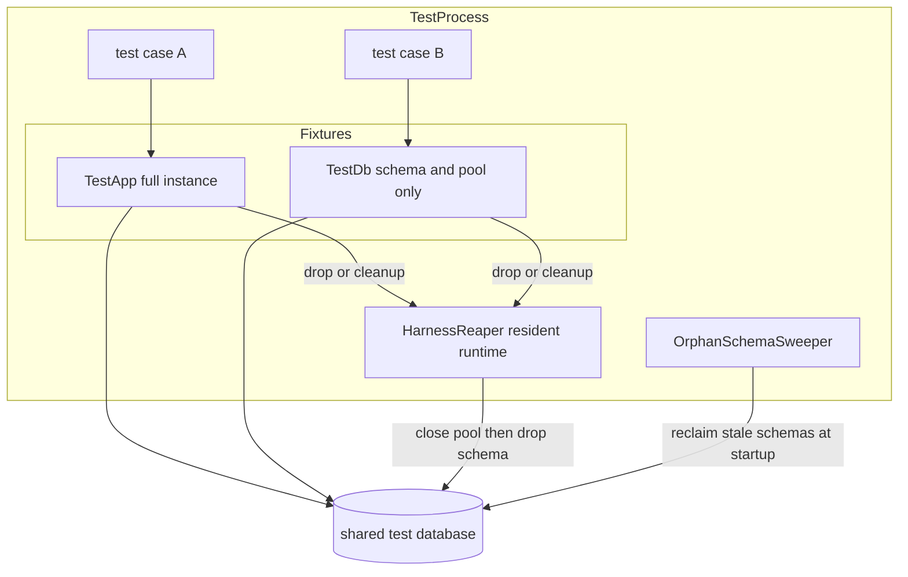
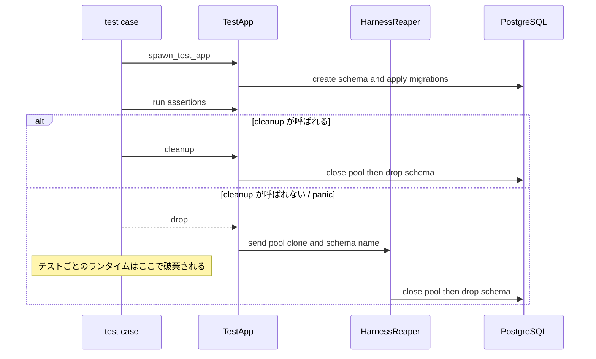
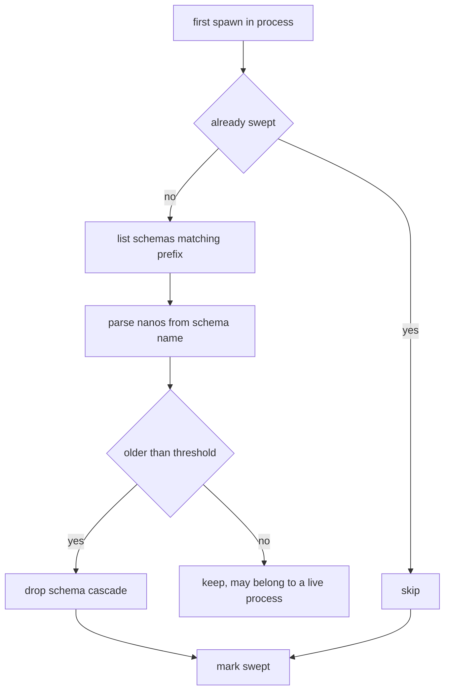

# Technical Design

## Overview

**Purpose**: テストスイートを、手順書を介さず単一プロセスで実行できる状態にする。

**Users**: このリポジトリで実装を進める開発者（人間・AI エージェント）。Phase 2 以降の実装は
既存テストを回しながら進むため、テストが素直に走らないことが全作業のコストに乗る。

**Impact**: `TestApp` の解放をテストごとの Tokio ランタイムから切り離し、プロセス常駐の
リーパーへ委譲する。あわせて repository / service テストを実インスタンス起動から軽量な
DB フィクスチャへ移し、テストハーネスを本番成果物から締め出す。プロダクションコードの
観測可能なふるまいは変えない。

### Goals

- `cargo test --lib` が単一プロセスで、資源枯渇に起因する失敗ゼロで完了する（1.1〜1.4）
- 後始末の実行がテストの記述に依存しない（2.1〜2.5）
- 過去の異常終了が残した孤立スキーマを自動回収する（3.1〜3.4）
- 実インスタンス起動を要する単体テストを削減し、実行時間を短縮する（4.1〜4.5）
- 本番成果物からテスト専用資産を排除する（5.1〜5.4）
- 配送ワーカーのクレーム 0 件現象に決着をつける（6.1〜6.4）

### Non-Goals

- テストフィクスチャの重複集約（B-1）。同じファイルを触る際の付随変更としては許容するが、
  独立した達成目標にはしない
- 契約テストの網羅性拡大（B-3）
- プロダクションの機能追加・観測可能なふるまいの変更。要件 6 で欠陥が確定した場合も、
  本 spec の責務は記録までとする
- マイグレーション適用そのものの高速化（テンプレートスキーマ複製等）。効果は見込めるが
  本 spec の完了条件には不要

## Boundary Commitments

### This Spec Owns

- `TestApp` のライフサイクル（生成・解放・異常終了時の後始末）
- 隔離スキーマの割り当てと回収
- テスト用フィクスチャの起動コスト階層（実インスタンス起動と DB のみの 2 段階）
- テストハーネスをビルド成果物へ含めるか否かのビルド構成
- 上記に付随して変更が必要になるテストコードの記述

### Out of Boundary

- プロダクションコードの観測可能なふるまい。既存の golden 契約テストの内容は変更対象ではなく、
  **変わらないことが成功条件の一部**
- 各テストが何を検証しているか（アサーションの中身）。フィクスチャの移行に伴う機械的変更を除く
- 契約テストの網羅性、フィクスチャ重複の集約
- 要件 6 で欠陥が確定した場合の修正そのもの（記録までが本 spec、修正は別 spec）

### Allowed Dependencies

- `src/db`（プール確立）、`src/migrate`（マイグレーション適用）、`src/runtime`、
  `src/bootstrap/wiring`（`compose_modules`）、`src/state`、`src/server` — いずれも既存の
  `spawn_test_app` が既に依存している範囲
- `sqlx` 0.9.0 の `Pool` / `PgPool`、`tokio` 1.52.3 のランタイム
- 新規の外部依存は追加しない

### Revalidation Triggers

- `TestApp` の公開フィールド・メソッドの形が変わったとき（全テストが影響を受ける）
- 軽量フィクスチャと `TestApp` の使い分け基準が変わったとき
- `[features]` の構成が変わったとき（`tests/` のビルド可否に直結する）
- 隔離スキーマの命名規約が変わったとき（スイープの判定条件が名前に依存している）

## Architecture

### Existing Architecture Analysis

現状の `src/test_harness.rs` は、本番 `bootstrap` と同じ構成要素（`db::establish_pool` /
`migrate::apply_migrations` / `runtime::RuntimeContext::deterministic` /
`bootstrap::wiring::compose_modules` / `state::AppState::new` / `server::build_router`）を
再利用して実インスタンスを起動する。この方針自体は steering `structure.md`「テストレイアウト」で
定められたものであり、維持する。

問題は解放側にある。`TestApp::cleanup()` は `pool.close().await` → `drop_schema` を正しく
実行するが、`Drop for TestApp` は同期コンテキストのため `pool.close()` を await できず、
スキーマ削除を `handle.spawn` でデタッチするだけになっている。`#[tokio::test]` のランタイムは
テスト終了時に破棄されるため、デタッチしたタスクは走り切らない。

**維持する制約**:
- モジュール構築順は `compose_modules` に一本化されている（複製しない）
- 非決定性（clock / id / RNG / 署名鍵）は注入可能境界の背後に置く
- 単体テストは実装ファイルと同階層の `tests.rs`、統合テストは `tests/*_it.rs`

### Architecture Pattern & Boundary Map



**Architecture Integration**:
- **Selected pattern**: 解放処理の実行主体を、テストごとのランタイムからプロセス常駐の
  リーパーへ移す。呼び出し側の記述は変えない
- **Domain boundaries**: フィクスチャ（資源の確保）とリーパー（資源の解放）を分離する。
  解放の責務がフィクスチャ側に散らないようにする
- **Existing patterns preserved**: `compose_modules` 一本化、決定性注入、テスト配置規約
- **New components rationale**: リーパーは「テストごとのランタイムより長く生きる実行主体」が
  必要だから。スイーパーはリーパーがプロセス終了に間に合わなかった分の安全網。軽量フィクスチャは
  repository / service テストが `TestApp` の大半を使っていないから
- **Steering compliance**: `tech.md`「テスト実行基盤の既知の問題」に記録済みの 2 項目を本 spec が
  引き取り、完了時に記述を実態へ同期する

### Technology Stack

| Layer | Choice / Version | Role in Feature | Notes |
|-------|------------------|-----------------|-------|
| Backend / Services | Rust edition 2024 | 実装言語 | 変更なし |
| Data / Storage | sqlx 0.9.0（postgres, migrate） | プール確立・マイグレーション・スキーマ操作 | `Pool::close()` が共有内部状態に作用する性質を利用する |
| Infrastructure / Runtime | tokio 1.52.3（rt-multi-thread） | リーパー用の常駐ランタイム | 専用スレッド上に 1 つだけ生成する |
| Infrastructure / Runtime | Cargo `[features]` | テストハーネスのビルド時ゲート | 新規セクション。crate 自身への dev-dependency を併用する |

新規の外部依存は追加しない。

## File Structure Plan

### Directory Structure

```
src/
├── test_harness.rs              # TestApp と spawn_test_app（既存、解放側を委譲に変更）
├── test_harness/
│   ├── reaper.rs                # 常駐リーパー：プール close とスキーマ drop の実行主体
│   ├── sweep.rs                 # 起動時の孤立スキーマ回収
│   ├── db_fixture.rs            # TestDb：隔離スキーマ + プールのみの軽量フィクスチャ
│   └── tests.rs                 # 既存
└── lib.rs                       # test_harness の公開を feature でゲートする
```

### Modified Files

- `Cargo.toml` — `[features]` セクションを新設し `test-harness` を定義。`[dev-dependencies]` に
  crate 自身を `features = ["test-harness"]` 付きで追加する
- `src/lib.rs` — `pub mod test_harness;` を `#[cfg(any(test, feature = "test-harness"))]` で
  ゲートする
- `src/federation.rs` — 連合ペアハーネスの公開を同様にゲートする
- `src/test_harness.rs` — `Drop for TestApp` をリーパーへの委譲に置き換える。`cleanup()` は
  明示パスとして維持する。`spawn_test_app` の冒頭でスイープを 1 度だけ起動する
- `src/statuses/**/tests.rs`, `src/social_graph/**/tests.rs`, `src/notifications/**/tests.rs`,
  `src/search/**/tests.rs`, `src/oauth/**/tests.rs`, `src/accounts/**/tests.rs`,
  `src/actor/**/tests.rs`, `src/media/**/tests.rs`, `src/federation/**/tests.rs`,
  `src/timelines/**/tests.rs` — 実インスタンスを使っていないテストを `TestDb` へ移す。
  モジュール単位で段階的に行う
- `.kiro/steering/tech.md` — 「テスト実行基盤の既知の問題」節を完了後の実態へ同期する

## System Flows

### 解放フロー



`cleanup()` が呼ばれた場合は従来どおり同期的に完了する。呼ばれなかった場合のみリーパーが
引き取る。リーパーはテストごとのランタイムとは独立に生存するため、送信後にテストが終了しても
処理は完了する。

### 起動時スイープ



閾値判定は名前に埋まったナノ秒だけで行うため、DB へのメタデータ追加を必要としない。
回収失敗はログのみでテスト実行を止めない。

## Requirements Traceability

| Requirement | Summary | Components | Interfaces | Flows |
|-------------|---------|------------|------------|-------|
| 1.1 | 単一プロセス実行で資源枯渇由来の失敗ゼロ | HarnessReaper, TestDb | — | 解放フロー |
| 1.2 | 事前のスキーマ掃除を前提としない | OrphanSchemaSweeper | `sweep_orphans` | 起動時スイープ |
| 1.3 | 失敗が対象の欠陥に起因することの保証 | HarnessReaper, TestDb | — | 解放フロー |
| 1.4 | 分割実行と一括実行で同一の成否 | HarnessReaper, TestDb | — | 解放フロー |
| 2.1 | テスト終了時に接続を解放 | HarnessReaper | `HarnessReaper::submit` | 解放フロー |
| 2.2 | パニック時も解放 | HarnessReaper | `HarnessReaper::submit` | 解放フロー |
| 2.3 | 記述に依存しない後始末 | HarnessReaper | `Drop for TestApp` | 解放フロー |
| 2.4 | 後始末省略時も未解放を生じない | HarnessReaper | `Drop for TestApp` | 解放フロー |
| 2.5 | 生存テスト数に比例する量を超えて保持しない | HarnessReaper | `HarnessReaper::submit` | 解放フロー |
| 3.1 | 起動時に孤立スキーマを回収 | OrphanSchemaSweeper | `sweep_orphans` | 起動時スイープ |
| 3.2 | 使用中スキーマを巻き込まない | OrphanSchemaSweeper | `is_reclaimable` | 起動時スイープ |
| 3.3 | 回収失敗がテストを妨げない | OrphanSchemaSweeper | `sweep_orphans` | 起動時スイープ |
| 3.4 | 1 プロセス 1 回 | OrphanSchemaSweeper | `sweep_orphans` | 起動時スイープ |
| 4.1 | 実インスタンス起動テストの削減 | TestDb | `spawn_test_db` | — |
| 4.2 | 純粋ロジックは起動なしで検証 | TestDb | `spawn_test_db` | — |
| 4.3 | 実行時間の短縮 | TestDb | `spawn_test_db` | — |
| 4.4 | 検証範囲を狭めない | TestDb | `spawn_test_db` | — |
| 4.5 | 統合テストは配置規約に従う | TestDb | — | — |
| 5.1 | 成果物にテスト専用資格情報を含めない | HarnessFeatureGate | `Cargo.toml` `[features]` | — |
| 5.2 | 無効時はハーネスを含めない | HarnessFeatureGate | `#[cfg]` | — |
| 5.3 | テストビルド時は利用可能 | HarnessFeatureGate | dev-dependency 自己参照 | — |
| 5.4 | 本番依存グラフにハーネス由来のエッジを含めない | HarnessFeatureGate | `#[cfg]` | — |
| 6.1 | クレーム 0 件現象の再現条件特定 | WorkerClaimInvestigation | — | — |
| 6.2 | 欠陥起因なら記録 | WorkerClaimInvestigation | — | — |
| 6.3 | テスト固有なら根拠を記録し steering を更新 | WorkerClaimInvestigation | — | — |
| 6.4 | 原因不明のまま放置しない | WorkerClaimInvestigation | — | — |

## Components and Interfaces

| Component | Domain/Layer | Intent | Req Coverage | Key Dependencies (P0/P1) | Contracts |
|-----------|--------------|--------|--------------|--------------------------|-----------|
| HarnessReaper | Test Infrastructure | 解放処理をテストごとのランタイムから切り離して実行する | 1.1, 1.3, 1.4, 2.1–2.5 | sqlx Pool (P0), tokio Runtime (P0) | Service, State |
| OrphanSchemaSweeper | Test Infrastructure | 過去の実行が残したスキーマを起動時に回収する | 1.2, 3.1–3.4 | 管理接続 (P0) | Service, Batch |
| TestDb | Test Infrastructure | 隔離スキーマ + プールのみを提供する軽量フィクスチャ | 4.1–4.5 | db::establish_pool (P0), migrate::apply_migrations (P0), HarnessReaper (P0) | Service |
| HarnessFeatureGate | Build Configuration | テストハーネスを本番成果物から締め出す | 5.1–5.4 | Cargo features (P0) | — |
| WorkerClaimInvestigation | Investigation | クレーム 0 件現象の原因を確定させる | 6.1–6.4 | DbDeliveryQueue (P1) | — |

### Test Infrastructure

#### HarnessReaper

| Field | Detail |
|-------|--------|
| Intent | プール close とスキーマ drop を、テストごとのランタイムより長く生きる実行主体で行う |
| Requirements | 1.1, 1.3, 1.4, 2.1, 2.2, 2.3, 2.4, 2.5 |

**Responsibilities & Constraints**
- 解放要求を受け取り、`pool.close()` → `drop_schema` の順で実行する
- プロセスにつき 1 つだけ生成され、意図的にプロセス終了まで生存する
- `Drop` から呼ばれるため、**送信操作はブロックせず、パニックしてはならない**
- リーパー自身は解放の成否でテストを失敗させない（失敗はログに留める）

**Dependencies**
- Inbound: `Drop for TestApp` / `Drop for TestDb` — 解放要求の送信元 (P0)
- Outbound: `drop_schema` — スキーマ削除 (P0)
- External: sqlx `Pool::close`（クローン 1 つで共有内部状態を閉じられる性質に依存）(P0)

**Contracts**: Service [x] / API [ ] / Event [ ] / Batch [ ] / State [x]

##### Service Interface

```rust
/// 解放要求。プールのクローンとスキーマ名を 1 単位で受け取る。
pub(crate) struct ReclaimRequest {
    pool: PgPool,
    schema: String,
}

impl HarnessReaper {
    /// プロセス唯一のリーパーを返す（初回呼び出しで生成）。
    fn global() -> &'static HarnessReaper;

    /// 解放要求を送る。ブロックせず、失敗してもパニックしない。
    /// 送信後、呼び出し側のランタイムが破棄されても処理は完了する。
    fn submit(&self, request: ReclaimRequest);
}
```

- **Preconditions**: なし（`Drop` の内側から呼ばれても安全であること）
- **Postconditions**: 要求が受理された場合、有限時間内にプールが閉じられスキーマが削除される
- **Invariants**: リーパーのランタイムはプロセス終了まで破棄されない。同一プールに対する
  重複要求は冪等に扱う（`cleanup()` 済みのプールへの `close()` は無害）

##### State Management

- **State model**: `OnceLock<HarnessReaper>` による 1 プロセス 1 インスタンス
- **Persistence & consistency**: 永続化しない。プロセス終了時に未処理の要求は失われるが、
  その分は `OrphanSchemaSweeper` が次回実行で回収する
- **Concurrency strategy**: 複数テストスレッドから並行に `submit` される。送信路は
  マルチプロデューサで、リーパー側で逐次または並行に処理する

**Implementation Notes**
- Integration: `cleanup()` の経路は変更しない。`Drop` のみを委譲に置き換える
- Validation: 「`cleanup()` を呼ばずに多数の `TestApp` を生成・破棄しても接続が積み上がらない」
  ことを直接検証するテストを置く。本 spec の中核であり、ここが緑にならなければ完了しない
- Risks: `Drop` 内の送信がパニックすると二重パニックでプロセスが異常終了する。送信路の選定で
  ブロックとパニックの双方を避ける

#### OrphanSchemaSweeper

| Field | Detail |
|-------|--------|
| Intent | 過去の異常終了が残したスキーマを、実行中のものを巻き込まずに回収する |
| Requirements | 1.2, 3.1, 3.2, 3.3, 3.4 |

**Responsibilities & Constraints**
- 1 プロセスにつき 1 回だけ実行する
- 回収対象の判定はスキーマ名に埋まったナノ秒のみで行う
- 回収失敗はログに留め、テスト実行を止めない

**Dependencies**
- Inbound: `spawn_test_app` / `spawn_test_db` — 初回呼び出し時に起動 (P0)
- Outbound: 管理接続 — スキーマ列挙と削除 (P0)

**Contracts**: Service [x] / API [ ] / Event [ ] / Batch [x] / State [ ]

##### Service Interface

```rust
/// 1 プロセス 1 回だけ、十分に古い孤立スキーマを回収する。
/// 失敗しても呼び出し側に伝播させない。
async fn sweep_orphans();

/// スキーマ名から回収可否を判定する。名前がパースできないものは回収しない。
fn is_reclaimable(schema_name: &str, now: SystemTime, threshold: Duration) -> bool;
```

- **Preconditions**: なし
- **Postconditions**: 閾値より古い `kawasemi_test_harness_*` スキーマが削除されている
- **Invariants**: 閾値より新しいスキーマは削除しない（他プロセスが使用中の可能性がある）

##### Batch / Job Contract
- **Trigger**: プロセス内で最初にフィクスチャが生成されたとき
- **Input / validation**: `kawasemi_test_harness_{nanos}_{seq}` 形式の名前。パース不能なものは対象外
- **Output / destination**: 対象スキーマの削除
- **Idempotency & recovery**: 削除は `IF EXISTS` 相当で冪等。失敗はログのみ

**Implementation Notes**
- Integration: 既存の `unique_schema_name` の命名規約に依存する。命名を変えるなら本コンポーネントも変わる
- Validation: 古い名前のスキーマを人工的に作り、回収されること／新しいものが残ることを検証する
- Risks: 閾値が短すぎると実行中の他プロセスのスキーマを削除する。長すぎると回収が遅れる

#### TestDb

| Field | Detail |
|-------|--------|
| Intent | 実インスタンス起動を伴わず、隔離スキーマ + マイグレーション適用済みプールだけを提供する |
| Requirements | 4.1, 4.2, 4.3, 4.4, 4.5 |

**Responsibilities & Constraints**
- ルーター構築・TCP listener bind・サーバータスク spawn・モジュール構築・署名鍵生成を**行わない**
- 解放は `TestApp` と同じくリーパーに委譲する
- **使い分けの基準**: HTTP リクエストの送出、ルーター、OAuth トークン、`AppState` 経由の
  モジュール参照のいずれかを使うテストは `TestApp`。それ以外（SQL とドメイン型だけで完結する
  repository / service テスト）は `TestDb`

**Dependencies**
- Outbound: `db::establish_pool`（P0）、`migrate::apply_migrations`（P0）、`HarnessReaper`（P0）

**Contracts**: Service [x] / API [ ] / Event [ ] / Batch [ ] / State [ ]

##### Service Interface

```rust
/// 隔離スキーマとマイグレーション適用済みプールのみを持つ軽量フィクスチャ。
pub struct TestDb {
    pub pool: PgPool,
    pub runtime: RuntimeContext,
}

/// 実インスタンスを起動せずに TestDb を生成する。
pub async fn spawn_test_db() -> TestDb;

impl TestDb {
    /// 明示的な後始末。省略しても Drop がリーパーへ委譲する。
    pub async fn cleanup(self);
}
```

- **Preconditions**: 共有テストデータベースへ到達可能であること（`spawn_test_app` と同条件）
- **Postconditions**: マイグレーション適用済みの隔離スキーマに接続されたプールが得られる
- **Invariants**: 決定性の注入（clock / id / RNG）は `TestApp` と同一の規約に従う

**Implementation Notes**
- Integration: 移行はモジュール単位で行い、各段階でそのモジュールのテストが緑であることを確認する
- Validation: 移行前後で当該モジュールのテスト件数と成否が一致することを確認する
- Risks: 移行対象の誤判定。`TestApp` でしか通らないテストを移すとコンパイルエラーになるため、
  誤判定は静かに壊れるのではなく即座に検出される

### Build Configuration

#### HarnessFeatureGate

| Field | Detail |
|-------|--------|
| Intent | テストハーネスを本番成果物から締め出し、本番依存グラフをクリーンにする |
| Requirements | 5.1, 5.2, 5.3, 5.4 |

**Responsibilities & Constraints**
- `test-harness` feature が無効なとき、ハーネスとその定数（固定鍵・固定パスフレーズ・
  テスト用 DB 接続先）を成果物に含めない
- `cargo test` および `tests/` からは従来どおり利用できる

**Dependencies**
- Outbound: Cargo の feature 解決（P0）

**Implementation Notes**
- Integration: 順序が重要。まず crate 自身への dev-dependency 構成を成立させ、`tests/` が
  ビルドできる状態を作ってから `#[cfg]` を付ける。逆順にすると全統合テストが一時的に壊れる
- Validation: feature 無効でのビルド成果物にテスト用定数の文字列が含まれないことを確認する。
  `federation → 各 feature モジュール` の依存エッジが消えることも確認対象
- Risks: `src/federation/test_harness.rs` 由来の依存エッジを落とし切れないと 5.4 を満たせない

### Investigation

#### WorkerClaimInvestigation

| Field | Detail |
|-------|--------|
| Intent | プールサイズ 1 でクレームが 0 件になる現象の原因を確定させる |
| Requirements | 6.1, 6.2, 6.3, 6.4 |

**Responsibilities & Constraints**
- 再現条件を特定する。`claim_due` は単一の `FOR UPDATE SKIP LOCKED` 文であり、プールサイズに
  依存しないはずである、という前提から出発する
- 第一候補: `run_once` 実行中に同じプールの別経路が対象行をロックしており、`SKIP LOCKED` が
  それを飛ばしている
- 結論が出ない場合も「何が否定されたか」を記録する。原因不明のまま「flake」として閉じない

**Implementation Notes**
- Integration: steering `tech.md` は同じ現象を「フル並列時のごく稀な flake、再現手順未特定」と
  記録している。**決定的な再現手順が得られた**ため、この記述は結論に応じて更新する
- Risks: 調査が発散する。時間を区切り、判明しなければ否定された仮説を記録して閉じる

## Testing Strategy

### Unit Tests

- `is_reclaimable` が、閾値より古い名前を回収対象と判定し、新しい名前・パース不能な名前を
  対象外と判定する（3.2, 3.4）
- `HarnessReaper::submit` が `Drop` の内側から呼ばれてもブロックせず、パニックしない（2.3, 2.4）
- `TestDb` が実インスタンスを起動せずにマイグレーション適用済みプールを提供する（4.2）

### Integration Tests

- `cleanup()` を呼ばずに多数の `TestApp` を生成・破棄したとき、保持接続数が生存インスタンス数に
  比例する範囲に留まる（2.1, 2.4, 2.5）— **本 spec の中核**
- テストがパニックしたあと、そのテストが確保した接続とスキーマが回収される（2.2）
- 古い孤立スキーマを人工的に作った状態でプロセスを起動すると回収され、新しいものは残る
  （3.1, 3.2）
- 回収処理が失敗する状況でもテスト自体は実行される（3.3）
- `TestDb` へ移行したモジュールのテスト件数と成否が移行前と一致する（4.4）

### Build Verification

- `test-harness` feature 無効でビルドした成果物に、テスト専用の固定鍵・パスフレーズ・
  DB 接続先の文字列が含まれない（5.1, 5.2）
- `cargo test` および `tests/` からハーネスが利用できる（5.3）
- 本番依存グラフに `src/federation/test_harness.rs` 由来のエッジが存在しない（5.4）

### Suite-level Verification

- `cargo test --lib` を単一プロセスで実行し、資源枯渇に起因する失敗が 0 件であること（1.1, 1.3）
- 事前のスキーマ掃除なしで実行できること（1.2）
- モジュール単位実行と一括実行で成否が一致すること（1.4）
- 実行時間が現状（891 秒）より短縮されること（4.3）

## Performance & Scalability

本 spec の性能目標は実行時間そのものではなく、**単一プロセスで完了できること**である。
実行時間の短縮（4.3）は `TestDb` 移行の副次的効果として測定する。

現状のベースライン（移行前の測定値、比較の基準として記録）:

| 指標 | 現状 |
|------|------|
| lib テスト件数 | 1,764 |
| うち実インスタンス起動を要する件数 | 750 |
| 一括実行時間 | 891 秒 |
| 一括実行時の失敗 | 256 件（全件 `PoolTimedOut`） |
| 実行後の残存スキーマ | 239 |

## Open Questions / Risks

- **リーパーの処理がプロセス終了に間に合わない分がどれだけ残るか**は実測しないと分からない。
  起動時スイープが安全網として機能することを実測で確認する
- **`TestDb` へ移せるテストの実数**は分類してみないと確定しない。750 件のうちどれだけ移せるかで
  4.3 の短縮幅が決まる
- **要件 6 が未解決のまま終わる可能性**がある。その場合も 6.4 に従い、否定された仮説を記録する
