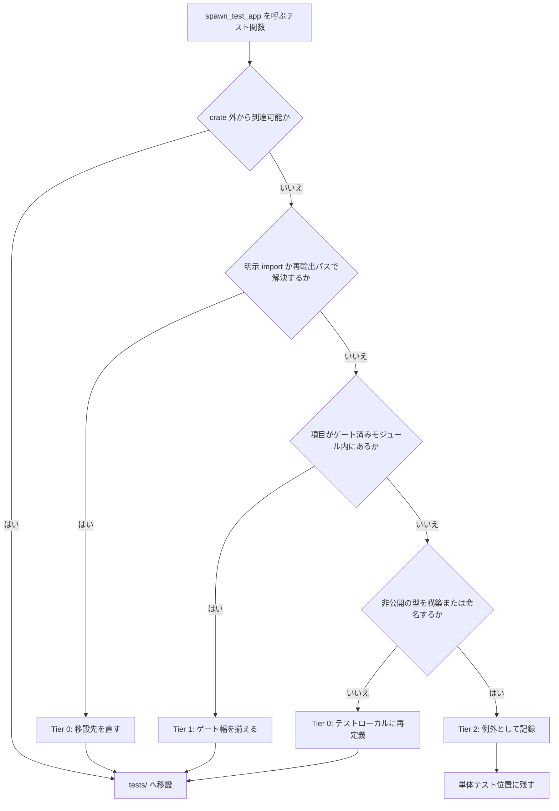
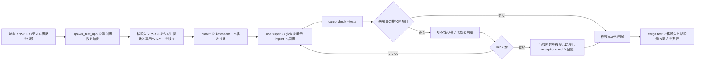
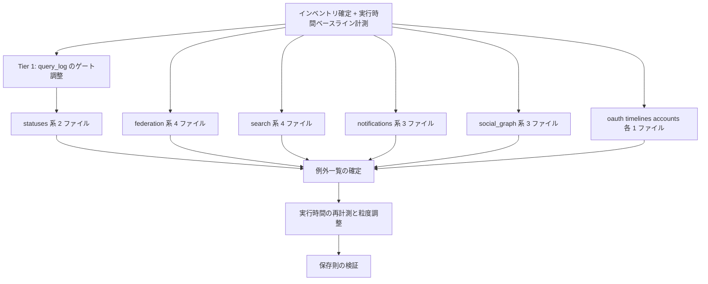

# Technical Design — test-placement-migration

## Overview

**Purpose**: steering `structure.md`「テストレイアウト」が定める「DB込みの実起動インスタンスを要する検証は `tests/` 直下の `*_it.rs` に置く」を、規約としてだけでなく**実態として**成立させる。単体テスト位置 `src/**/tests.rs` に残る `spawn_test_app` 呼び出し 203 箇所 / 20 ファイル（`src/test_harness/tests.rs` の 5 箇所は対象外）を移設する。

**Users**: このリポジトリでテストを読み書きする開発者。移設後は「実インスタンスを起動する検証は `tests/` にある」が例外なく（記録された例外を除いて）成り立ち、検証の所在を規約から一意に導ける。

**Impact**: 本 spec は**プロダクションコードのふるまいを一切変更しない**。変更されるのはテストの物理配置と、移設に伴う import・可視性ゲートのみ。test-infrastructure spec が 748 → 208 まで削減した残債を引き取り、配置規約の適用を完了させる。

### Goals

- `spawn_test_app` を呼ぶ検証を `tests/*_it.rs` へ移設し、単体テスト位置に残るものを「記録された例外」に限定する
- 検証内容（対象・入力・アサーション）を移設前と同一に保つ
- 既定フィーチャのライブラリビルドの公開 API を 1 項目も広げない
- フルスイート実行時間を移設前の 1.2 倍以内に収める

### Non-Goals

- テスト実行時間の短縮（配置の問題であってフィクスチャコストの問題ではない）
- 検証内容の追加・拡張・改善
- `TestApp` → `TestDb` の追加移行（test-infrastructure spec で完了済み）
- 配置規約を将来にわたり自動強制する仕組み（lint / CI ゲート）の導入
- steering「テストレイアウト」の規約文言の緩和

## Boundary Commitments

### This Spec Owns

- `src/**/tests.rs` 20 ファイル内の、`spawn_test_app` を呼ぶテスト関数の**配置**
- 移設先となる `tests/*_it.rs` ファイル群の新設と、その import 構成
- `src/test_harness.rs` の `query_log` モジュール宣言の cfg ゲート幅と可視性
- 移設できなかった検証の例外一覧（`exceptions.md`）の内容と正確性
- 移設前後のフルスイート実行時間の計測とその記録

### Out of Boundary

- **プロダクションコードのふるまい** — 本 spec は 1 行も動作を変えない
- **本番モジュールの `pub(crate)` / private 項目の可視性** — `RenderContext` / `StatusRenderAssembler` / `RequiredPolls` / `TolerantPolls` を含め、`pub` へ昇格させない。これらを要する検証は例外として残す
- `src/test_harness/tests.rs` の 5 箇所（test-infrastructure spec が対象外と判断済み）
- test-infrastructure spec が確立した隔離・回収機構（`establish_isolated_db` / `reaper` / `sweep`）の実装
- 既存 `tests/*_it.rs` 87 本の検証内容
- 純粋な単体テスト（`spawn_test_app` を呼ばないもの）の配置 — 現在の位置が正しい

### Allowed Dependencies

- `src/test_harness.rs` の `spawn_test_app` / `TestApp` / `db_fixture` — 既存の公開 API をそのまま使う
- `Cargo.toml` の自己 dev-dependency（`kawasemi = { path = ".", features = ["test-harness"] }`）による `tests/*.rs` からのハーネス参照
- 各モジュールが既に `pub` として公開している型・関数・再輸出パス
- **禁止**: 移設を理由に本番モジュールの項目の可視性を広げること。ゲート内にある項目のゲート幅調整（`query_log`）のみ例外的に許す

### Revalidation Triggers

- `spawn_test_app` / `TestApp` のシグネチャまたはフィールド構成の変更
- `test-harness` フィーチャゲートの適用範囲の変更（`src/lib.rs` / `src/federation.rs`）
- steering「テストレイアウト」の規約文言の変更
- 例外一覧に載る項目の可視性が別 spec で変更された場合（例外が不要になるため再評価が要る）

## Architecture

### Existing Architecture Analysis

移設を阻害する構造は 2 種類あり、性質がまったく異なる。

1. **`use super::*` によるグロブ import** — `src/foo/bar/tests.rs` は親モジュール `bar` の内部として書かれており、`use super::*` が親の `use` 宣言ごと引き込む。crate 外からは `pub use` された項目しか見えないため、`Id` / `AccountRef` / `Arc` / `Value` / `StatusCode` といった**公開型**が移設先で軒並み解決不能になる。試行コンパイルで検出した 689 件のエラーのうち約 600 件がこれで、**crate の変更を一切要さない**（移設先での明示 import で解消する）。

2. **親モジュールの非公開項目への直接アクセス** — こちらが真の阻害要因。ただし試行の結果、非公開項目 16 のうち 8 つは**純粋な単体テストだけ**が使用しており、それらは移設対象ではないため触れる必要がない。

`pub use` は可視性を広げられない（E0364 / E0365、実測済み）。**crate 外へ項目を見せる方法はその項目自身に `pub` を書くこと以外に存在しない**。したがって「ゲート付きモジュールに再輸出を集約する」といった迂回路は取れず、封じ込めが効くのは `test_harness` のように**モジュール宣言そのものがゲートされている**場合に限られる。

### 可視性の梯子（本 spec の中心的な設計判断）

阻害される項目ごとに、成立する**最も低い段**を選ぶ。新しい可視性の慣用句は導入しない。

| 段 | 手段 | 既定フィーチャのビルドへの影響 | 適用対象 |
|---|---|---|---|
| **Tier 0** | 移設先での明示 import / `pub use` 済みパスの使用 / 1 行の非公開ヘルパーのテストローカルな再定義 | なし | 阻害要因の大半 |
| **Tier 1** | 既にゲート内にある項目のゲート幅を揃える | なし（実測で確認） | `test_harness::query_log` のみ |
| **Tier 2** | 移設せず例外として記録する | なし | 本番モジュールの非公開**型**を構築・命名する検証 |

**Tier 2 は妥協ではなく構造からの帰結である。** `src/statuses/render_assembler/tests.rs` の 13 本を移設するには `RenderContext`・`StatusRenderAssembler`・`new`・`assemble_many`・`assemble_one` をすべて `pub` にする必要がある。この組み立て経路は steering が「唯一の組み立て経路」と定める crate 内部の要であり、公開すれば「テストの配置を直すために本番の API 契約を増やす」ことになる。要件 3.1 はこれを禁じている。



### 阻害要因の実測結果

`spawn_test_app` を呼ぶテストが触れる非公開項目と、適用する段。

| 項目 | 現在の可視性 | 対象テスト数 | 段 |
|---|---|---|---|
| `test_harness::query_log` | `#[cfg(test)] pub(crate) mod` | statuses 系 3 ファイル | Tier 1 |
| `statuses::render_assembler::RenderContext` | `pub(crate) struct` | 13 | Tier 2 |
| `notifications::service::RequiredPolls` | private struct | 2 | Tier 2 |
| `search::hydrator::TolerantPolls` | private struct | 1 | Tier 2 |
| `search::hydrator::account_ref_id` | private fn | 1 | Tier 0 |
| `signatures::signer::sha256_pkcs1v15_padding` | private fn | 2 | Tier 0 |
| `signatures::signer::host_from_url` | private fn | 1 | Tier 0 |
| `signatures::negotiation::{format_from_db, format_to_db}` | private fn | 各 1 | Tier 0 |
| `federation::endpoints::webfinger::parse_acct_resource` | private fn | 1 | Tier 0 |
| `signatures::{suite, signer, negotiation, http_client}`（E0603） | private mod | — | Tier 0（`pub use` 済みパスへ変更） |

Tier 0 の非公開 fn はいずれも、テストが**そのふるまいを検証している**のではなく**期待値の構築に使っている**（ふるまいを検証している純粋テストは移設対象外として元位置に残る）。したがってテストローカルな再定義は検証内容を変えない。

### Architecture Integration

- **選択パターン**: テスト関数単位の移設 + 段階的可視性ポリシー。ファイル単位ではない
- **既存パターンの保持**: `spawn_test_app` / `TestApp` / `establish_isolated_db` / リーパー / 起動時スイープはすべて無変更
- **Steering 準拠**: 「テスト専用資産を本番成果物に入れない」が定める 3 条件（モジュール宣言のゲート・配下の丸ごと除外・自己 dev-dependency 経由の可視性）を `query_log` に適用する

### Technology Stack

| Layer | Choice / Version | Role in Feature | Notes |
|---|---|---|---|
| Backend / Services | Rust edition 2024 | 移設対象コードの言語 | 新規依存なし |
| Infrastructure / Runtime | Cargo test targets | `tests/*.rs` は 1 ファイル = 1 バイナリ | 87 → 最大 106 本。要件 5 の計測対象 |
| Data / Storage | PostgreSQL（既存テスト DB） | 隔離スキーマ単位のフィクスチャ | 変更なし |

## File Structure Plan

### 移設先（新規）

```
tests/
├── accounts_account_service_it.rs        # src/accounts/account_service/tests.rs 由来
├── federation_webfinger_endpoint_it.rs   # src/federation/endpoints/webfinger/tests.rs 由来
├── federation_outbound_worker_it.rs
├── federation_signatures_negotiation_it.rs
├── federation_signatures_signer_it.rs
├── notifications_endpoints_it.rs
├── notifications_service_it.rs
├── notifications_module_it.rs            # src/notifications/tests.rs 由来
├── oauth_middleware_it.rs
├── search_endpoint_it.rs
├── search_hydrator_it.rs
├── search_service_it.rs
├── search_module_it.rs                   # src/search/tests.rs 由来
├── social_graph_endpoints_it.rs
├── social_graph_follow_request_service_it.rs
├── social_graph_module_it.rs             # src/social_graph/tests.rs 由来
├── statuses_account_provider_it.rs
├── statuses_endpoints_it.rs
└── timelines_endpoints_it.rs
```

命名は `<モジュールパスを _ で連結>_it.rs`。既存の `tests/notification_list_it.rs` 等と衝突しないよう、モジュール由来であることが読み取れる綴りにする。`src/<module>/tests.rs`（モジュール直下）由来のものは `_module_it.rs` で区別する。

**`src/statuses/render_assembler/tests.rs` に対応する移設先ファイルは作らない**（13 本すべてが Tier 2 の例外）。

### 変更ファイル

- `src/**/tests.rs`（20 ファイル） — `spawn_test_app` を呼ぶテスト関数と、それ**専用**のヘルパーを削除する。残る純粋な単体テストと共用ヘルパーはそのまま。ファイルのモジュールドキュメントに移設先を 1 行で記す
- `src/test_harness.rs` — `query_log` の宣言を `#[cfg(test)] pub(crate) mod` から `#[cfg(any(test, feature = "test-harness"))] pub mod` へ。同モジュールのドキュメントコメントが述べる「出荷ライブラリに届いてはならない」理由づけを、ゲート変更後も正確な記述へ更新する
- `.kiro/specs/test-placement-migration/exceptions.md`（新規） — 例外一覧。要件 4 の成果物
- `.kiro/specs/test-placement-migration/inventory.md`（新規） — 移設対象テスト関数の確定表。要件 1.4 の成果物
- `.kiro/specs/test-placement-migration/timing.md`（新規） — 移設前後の実行時間計測記録。要件 5.1 の成果物

## System Flows

### 1 ファイル分の移設手順



`use super::*` の展開は、グロブが隠していた依存を明示に変える操作であり、移設の本体である。展開漏れはコンパイルエラーとして必ず現れるため、静かに失敗しない。

## Requirements Traceability

| Requirement | Summary | Components | Interfaces | Flows |
|---|---|---|---|---|
| 1.1 | 単体テスト位置に `spawn_test_app` を残さない | 移設先ファイル群 / `exceptions.md` | — | 移設手順 |
| 1.2 | 実インスタンス検証は `tests/` 直下へ | 移設先ファイル群 | — | 移設手順 |
| 1.3 | 新規ファイルは `_it.rs` 命名 | File Structure Plan | — | — |
| 1.4 | 対象 203 / 20 の内訳を移設前に確定 | `inventory.md` | — | — |
| 1.5 | 203 = 移設 + 例外 の保存則 | `inventory.md` / `exceptions.md` | 計数コマンド | — |
| 2.1 | 対象・入力・アサーションを同一に保つ | 移設先ファイル群 | — | 移設手順 |
| 2.2 | 削除・無効化・アサーション削減の禁止 | 移設先ファイル群 | — | — |
| 2.3 | 成立しないものは弱めず例外へ | `exceptions.md` | — | 移設手順（Tier 2 分岐） |
| 2.4 | 既存統合テストと重複させない | 移設先ファイル群 | — | — |
| 2.5 | フルスイート通過 | — | `cargo test` | — |
| 2.6 | テスト関数総数の差分が説明可能 | `inventory.md` | 計数コマンド | — |
| 3.1 | 既定フィーチャの公開 API を広げない | 可視性の梯子 | `cargo build` | — |
| 3.2 | 緩和はテスト構成に限定 | Tier 1（`query_log`） | cfg ゲート | — |
| 3.3 | 限定できないものは例外へ | Tier 2 | — | 移設手順（Tier 2 分岐） |
| 3.4 | テスト専用資産を既定ビルドから外す | `src/test_harness.rs` | cfg ゲート | — |
| 3.5 | 緩和した項目を一覧できる形で残す | `exceptions.md`（Tier 1 節） | — | — |
| 4.1 | 例外をファイル単位・件数付きで列挙 | `exceptions.md` | — | — |
| 4.2 | 各例外に公開面拡大の根拠と項目名 | `exceptions.md` | — | — |
| 4.3 | 根拠が該当しないものは移設 | 可視性の梯子 | — | 移設手順 |
| 4.4 | 例外一覧に件数と再現手順 | `exceptions.md` | 計数コマンド | — |
| 4.5 | 対象外 5 箇所を例外と区別 | `exceptions.md` | — | — |
| 5.1 | 移設前後の実行時間を同一条件で計測 | `timing.md` | 計測コマンド | — |
| 5.2 | 1.2 倍以内 | `timing.md` | 計測コマンド | — |
| 5.3 | 超えた場合は粒度調整 | File Structure Plan | — | — |
| 5.4 | 隔離スキーマ数が上限を超えず完走 | — | `cargo test` | — |
| 5.5 | 終了時に隔離スキーマを残さない | — | 既存リーパー / スイープ | — |
| 6.1 | steering の規約文言を緩和しない | — | — | — |
| 6.2 | 計数手順をコマンドとして文書化 | `exceptions.md` | 計数コマンド | — |
| 6.3 | 完了主張に実行結果を添える | `exceptions.md` / `timing.md` | — | — |
| 6.4 | 計数単位を明示 | `inventory.md` | 計数コマンド | — |
| 6.5 | steering と実態が一致し確認できる | 全体 | 計数コマンド | — |

## Components and Interfaces

| Component | Domain/Layer | Intent | Req Coverage | Key Dependencies | Contracts |
|---|---|---|---|---|---|
| 移設先ファイル群 | テスト | `spawn_test_app` を呼ぶ検証の新しい住所 | 1, 2 | `test_harness`（P0）、各モジュールの公開 API（P0） | State |
| `query_log` ゲート調整 | テストハーネス | 3 ファイルの移設を可能にする唯一の crate 変更 | 3.2, 3.4 | `test-harness` フィーチャ（P0） | State |
| `inventory.md` | 仕様成果物 | 移設対象の確定表 | 1.4, 1.5, 2.6, 6.4 | 計数コマンド（P0） | Batch |
| `exceptions.md` | 仕様成果物 | 例外の列挙と正当化 | 3.5, 4, 6.2 | `inventory.md`（P0） | Batch |
| `timing.md` | 仕様成果物 | 実行時間の計測記録 | 5.1, 5.2 | フルスイート実行（P0） | Batch |

### テスト / 移設先ファイル群

| Field | Detail |
|---|---|
| Intent | `spawn_test_app` を起点とする検証を統合テストバイナリとして保持する |
| Requirements | 1.1, 1.2, 1.3, 2.1, 2.2, 2.4, 2.5 |

**Responsibilities & Constraints**

- 移設元のテスト関数を、対象・入力・アサーションを変えずに保持する
- 各ファイルは `use kawasemi::…` の明示 import のみで構成し、グロブ import を持ち込まない
- 移設元に残る純粋な単体テストと共有していたヘルパーは、移設先へ**複製**する（移設元でも引き続き必要なため）。複製されるのはテストの足場であり、検証内容ではない
- 既存 `tests/*_it.rs` が検証する「モジュール横断の配線・契約・ライフサイクル」と重複する検証を新たに作らない

**Dependencies**

- Outbound: `kawasemi::test_harness::{spawn_test_app, TestApp}` — 実インスタンス起動（P0）
- Outbound: 各対象モジュールの公開 API — 検証対象（P0）
- External: `Cargo.toml` の自己 dev-dependency（`features = ["test-harness"]`）— ハーネス可視性（P0）

**Implementation Notes**

- Integration: 移設は 1 ファイル完結。ファイル間に依存はなく、並行実装が安全
- Validation: 移設元・移設先の双方で `cargo test` を通し、テスト関数の総数が保存されることを確認する
- Risks: ヘルパーの複製が移設元とドリフトしうる。ヘルパーは検証内容ではなく足場であり、ドリフトしても両者のテストが独立に赤くなるため静かには壊れない

### テストハーネス / `query_log` ゲート調整

| Field | Detail |
|---|---|
| Intent | `#[cfg(test)]` という必要より狭いゲートを、モジュール全体と同じゲートに揃える |
| Requirements | 3.2, 3.4 |

**Responsibilities & Constraints**

- `src/test_harness.rs:145-146` の `#[cfg(test)] pub(crate) mod query_log;` を `#[cfg(any(test, feature = "test-harness"))] pub mod query_log;` にする
- 本 spec で crate に加える**唯一の**変更である
- `src/lib.rs:49` の `pub mod test_harness;` が既に同じゲートを持つため、既定フィーチャのビルド成果物は変わらない（`cargo build` / `cargo check --tests` の双方で実測確認済み）
- モジュールのドキュメントコメントは「出荷ライブラリに届いてはならない」という不変条件を保ったまま、ゲートの実態に合わせて更新する

**Contracts**: State

**Implementation Notes**

- Validation: 変更前後で `cargo build`（既定フィーチャ）が成功し、成果物に `query_log` が含まれないこと
- Risks: `record_queries` は per-future の subscriber を張るため、テストがどのバイナリにあるかに依存しない。ただしドキュメントが述べる interest cache のウォームアップは並行実行状況に依存するため、移設後に該当テストを複数回実行して安定性を確認する

### 仕様成果物 / `inventory.md`・`exceptions.md`・`timing.md`

| Field | Detail |
|---|---|
| Intent | 要件 1.4–1.5 / 4 / 5 / 6 が求める「確定した内訳・正当化された例外・計測値」を検証可能な形で残す |
| Requirements | 1.4, 1.5, 2.6, 3.5, 4.1, 4.2, 4.4, 4.5, 5.1, 5.2, 6.2, 6.3, 6.4 |

**Contracts**: Batch

##### `inventory.md`

- Trigger: 移設着手前に 1 度。以降のタスクはこの表を参照する
- Input: `git grep -n 'spawn_test_app(' -- 'src/**/tests.rs'` と各ファイルのテスト関数境界
- Output: ファイル × テスト関数名 × 移設可否の判定（判定は各タスクで確定する）× 呼び出し箇所数
- 計数単位を明記する: **呼び出し箇所 203**（`git grep -o`）と**テスト関数の本数**は異なる。placement-audit.md と同じ単位で比較する

##### `exceptions.md`

- Trigger: 各移設タスクが Tier 2 判定を出すたびに追記
- Output: 例外ごとに ①ファイルとテスト関数名 ②件数 ③到達不能な項目の名前と現在の可視性 ④移設した場合に `pub` 化を要する項目の連鎖
- **対象外である `src/test_harness/tests.rs` の 5 箇所は、例外とは別の節に置く**（要件 4.5）。これは本 spec が判断したものではなく test-infrastructure spec の既決事項である
- Tier 1 で緩和した項目（`query_log`）も別節に記載する（要件 3.5）
- 末尾に計数の再現コマンドと、その実行結果を貼る（要件 4.4, 6.2, 6.3）

##### `timing.md`

- Trigger: 移設着手前と全移設完了後
- Input: 同一条件でのフルスイート実行（同じマシン、同じ並列度、ウォームキャッシュ）
- Output: 前後の実測値、比、および 1.2 倍の判定
- 1 回の計測は揺らぐため複数回の中央値を採る。前後で試行回数を揃える

## Error Handling

本 spec の「エラー」はすべて**コンパイル時**か**テスト失敗**として現れる。実行時のエラーハンドリング設計は対象外。

| 事象 | 検知 | 対応 |
|---|---|---|
| グロブ import が隠していた依存の未解決 | `cargo check --tests`（E0425 / E0433 / E0412） | 移設先に明示 import を追加（Tier 0） |
| 非公開モジュールへのパス参照 | E0603 | `pub use` 済みの再輸出パスへ変更（Tier 0） |
| 非公開項目への到達不能 | E0364 / E0365 / E0603 / E0599 | 可視性の梯子で段を判定。Tier 2 なら移設を取り消し `exceptions.md` へ記録 |
| 移設後のテスト失敗 | `cargo test` | **移設が原因かを先に切り分ける。** `TestApp` のバックグラウンドループと `runtime.keys` は移設で変わらないため、失敗は import の取り違えか、移設元に残したヘルパーとの不整合を疑う |
| 実行時間の 1.2 倍超過 | `timing.md` の計測 | 移設先ファイルの粒度を統合して binary 数を減らす（要件 5.3） |
| 隔離スキーマの残留 | 実行後の `information_schema` 確認 | 既存のリーパーとスイープが回収する。残るなら移設ではなくハーネス側の退行を疑う |

## Testing Strategy

本 spec の成果物はテストそのものであるため、「テスト戦略」は**移設が検証範囲を保存したことをどう示すか**に読み替える。

### 保存の検証（要件 2）

1. 移設した各テスト関数が、移設先で移設前と同じアサーションを持つこと（差分レビューで確認。関数本体の変更は import 由来の修飾子とヘルパー呼び出しに限る）
2. 移設前後でテスト関数の総数が保存されること（増減があれば `inventory.md` で説明できること）
3. フルスイート（`cargo test`）が移設前と同じ本数を通過すること
4. 移設元に残った純粋な単体テストが引き続き通過すること

### 配置の検証（要件 1・6）

5. `git grep -o 'spawn_test_app(' -- 'src/**/tests.rs' | wc -l` の結果が「例外の件数 + 対象外 5」に一致すること
6. `git ls-files 'tests/*_it.rs' | wc -l` が移設で作られたファイル数だけ増えていること
7. `src/**/tests.rs` の各ファイルについて、残存件数が `exceptions.md` の記載と一致すること

### 公開面の検証（要件 3）

8. 既定フィーチャの `cargo build` が成功し、`query_log` を含まないこと
9. 移設に伴う diff に、本番モジュールの項目を `pub` へ昇格させる変更が 1 件も含まれないこと（`git diff` で `-pub(crate)` / `+pub` および `-fn` / `+pub fn` を検索する）

### 実行コストの検証（要件 5）

10. 移設前後のフルスイート実行時間の比が 1.2 以内であること
11. フルスイート実行後に `kawasemi_test_harness_` 接頭辞のスキーマが残らないこと

## Migration Strategy

移設は**モジュール単位で独立**しており、依存関係がない。並行実装が安全である。



移設対象 19 ファイルの内訳: federation 4（webfinger / outbound_worker / signatures_negotiation / signatures_signer）、search 4（endpoint / hydrator / service / モジュール直下）、notifications 3（endpoints / service / モジュール直下）、social_graph 3（endpoints / follow_request_service / モジュール直下）、statuses 2（account_provider / endpoints）、その他 3（oauth_middleware / timelines_endpoints / accounts_account_service）。

- **P0 は全作業の前提**。インベントリなしに移設すると要件 1.5 の保存則が検証できない
- **P1 は statuses 系 2 ファイルの前提**（両者とも `query_log` を使う）。それ以外の波とは独立で並行実施できる
- ロールバックの単位はファイル。移設先を削除し移設元を復元すれば元に戻る
- `src/statuses/render_assembler/tests.rs` は最初から Tier 2 と判明しているため移設タスクを持たず、例外一覧への記録のみ行う

## Performance & Scalability

- **目標**: フルスイート実行時間が移設前の 1.2 倍以内（要件 5.2）
- **増分の出どころ**: テスト自体の実行時間は変わらない（同じ `spawn_test_app` を同じ回数呼ぶ）。増分は統合テストバイナリの増加（87 → 最大 106）に伴うコンパイル・リンク時間とプロセス起動オーバーヘッド
- **是正手段**: 移設先ファイルの統合による binary 数の削減。モジュール単位を諦め、ドメイン単位（例: `search_*_it.rs` を 1 本に）へ寄せる
- **同時実行スキーマ数**: 移設でフィクスチャの総数は変わらないが、バイナリ間の並列実行により**同時に存在するスキーマ数のピークが上がりうる**。要件 5.4 の完走確認で検知する
