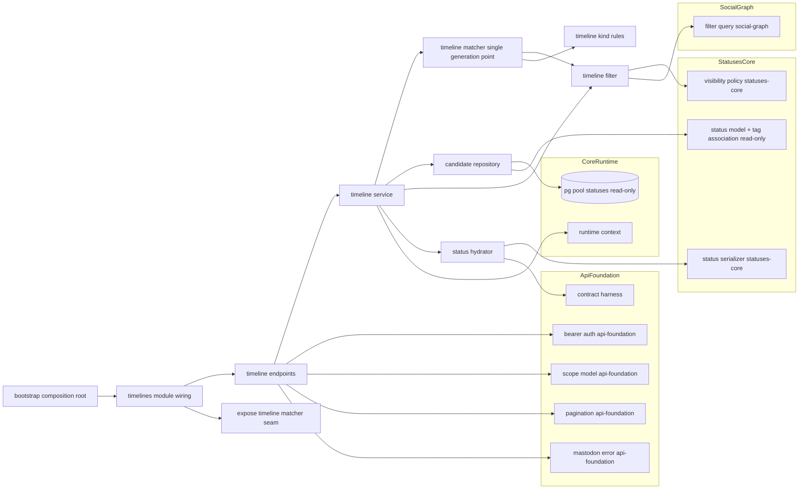
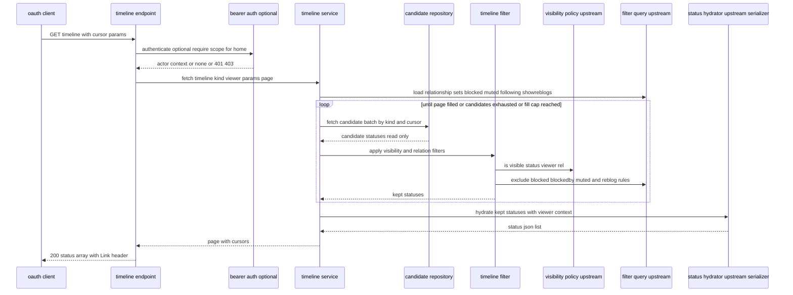
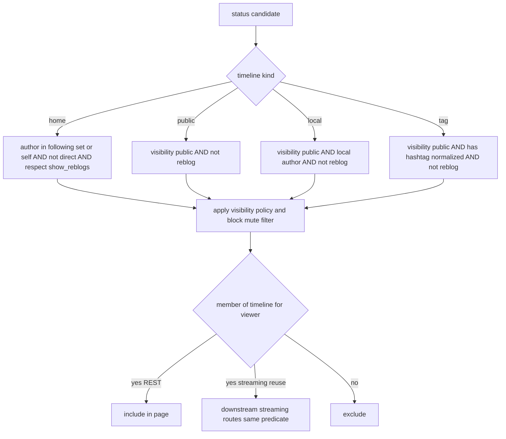

# Design Document

## Overview

**Purpose**: timelines は kawasemi の Mastodon 互換 API における **タイムライン集約レイヤー** を提供する。home / public / local / tag の各タイムラインを、一貫したカーソルページネーション（api-foundation 規約）と、可視性フィルタ（statuses-core `VisibilityPolicy`）・ブロック/ミュートフィルタ（social-graph `FilterQuery`）の下で集約して返す。本 spec の核は「上流の可視性・関係・ページネーション・Status 契約を**再実装せず消費する**」ことと、「ある投稿がどのタイムラインに属するかの判定を**単一の生成点（`TimelineMatcher`）に集約**し、後段の Streaming がそれを再利用できるようにする」ことである。

**Users**: 標準クライアント（Ivory・Elk・Phanpy 等）のユーザーがタイムラインを閲覧する。下流の streaming は本 spec が確立する membership 判定点（`TimelineMatcher`）を再利用し、experience-expansion は list タイムラインを本基盤の上に追加する。

**Impact**: core-runtime のランタイム土台、api-foundation の横断土台（Bearer / Scope / Pagination / MastodonError）、statuses-core（`VisibilityPolicy` / `StatusSerializer` / Status モデル / 投稿永続データ）、social-graph（`FilterQuery`）の上に、タイムライン集約モジュール `src/timelines/` を追加する。本 spec は **新規の永続テーブルを所有しない**（query-on-read 方針、`research.md` 参照）。投稿データは read-only で消費する。

### Goals

- home / public / local / tag タイムラインを Mastodon 互換で提供する。
- 可視性を statuses-core `VisibilityPolicy`、ブロック/被ブロック/ミュート/フォローを social-graph `FilterQuery` で適用し、判定ロジックを再実装しない。
- ページネーションを api-foundation 規約（`Link` + `max_id`/`since_id`/`min_id`/`limit`）で全タイムライン一貫させる。
- タイムライン membership 判定を `TimelineMatcher` 単一点に集約し、Streaming が再利用できるシームとして提供する。
- タイムライン要素を statuses-core `StatusSerializer` で具体化し、Status JSON 契約を再定義しない。

### Non-Goals

- list タイムライン（experience-expansion）、WebSocket Streaming の配信そのもの（streaming）、filters の `filtered` 適用（later）。
- Status / Poll / Account エンティティ JSON 契約・可視性判定ロジックの定義（statuses-core / accounts-and-instance）。
- フォロー/ブロック/ミュートの関係状態の所有・書き込み（social-graph）。
- ハッシュタグの抽出・正規化・永続化（statuses-core が投稿作成/受信時に行う。本 spec は read-only 照会のみ）。
- OAuth・ページネーション規約・エラー/レート制限・契約ハーネス基盤（api-foundation）。

## Boundary Commitments

### This Spec Owns

- タイムライン API: home（`GET /api/v1/timelines/home`）・public/local（`GET /api/v1/timelines/public`、`local` 指定でローカル）・tag（`GET /api/v1/timelines/tag/:hashtag`）の HTTP 表層・スコープ要求・応答コード規律・`Link` 付与。
- タイムライン種別ごとの候補選択クエリ（`statuses` を read-only 消費）と、上流フィルタ/可視性の**適用**。
- タイムライン membership 判定の単一生成点（`TimelineMatcher`）— ある投稿が、ある閲覧者の、あるタイムライン種別に属するかの唯一の定義。Streaming 再利用の公開シーム。
- フィルタ後ページ充填を含む安定カーソルページネーションの組み立て（api-foundation 規約に乗る）。

### Out of Boundary

- 可視性判定ロジック（statuses-core `VisibilityPolicy`）。Status / Poll / Account JSON 契約とシリアライズ定義（statuses-core / accounts-and-instance。本 spec は `StatusSerializer` を消費）。
- フォロー/ブロック/ミュートの関係状態の保持・書き込み・関係 Activity（social-graph。本 spec は `FilterQuery` で読み取るのみ）。
- ハッシュタグの抽出・正規化・永続化（statuses-core）。検索・trends・featured_tags（search / 別 spec）。
- 認証/スコープ/エラー/ページネーション規約/レート制限/契約ハーネス基盤（api-foundation）。
- list タイムライン（experience-expansion）、リアルタイム配信（streaming）、filters の `filtered`（later）。
- 新規永続テーブル・マイグレーション（query-on-read 方針。`research.md` の Migration Numbering Coordination 参照）。

### Allowed Dependencies

- core-runtime: `AppState` / `RuntimeContext`（`Clock`）/ `PgPool` / `AppError` / 構造化ログ / テストハーネス（`spawn_test_app`）/ axum・tower 基盤。
- api-foundation: Bearer 認証（`authenticate` は `Option<RequestActorContext>` を返す任意認証対応 / `require_scope`）/ `Scope`（`read:statuses` 内包判定）/ `MastodonError` / ページネーション（`PageParams` / `Cursor` / `Page<T>` / `build_link_header`）/ `X-RateLimit-*` レイヤー / 契約ハーネス（`assert_golden` / `register_fixture`）。
- statuses-core: `VisibilityPolicy::is_visible`（可視性判定）/ `StatusSerializer::status_to_json`（Status 具体化・viewer 操作状態・reblog ネスト・null 規律）/ Status・Visibility モデル / `statuses`・`status_media`・ハッシュタグ関連の read-only 照会。
- social-graph: `FilterQuery`（`blocked_set` = blocked/blocked_by/muted（期限考慮）/ `following_set` / ブースト表示可否 `show_reblogs` 由来集合）。
- 下流仕様（streaming の配信実体、experience-expansion の list TL）を本 spec に持ち込まない。

### Revalidation Triggers

- statuses-core の `VisibilityPolicy::is_visible` / `StatusSerializer::status_to_json` シグネチャ・Status モデル・`statuses` 物理スキーマ・ハッシュタグ関連の問い合わせ可能性の変更。
- social-graph `FilterQuery` の `blocked_set` / `following_set` / `show_reblogs` 由来集合の公開シグネチャ・期限考慮規約の変更。
- api-foundation の Bearer / `read:statuses` Scope / Pagination（`Link`・カーソル）・`MastodonError` 契約の変更。
- `TimelineMatcher`（membership 判定点）の公開シーム形・タイムライン種別条件の変更（下流 streaming の再検証を誘発）。
- タイムライン種別ごとの集約規約（home のブースト/direct 規律、public/local/tag のブースト除外・public 限定規律）の変更。
- home 候補クエリのフォロー集合受け渡し方式（`FilterQuery.following_set` 由来の配列パラメータ `= ANY($n)`、MVP 方針）が、フォロー数の増大によりクエリパラメータ数・性能上の限界に達した場合。join ベースの候補クエリへ切り替えるには social-graph 側に共有可能な問い合わせ能力（例: フォロー関係テーブルへの join 手段）の追加が必要となるため、social-graph の再検証を誘発する。

## Architecture

### Architecture Pattern & Boundary Map

選択パターン: **Query-on-read 集約レイヤー（候補クエリ → 上流フィルタ/可視性の適用 → 上流シリアライザでの具体化）+ 単一 membership 判定点（`TimelineMatcher`）+ core-runtime Composition Root 配線**。横断関心（Bearer・`read:statuses`・エラー・ページネーション・レート制限）は api-foundation に「乗るだけ」。可視性は statuses-core、関係フィルタは social-graph を消費し、本 spec では再実装しない。タイムライン membership の条件は `TimelineMatcher` に一元化し、REST 取得（クエリ側）と将来の Streaming（ルーティング側）が同一述語を共有する。依存方向は一方向（左→右、上位は下位のみ参照）。



**Architecture Integration**:
- Selected pattern: query-on-read 集約 + 単一 membership 判定点。集約業務を service に集約し、可視性/関係/ページネーション/Status 契約を上流へ委譲。
- Domain/feature boundaries: タイムライン種別条件（`TimelineKindRules`）・候補クエリ（`CandidateRepository`）・フィルタ適用（`TimelineFilter`）・membership 判定（`TimelineMatcher`）・具体化（`StatusHydrator`）・HTTP 表層（`TimelineEndpoints`）を分離。
- Existing patterns preserved: steering「可視性は共通コードパス」「契約の集約」「決定性の強制」。search の「上流 read-only 消費」パターン。api-foundation「乗るだけ」、core-runtime「Composition Root」。
- New components rationale: 各コンポーネントは Boundary Commitments の 1 関心に 1:1 対応。`TimelineMatcher` を単一点にして REST/Streaming の二重定義を構造的に排除。
- Steering compliance: 外部ブローカー非依存（DB 完結・query-on-read）、新規テーブル非所有（依存方向維持）、決定性（時刻は `RuntimeContext`、`FilterQuery`/`VisibilityPolicy` はモック可能）、可観測性（フィルタ除外・ページ充填の診断）。

### Technology Stack

| Layer | Choice / Version | Role in Feature | Notes |
|-------|------------------|-----------------|-------|
| Backend / Services | Rust (edition 2021) + axum 0.7 系 | タイムラインエンドポイント・集約サービス | core-runtime クレートに `src/timelines/` を追加 |
| Middleware | api-foundation の tower レイヤー/抽出器 | Bearer 認証・スコープ・エラー変換・ページネーション・レート制限の再利用 | 新規ミドルウェアは作らない |
| Data / Storage | PostgreSQL + sqlx 0.7 系（read-only 消費） | `statuses` / `status_media` / ハッシュタグ関連の候補クエリ | 既存 `PgPool` を共有。**新規テーブル無し** |
| Visibility / Relations | statuses-core `VisibilityPolicy` / social-graph `FilterQuery` | 可視性・ブロック/ミュート/フォロー集合の適用 | port 背後でモック可能 |
| Serialization | statuses-core `StatusSerializer` | Status JSON 具体化（再定義しない） | viewer 文脈を渡す |
| Test | core-runtime `spawn_test_app` + api-foundation 契約ハーネス | 統合 / 契約テスト | 決定的 `RuntimeContext` |

> バージョンは系列の目安。実装時に最新互換版へ固定する。選定理由・代替比較は `research.md` 参照。

## File Structure Plan

### Directory Structure

```
src/
└── timelines/
    ├── mod.rs                  # TimelinesModule 組み立て・公開・ルータ装着点・TimelineMatcher シーム公開
    ├── model.rs                # TimelineKind(Home/Public/Local/Tag), TimelineParams, TimelineQuerySpec, FilterContext 等のドメイン型
    ├── kind_rules.rs           # TimelineKindRules（種別ごとの条件：home=フォロー+自分・direct除外・ブースト含む、public/local/tag=public限定・ブースト除外、local=ローカル限定、tag=タグ照合）
    ├── candidate_repository.rs # CandidateRepository（statuses / status_media / タグ関連を read-only 照会しカーソル範囲の候補を取得）
    ├── filter.rs               # TimelineFilter（VisibilityPolicy + FilterQuery（blocked/blocked_by/muted・show_reblogs）を適用。再実装しない）
    ├── matcher.rs              # TimelineMatcher（単一生成点：候補クエリ仕様の提供 + 単一投稿の membership 判定。REST/Streaming 共有）
    ├── hydrator.rs             # StatusHydrator（候補 → statuses-core StatusSerializer で Status JSON 具体化・viewer 操作状態反映）
    ├── service.rs              # TimelineService（種別解決→候補取得→フィルタ→ページ充填→具体化→Page 組み立て）
    └── endpoints.rs            # home/public(local)/tag の HTTP ハンドラ・スコープ・任意認証・Link 付与・応答コード規律

tests/
├── timeline_home_it.rs        # ホーム：フォロー+自分・direct除外・ブースト表示可否・ブロック/ミュート除外・read:statuses 要求（統合）
├── timeline_public_local_it.rs # 公開/ローカル：public限定・ブースト除外・local/remote/only_media・未認証は公開のみ（統合）
├── timeline_tag_it.rs         # タグ：タグ照合（正規化）・any/all/none・public限定・ブースト除外・local/only_media（統合）
├── timeline_visibility_it.rs  # 可視性再利用：private のフォロー反映・未認証 public のみ・ローカル/リモート同一判定（統合）
├── timeline_pagination_it.rs  # max_id/since_id/min_id/limit・Link next/prev・フィルタ後充填で欠落/重複/無限ループ無し（統合）
└── timeline_matcher_it.rs     # 単一生成点：REST 取得と membership 判定が同一条件・Streaming 再利用シーム（統合/単体）
```

### Modified Files

- `src/state.rs`（core-runtime）— `AppState` に `TimelinesModule`（サービス/リポジトリ/Matcher のハンドル）を追加。
- `src/bootstrap.rs`（core-runtime）— プール・api-foundation・statuses-core・social-graph モジュール構築後に `TimelinesModule` を構築し、`VisibilityPolicy` / `FilterQuery` / `StatusSerializer` を結線、`TimelineMatcher` を下流再利用シームとして `AppState` に公開。
- `src/server.rs`（core-runtime）— タイムラインルータを土台ルータへ装着し、api-foundation 横断レイヤー（認証・エラー・レート制限）が適用される装着点に乗せる。

> 各ファイルは単一責務。種別条件（kind_rules）・候補クエリ（candidate_repository）・フィルタ適用（filter）・membership 判定（matcher）・具体化（hydrator）を分離し、Composition Root へ一方向に配線する。新規マイグレーションは持たない。

## System Flows

### タイムライン取得（候補 → フィルタ → 充填 → 具体化）



候補は種別ごとの条件（`TimelineKindRules`）で取得し、可視性（statuses-core）・関係（social-graph）を適用してから `limit` 件へ充填する（7.4）。フィルタ後不足時は次バッチを取得して安定カーソル順で充填するが、この充填ループは `TimelineService` の設計定数 `MAX_FILL_ITERATIONS`（反復回数の上限、詳細は Components and Interfaces > TimelineService を参照）で打ち切られ、無制限のスキャンにはならない（欠落・重複・無限ループ無し、上限到達時は部分結果 + 継続カーソルを返す、7.4）。具体化は statuses-core `StatusSerializer` に委譲（10.x）。

### タイムライン種別条件と単一生成点



`TimelineMatcher` が種別条件 + 可視性 + 関係フィルタを一元的に評価する（8.1, 8.2）。REST はこの述語に基づく候補クエリ + フィルタを用い、Streaming は同一述語で単一投稿の所属を判定する（8.3）。配信そのものは本 spec 外（8.4）。

## Requirements Traceability

| Requirement | Summary | Components | Interfaces | Flows |
|-------------|---------|------------|------------|-------|
| 1.1–1.6 | ホーム：フォロー+自分・direct除外・ブースト表示可否・ブロック/ミュート除外・認証要求 | TimelineKindRules, CandidateRepository, TimelineFilter, TimelineService, TimelineEndpoints | fetch_home(), apply() | 取得 / 種別条件 |
| 2.1–2.6 | 公開：public限定・ブースト除外・local/remote/only_media・ブロック/ミュート | TimelineKindRules, CandidateRepository, TimelineFilter, TimelineService | fetch_public() | 取得 / 種別条件 |
| 3.1–3.4 | ローカル：public+ローカル限定・ブースト除外・ブロック/ミュート・only_media | TimelineKindRules, CandidateRepository, TimelineFilter | fetch_public(local) | 種別条件 |
| 4.1–4.6 | タグ：タグ照合（正規化）・any/all/none・public限定・ブースト除外・local/only_media・ブロック/ミュート | TimelineKindRules, CandidateRepository, TimelineFilter | fetch_tag() | 種別条件 |
| 5.1–5.4 | 可視性再利用・未認証public・ローカル/リモート同一・private フォロー反映 | TimelineFilter, VisibilityPolicy(上流) | is_visible() | 取得 |
| 6.1–6.4 | ブロック/ミュート再利用・除外・ブースト評価・期限考慮 | TimelineFilter, FilterQuery(上流) | blocked_set(), following_set() | 取得 |
| 7.1–7.4 | ページネーション規約・Link・since/min 差・安定カーソル充填 | TimelineService, Pagination(上流) | PageParams, build_link_header() | 取得 |
| 8.1–8.4 | 単一生成点・REST/membership 同一・Streaming 再利用シーム・配信非含有 | TimelineMatcher, TimelinesModule | matches(), candidate_spec() | 単一生成点 |
| 9.1–9.4 | 認証・read:statuses・未認証公開許容・エラー互換 | TimelineEndpoints, Bearer/Scope/MastodonError(上流) | authenticate(), require_scope() | 取得 |
| 10.1–10.4 | Status 契約消費・viewer 操作状態・reblog ネスト・埋め込み委譲 | StatusHydrator, StatusSerializer(上流) | status_to_json() | 取得（具体化） |

## Components and Interfaces

| Component | Domain/Layer | Intent | Req Coverage | Key Dependencies (P0/P1) | Contracts |
|-----------|--------------|--------|--------------|--------------------------|-----------|
| model | Timeline Domain | タイムライン種別・パラメータ・クエリ仕様・フィルタ文脈のドメイン型 | 1,2,3,4,7,8 | core-runtime Id/時刻型 (P0) | State |
| TimelineKindRules | Domain | 種別ごとの集約条件の単一定義 | 1,2,3,4 | model (P0) | Service |
| CandidateRepository | Data | statuses / タグ関連を read-only 照会しカーソル候補を取得 | 1,2,3,4,7 | PgPool, statuses 物理(read-only) (P0) | Service |
| TimelineFilter | Filter | 可視性 + ブロック/ミュート/ブースト規律の適用（再実装しない） | 1,2,3,4,5,6 | VisibilityPolicy, FilterQuery (P0) | Service |
| TimelineMatcher | Domain (single point) | membership 判定の単一生成点（候補仕様 + 単一投稿判定） | 8,1,2,3,4 | TimelineKindRules, TimelineFilter (P0) | Service |
| StatusHydrator | Serialize | 候補 → Status JSON 具体化（上流シリアライザ委譲） | 10 | StatusSerializer(上流), Harness (P0/P1) | Service |
| TimelineService | Service | 種別解決→候補→フィルタ→充填→具体化→Page 組み立て | 1,2,3,4,5,6,7,10 | Matcher, CandidateRepo, Filter, Hydrator, Pagination (P0) | Service |
| TimelineEndpoints | API | home/public(local)/tag の HTTP 表層・スコープ・任意認証・Link | 1,2,3,4,7,9 | TimelineService, Bearer, Scope, MastodonError, Pagination (P0) | API |
| TimelinesModule(wiring) | Runtime | 構築・上流結線・Matcher シーム公開・ルータ装着・AppState 格納 | 8 | core-runtime bootstrap (P0) | Service |

依存方向（左→右、上位は下位のみ参照）: `model → TimelineKindRules / CandidateRepository → TimelineFilter → TimelineMatcher / StatusHydrator → TimelineService → TimelineEndpoints → TimelinesModule wiring`。

### Timeline Domain / ドメイン層

#### model / TimelineKindRules

| Field | Detail |
|-------|--------|
| Intent | タイムライン種別とパラメータを型で表し、種別ごとの集約条件を単一に定義する |
| Requirements | 1.1, 1.3, 2.1, 2.2, 3.1, 3.2, 4.1, 4.3, 7.1 |

**Responsibilities & Constraints**
- `TimelineKind` は `Home` / `Public` / `Local` / `Tag` の 4 種。`TimelineParams` は `local` / `remote` / `only_media` / タグ（`hashtag` + 任意 `any`/`all`/`none`）/ `PageParams` を保持。
- `TimelineKindRules` は種別ごとの条件を一箇所で定義する：home = 投稿者がフォロー集合 ∪ 自分、`direct` 除外、ブーストは含むが `show_reblogs` 無効化フォローのブーストは除外（1.1, 1.3, 1.4）。public/local/tag = `public` 限定かつブースト除外（2.1, 2.2, 3.1, 3.2, 4.1, 4.3）。local = ローカル投稿者限定（3.1）。tag = 正規化タグ名で照合（4.1, 4.2）。
- 種別条件はここにのみ存在し、`TimelineMatcher` と `CandidateRepository` がこれを参照する（条件の二重定義禁止）。

**Contracts**: State [x] / Service [x]

##### 型定義（抜粋）
```rust
pub enum TimelineKind { Home, Public, Local, Tag }
pub struct TagFilter { pub primary: String, pub any: Vec<String>, pub all: Vec<String>, pub none: Vec<String> }
pub struct TimelineParams { pub local: bool, pub remote: bool, pub only_media: bool, pub tag: Option<TagFilter>, pub page: PageParams }
pub struct TimelineQuerySpec { /* kind + 条件 + cursor 範囲（candidate 取得用） */ }
pub struct FilterContext { pub viewer: Option<Id>, pub blocked: HashSet<Id>, pub blocked_by: HashSet<Id>, pub muted: HashSet<Id>, pub following: HashSet<Id>, pub reblogs_hidden: HashSet<Id>, pub now: OffsetDateTime }
```
- Invariants: public/local/tag は常に `public` 限定かつブースト除外。home のみ `direct` 以外の可視投稿とブーストを含む。

### Data / データ層

#### CandidateRepository

| Field | Detail |
|-------|--------|
| Intent | 種別ごとの候補投稿をカーソル範囲で `statuses`（およびハッシュタグ関連）から read-only 取得する |
| Requirements | 1.1, 2.1, 2.3, 2.4, 2.5, 3.1, 3.4, 4.1, 4.4, 4.5, 7.1, 7.4 |

**Responsibilities & Constraints**
- home: 投稿者が `following ∪ self` の投稿（ブースト含む）をカーソル範囲・新しい順で取得（1.1）。**フォロー集合の受け渡し（MVP 方針）**: `following ∪ self` の判定は social-graph のテーブルを直接 JOIN せず、`FilterQuery` の関係データ（`following_set`）から得た ID 配列を候補 SQL へ `author_id = ANY($n)`（自分自身の id を含めた配列）のバインドパラメータとして渡すことで表現する（Data Contracts & Integration 参照）。フォロー数が非常に多い閲覧者ではこの配列パラメータの件数・クエリ性能上の限界に達する可能性がある（Revalidation Triggers 参照）。public: `visibility=public` かつ非ブースト（2.1, 2.2）。local: 加えてローカル投稿者（3.1）。remote/local/only_media は WHERE で絞る（2.3, 2.4, 2.5, 3.4）。
- tag: 正規化タグ名で status↔tag 関連を read-only 照会し `public` 非ブーストに限定。`any`/`all`/`none` を関連結合で適用（4.1, 4.4, 4.5）。
- カーソルは投稿 id（時系列）で `max_id`/`since_id`/`min_id` 範囲を解釈（api-foundation `Cursor` 規約）。フィルタ後充填のため `limit` より多めのバッチを取得可能（7.4）。
- **read-only**：本 spec は `statuses` 等を書き換えない。新規テーブルを持たない。

**Contracts**: Service [x]

##### Service Interface
```rust
pub async fn fetch_candidates(pool: &PgPool, spec: &TimelineQuerySpec, batch_limit: u32) -> Result<Vec<Status>, AppError>;
```
- Postconditions: 返す候補は種別条件（種別 SQL レベル）を満たし、id 降順で安定。可視性・関係フィルタは未適用（適用は `TimelineFilter`）。

### Filter / フィルタ層

#### TimelineFilter

| Field | Detail |
|-------|--------|
| Intent | 候補に可視性（statuses-core）とブロック/ミュート/ブースト規律（social-graph）を適用する。判定ロジックは再実装しない |
| Requirements | 1.2, 1.4, 1.5, 2.6, 3.3, 4.6, 5.1, 5.2, 5.3, 5.4, 6.1, 6.2, 6.3, 6.4 |

**Responsibilities & Constraints**
- 各候補に statuses-core `VisibilityPolicy::is_visible(status, viewer, rel)` を適用し不可視を除外（5.1, 5.3, 5.4）。未認証 viewer は `public` のみ通す（5.2）。
- social-graph `FilterQuery` から得た `blocked` / `blocked_by` / `muted`（期限考慮済み）/ `following` / `reblogs_hidden`（`show_reblogs` 無効化集合）を `FilterContext` に束ね、投稿者がいずれかに該当する投稿を除外（6.1, 6.2, 6.4）。
- ブースト評価: ブースト実行者または被ブースト元投稿者が blocked/blocked_by/muted なら除外（6.3, 1.5）。home でブースト実行者が `reblogs_hidden` ならブースト除外（1.4）。
- 関係集合の取得は閲覧者単位で 1 回行い候補ごとの N+1 を避ける（`FilterContext` に前ロード）。

**Contracts**: Service [x]

##### Service Interface
```rust
pub fn keep(&self, status: &Status, ctx: &FilterContext) -> bool; // 可視 && 関係除外に該当しない && ブースト規律を満たす
```
- Invariants: 可視性・関係状態の判定は上流に委譲し、本コンポーネントは「適用」のみを行う（再実装しない、5.1, 6.1）。

### Domain (single point) / 単一生成点

#### TimelineMatcher

| Field | Detail |
|-------|--------|
| Intent | ある投稿が、ある閲覧者の、あるタイムライン種別に属するかを判定する唯一の点。REST 取得と Streaming ルーティングが共有する |
| Requirements | 8.1, 8.2, 8.3, 8.4, 1.1, 2.1, 3.1, 4.1 |

**Responsibilities & Constraints**
- `candidate_spec(kind, params, ctx)`: 種別条件（`TimelineKindRules`）をカーソル付きクエリ仕様へ変換し `CandidateRepository` が使う形を返す（REST クエリ側、8.2）。
- `matches(status, kind, params, ctx)`: 単一投稿が種別条件 + 可視性 + 関係フィルタ（`TimelineFilter`）を満たすかを判定（Streaming ルーティング側、8.1）。
- REST 取得とこの判定は同一の `TimelineKindRules` / `TimelineFilter` を用い、条件を二重定義しない（8.2）。本コンポーネントは下流 streaming が再利用できる公開シームとして `TimelinesModule` から公開される（8.3）。配信（送出）そのものは含まない（8.4）。

**Contracts**: Service [x]

##### Service Interface
```rust
pub fn candidate_spec(&self, kind: TimelineKind, params: &TimelineParams, ctx: &FilterContext) -> TimelineQuerySpec;
pub fn matches(&self, status: &Status, kind: TimelineKind, params: &TimelineParams, ctx: &FilterContext) -> bool; // streaming 再利用
```
- Postconditions: `matches` は REST の候補クエリ + `TimelineFilter::keep` と論理的に同一の所属判定を返す（二重定義禁止、8.2）。

### Serialize / 具体化層

#### StatusHydrator

| Field | Detail |
|-------|--------|
| Intent | フィルタ後の候補を statuses-core `StatusSerializer` で Status JSON に具体化する |
| Requirements | 10.1, 10.2, 10.3, 10.4 |

**Responsibilities & Constraints**
- 各 Status を `StatusSerializer::status_to_json(status, ctx)` で具体化し、viewer 操作状態（`favourited`/`reblogged`/`bookmarked` 等）を反映するため `SerializeContext`（viewer / now）を渡す（10.1, 10.2）。
- ブーストは statuses-core 規律に従い `reblog` ネスト表現（10.3）。Account・メディア等の埋め込みは上流委譲（10.4）。
- 必要に応じ api-foundation 契約ハーネスへタイムライン応答（Status 配列）のフィクスチャ（実クライアントキャプチャ）を登録できる（契約は statuses-core の Status ゴールデンを再利用）。

**Contracts**: Service [x]

##### Service Interface
```rust
pub fn hydrate(&self, statuses: &[Status], viewer: Option<Id>, now: OffsetDateTime) -> Vec<serde_json::Value>;
```

### Service / サービス層

#### TimelineService

| Field | Detail |
|-------|--------|
| Intent | 種別解決→関係集合ロード→候補取得→フィルタ→ページ充填→具体化→Page 組み立てを集約する |
| Requirements | 1.1, 2.1, 3.1, 4.1, 5.x, 6.x, 7.1, 7.4, 10.x |

**Responsibilities & Constraints**
- 閲覧者の関係集合（`FilterQuery.blocked_set` / `following_set` / `reblogs_hidden`）を 1 回ロードし `FilterContext` を作る（6.1）。
- `TimelineMatcher.candidate_spec` → `CandidateRepository.fetch_candidates` → `TimelineFilter.keep` を回し、フィルタ後に `limit` 件へ充填する（不足時は次カーソルバッチを取得、欠落・重複・無限ループ無し、7.4）。
- **充填ループの上限**: フィルタ後充填ループは設計定数 `MAX_FILL_ITERATIONS`（小さな固定値、目安 5 反復。1 反復あたりのバッチ件数は `CandidateRepository` の `batch_limit` に従うため、1 リクエストで走査する候補行数の実質上限は `MAX_FILL_ITERATIONS × batch_limit` に収まる）で打ち切る。ブロック/ミュートが多い閲覧者やタグが疎な照会でも、ほぼ全件走査（near-full-table scan）に陥らないことを保証する（7.4）。
- 上限に達した場合はブロック・エラーとせず、その時点までに蓄積済みの結果と、続きから再開可能な有効なページネーションカーソルを返す（`limit` 未満の部分ページとなり得る）。

**Contracts**: Service [x]

##### Service Interface
```rust
pub async fn timeline(&self, kind: TimelineKind, viewer: Option<&RequestActorContext>, params: TimelineParams) -> Result<Page<serde_json::Value>, AppError>;
```
- Postconditions: 返す各要素は当該閲覧者にとって membership を満たす可視投稿の Status JSON で、id 降順・`limit` 件以内・安定カーソル。充填ループが `MAX_FILL_ITERATIONS` に達した場合は `limit` 件に満たない部分ページを返すことがあるが、その場合も継続取得可能な有効なカーソルを伴う（無限ループ・ブロッキング・エラー化はしない、7.4）。

### API / エンドポイント層

#### TimelineEndpoints

| Field | Detail |
|-------|--------|
| Intent | home/public(local)/tag の HTTP 表層・スコープ・任意認証・Link 付与・応答コード規律 |
| Requirements | 1.1, 1.6, 2.1, 2.3, 3.1, 4.1, 7.2, 9.1, 9.2, 9.3, 9.4 |

**Responsibilities & Constraints**
- home: Bearer 必須 + `read:statuses` スコープ（9.1）。未認証は 401（1.6）。public/local/tag: `authenticate` の任意認証で、未認証は `public` のみ返す（9.2, 5.2）。スコープ不足は 403（9.3）。
- パラメータ（`local`/`remote`/`only_media`/`max_id`/`since_id`/`min_id`/`limit`、tag は path `:hashtag` + `any[]`/`all[]`/`none[]`）を解釈し `TimelineService` へ渡す。local TL は `public?local=true` 経路として扱う（Mastodon 互換）。
- 応答は Status 配列 + `Link`（next/prev、`build_link_header`）（7.2）。失敗は全て `MastodonError` 互換本文、`X-RateLimit-*` は横断レイヤー（9.4）。

**Contracts**: API [x]

##### API Contract
| Method | Endpoint | Request | Response | Errors |
|--------|----------|---------|----------|--------|
| GET | /api/v1/timelines/home | Bearer(`read:statuses`), pagination | 200 Status[] + Link | 401, 403 |
| GET | /api/v1/timelines/public | Bearer 任意, local/remote/only_media, pagination | 200 Status[] + Link | 401, 403 |
| GET | /api/v1/timelines/tag/:hashtag | Bearer 任意, any[]/all[]/none[]/local/only_media, pagination | 200 Status[] + Link | 401, 403, 404 |

> ローカルタイムラインは `GET /api/v1/timelines/public?local=true`（Mastodon 互換）。

### Runtime / 配線層

#### TimelinesModule（wiring）

| Field | Detail |
|-------|--------|
| Intent | 構築・上流結線・Matcher シーム公開・ルータ装着・AppState 格納 |
| Requirements | 8.1, 8.3 |

**Responsibilities & Constraints**
- 各コンポーネントを構築し、`VisibilityPolicy`（statuses-core）/ `FilterQuery`（social-graph）/ `StatusSerializer`（statuses-core）/ Pagination（api-foundation）を結線。
- `TimelineMatcher` を下流 streaming が再利用できる公開シームとして `AppState` に格納し、タイムラインルータを土台ルータへ装着（8.1, 8.3）。

**Contracts**: Service [x]

### Test / テスト層

統合テストは `spawn_test_app` 上で、フォロー/ブロック/ミュート/可視性の各状態を作り、home/public/local/tag の包含・除外・ページネーション・未認証挙動・単一生成点の一致を検証する。契約は statuses-core の Status ゴールデンを再利用し、タイムライン応答は実クライアントキャプチャをフィクスチャ化して受け入れ基準にする。

## Data Models

### Logical Data Model

本 spec は **永続データを所有しない**。読み取り対象は上流所有：

- statuses-core: `statuses`（投稿者 `actor_id` / `visibility` / `reblog_of_id` / `in_reply_to_id` / `local` / `created_at` / id）・`status_media`（`only_media` 判定）・ハッシュタグ関連（タグ照合、read-only）。
- social-graph: 関係集合は `FilterQuery` 経由でのみ取得（テーブル直読みしない）。

### Data Contracts & Integration

- タイムライン応答は Status JSON の配列（statuses-core `StatusSerializer` で具体化、契約は statuses-core 所有）。ページネーションは `Link` + 投稿 id カーソル（api-foundation 規約）。
- 可視性は statuses-core `VisibilityPolicy::is_visible`、関係は social-graph `FilterQuery`（`blocked_set` / `following_set` / `show_reblogs` 由来集合）を消費。関係データは常に `FilterQuery` 経由でのみ取得し、social-graph のテーブルを直接読み取らない。
- home タイムラインの候補クエリが必要とする `author ∈ following ∪ self` は、`FilterQuery.following_set` から取得したフォロー中アカウント ID の配列を候補 SQL の `= ANY($n)` バインドパラメータとして渡すことで表現する（MVP 方針。social-graph テーブルへの直接 JOIN は行わない）。フォロー数が極めて多い閲覧者ではこの配列パラメータの件数・クエリ性能に限界が生じ得る点に留意する。
- エラー応答は api-foundation の `{"error": ...}`（+ `error_description`）。`X-RateLimit-*` は横断レイヤー。
- 下流供給: `TimelineMatcher`（streaming が membership 判定を再利用する公開シーム）。

### Migration Numbering Coordination

- 本 spec は query-on-read 方針で**新規マイグレーションを追加せず、マイグレーション番号を一切所有/予約しない**。以前 timelines が確保していた予約番号 `0008` は federation-core が `0008_federation.sql` として取得したため解放済み（`research.md` の Migration Numbering Coordination 参照）。既存 0006（social-graph）/ 0007（statuses-core）/ 0008（federation-core）/ 0009（notifications）/ 0010（search）と衝突しない。

## Error Handling

### Error Strategy
- 全失敗を core-runtime `AppError` に集約し、api-foundation `MastodonError` 変換層で互換本文 + ステータスへ写像する（新エラー型を作らない）。
- 上流（`VisibilityPolicy` / `FilterQuery` / `StatusSerializer`）からのエラーは `AppError` として伝播し、本 spec で意味論を改変しない。

### Error Categories and Responses
- **利用者起因**: home の未認証 → 401（1.6, 9.1）。スコープ不足 → 403（9.3）。不正なカーソル/パラメータ → 422 相当。存在しない種別/タグ経路 → 404。いずれも互換エラー本文（9.4）。
- **未認証許容**: public/local/tag の未認証要求はエラーにせず `public` のみ返す（9.2, 5.2）。
- **システム起因（5xx）**: 内部詳細を本文に出さず互換本文のみ。診断は core-runtime ログへ。

### Monitoring
- タイムライン種別・閲覧者・フィルタ除外件数・ページ充填の反復回数を相関 ID 付き構造化ログに出力。可視性/関係フィルタの不一致や充填の異常反復を診断対象にする。充填ループが `MAX_FILL_ITERATIONS` 上限に到達したケース（部分ページ返却）も専用ログイベントとして記録し、ブロック/ミュートが多い閲覧者やタグが疎な照会の傾向を追跡できるようにする。

## Testing Strategy

### Unit Tests
- `TimelineKindRules`: home（フォロー+自分・direct除外・ブースト含む）/ public/local/tag（public限定・ブースト除外）/ local（ローカル限定）/ tag（正規化照合・any/all/none）の条件（1.1, 1.3, 2.1, 2.2, 3.1, 4.1, 4.2, 4.4）。
- `TimelineFilter.keep`: 可視性除外（未認証 public のみ）・blocked/blocked_by/muted 除外・ブースト規律（reblogs_hidden / 被ブースト元投稿者の関係）（5.x, 6.x, 1.4, 1.5）。
- `TimelineMatcher.matches`: 単一投稿の所属判定が候補クエリ + フィルタと同一結果（8.1, 8.2）。

### Integration Tests（`spawn_test_app` 上）
- home: フォロー+自分の集約・direct 除外・`show_reblogs` 無効ブースト除外・ブロック/ミュート除外・未認証 401（1.x, 6.x）。
- public/local: public 限定・ブースト除外・`local`/`remote`/`only_media`・未認証は公開のみ（2.x, 3.x, 5.2）。
- tag: 正規化タグ照合・`any`/`all`/`none`・`local`/`only_media`・public 限定・ブロック/ミュート除外（4.x, 6.x）。
- 可視性: private のフォロー反映・ローカル/リモート同一判定（5.1, 5.3, 5.4）。
- pagination: `max_id`/`since_id`/`min_id`/`limit`・`Link` next/prev・フィルタ後充填で欠落/重複/無限ループ無し・充填ループが `MAX_FILL_ITERATIONS` 上限に到達した場合の部分ページ + 有効な継続カーソル返却（7.x）。
- 単一生成点: REST 取得と `TimelineMatcher.matches` の一致（8.1, 8.2）。

### Contract Tests（api-foundation ハーネス上）
- タイムライン応答が statuses-core Status ゴールデンと整合（viewer 操作状態・reblog ネスト・null 規律を上流から継承）。実クライアントキャプチャをフィクスチャ登録（10.x）。

## Security Considerations
- 可視性・ブロック/被ブロック/ミュートを上流の単一判定で適用し、タイムライン側でローカル特権的な可視性ショートカットを作らない（5.x, 6.x、最重要リスク対応）。
- home は Bearer + `read:statuses` を要し、未認証/スコープ不足の越権取得を拒否する（1.6, 9.1, 9.3）。未認証の public/local/tag は `public` のみへ縮退する（9.2, 5.2）。
- 上流データは read-only 消費に限り、タイムライン経由で投稿/関係状態を改変しない。
